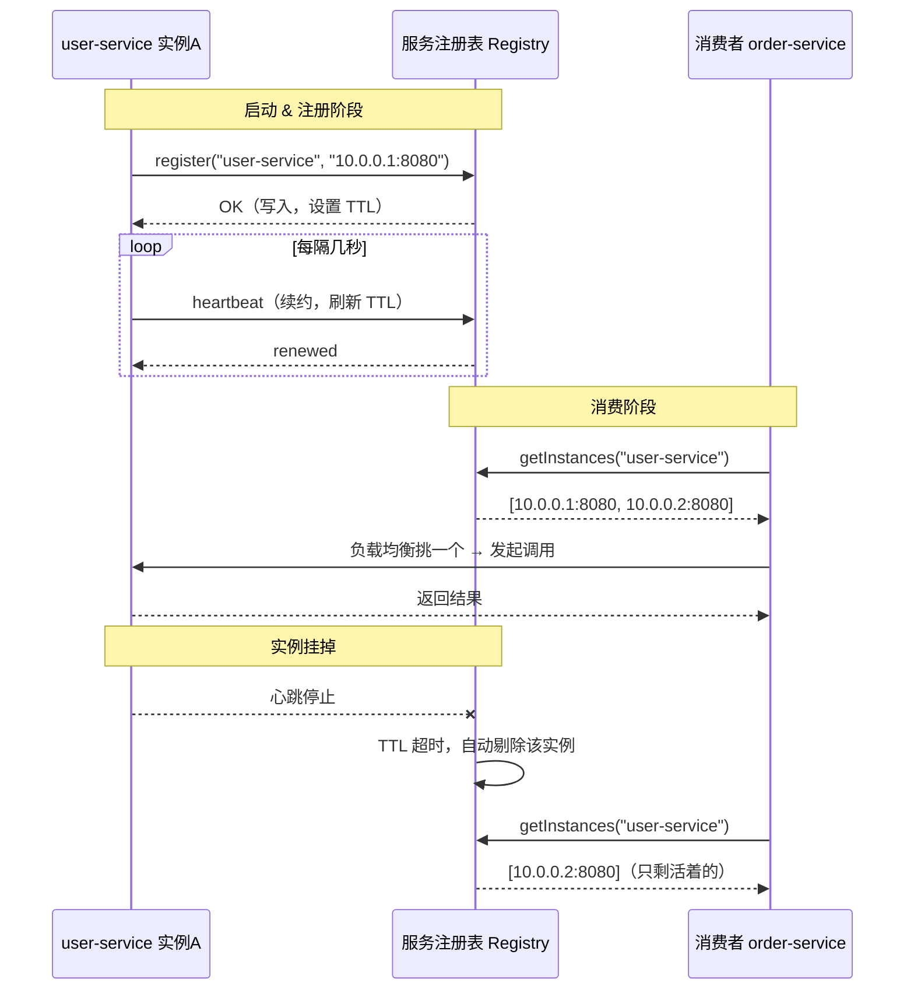
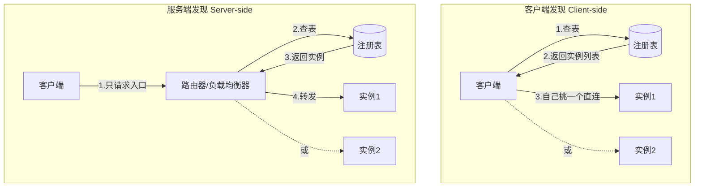

# 07 · 服务注册与发现（Service Discovery）

> 微服务实例的地址一直在变，别写死 IP，让「注册表」帮你动态找到活着的实例。

## 📖 知识讲解

### 为什么需要服务发现？

在单体应用里，模块之间就是本地方法调用，不存在「找不到对方」的问题。可一旦拆成微服务，`order-service` 要调 `user-service`，就得知道后者的网络位置 `IP:port`。

问题来了 —— 在云原生环境里，这个地址**根本不固定**：

| 场景 | 结果 |
|------|------|
| 自动扩缩容（autoscaling） | 实例数量随流量增减，新实例的 IP 事先不知道 |
| 实例故障 / 重启 | 旧地址失效，容器编排会拉起一个新 IP 的实例 |
| 重新部署 / 滚动升级 | 每次发布容器 IP 都可能变 |

所以**绝对不能把地址写死在代码或配置里**。我们需要一个东西，实时记录「现在有哪些实例活着、它们在哪」——这就是**服务注册表**。

### 服务注册表（Service Registry）

服务注册表本质上是一个**存放所有服务实例位置的数据库**，键是服务名，值是一组「活着的实例地址」。常见实现：

| 注册表 | 出品方 / 生态 |
|--------|--------------|
| Eureka | Netflix / Spring Cloud |
| Consul | HashiCorp |
| etcd | CNCF / Kubernetes 底层 |
| Nacos | 阿里，配置中心 + 注册中心二合一 |
| ZooKeeper | Apache |

### 两种发现模式

```
客户端发现：客户端自己查表、自己挑实例（自己做负载均衡）
服务端发现：客户端只管请求一个入口，入口去查表并转发
```

| 维度 | 客户端发现（Client-side） | 服务端发现（Server-side） |
|------|--------------------------|--------------------------|
| 谁查注册表 | 客户端（调用方）自己查 | 路由器 / 负载均衡器查 |
| 谁做负载均衡 | 客户端自己挑一个实例 | 由入口组件挑 |
| 典型实现 | Eureka + Ribbon | K8s Service、Nginx、API 网关 |
| 优点 | 客户端能做智能路由，少一跳 | 客户端逻辑极简，语言无关 |
| 缺点 | 每种语言都要写发现逻辑，耦合注册表 | 入口是关键路径，要保证高可用 |

### 两种注册方式

| 方式 | 谁来注册 | 说明 |
|------|---------|------|
| 自注册（self-registration） | 实例自己 | 启动时向注册表登记，然后**定时发心跳续约**；关闭时注销 |
| 第三方注册（third-party registration） | 专门的 registrar 组件 | 实例自己不管注册，由外部组件（如 K8s、Registrator）观察实例状态代为登记 |

### 心跳与健康检查（剔除失联实例）

注册表怎么知道一个实例还活着？靠**心跳（heartbeat）/ 健康检查**：

- 实例每隔几秒向注册表续约一次（renew）。
- 注册表给每条记录一个 **TTL（存活时间）**，收到心跳就刷新 TTL。
- 如果超过 TTL 还没等到心跳，就认为实例挂了，**自动从表中剔除**，之后不再把流量导给它。

这样消费者永远只会拿到「当前活着」的实例列表。

## 🔄 流程图 / 原理图

### 图 1：注册 → 心跳 → 发现 → 调用 的完整时序



### 图 2：客户端发现 vs 服务端发现 两种拓扑对比



## 💻 代码说明

本模块提供一个**纯 Node（零依赖）**的内存服务注册表 demo。

| 文件 | 作用 |
|------|------|
| `registry.js` | 内存服务注册表类：`register` / `deregister` / `getInstances` / `heartbeat`，带 TTL 心跳，后台定时扫描剔除超时实例，导出为模块 |
| `demo.js` | 模拟两个 `user-service` 实例注册 + 心跳；一个消费者查表拿实例列表并**轮询（round-robin）**调用；随后一个实例心跳停止被剔除，消费者只剩一个实例 |

核心思路：

- 注册表内部是 `Map<serviceName, Map<instanceId, {address, expireAt}>>`。
- 每次心跳把 `expireAt` 刷新为 `now + TTL`。
- 一个定时器周期扫描，把 `expireAt < now` 的实例删掉（这就是「失联剔除」）。
- 消费者调用前先 `getInstances` 拿到**当前活着**的列表，再用轮询指针挑一个。

## ▶️ 运行方式

```bash
cd 16-gateway-microservices/07-service-discovery
node demo.js
```

你会看到：两个实例注册 → 消费者轮询调用两个实例 → 实例B 停止心跳 → 被自动剔除 → 消费者只调用实例A。

## ⚠️ 常见坑 / 最佳实践

- **别把地址写死**：这是服务发现存在的全部理由。配置里写死 IP，一次扩容/重启就炸。
- **心跳间隔 < TTL**：心跳周期要明显小于 TTL（如心跳 3s、TTL 10s），否则网络抖一下就被误剔除。
- **注册表本身要高可用**：它是关键基础设施，通常集群部署（Eureka peer、Consul raft 集群），单点挂了整个系统瞎。
- **优雅下线**：实例关闭前主动 `deregister`，别干等 TTL 超时，否则那段时间流量还会打到已死实例。
- **客户端要容错**：即使拿到实例列表，调用时实例也可能刚好挂了，客户端要有重试 + 切换下一个实例的能力。
- **健康检查要「真」**：光有进程活着不够，最好检查依赖（DB、下游）是否正常，避免「假活」实例继续接流量。

## 🔗 官方文档

- microservices.io · Service Discovery：https://microservices.io/patterns/server-side-discovery.html 、https://microservices.io/patterns/client-side-discovery.html
- Spring Cloud Netflix Eureka：https://docs.spring.io/spring-cloud-netflix/reference/spring-cloud-netflix.html
- Consul：https://developer.hashicorp.com/consul/docs/concepts/service-discovery
- Nacos：https://nacos.io/en-us/docs/what-is-nacos.html
