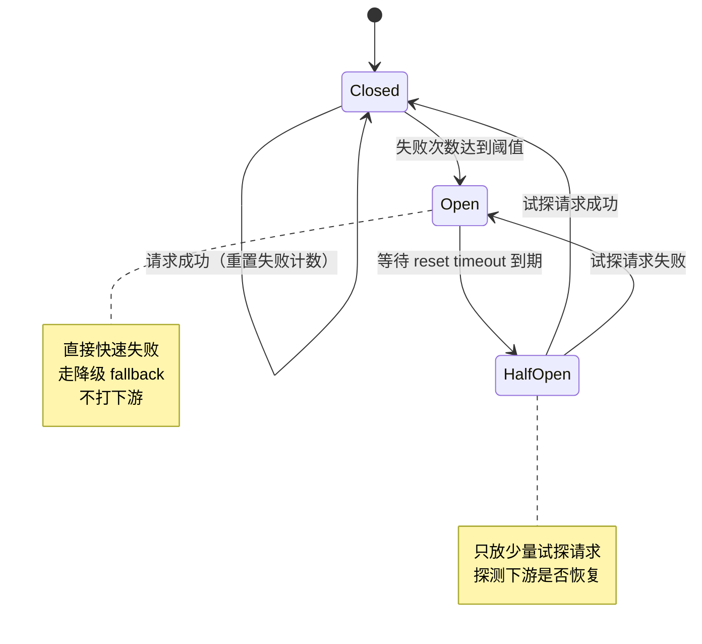
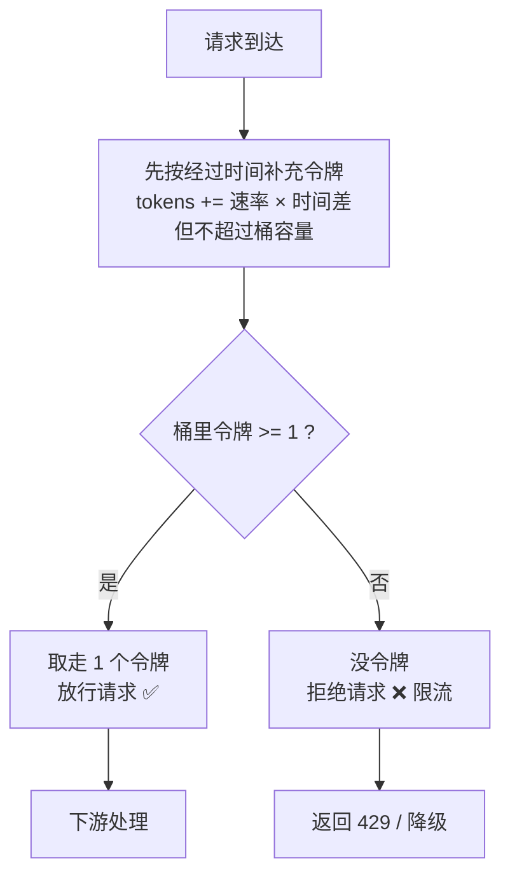

# 08 · 限流 / 熔断 / 降级（Rate Limiting / Circuit Breaker / Fallback）

> 三把保命伞：限流挡住洪水、熔断切断雪崩、降级给个兜底，让系统在压力下「不死」。

## 📖 知识讲解

微服务里最怕两件事：**流量突然暴涨**把自己压垮，以及**某个下游挂了**把整条链路一起拖死。限流、熔断、降级就是应对这两件事的三件套。

### 一、限流（Rate Limiting）

限流就是「单位时间内只放行 N 个请求」，超出的直接拒绝或排队，保护后端不被打爆。常见算法对比：

| 算法 | 原理 | 优点 | 缺点 |
|------|------|------|------|
| **固定窗口计数** | 每个时间窗（如每秒）计数，满了就拒 | 实现最简单 | **临界突刺**：窗口交界处可能瞬间放行 2N |
| **滑动窗口** | 把窗口切细统计，平滑滚动 | 缓解临界突刺 | 实现和存储更复杂 |
| **漏桶（Leaky Bucket）** | 请求进桶，桶以**恒定速率**漏出（处理） | 输出速率绝对平滑 | 不允许突发，桶满则丢 |
| **令牌桶（Token Bucket）** | 以固定速率**往桶里放令牌**，请求要拿到令牌才放行，桶满则令牌溢出丢弃 | **允许一定突发**（桶里攒了令牌就能一次多放），最常用 | 需维护令牌补充逻辑 |

**令牌桶最常用**，因为它兼顾「平均速率受控」和「允许短时突发」：平时没请求时令牌会攒着（上限是桶容量），突发来时可以一口气消耗这些攒下的令牌。

漏桶 vs 令牌桶一句话记忆：**漏桶管「出水」恒定，令牌桶管「发票」恒定**。

### 二、熔断（Circuit Breaker）

灵感来自电路保险丝。当下游频繁失败时，与其让请求一个个卡死超时、耗尽线程和连接（**雪崩**），不如直接「跳闸」快速失败。经典**三态**（Martin Fowler）：

| 状态 | 含义 | 行为 | 转换条件 |
|------|------|------|----------|
| **Closed（闭合）** | 正常 | 放行所有请求，同时统计失败次数 | 失败数达到阈值 → 跳到 Open |
| **Open（断开）** | 已跳闸 | **直接快速失败**，不打下游（走降级） | 等待 reset timeout 后 → 转 Half-Open |
| **Half-Open（半开）** | 试探恢复 | 放**少量试探请求**去探下游 | 试探成功 → 回 Closed；失败 → 回 Open |

Open 状态是关键：它给了下游「喘息恢复」的时间，同时避免调用方把资源浪费在注定失败的请求上。

### 三、降级（Fallback / Degradation）

当主链路不可用（被熔断、超时、异常）时，提供一个**次要方案**保证核心可用，而不是直接把错误抛给用户：

- 返回**默认值**（如推荐列表挂了，返回一个静态热门榜）
- 返回**缓存**的旧数据
- **排队 / 稍后重试**
- 给个**友好提示**（"当前人多，请稍后再试"）

降级常和熔断配合：熔断打开时，`call()` 不去打下游，而是直接走 `fallback` 返回兜底。

## 🔄 流程图 / 原理图

### 图 1：熔断器三态转换（stateDiagram）



### 图 2：令牌桶限流判定流程（flowchart）



## 💻 代码说明

纯 Node（零依赖）三件套：

| 文件 | 作用 |
|------|------|
| `token-bucket.js` | 令牌桶限流器类。按速率**惰性补充**令牌（拿的时候才算），`tryRemove()` 返回是否放行 |
| `circuit-breaker.js` | 熔断器类。三态 Closed/Open/Half-Open，失败阈值、reset timeout、half-open 试探；`call(fn)` 包裹调用，失败或熔断时走 `fallback` |
| `demo.js` | ① 用令牌桶对一串高频请求限流，打印通过/拒绝；② 用熔断器包裹一个「前几次故意失败」的下游，打印状态 Closed→Open→(等待)→Half-Open→Closed 全过程与降级返回 |

令牌桶采用**惰性补充**：不用后台定时器，而是每次请求时根据「距上次的时间差 × 速率」算出应补多少令牌，这样更省资源也更精确。

## ▶️ 运行方式

```bash
cd 16-gateway-microservices/08-rate-limit-circuit-breaker
node demo.js
```

## ⚠️ 常见坑 / 最佳实践

- **限流阈值要贴合下游真实容量**：拍脑袋设太高等于没限，太低误伤正常流量。压测后再定。
- **固定窗口有临界突刺**：对精度敏感的场景用滑动窗口或令牌桶。
- **熔断阈值别太敏感**：偶发一两次失败就跳闸会导致频繁抖动。通常用「失败率 + 最小请求数」而非单纯计数。
- **Half-Open 只放少量请求**：一次放太多会在下游还没恢复时又把它打死。
- **降级要有意义**：兜底数据也要对业务合理，别返回一个会让前端崩溃的空结构；核心写操作（如支付）通常不能随便降级。
- **三者是组合拳**：网关层限流 + 调用层熔断 + 业务层降级，分层协作。真实项目多用 Resilience4j、Sentinel、Hystrix（已停更）等成熟库，别手撸上生产。
- **幂等 + 超时**：熔断依赖「快速失败」，所以每个下游调用都要设合理超时，否则请求卡住熔断也统计不出来。

## 🔗 官方文档

- Martin Fowler · CircuitBreaker：https://martinfowler.com/bliki/CircuitBreaker.html
- Resilience4j（Java 主流实现）：https://resilience4j.readme.io/docs/circuitbreaker
- Sentinel（阿里，限流熔断）：https://sentinelguard.io/en-us/docs/introduction.html
- Token Bucket 算法（维基）：https://en.wikipedia.org/wiki/Token_bucket
