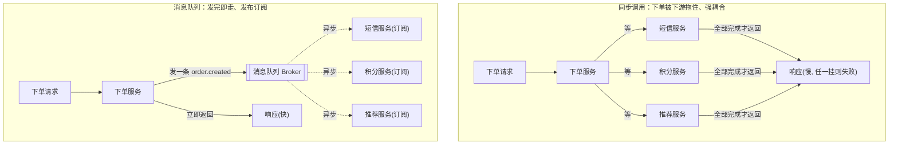
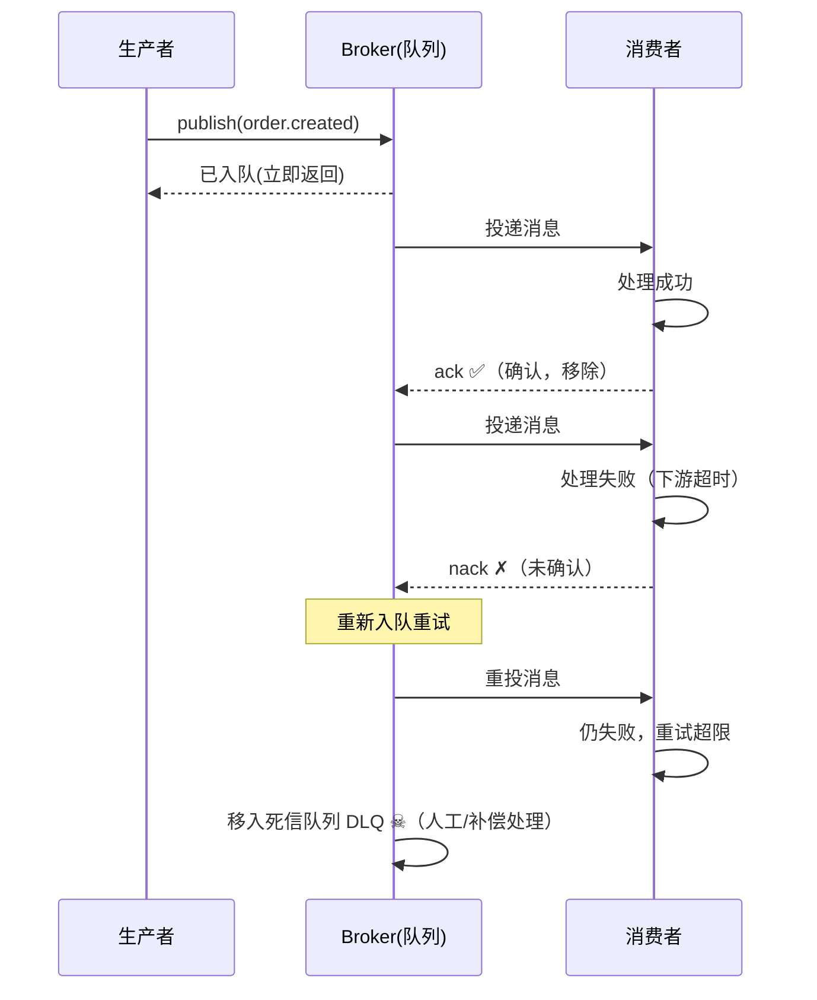

# 09 · 消息队列解耦（Message Queue）

> 服务之间不必「你等我、我等你」地同步调用。把消息丢进一个队列，生产者发完就走、消费者慢慢处理——用一个中间人换来**解耦、异步、削峰**三大好处。

## 📖 知识讲解

### 什么是消息队列？

**消息队列（Message Queue / MQ）** 是服务之间的「中间人」：

- **生产者（Producer）**：产生消息、丢进队列，然后**立刻返回**，不关心谁来处理、什么时候处理。
- **Broker（消息中间件）**：存储消息的队列本身（Kafka、RabbitMQ、RocketMQ、Redis Stream……），负责暂存、投递、重试。
- **消费者（Consumer）**：从队列取消息、处理，处理成功后**确认（ack）**。

生产者和消费者**不直接通信**，只通过 Broker 打交道——这就是「解耦」。

### 为什么要用？三大核心价值

#### 1. 解耦（Decoupling）

同步调用下，「下单」要直接调「短信」「积分」「推荐」服务，它们的地址、协议、可用性都**耦合**进了下单代码。加一个「风控」下游就要改下单代码。

用 MQ：下单只往队列发一条 `order.created` 事件，谁想处理谁来订阅（**发布订阅 pub-sub**）。新增下游只是多加一个订阅者，**下单代码一行不改**。

#### 2. 异步（Asynchronous）

同步做完短信+积分+推荐，下单接口可能要 800ms。用 MQ，下单只需把消息塞进队列（几毫秒）就返回，**用户体验快**；短信/积分在后台异步慢慢做。

#### 3. 削峰填谷（Peak Shaving）

秒杀时瞬间 10 万请求，数据库扛不住。让请求先进队列**排队**，消费者按数据库能承受的速率（比如 2000/s）**匀速消费**——把「洪峰」削平成「平缓的水流」。队列在这里当**缓冲池**。

### 两种消息模型

| 模型 | 一条消息给谁 | 类比 | 典型 |
|------|------------|------|------|
| 点对点（Queue / P2P） | **只有一个**消费者拿到并处理 | 任务分发 | 工作队列（订单派给某个 worker）|
| 发布订阅（Pub-Sub / Topic） | **每个订阅者都**收到一份 | 广播 | 事件通知（一条下单事件，短信/积分/风控各处理一份）|

### 可靠投递：ack / 重试 / 死信 / 幂等（重点）

网络和下游都会出问题，MQ 靠这四件套保证消息不丢、不乱：

| 机制 | 作用 |
|------|------|
| **ack 确认** | 消费者处理成功后才向 Broker 确认；没 ack 的消息 Broker 认为没处理完，会**重投**，保证「至少一次」投递 |
| **重试（retry）** | 处理失败（抛异常/超时）的消息重新入队，再试几次 |
| **死信队列 DLQ** | 重试仍失败的「毒消息」丢进死信队列，避免它无限重试堵塞正常消息，留待人工/补偿 |
| **幂等（idempotent）** | 因为「至少一次」会导致**重复消费**，消费者必须能识别重复（用唯一 msgId/业务 id 去重），保证「处理一次和处理多次结果相同」 |

> 投递语义：at-most-once（最多一次，可能丢）、**at-least-once（至少一次，可能重——最常用）**、exactly-once（恰好一次，最难，需幂等+事务配合近似实现）。工程上普遍是「at-least-once + 消费端幂等」。

### 代价与注意

- **最终一致，不是强一致**：异步意味着「短信可能几秒后才发」，业务要能接受这个延迟。
- **消息可能乱序**：多分区/多消费者并行时顺序不保证，需要严格顺序时要用单分区/顺序消息。
- **引入新的基础设施**：Broker 本身要高可用、要监控积压（lag）、要处理死信。

## 🔄 流程图 / 原理图

### 图 1：同步调用 vs 消息队列解耦



### 图 2：可靠投递时序（ack / 重试 / 死信）



## 💻 代码说明

`demo.js` 手写一个**内存版 Broker**，把上面所有机制跑一遍。场景：用户下单后要「发短信」和「加积分」。

| 部分 | 演示 |
|------|------|
| `Broker` 类 | `publish`（发完即返回）、`subscribe`（发布订阅，一条消息多方消费）、`startConsuming`（按速率消费）、ack/重试/DLQ |
| 阶段 1 · 削峰 | 生产者**瞬间下 5 单**，每次只把消息塞进队列就立刻返回；打印「接口耗时极短」+「队列积压数」 |
| 阶段 2 · 异步消费 | 消费者按 `300ms/条`慢慢消化积压——这就是削峰 |
| 重试 + 死信 | `points-service` 对 `ORD-3` 故意持续失败 → 重试 2 次仍失败 → 进 **DLQ** |
| 幂等 | `sms-service` 用 `Set` 记录已处理订单，重试导致的**重复消费被幂等跳过** |

核心思路：

- `publish` 只 push 进数组就 return，**不等消费**（异步/解耦）；
- 一条 `order.created` 被 `sms-service` 和 `points-service` **各消费一份**（pub-sub）；
- handler 正常返回视为 **ack**；抛异常视为 **nack**，消息重新入队；超过 `maxRetries` 进 **DLQ**；
- 消费者可能重复收到消息，所以短信服务做了**幂等去重**。

## ▶️ 运行方式

纯 Node 零依赖（建议 Node 18+）：

```bash
cd 16-gateway-microservices/09-message-queue
node demo.js
```

你会看到：5 个下单接口瞬间全部返回（削峰入队）→ 消费者匀速处理 → 短信/积分各自消费 → `ORD-3` 积分重试后进死信队列 → 重复消费被幂等跳过。

## ⚠️ 常见坑 / 最佳实践

- **消费端一定要幂等**：at-least-once 必然带来重复消费。用唯一业务 id / msgId 去重（DB 唯一键、Redis SETNX），否则会重复发短信、重复扣款。
- **必须处理死信**：毒消息（永远处理失败的）如果一直重试，会堵死正常消息。设最大重试次数 + DLQ + 告警，人工介入。
- **监控队列积压（lag）**：消费速度长期跟不上生产速度，积压会无限增长直至撑爆。要监控并能弹性扩消费者。
- **别把 MQ 当强一致用**：MQ 是最终一致。下单后立刻查积分可能还没加上，业务要容忍这个延迟。
- **要顺序就别乱并行**：多消费者并行处理会打乱顺序。需要顺序（如同一账户的操作）用「同 key 进同一分区 + 单线程消费」。
- **消息要可序列化、带版本**：payload 用 JSON/Protobuf，带上 schema 版本，避免生产者升级后老消费者解析失败。
- **先确认落库再 ack**：消费者应「处理成功（写库）后再 ack」，不能收到就 ack，否则处理途中崩溃消息就丢了。

## 🔗 官方文档

- microservices.io · Messaging（消息传递）：https://microservices.io/patterns/communication-style/messaging.html
- microservices.io · Saga（跨服务最终一致）：https://microservices.io/patterns/data/saga.html
- RabbitMQ 官方教程（Publish/Subscribe、Work Queues、ack）：https://www.rabbitmq.com/tutorials
- Apache Kafka 文档：https://kafka.apache.org/documentation/
- Enterprise Integration Patterns（消息模式经典）：https://www.enterpriseintegrationpatterns.com/patterns/messaging/
