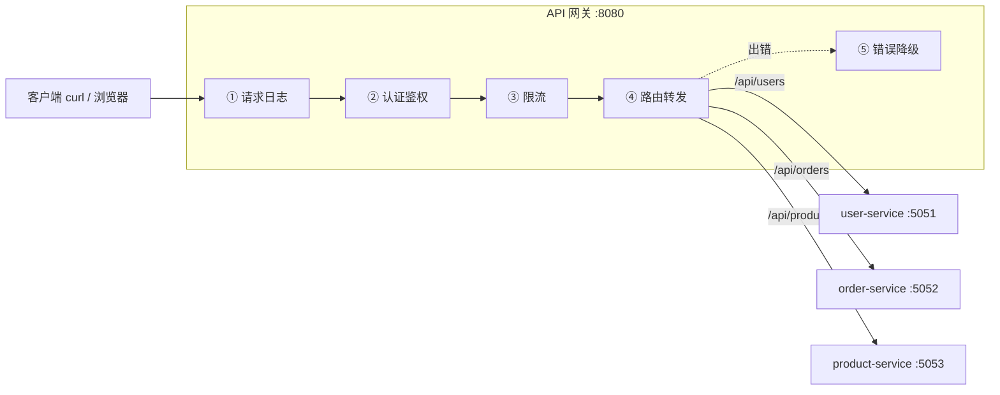
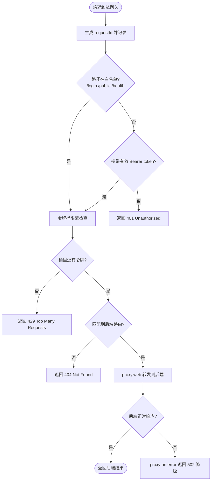

# 10 · 手写一个 API 网关（Build a Gateway）

> 用 Node + Express + http-proxy 亲手写一个可运行的 API 网关，把前面模块学到的「日志 / 鉴权 / 限流 / 路由 / 降级」串成一条中间件管线。

## 📖 知识讲解

前面几个模块分别讲了网关的「一个个能力」，本模块把它们**组装成一个真实可运行的整体**。

整个系统由两部分组成：

- **后端微服务集群**（`services/all-services.js`）：3 个独立 Express 服务
  - `user-service` → `5051`（用户数据）
  - `order-service` → `5052`（订单数据，故意 30% 概率失败，用来演示降级）
  - `product-service` → `5053`（商品数据）
- **API 网关**（`gateway.js`，监听 `8080`）：所有客户端流量的**统一入口**。

网关内部是一条**中间件管线**，请求按固定顺序依次穿过：

| 顺序 | 能力 | 作用 | 对应模块 |
| --- | --- | --- | --- |
| 1 | 请求日志 | 生成 requestId、记录耗时 | 模块 05（可观测性） |
| 2 | 认证鉴权 | 校验 `Bearer token`，白名单放行 | 模块 05（统一鉴权） |
| 3 | 限流 | 令牌桶按 IP 限流 | 模块 05（限流保护） |
| 4 | 路由转发 | 按路径前缀反向代理到后端 | 模块 08（服务路由） |
| 5 | 错误降级 | 后端挂了返回 502 兜底 | 模块 08（熔断降级） |

**核心思想**：这些「横切关注点」在网关统一处理，后端微服务只需专注业务逻辑，不用每个服务都重复实现一遍鉴权/限流/日志（对应模块 03「网关作为统一入口」的价值）。

## 🔄 流程图 / 原理图

### 整体架构



### 单个请求穿过管线的处理流程



## 💻 代码说明

`gateway.js` 由 5 段中间件 + 登录接口组成：

- **`requestLogger`**：给每个请求生成 `requestId`，监听 `res` 的 `finish` 事件计算耗时并打印 `method/url/status/耗时`。requestId 贯穿全链路，方便排查问题。
- **`authenticate`**：先看路径是否命中 `AUTH_WHITELIST`（`/login`、`/public`、`/health`）——命中直接放行；否则解析 `Authorization: Bearer <token>`，token 不存在或非法返回 401。演示用 token 存在内存 `Set` 里，真实项目应校验 JWT 签名或查 Redis。
- **`rateLimit`**：**令牌桶**实现。每个 IP 一个桶（容量 5，每秒补 2 个）。请求到达时先按经过时间补充令牌，再尝试消耗 1 个；桶空则 429。
- **`routeProxy`**：按 `req.path` 前缀匹配 `ROUTES` 路由表；匹配不到返回 404；匹配到则**去掉前缀**（`/api/users/1` → `/1`）后用 `proxy.web(req, res, { target, changeOrigin: true })` 转发。
- **`proxy.on('error')`**：后端连不上时统一返回 502，并用 `res.headersSent` 判断避免重复写头。
- **`POST /login`**：发放一个演示 token 放进 `VALID_TOKENS`，返回给客户端用于后续请求。

中间件通过 `app.use(...)` **按顺序**挂载，顺序即请求流经顺序——这是理解网关最关键的一点。

## ▶️ 运行方式

```bash
# 0. 安装依赖
npm install

# 1. 【终端 A】启动 3 个后端微服务
npm run services

# 2. 【终端 B】启动网关
npm start
```

完整测试（在第三个终端执行）：

```bash
# ① 先登录拿 token（/login 在白名单，无需鉴权）
curl -s -X POST http://localhost:8080/login
# 返回类似：{"token":"demo-xxxx","tokenType":"Bearer",...}

# ② 带 token 访问用户服务 —— 成功 200
TOKEN=$(curl -s -X POST http://localhost:8080/login | grep -o 'demo-[a-f0-9]*' | head -1)
curl -s -H "Authorization: Bearer $TOKEN" http://localhost:8080/api/users
curl -s -H "Authorization: Bearer $TOKEN" http://localhost:8080/api/products

# ③ 不带 token —— 401
curl -s http://localhost:8080/api/users

# ④ 狂刷触发限流 —— 很快看到 429
for i in $(seq 1 20); do \
  curl -s -o /dev/null -w "%{http_code}\n" -H "Authorization: Bearer $TOKEN" http://localhost:8080/api/users; \
done

# ⑤ 访问订单服务（30% 概率后端 500；若把 order-service 停掉则网关返回 502 降级）
curl -s -H "Authorization: Bearer $TOKEN" http://localhost:8080/api/orders

# ⑥ 访问不存在的服务前缀 —— 网关 404
curl -s -H "Authorization: Bearer $TOKEN" http://localhost:8080/api/unknown

# ⑦ 访问公开资源 —— 无需 token
curl -s http://localhost:8080/public
```

## ⚠️ 常见坑 / 最佳实践

- **中间件顺序**：日志要最先、鉴权/限流要在转发前、`routeProxy` 要最后（兜底）。顺序错了会导致「未鉴权就转发」等安全问题。
- **前缀剥离**：转发前必须把 `/api/users` 前缀从 `req.url` 去掉，否则后端会收到 `/api/users/...` 这种带前缀的路径而 404。
- **`proxy.on('error')` 里判断 `res.headersSent`**：转发中途出错时响应头可能已发出，直接 `writeHead` 会抛 `ERR_HTTP_HEADERS_SENT`。
- **`changeOrigin: true`**：反向代理时把 Host 头改成目标服务，避免后端因 Host 校验拒绝请求。
- **限流状态在内存里**：本 demo 的令牌桶存进程内存，多实例网关会各算各的。生产环境应放 Redis 做分布式限流。
- **token 存内存**：仅供演示。真实场景用 JWT（无状态、自校验）或集中式会话存储。
- **`proxy.web` 不要再调 `next()`**：转发已经接管了响应，交给后端，管线到此结束。

## 🔗 官方文档

- http-proxy (npm)：https://www.npmjs.com/package/http-proxy
- node-http-proxy (GitHub)：https://github.com/http-party/node-http-proxy
- Express：https://expressjs.com/
- API Gateway 模式 (microservices.io)：https://microservices.io/patterns/apigateway.html
