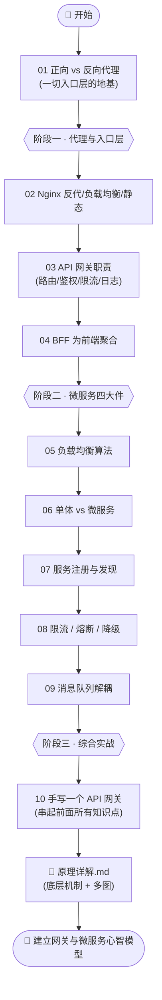
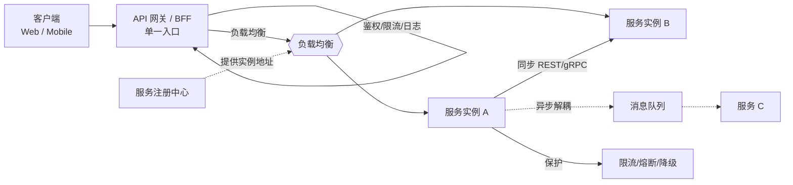

# 16 · API 网关 / 反向代理 / 微服务（Gateway & Microservices）

> 当一个应用从「一台服务器 + 一个进程」成长为「几十个服务 + 多个前端」，两个问题会立刻冒出来：**客户端到底该请求谁？** 和 **这些服务之间怎么协作？** 这个工程就系统回答这两个问题——从最底层的**反向代理**，到统一入口的 **API 网关 / BFF**，再到 **微服务** 的注册发现、负载均衡、限流熔断、消息队列，最后用 Node **手写一个可运行的 API 网关**把所有知识点串起来。

## 📚 这个工程讲什么

前端工程师为什么要懂网关和微服务？因为你每天调的那个 `/api/...`，背后往往不是一台服务器，而是一整套「入口层 + 服务集群」：

- 你的请求先打到 **反向代理 / API 网关**（Nginx、Kong、或自研网关），它负责**鉴权、限流、路由、日志、聚合**；
- 网关再把请求**负载均衡**地转发到某个微服务实例，实例地址由**服务注册中心**动态提供；
- 服务之间要么同步调用（REST/gRPC），要么通过**消息队列**异步解耦；
- 一旦下游抖动，**限流/熔断/降级**保证整个系统不被拖垮雪崩。

理解这套架构，你才能读懂「为什么跨域要配代理」「为什么要有 BFF 层」「为什么接口偶尔 429/502」「灰度和限流是怎么做的」。本工程**对照 nginx.org、microservices.io（Chris Richardson）、Martin Fowler、Sam Newman、node-http-proxy 官方**整理，概念配图 + 可运行 Node demo 并重。

技术栈与版本：**Node.js 18+**、**Express 4.x**、**http-proxy 1.18.x**、**Nginx 1.25+（配置示例）**。绝大多数 demo 用**纯 Node 零依赖**即可运行。

## 🗂 模块索引

| 模块 | 知识点 | 你将学会 | 运行方式 |
| --- | --- | --- | --- |
| [01](./01-forward-reverse-proxy/) | 正向代理 vs 反向代理 | 两种代理的本质区别、反向代理为何是网关/CDN 的基础 | `node reverse-proxy.js` |
| [02](./02-nginx-basics/) | Nginx 反代/负载均衡/静态服务 | upstream、proxy_pass、四种 LB 方法、静态服务配置 | 配置示例 / Docker 可选 |
| [03](./03-api-gateway/) | API 网关职责 | 单一入口、路由/鉴权/限流/日志/聚合/协议转换 | `node gateway-pipeline.js` |
| [04](./04-bff/) | BFF 前端聚合 | 为每类客户端建专属后端、扇出聚合裁剪数据 | `node web-bff.js` |
| [05](./05-load-balancing/) | 负载均衡算法 | 轮询/加权/最少连接/一致性哈希 + 哈希环原理 | `node load-balancer.js` |
| [06](./06-microservices-intro/) | 单体 vs 微服务 | 两种架构全面对比、何时该拆、避免过度设计 | `node compare.js` |
| [07](./07-service-discovery/) | 服务注册与发现 | 注册表、客户端/服务端发现、心跳健康检查 | `node demo.js` |
| [08](./08-rate-limit-circuit-breaker/) | 限流/熔断/降级 | 令牌桶限流、熔断三态、fallback 兜底 | `node demo.js` |
| [09](./09-message-queue/) | 消息队列解耦 | 解耦/异步/削峰、pub-sub、ack/重试/幂等 | `node demo.js` |
| [10](./10-build-a-gateway/) | 手写一个 API 网关 | 用 Express + http-proxy 把日志/鉴权/限流/路由/降级串成管线 | `npm install && npm start` |
| 📄 | [**原理详解.md**](./原理详解.md) | 反向代理/网关/BFF/负载均衡/限流熔断/微服务通信的 how & why + 多图 | 阅读 |

## 🧭 学习路线

建议按编号顺序。整体分四个阶段：**打地基（代理）→ 建入口（网关/BFF）→ 拆服务（微服务四大件）→ 造轮子（手写网关）**。



核心概念之间的关系：



## ▶️ 如何运行

大多数模块是**纯 Node 零依赖**，直接：

```bash
cd 16-gateway-microservices/05-load-balancing
node load-balancer.js
```

需要多进程的（01/04/07/09）按各自 README 开两个终端。压轴的 **10-build-a-gateway** 需要安装依赖：

```bash
cd 16-gateway-microservices/10-build-a-gateway
npm install
npm run services   # 终端 1：起 3 个后端微服务
npm start          # 终端 2：起网关（8080）
```

## 🔗 权威文档

- [Nginx 官方文档 · Load Balancing](https://nginx.org/en/docs/http/load_balancing.html) · [反向代理](https://docs.nginx.com/nginx/admin-guide/web-server/reverse-proxy/)
- [microservices.io · API Gateway 模式](https://microservices.io/patterns/apigateway.html) · [Service Discovery](https://microservices.io/patterns/server-side-discovery.html) · [微服务 vs 单体](https://microservices.io/patterns/monolithic.html)
- [Sam Newman · Backends For Frontends](https://samnewman.io/patterns/architectural/bff/)
- [Martin Fowler · Circuit Breaker](https://martinfowler.com/bliki/CircuitBreaker.html)
- [node-http-proxy](https://github.com/http-party/node-http-proxy) · [Express](https://expressjs.com/)
