# 《API 网关与微服务 · 原理详解》

> 本文是 16 号工程的**核心交付物**。不讲「怎么配」，讲**为什么这样设计、内部怎么跑、边界在哪**。从一个请求的旅程出发，逐层拆开反向代理、API 网关、BFF、负载均衡、限流熔断、服务发现、微服务通信的**底层机制**，配大量 Mermaid 原理图，并对照官方权威（nginx.org、microservices.io、Martin Fowler、Sam Newman）。

---

## 目录

1. [一个请求的完整旅程](#一)
2. [反向代理的本质](#二)
3. [API 网关的核心能力](#三)
4. [BFF：为前端而生的网关](#四)
5. [负载均衡与一致性哈希](#五)
6. [服务注册与发现](#六)
7. [限流 / 熔断 / 降级机制](#七)
8. [微服务通信：同步 vs 异步](#八)
9. [常见误区与设计取舍](#九)

---

<a id="一"></a>
## 一、一个请求的完整旅程

要理解整套架构，最好的方式是**跟着一个请求走一遍**。假设手机 App 点了「我的订单」，请求 `GET /api/orders`：

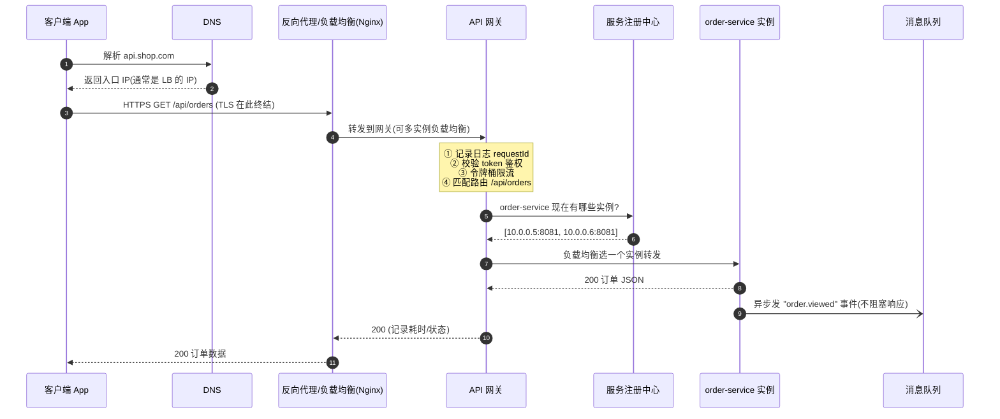

这一路上每一跳都对应本工程一个模块：

| 阶段 | 组件 | 对应模块 |
| --- | --- | --- |
| 统一入口、TLS 终结 | 反向代理 / Nginx | 01, 02 |
| 鉴权/限流/路由/日志 | API 网关 | 03, 08, 10 |
| 为不同端裁剪数据 | BFF | 04 |
| 选哪个实例 | 负载均衡 | 05 |
| 实例地址从哪来 | 服务注册中心 | 07 |
| 下游故障不雪崩 | 熔断/降级 | 08 |
| 异步解耦 | 消息队列 | 09 |

下面逐层拆开每一跳的**内部机制**。

---

<a id="二"></a>
## 二、反向代理的本质

### 2.1 正向 vs 反向：站在谁那边

代理（proxy）就是「中间人」。区别只在于它**代表谁、隐藏谁**：

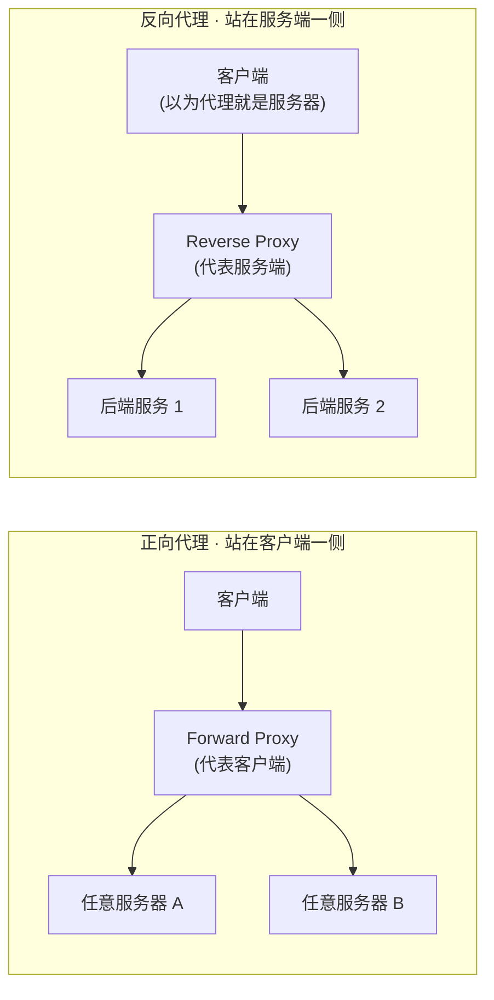

| 维度 | 正向代理 | 反向代理 |
| --- | --- | --- |
| 站在谁一侧 | 客户端 | 服务器 |
| 隐藏谁 | 隐藏**客户端**（服务器不知真实客户是谁） | 隐藏**服务端**（客户端不知背后有几台） |
| 谁配置它 | 客户端主动设置代理 | 服务端运维部署，客户端无感 |
| 典型用途 | 科学上网、公司出口、爬虫换 IP | Nginx、CDN、API 网关、负载均衡 |

**一句话记忆**：正向代理是「我（客户端）找个人帮我出门」；反向代理是「你（服务器）请个前台替你收件」。本工程后面讲的网关、负载均衡、CDN——**全是反向代理的能力延伸**。

### 2.2 反向代理内部：一次转发发生了什么

反向代理不是简单「把字节倒一遍」。它要重建两条 TCP 连接、改写若干 header：

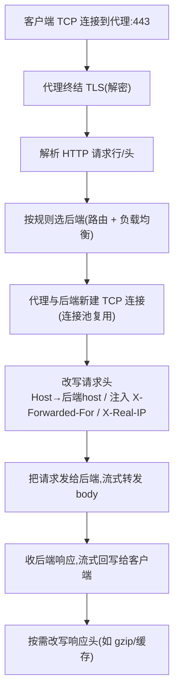

关键点（对照 node-http-proxy 与 Nginx）：

- **两段独立 TCP 连接**：客户端↔代理、代理↔后端。所以后端看到的「源 IP」是代理的 IP——真实客户端 IP 靠 `X-Forwarded-For` / `X-Real-IP` 头透传。这就是为什么后端拿客户端 IP 要读这两个头，而不是 socket 的 remoteAddress。
- **`changeOrigin` / `Host` 头**：node-http-proxy 的 `changeOrigin:true` 会把 `Host` 头改成 target 的 host。很多后端（尤其虚拟主机、云服务）靠 Host 头区分站点，不改就 404/证书错。Nginx 里对应 `proxy_set_header Host $host;`。
- **流式转发**：代理不必等 body 收全，边收边转，所以能代理大文件/流。
- **TLS 终结（SSL termination）**：HTTPS 在代理这一层解密，代理到后端可以走明文 HTTP（内网），后端不必各自管证书。

> node-http-proxy 最小反向代理：
> ```js
> const proxy = require('http-proxy').createProxyServer({});
> require('http').createServer((req, res) => {
>   proxy.web(req, res, { target: 'http://localhost:5050', changeOrigin: true });
> }).listen(8080);
> proxy.on('error', (e, req, res) => { res.writeHead(502); res.end('Bad Gateway'); });
> ```

---

<a id="三"></a>
## 三、API 网关的核心能力

### 3.1 为什么需要网关：没有它有多乱

微服务把后端拆成几十个服务后，如果让客户端直连每个服务，会同时爆发一堆问题：

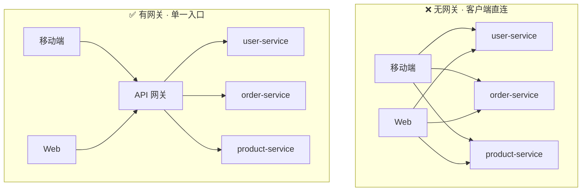

无网关时每个客户端都要：知道所有服务地址、各自实现鉴权限流、发多次请求聚合、处理跨域和协议差异、服务一拆分客户端就得改。这些**横切关注点（cross-cutting concerns）**散落各处，无法治理。

网关（microservices.io 定义）就是**所有客户端的单一入口**，把横切关注点收拢到一层。它处理请求有两种方式：**简单路由**（转发给某个服务）和**扇出聚合 fan-out**（并发调多个服务再合并）。

### 3.2 网关的处理管线（middleware pipeline）

网关内部是一条**责任链 / 中间件管线**，请求依次穿过每一环，任一环都可提前拦截：

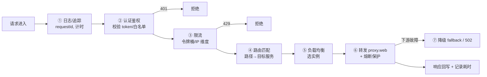

网关核心能力清单（对照 microservices.io + Kong/API 网关通用职责）：

| 能力 | 做什么 | 本工程模块 |
| --- | --- | --- |
| **路由 Routing** | 按 path/host/header 把请求转发到对应服务 | 03, 10 |
| **认证鉴权 Auth** | 校验 JWT/API Key、RBAC 权限 | 03, 10 |
| **限流 Rate Limiting** | 保护后端，按 IP/用户/API 限速 | 08, 10 |
| **聚合 Composition** | 扇出多服务再合并（尤其移动端省往返） | 04 |
| **协议转换** | 对外 HTTP/JSON，对内 gRPC/其他 | 03 |
| **可观测性** | 日志、指标、分布式追踪 | 03, 10 |
| **SSL 终结 / 缓存 / 压缩** | 统一在入口层处理 | 02, 03 |

**取舍**：网关是单一入口 → 也是**单点风险**和**性能瓶颈**，必须自身多实例 + 前面再挂负载均衡；它增加一跳延迟（通常几毫秒可忽略），但省掉客户端多次往返，移动端上通常净赚。

---

<a id="四"></a>
## 四、BFF：为前端而生的网关

### 4.1 BFF 解决什么

一个「通用 API 网关」想同时伺候 Web、iOS、Android、第三方，很快会陷入两难：Web 要一大坨详情、手机屏小只要精简字段、还要省流量和往返。通用 API 只能**取并集**，结果人人都拿到一份「对谁都不完全合适」的臃肿数据。

Sam Newman 提出的 **BFF（Backends For Frontends）**：**为每一类前端各建一个专属后端**，由该前端团队拥有，专门为这个前端聚合、裁剪、塑形数据。

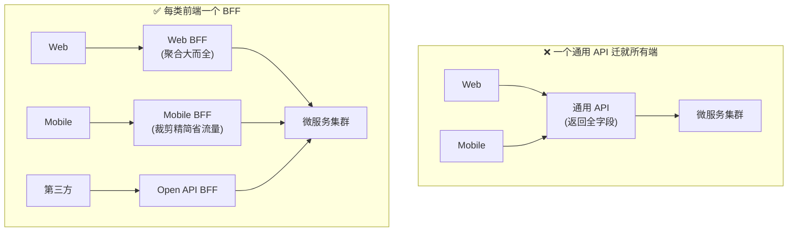

### 4.2 BFF 的核心动作：扇出聚合

BFF 的典型逻辑是**并发扇出**到多个微服务，再合并成「这个前端页面正好需要的形状」：

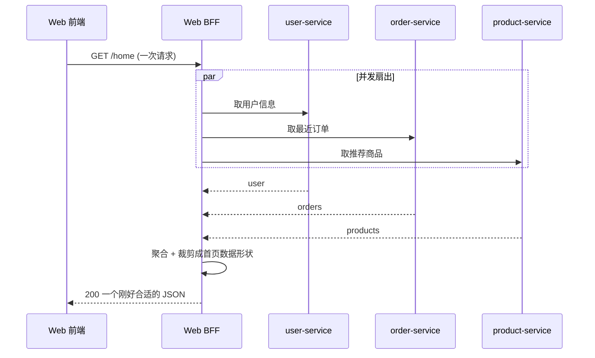

**BFF 是 API Gateway 模式的变体**（per-client gateway）。边界很重要：BFF 只做**面向该前端的编排与塑形**，不放核心业务规则（那属于领域服务）；否则 BFF 会退化成新的单体。代价是多套 BFF、可能有重复逻辑——用共享库或下沉公共网关缓解。

---

<a id="五"></a>
## 五、负载均衡与一致性哈希

### 5.1 四种主流算法

负载均衡器面对「一个请求，一池后端」，怎么选？（对照 nginx.org）

| 算法 | 原理 | 适合 | 短板 |
| --- | --- | --- | --- |
| **轮询 Round-Robin**（默认） | 依次 1→2→3→1… | 实例性能均等、请求均匀 | 忽略实例负载差异 |
| **加权轮询 Weighted** | 按 `weight` 比例分配 | 实例配置不一（大机器多分） | 静态权重，不看实时负载 |
| **最少连接 Least-Conn** | 发给当前活跃连接最少者 | 请求耗时差异大 | 需维护连接计数 |
| **IP/一致性哈希 Hash** | 按 key 哈希固定落点 | 会话保持、缓存亲和 | 节点变动要处理重映射 |

Nginx 配置对应：默认轮询、`server x weight=3`、`least_conn;`、`ip_hash;`、`hash $request_uri consistent;`。

### 5.2 一致性哈希：为什么不用 hash % N

朴素做法「`hash(key) % N` 选第 N 台」有个致命问题：**N 一变（扩容/宕机），几乎所有 key 的落点全变**——对缓存来说等于缓存雪崩（全部 miss）。

一致性哈希把**节点和 key 都映射到同一个哈希环（0~2³²）**，key 顺时针找到的第一个节点就是它的归属：

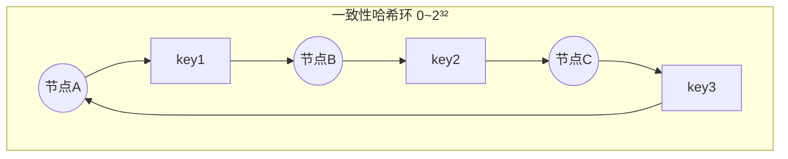

**关键性质**：增删一个节点，**只影响环上相邻的一小段 key**，其余 key 落点不变。删除节点 B，只有原本落在 B 的 key 顺移到下一个节点 C，A/C 上的 key 纹丝不动。

重映射规模对比（demo 05 会实测）：

| 方案 | 增删 1 个节点后受影响 key |
| --- | --- |
| `hash % N` | ≈ 全部（(N-1)/N 比例） |
| 一致性哈希 | ≈ `1/N`（只有那一段） |

**虚拟节点（virtual nodes）**：真实节点太少时环上分布不均，某节点可能背了半个环。解法是让每个真实节点在环上放几十~几百个「虚拟副本」，让分布趋于均匀，同时保留「增删只动局部」的好处。

---

<a id="六"></a>
## 六、服务注册与发现

### 6.1 问题：地址是动态的

微服务实例的 IP:port **一直在变**——自动扩缩、故障重启、滚动发布、容器漂移。客户端/网关**不能写死地址**。解法：一个**服务注册中心（Service Registry）**，实例上线时登记、定时心跳续约、失联被剔除；调用方从注册中心查「现在有哪些健康实例」。

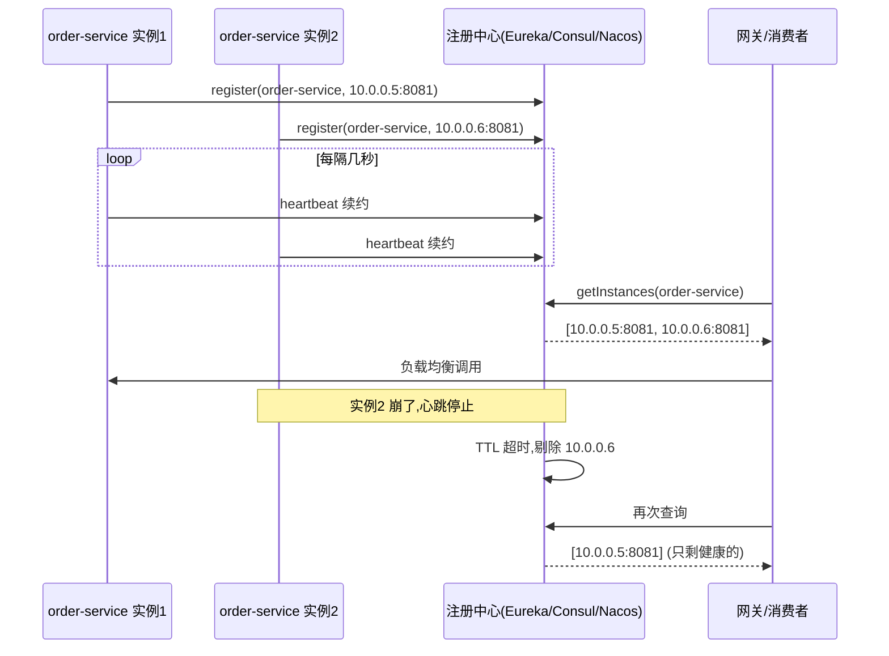

### 6.2 两种发现模式

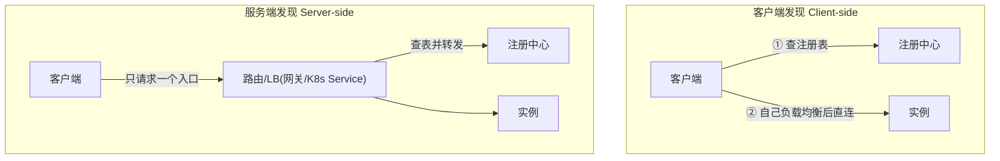

| 模式 | 谁查注册表 | 谁做负载均衡 | 代表 |
| --- | --- | --- | --- |
| **客户端发现** | 客户端 | 客户端 | Eureka + Ribbon |
| **服务端发现** | 路由/LB | 路由/LB | K8s Service、Nginx、网关 |

注册方式还分**自注册**（实例自己注册+心跳）和**第三方注册**（由独立 registrar 代注册，如 K8s 里 kubelet）。前端/网关侧最常见的是**服务端发现**——客户端只认一个网关地址，其余交给平台。

---

<a id="七"></a>
## 七、限流 / 熔断 / 降级机制

这三兄弟是**稳定性铁三角**：限流防「进得太多」，熔断防「下游拖垮自己」，降级保「核心还能用」。

### 7.1 限流：令牌桶为主

| 算法 | 原理 | 特点 |
| --- | --- | --- |
| 固定窗口计数 | 每窗口计数，超了拒 | 简单，但窗口临界有 2 倍突刺 |
| 滑动窗口 | 平滑统计最近 N 秒 | 消除临界突刺，成本略高 |
| 漏桶 Leaky Bucket | 请求入桶，恒定速率漏出 | 强制平滑，**不允许突发** |
| **令牌桶 Token Bucket** | 恒定速率放令牌，桶满则弃；请求取令牌 | **允许一定突发**，最常用 |

令牌桶判定流程：

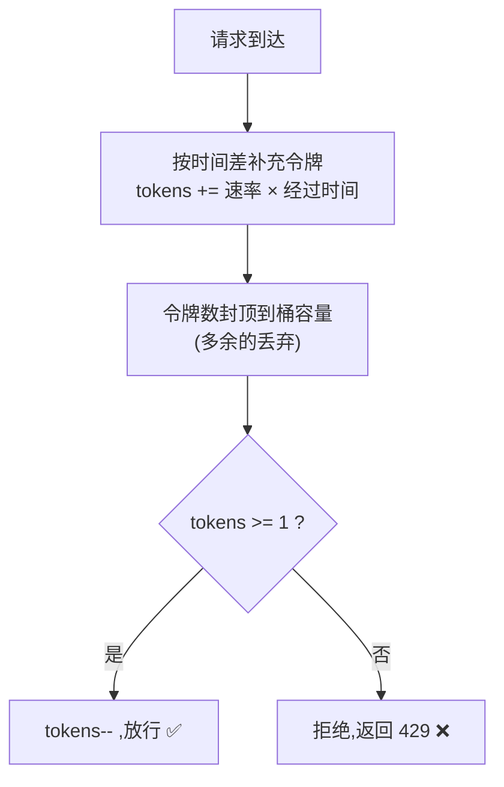

令牌桶的妙处：平时桶里攒着令牌，突发来一波能瞬间放行一批（用存量令牌），但**长期平均速率**被放令牌的速率死死限住——既扛突发又保均值。

### 7.2 熔断：三态状态机（Martin Fowler）

下游服务挂了还硬打，会把线程/连接全耗在等超时上，故障**级联扩散成雪崩**。熔断器像电路保险丝，下游故障就「跳闸」，快速失败：

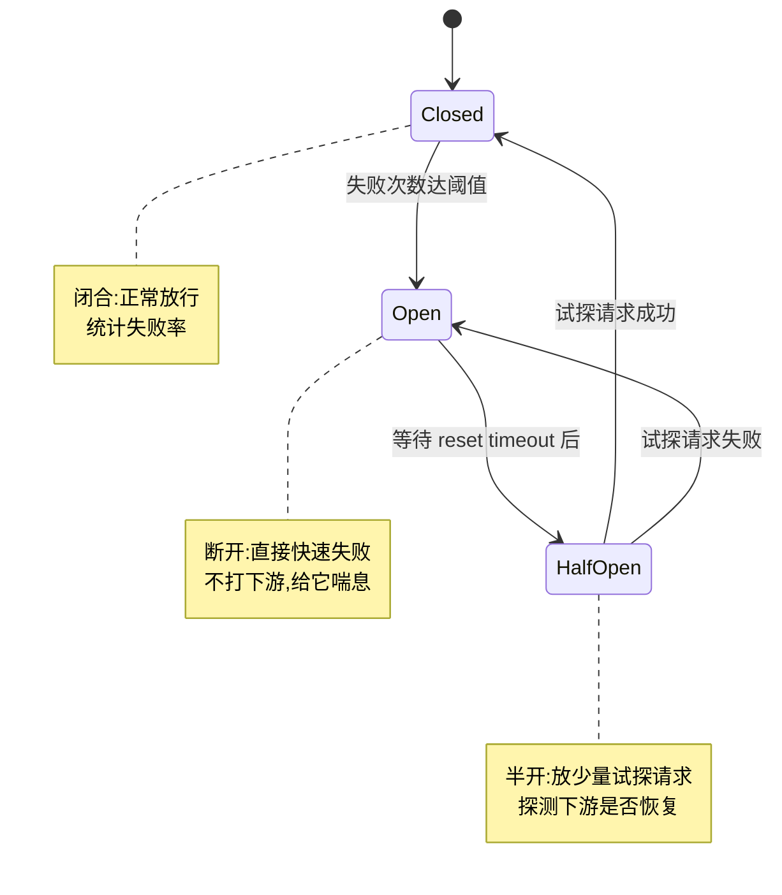

| 状态 | 行为 | 转换条件 |
| --- | --- | --- |
| **Closed 闭合** | 正常放行，统计失败 | 失败达阈值 → Open |
| **Open 断开** | 直接快速失败，不打下游 | 等 reset timeout → Half-Open |
| **Half-Open 半开** | 放少量试探请求 | 成功→Closed；失败→Open |

### 7.3 降级：fallback 兜底

熔断/失败/超时时，别把错误直接甩给用户，而是走**降级**：返回缓存的旧数据、默认值、友好提示、或把请求塞进队列稍后处理。熔断（快速失败）+ 降级（兜底响应）配合，才能让「某个非核心服务挂了，主页面照常打开，只是某个模块显示占位」。

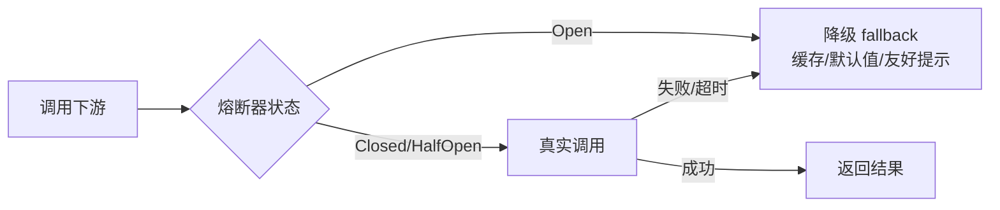

---

<a id="八"></a>
## 八、微服务通信：同步 vs 异步

服务拆开后，「函数调用」变成了「网络调用」。两大通信范式：

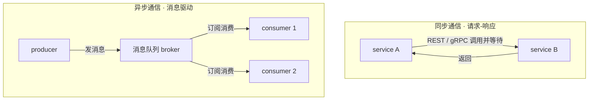

| 维度 | 同步（REST/gRPC） | 异步（消息队列） |
| --- | --- | --- |
| 时序 | 调用方阻塞等结果 | 发完即走，不等 |
| 耦合 | 时间耦合（B 挂 A 就等/错） | 解耦（B 挂了消息在队列等） |
| 一致性 | 易得强一致 | 最终一致 |
| 适合 | 需即时结果的查询 | 通知、削峰、扇出、跨服务事件 |

### 8.1 消息队列如何解耦

下单场景：同步做法里 order-service 要挨个 call 邮件、积分、库存服务——任一慢/挂，下单就慢/失败，强耦合。改用消息队列：order-service 只管**发一条 `order.created` 事件**就立即返回，下游各自异步订阅消费：

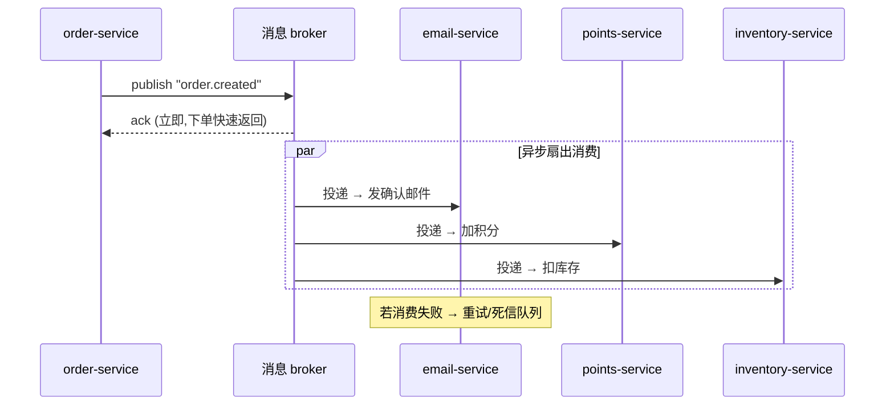

消息队列带来三个核心价值：**解耦**（生产/消费互不感知）、**异步削峰**（突发流量先入队缓冲，消费方按自己节奏处理）、**广播扇出**（一条事件多方订阅）。代价是**最终一致**，且必须处理**重复投递**（消费端幂等）、**顺序**、**丢失**（ack + 持久化 + 死信队列）。

| 中间件 | 定位 |
| --- | --- |
| **Kafka** | 高吞吐、日志/流处理、分区顺序、可重放 |
| **RabbitMQ** | AMQP、灵活路由（exchange/binding）、传统任务队列 |

---

<a id="九"></a>
## 九、常见误区与设计取舍

- ❌ **一上来就微服务**。小团队/小系统上微服务是过度设计——分布式复杂性（网络、一致性、分布式事务、可观测性、运维）远超收益。推荐 **Monolith First（单体优先）**：先用模块化单体，业务与边界稳定、确实遇到独立扩缩/独立部署的痛点，再按业务能力拆。
- ❌ **把网关当业务层**。网关/BFF 只放横切关注点和面向前端的编排，塞核心业务规则会让它变成新单体、成为部署瓶颈。
- ❌ **靠 socket 源 IP 认客户端**。经过反向代理后源 IP 是代理的，真实 IP 在 `X-Forwarded-For`；且这个头可被伪造，鉴权别单靠它。
- ❌ **限流只做固定窗口**却忽略临界突刺（窗口交界处可能瞬间放行 2 倍）。要突发容忍用令牌桶，要绝对平滑用滑动窗口/漏桶。
- ❌ **有熔断没降级**。熔断只做到「快速失败」，用户还是看到错误；必须配 fallback 才有意义。
- ❌ **消息消费不做幂等**。消息队列基本都是「至少一次」投递，同一条可能被消费多次，消费端必须靠业务唯一键去重。
- ❌ **一致性哈希不加虚拟节点**，导致节点间负载严重倾斜。
- ✅ **网关自身要高可用**：多实例 + 前置负载均衡，别让单一入口变单点故障。
- ✅ **可观测性优先**：微服务出问题靠日志/指标/分布式追踪（traceId 贯穿全链路）定位，网关是打点的最佳位置。

---

## 🔗 权威文档

- [Nginx · Load Balancing](https://nginx.org/en/docs/http/load_balancing.html)、[Reverse Proxy](https://docs.nginx.com/nginx/admin-guide/web-server/reverse-proxy/)
- [microservices.io · API Gateway](https://microservices.io/patterns/apigateway.html)、[Service Registry](https://microservices.io/patterns/service-registry.html)、[Server-side Discovery](https://microservices.io/patterns/server-side-discovery.html)、[Monolithic vs Microservices](https://microservices.io/patterns/monolithic.html)
- [Sam Newman · Backends For Frontends](https://samnewman.io/patterns/architectural/bff/)
- [Martin Fowler · Circuit Breaker](https://martinfowler.com/bliki/CircuitBreaker.html)、[Microservices](https://martinfowler.com/articles/microservices.html)、[Monolith First](https://martinfowler.com/bliki/MonolithFirst.html)
- [node-http-proxy](https://github.com/http-party/node-http-proxy)、[Express](https://expressjs.com/)、[Apache Kafka](https://kafka.apache.org/documentation/)、[RabbitMQ Tutorials](https://www.rabbitmq.com/tutorials)
