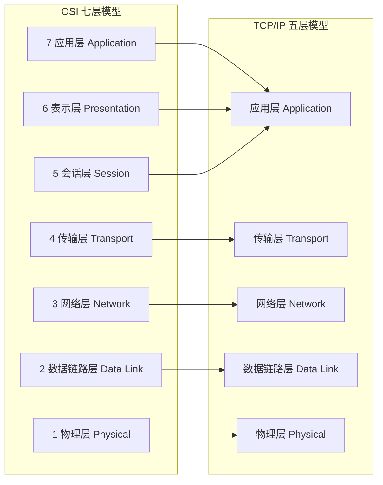
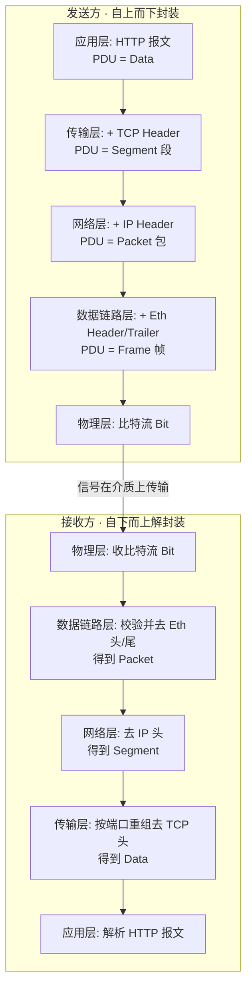
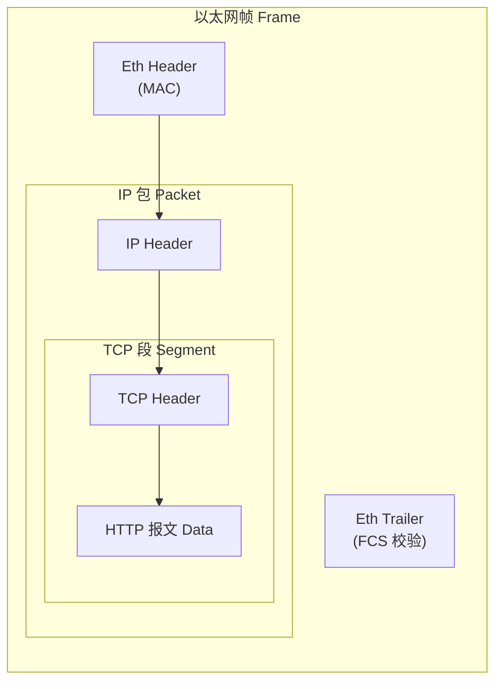

# 01 · 网络分层模型（OSI & TCP/IP Model）

> 分层模型把"两台机器如何通信"这个巨大问题拆成若干层，每层只关心自己的职责、只与上下相邻层打交道，从而让协议可以被独立设计、替换和排错。

## 📖 知识讲解

### 为什么要分层

网络通信涉及的问题极其庞杂：电信号如何编码、比特如何成帧、主机之间如何寻址、如何保证数据不丢不乱、应用之间如何约定报文格式……如果不分层，任何一处改动都会牵一发而动全身。分层的核心思想是**关注点分离（separation of concerns）**：

- 每一层向上层提供**服务（service）**，向下层请求服务；
- 相邻层之间通过**接口（interface）**交互，实现细节被封装；
- 同一层在通信双方之间遵循相同的**协议（protocol）**，即"对等层对话"（peer-to-peer）。

由此带来的好处：**解耦**（改物理介质不影响 HTTP）、**标准化**（不同厂商设备可互通）、**易排错**（能定位到具体某一层）。

### OSI 七层模型（自上而下）

OSI（Open Systems Interconnection）是 ISO 提出的**参考模型**，理论意义大于工程意义，但它的分层术语是全行业通用语言。

| 层 | 名称 | 职责 | 典型协议 / 设备 | PDU 名称 |
|---|---|---|---|---|
| 7 | 应用层 Application | 为应用程序提供网络服务接口，定义应用级报文语义 | HTTP、FTP、SMTP、DNS | Data（数据/报文 Message） |
| 6 | 表示层 Presentation | 数据编码、加密/解密、压缩、字符集转换 | TLS（有争议）、JPEG、ASCII | Data |
| 5 | 会话层 Session | 建立、管理、终止会话，同步与断点续传 | RPC、NetBIOS | Data |
| 4 | 传输层 Transport | 端到端可靠/不可靠传输、分段、流量控制、端口寻址 | TCP、UDP | 段 Segment（TCP）/ 数据报 Datagram（UDP） |
| 3 | 网络层 Network | 逻辑寻址（IP）、路由选择、跨网络转发 | IP、ICMP、路由器 Router | 包 Packet（也叫数据报 Datagram） |
| 2 | 数据链路层 Data Link | 相邻节点间成帧、MAC 寻址、差错检测（CRC） | Ethernet、PPP、交换机 Switch、网卡 | 帧 Frame |
| 1 | 物理层 Physical | 比特流的电/光/电磁信号传输、接口与线缆规范 | 双绞线、光纤、集线器 Hub | 比特 Bit |

记忆口诀（自下而上）：**物 - 数 - 网 - 传 - 会 - 表 - 应**。

### TCP/IP 模型（四层 / 五层）

TCP/IP 是**实际运行在互联网上的工程模型**，先有实现后有模型。它有两种常见画法：

- **四层版**（RFC 1122 原始定义）：应用层 Application / 传输层 Transport / 网际层 Internet / 链路层 Link。
- **五层版**（教学常用）：把链路层再拆成数据链路层与物理层，即：应用 / 传输 / 网络 / 数据链路 / 物理。

RFC 1122 把 OSI 的应用、表示、会话三层合并为一个"应用层"——因为在真实工程里，这三层的边界很模糊，通常由应用自己处理（例如 HTTP 报文里就同时包含了会话、编码等语义）。

### OSI 与 TCP/IP 的对应关系

```
OSI 七层            TCP/IP 四层        TCP/IP 五层
─────────           ──────────         ──────────
应用层  ┐
表示层  ├──────────  应用层            应用层
会话层  ┘
传输层  ────────────  传输层            传输层
网络层  ────────────  网际层            网络层
数据链路层 ┐          链路层           数据链路层
物理层     ┘                          物理层
```

### 数据封装（Encapsulation）与解封装（Decapsulation）

数据从发送方**自上而下**逐层传递，每经过一层就在数据前面（有的层还在后面）添加本层的**头部 header**（数据链路层还会加尾部 trailer，如 Ethernet 的 FCS 校验），这个过程叫**封装**；数据的完整单元（本层头部 + 上层交下来的全部内容）称为该层的 **PDU（Protocol Data Unit）**。

到达接收方后**自下而上**逐层剥离对应头部，每层解读并去掉自己那层的 header，把净荷（payload）交给上层，这个过程叫**解封装**。关键点：**每一层只认识自己那层的头部，对上层数据视为不透明的净荷**。

以一个 HTTP GET 请求为例：

1. 应用层：生成 HTTP 报文（请求行 + 请求头 + 体），此为 **Data**。
2. 传输层（TCP）：加 TCP 头部（源/目的端口、seq、ack 等）→ **Segment**。
3. 网络层（IP）：加 IP 头部（源/目的 IP、TTL、协议号）→ **Packet**。
4. 数据链路层（Ethernet）：加以太网头部（源/目的 MAC、类型）+ 尾部 FCS → **Frame**。
5. 物理层：把帧转成比特流，编码为电/光信号在介质上传输 → **Bit**。

接收端反向：物理层收比特 → 链路层校验并去帧头得到 Packet → 网络层按 IP 转发/上交去 IP 头得到 Segment → 传输层按端口重组去 TCP 头得到 Data → 应用层解析 HTTP 报文。

### 每层的寻址粒度（易混点）

- 物理层：无地址，只是信号。
- 数据链路层：**MAC 地址**（48 位，硬件地址，同一局域网内寻址）。
- 网络层：**IP 地址**（逻辑地址，跨网络寻址）。
- 传输层：**端口号 port**（定位主机内的具体进程/应用）。

一次通信真正定位到"哪台机器的哪个程序"靠的是 **IP + 端口** 组成的 socket 二元组。

## 🔄 流程图 / 原理图

### 图 1：OSI ↔ TCP/IP 分层对应



### 图 2：一个 HTTP 请求的封装与解封装全过程



### 图 3：帧结构中的层层嵌套（洋葱模型）



## 💻 代码说明 / 抓包说明

本模块以原理为主。用 Wireshark 抓一个 HTTP 请求，展开某个包，你会看到与封装完全对应的分层结构（由外到内，恰是解封装顺序）：

```
Frame 42: 583 bytes on wire                         ← 物理层视角（整帧比特数）
Ethernet II, Src: aa:bb:cc.., Dst: 11:22:33..       ← 数据链路层：MAC 头部
    Type: IPv4 (0x0800)
Internet Protocol Version 4, Src: 192.168.1.5,      ← 网络层：IP 头部
    Dst: 93.184.216.34, TTL: 64, Protocol: TCP (6)
Transmission Control Protocol, Src Port: 51000,     ← 传输层：TCP 头部
    Dst Port: 80, Seq: 1, Ack: 1, Flags: PSH,ACK
Hypertext Transfer Protocol                         ← 应用层：HTTP 报文
    GET /index.html HTTP/1.1\r\n
    Host: example.com\r\n
```

阅读要点：Wireshark 每一行折叠块正好对应一层的 header；最外层是链路层（先被物理层收到、先被解析），最内层净荷是 HTTP。**外层头部里的"类型/协议"字段决定净荷该交给哪个上层协议**——Ethernet 的 `Type=0x0800` 表示净荷是 IPv4，IP 的 `Protocol=6` 表示净荷是 TCP，TCP 的 `Dst Port=80` 表示交给 HTTP 服务。这就是解封装时"逐层分用（demultiplexing）"的依据。

## ▶️ 运行方式

本模块以文档为主，无 demo。建议对照观察：

- 安装 [Wireshark](https://www.wireshark.org/)，抓取网卡流量，过滤 `http`，展开任意一个 HTTP 包逐层查看头部。
- 命令行可用 `sudo tcpdump -i any -X port 80` 查看原始十六进制报文，感受"头部套头部"。
- 浏览器 DevTools 的 Network 面板只能看到应用层（HTTP）视角，看不到 TCP/IP 头部——这本身就说明了分层的抽象。

## ⚠️ 常见坑 / 最佳实践

- **分层是抽象模型，不是严格实现**。真实协议栈里各层并非泾渭分明：例如为了性能，内核会做跨层优化；NAT 设备会同时改动网络层 IP 和传输层端口（本应各管各的）。不要把模型当成对代码结构的强制约束。
- **OSI 只是参考模型，互联网跑的是 TCP/IP**。面试/文档里用 OSI 的"七层"术语交流，但没有任何主流系统真按七层写代码。会话层、表示层在工程中几乎不独立存在。
- **TLS 属于哪一层有争议**。按 OSI 理论它做加密/编码，接近**表示层（第 6 层）**；但工程上它运行在 TCP 之上、为应用提供安全通道，很多人把它归到**传输层与应用层之间的"会话/传输层"**。更准确的说法：TLS 是介于传输层与应用层之间的**安全层**，不必强行塞进某一层。QUIC 则把加密直接内建进传输层，进一步模糊了边界。
- **PDU 名称别记混**：传输层 TCP 叫段 Segment、UDP 叫数据报 Datagram；网络层叫包 Packet（也叫 datagram）；链路层叫帧 Frame；物理层叫比特 Bit。面试高频。
- **"路由器工作在第几层"这类题**：交换机（Switch）主要在第 2 层（看 MAC），路由器（Router）在第 3 层（看 IP），网关/代理/负载均衡可能到第 4~7 层。设备工作层次 = 它需要"拆到哪一层头部"才能做决策。

## 🔗 官方文档

- OSI 模型（Wikipedia）：https://en.wikipedia.org/wiki/OSI_model
- RFC 1122 Requirements for Internet Hosts（TCP/IP 分层定义）：https://www.rfc-editor.org/rfc/rfc1122
- MDN 网络工作原理：https://developer.mozilla.org/zh-CN/docs/Learn/Common_questions/Web_mechanics/How_does_the_Internet_work
- Cloudflare Learning · OSI Model：https://www.cloudflare.com/learning/ddos/glossary/open-systems-interconnection-model-osi/
