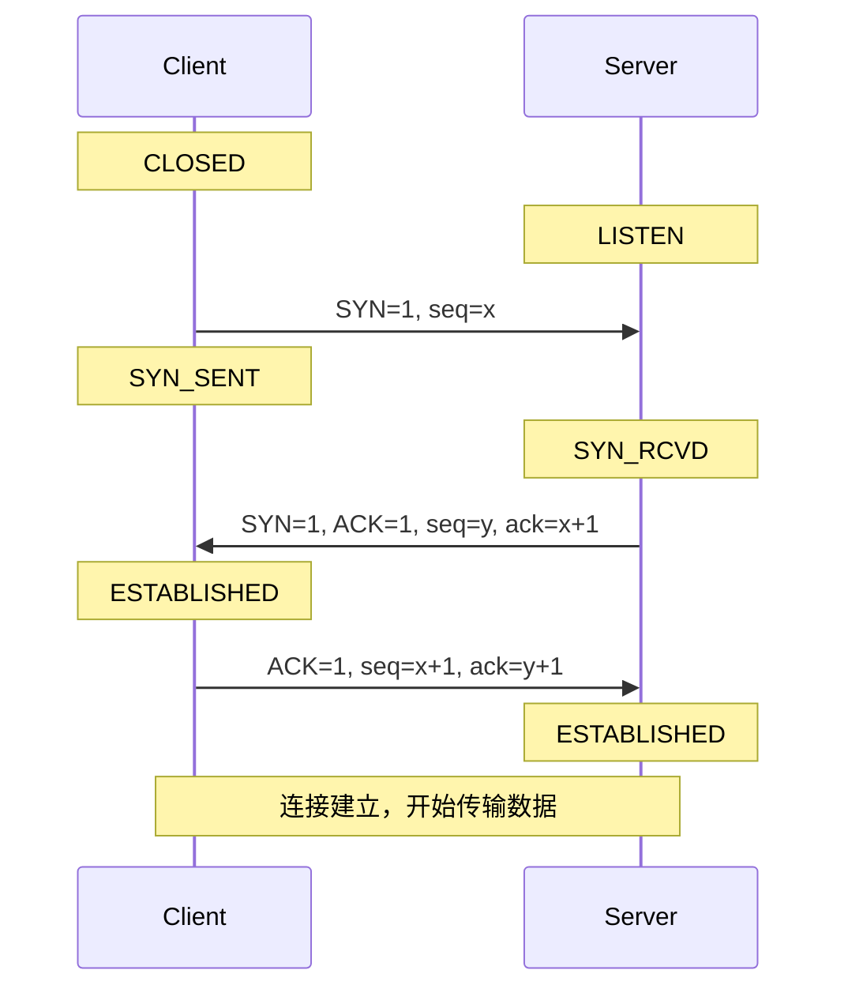
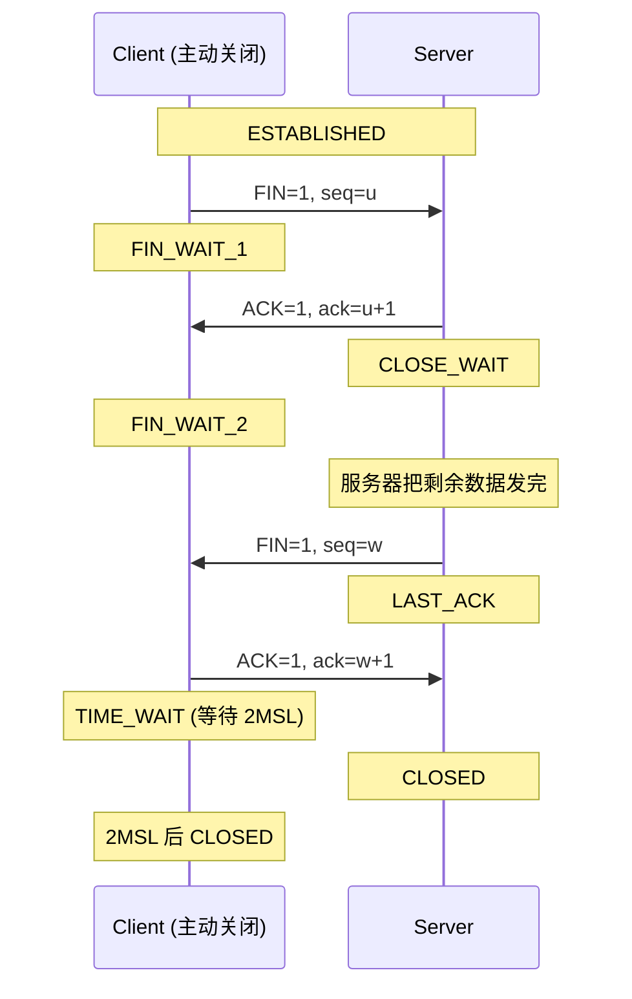
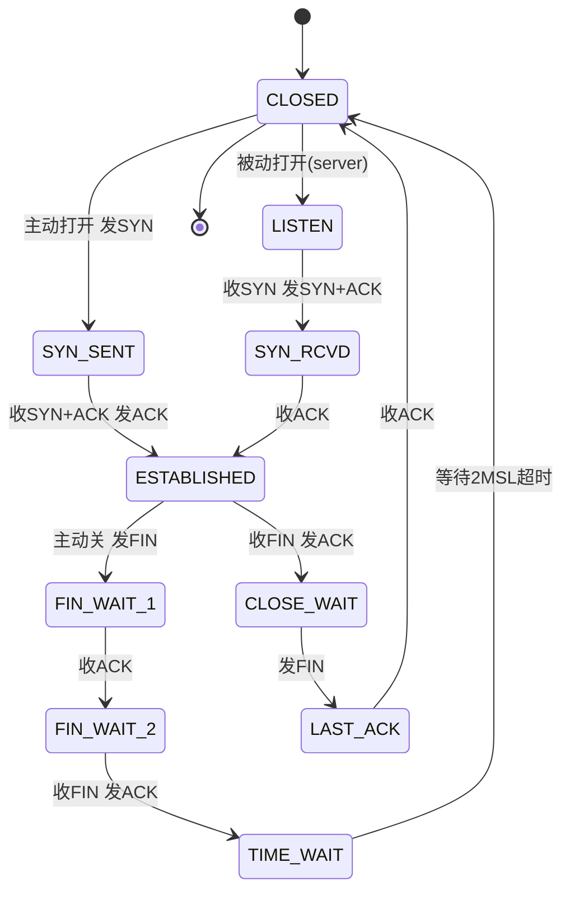
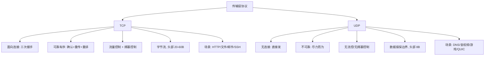

# 02 · TCP 与 UDP（Transmission Control Protocol & User Datagram Protocol）

> TCP 和 UDP 都是传输层协议，跑在 IP 之上。TCP 用"连接 + 确认 + 重传"换来可靠有序，UDP 用"发完就不管"换来极低开销——理解它们的取舍，就理解了绝大多数网络性能问题的根源。

## 📖 知识讲解

### 一句话对比

| 维度 | TCP | UDP |
|---|---|---|
| 连接 | 面向连接（先握手） | 无连接（直接发） |
| 可靠性 | 可靠：确认 + 重传，保证不丢 | 不可靠：尽力而为，可能丢/重/乱 |
| 顺序 | 有序：按序列号重组 | 无序：到达顺序 = 网络顺序 |
| 流量控制 | 有（滑动窗口） | 无 |
| 拥塞控制 | 有（慢启动/拥塞避免等） | 无 |
| 头部开销 | 20~60 字节 | 固定 8 字节 |
| 传输方式 | 字节流 stream | 数据报 datagram（保留边界） |
| 通信模式 | 一对一（单播） | 一对一/一对多/多对多（支持广播、组播） |
| 典型场景 | HTTP、文件传输、邮件、SSH | DNS、视频/音频流、在线游戏、QUIC/HTTP3 |

核心权衡：**可靠有序不是免费的**——它以握手往返、确认等待、队头阻塞、更大头部为代价。对时延极敏感、能容忍少量丢包的场景（实时音视频、游戏），UDP 反而更优。

### TCP 报文段（Segment）字段

理解握手挥手前，先看 TCP 头部关键字段（RFC 9293）：

- **源端口 / 目的端口（各 16 位）**：定位收发进程。
- **序列号 Sequence Number（32 位）**：本段第一个字节在整个字节流中的编号。TCP 是字节流，seq 是"字节计数"而非"报文计数"。
- **确认号 Acknowledgment Number（32 位）**：期望收到的**下一个**字节序号，即"这之前的我都收到了"（累积确认）。仅当 ACK=1 时有效。
- **数据偏移（4 位）**：头部长度，因有可选项所以是变长。
- **标志位 Flags**：
  - `SYN`：发起连接、同步序列号。
  - `ACK`：确认号字段有效。
  - `FIN`：发送方数据发完，请求关闭。
  - `RST`：复位，强制断开异常连接。
  - `PSH`：催促接收方尽快把数据交给应用，别缓存。
  - `URG` / 紧急指针：紧急数据（现代基本不用）。
- **窗口 Window（16 位）**：本方接收窗口大小（还能收多少字节），用于**流量控制**。
- **校验和 Checksum（16 位）**：覆盖头部 + 数据 + 伪首部，检测比特错误。
- **选项 Options**：如 MSS（最大段大小）、窗口缩放（Window Scale，突破 64KB 限制）、SACK（选择性确认）、时间戳。

UDP 头部只有 8 字节：源端口、目的端口、长度、校验和——没有序列号、没有确认、没有窗口，简单到极致。

### 三次握手（Three-Way Handshake）—— 建立连接

目的：**双方各自同步初始序列号（ISN），并确认对方的收发能力都正常**。

1. **第一次（SYN）**：客户端发 `SYN=1, seq=x`，进入 `SYN_SENT`。（我要连你，我的初始序号是 x）
2. **第二次（SYN-ACK）**：服务器回 `SYN=1, ACK=1, seq=y, ack=x+1`，进入 `SYN_RCVD`。（同意，我的初始序号是 y，且确认收到你的 x）
3. **第三次（ACK）**：客户端回 `ACK=1, seq=x+1, ack=y+1`，进入 `ESTABLISHED`；服务器收到后也进入 `ESTABLISHED`。（确认收到你的 y，开始通信）

状态迁移（客户端视角）：`CLOSED → SYN_SENT → ESTABLISHED`；（服务端视角）：`CLOSED → LISTEN → SYN_RCVD → ESTABLISHED`。

**为什么是三次，不是两次？**

- **核心：确认双向通道都可用**。两次握手只能确认"客户端→服务器"这一方向通，服务器无法确认自己发出的 SYN-ACK 客户端是否收到，即"服务器的发送 + 客户端的接收"能力未被验证。第三次 ACK 正是补上这一确认。
- **防止历史连接（旧的重复 SYN）被错误建立**。若一个早已失效、在网络中滞留的旧 SYN 到达服务器，两次握手下服务器会直接建连并一直等待数据，浪费资源。三次握手中客户端可用第三次 ACK（或对旧 SYN 回 RST）来拒绝这个过期连接。RFC 9293 明确以此为主要理由。
- **同步序列号需要双向确认**。x 和 y 都必须被对方确认，两次不够。

**为什么不是四次？** SYN-ACK 可以合并成一个段（服务器的"确认你"和"同步我"一起发），所以三次足矣。

### 四次挥手（Four-Way Handshake）—— 释放连接

TCP 是全双工，两个方向要**各自独立关闭**，所以需要四次。

1. **第一次（FIN）**：主动关闭方（设为客户端）发 `FIN=1, seq=u`，进入 `FIN_WAIT_1`。（我没数据要发了）
2. **第二次（ACK）**：服务器回 `ACK=1, ack=u+1`，进入 `CLOSE_WAIT`；客户端收到进入 `FIN_WAIT_2`。（知道了，但我这边可能还有数据要发）
3. **第三次（FIN）**：服务器把剩余数据发完后，发 `FIN=1, seq=w`，进入 `LAST_ACK`。（现在我也发完了）
4. **第四次（ACK）**：客户端回 `ACK=1, ack=w+1`，进入 `TIME_WAIT`；服务器收到后进入 `CLOSED`。客户端等待 **2MSL** 后才进入 `CLOSED`。

**为什么挥手要四次，握手却三次？** 握手时服务器的 ACK 和 SYN 能合并成一个段；挥手时，服务器收到 FIN 后**通常还有数据没发完**，所以先单独回 ACK，等自己数据发完再发 FIN——两者不能合并，于是拆成四次。（若服务器也无数据可发，某些实现会合并 ACK+FIN，退化成三次。）

**TIME_WAIT 与 2MSL**（MSL = Maximum Segment Lifetime，报文最大生存时间，通常约定 2 分钟，Linux 默认 2MSL=60s）：

主动关闭方在最后一次 ACK 后要等 2MSL，原因有二：

1. **保证最后的 ACK 能到达对方**。若这个 ACK 丢了，对方会重传 FIN，此时本方还在 TIME_WAIT 就能重发 ACK；若立即关闭就无法响应，对方会一直卡在 LAST_ACK。
2. **让本次连接的旧报文在网络中自然消亡**，避免它们串扰到后续用相同四元组（同一对 IP+端口）建立的新连接。等 2MSL 可确保双向的残留报文都过期。

### 流量控制 vs 拥塞控制（一句话区分）

- **流量控制（flow control）**：防止发送方发太快**淹没接收方**，靠接收窗口 rwnd（Window 字段）。
- **拥塞控制（congestion control）**：防止发送方发太快**压垮网络中间链路**，靠拥塞窗口 cwnd，算法有慢启动、拥塞避免、快重传、快恢复，现代还有 BBR。
- 实际发送量 = `min(rwnd, cwnd)`。

### UDP 的适用场景

- **DNS 查询**：一问一答、报文短，UDP 省去握手延迟（DNS 也支持 TCP，用于大响应或区域传送）。
- **实时音视频、直播**：丢一帧不如卡一秒，宁可丢包也要低延迟。
- **在线游戏**：位置状态可用最新包覆盖旧包，重传旧状态没意义。
- **QUIC / HTTP/3**：构建在 UDP 之上，在用户态自己实现了可靠、有序、拥塞控制——既拿到 UDP 的灵活低延迟，又补齐了可靠性，还避免了 TCP 的队头阻塞。这是"UDP 不可靠"这一表述的重要现代反例：不可靠的是协议本身，可靠性可以在上层重建。

## 🔄 流程图 / 原理图

### 图 1：三次握手时序（sequenceDiagram）



### 图 2：四次挥手时序（sequenceDiagram）



### 图 3：TCP 状态机（stateDiagram-v2）



### 图 4：TCP vs UDP 对比（graph）



## 💻 代码说明 / 抓包说明

用 `tcpdump` 抓一次完整连接的握手，能清楚看到 SYN / SYN-ACK / ACK 三步（`Flags [S]`=SYN，`[S.]`=SYN+ACK，`[.]`=ACK）：

```
# tcpdump -i any -n 'tcp port 80'
IP 192.168.1.5.51000 > 93.184.216.34.80: Flags [S],  seq 1000000000, win 64240   ← 第一次 SYN
IP 93.184.216.34.80 > 192.168.1.5.51000: Flags [S.], seq 2000000000, ack 1000000001, win 65535  ← 第二次 SYN-ACK
IP 192.168.1.5.51000 > 93.184.216.34.80: Flags [.],  ack 2000000001, win 64240   ← 第三次 ACK
...（数据传输，Flags [P.] = PSH+ACK）...
IP 192.168.1.5.51000 > 93.184.216.34.80: Flags [F.], seq ..., ack ...             ← 挥手 FIN
IP 93.184.216.34.80 > 192.168.1.5.51000: Flags [.],  ack ...                      ← ACK
IP 93.184.216.34.80 > 192.168.1.5.51000: Flags [F.], seq ..., ack ...             ← FIN
IP 192.168.1.5.51000 > 93.184.216.34.80: Flags [.],  ack ...                      ← 最后 ACK
```

阅读要点：注意 `ack` 值总是"对方 seq + 1"（SYN/FIN 各占用一个序号），这正是累积确认"我期望的下一个字节"的体现。用 `ss -tan`（Linux）或 `netstat -an` 可实时观察连接的 `ESTAB / TIME-WAIT / CLOSE-WAIT` 等状态，验证状态机。

## ▶️ 运行方式

本模块以文档为主，无 demo。建议对照观察：

- 抓握手：`sudo tcpdump -i any -n 'tcp[tcpflags] & (tcp-syn|tcp-fin) != 0'` 只看握手/挥手包。
- 看状态：`ss -tan | grep -E 'SYN|TIME|CLOSE'`（Linux）或 macOS `netstat -an -p tcp`。
- 造 TIME_WAIT：反复发起短连接（如 `curl` 循环）后立刻 `ss -tan | grep TIME-WAIT | wc -l` 观察堆积。
- 在 Wireshark 里过滤 `tcp.flags.syn==1`，用 "Follow TCP Stream" 看完整生命周期。

## ⚠️ 常见坑 / 最佳实践

- **TIME_WAIT 大量堆积**：高并发**短连接**的客户端/主动关闭方最易中招，每个连接关闭后占用一个端口 2MSL，可能耗尽本地端口导致新连接失败。对策：① 用**长连接/连接池**（HTTP Keep-Alive）从根上减少连接数；② Linux 开 `net.ipv4.tcp_tw_reuse=1` 允许安全复用 TIME_WAIT 端口（**注意 `tcp_tw_recycle` 已在新内核移除，NAT 环境下会丢连接，切勿使用**）；③ 让服务端而非客户端主动关闭，把 TIME_WAIT 转移到有更多资源的一方需权衡。
- **CLOSE_WAIT 堆积往往是 bug**：CLOSE_WAIT 表示"对方已 FIN，但本方应用迟迟没调用 close()"。大量 CLOSE_WAIT 几乎总是**应用层没正确关闭 socket / 连接泄漏**，而非内核问题——查你的代码是否漏了 close。
- **SYN 洪泛攻击（SYN Flood）**：攻击者伪造大量源 IP 只发 SYN 不回第三次 ACK，服务器为每个半连接分配资源并卡在 `SYN_RCVD`，半连接队列被占满，正常用户无法连接（一种 DoS）。防御：**SYN Cookies**（不预先分配资源，把状态编码进 SYN-ACK 的序列号里，收到合法 ACK 再建连）、增大半连接队列、缩短 SYN-ACK 重试、上游防火墙限速。
- **"UDP 一定不可靠"是误解**：不可靠的是 UDP 协议本身，QUIC 就在 UDP 之上实现了可靠有序。选 UDP 不等于放弃可靠性，而是把可靠性的控制权交给上层，按需定制。
- **seq/ack 是按字节计数，不是按包**：这是流式协议的本质。SYN 和 FIN 虽不携带数据，但各消耗 1 个序号。
- **别把流量控制和拥塞控制搞混**：一个防淹没接收方（rwnd），一个防压垮网络（cwnd），面试高频区分点。
- **UDP 有报文边界，TCP 没有**：TCP 是字节流，应用层必须自己解决"粘包/拆包"（用定长、分隔符或长度前缀）；UDP 一个 `sendto` 对应一个 `recvfrom`，边界天然保留。

## 🔗 官方文档

- RFC 9293 · Transmission Control Protocol（TCP 现行标准，2022 年取代 RFC 793）：https://www.rfc-editor.org/rfc/rfc9293
- RFC 768 · User Datagram Protocol：https://www.rfc-editor.org/rfc/rfc768
- RFC 5681 · TCP Congestion Control：https://www.rfc-editor.org/rfc/rfc5681
- MDN · TCP（术语表）：https://developer.mozilla.org/zh-CN/docs/Glossary/TCP
- Cloudflare · What is TCP/IP：https://www.cloudflare.com/learning/ddos/glossary/tcp-ip/
- Cloudflare · SYN Flood 攻击：https://www.cloudflare.com/learning/ddos/syn-flood-ddos-attack/
