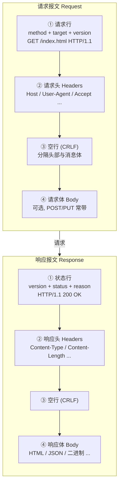
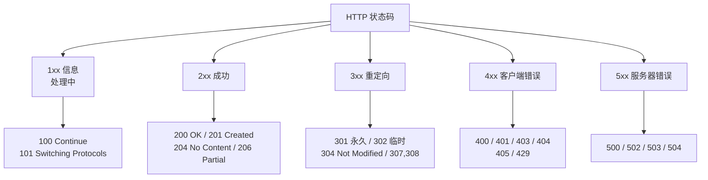
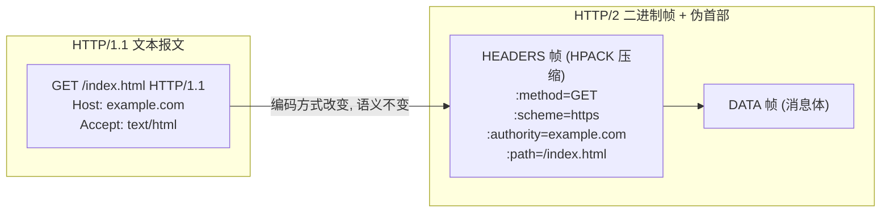

# 03 · HTTP 报文（HTTP Messages）

> HTTP 报文是客户端与服务器交换的"语言"。请求报文与响应报文都由固定的四段结构组成——看懂报文，就看懂了 Web 的一切请求/响应。

## 📖 知识讲解

### 报文的四段结构（HTTP/1.x 文本格式）

HTTP/1.x 的报文是**纯文本、以行为单位**的，用 `CRLF`（`\r\n`）换行。请求与响应结构对称：

**请求报文（Request）**：

```
① 请求行     GET /index.html HTTP/1.1
② 请求头     Host: example.com
             User-Agent: curl/8.0
             Accept: text/html
③ 空行       （一个单独的 CRLF，标志头部结束）
④ 请求体     name=alice&age=20   （GET 通常无体）
```

- **① 请求行 Request Line** = `method` + 空格 + `request-target`（路径/查询串）+ 空格 + `HTTP-version`。
- **② 请求头 Headers**：若干 `字段名: 值`，提供元信息。
- **③ 空行**：一个空的 CRLF，**用来分隔头部和消息体**——非常关键，服务器靠它判断头部到哪结束。
- **④ 请求体 Body**：可选，POST/PUT/PATCH 常带（表单、JSON、文件等）。

**响应报文（Response）**：

```
① 状态行     HTTP/1.1 200 OK
② 响应头     Content-Type: text/html; charset=utf-8
             Content-Length: 138
③ 空行
④ 响应体     <html>...</html>
```

- **① 状态行 Status Line** = `HTTP-version` + 空格 + `status-code`（三位数字）+ 空格 + `reason-phrase`（原因短语，如 `OK` / `Not Found`，仅供人读）。
- 其余三段与请求对称。

### 常用请求方法（Methods）与安全性/幂等性

| 方法 | 语义 | 安全 safe | 幂等 idempotent | 可缓存 |
|---|---|---|---|---|
| GET | 获取资源 | ✅ | ✅ | ✅ |
| HEAD | 同 GET 但只要头部、无体 | ✅ | ✅ | ✅ |
| OPTIONS | 查询资源支持的方法/能力（CORS 预检用） | ✅ | ✅ | ❌ |
| POST | 提交数据、创建资源/触发处理 | ❌ | ❌ | 一般否（除非显式指定） |
| PUT | 用请求体**整体替换**目标资源 | ❌ | ✅ | ❌ |
| PATCH | **部分更新**资源 | ❌ | ❌（规范上不保证） | ❌ |
| DELETE | 删除资源 | ❌ | ✅ | ❌ |

两个核心概念（RFC 9110 定义）：

- **安全（safe）**：只读，不改变服务器状态。GET/HEAD/OPTIONS 安全。
- **幂等（idempotent）**：同一请求执行一次和执行 N 次，对服务器状态的**最终影响相同**。GET/HEAD/OPTIONS/PUT/DELETE 幂等；POST/PATCH 不幂等。
  - 直观理解：`DELETE /user/1` 删一次和删十次，结果都是"用户 1 不存在"，幂等；`POST /users` 连发十次会创建十个用户，不幂等。
  - 幂等性的工程价值：**幂等请求在网络失败后可以安全重试**，非幂等请求重试可能造成重复下单等副作用。

### 状态码（Status Codes）五大类

三位数字，首位定大类：

| 类别 | 含义 | 常见码 |
|---|---|---|
| **1xx 信息** | 请求已收到，处理中 | 100 Continue、101 Switching Protocols（升级到 WebSocket） |
| **2xx 成功** | 请求成功处理 | 200 OK、201 Created、204 No Content、206 Partial Content |
| **3xx 重定向** | 需进一步操作（多为跳转） | 301 永久重定向、302 临时重定向、304 Not Modified、307/308 |
| **4xx 客户端错误** | 请求有误，责任在客户端 | 400 Bad Request、401 Unauthorized、403 Forbidden、404 Not Found、405 Method Not Allowed、429 Too Many Requests |
| **5xx 服务器错误** | 服务器处理失败 | 500 Internal Server Error、502 Bad Gateway、503 Service Unavailable、504 Gateway Timeout |

高频码辨析：

- **201 vs 200**：201 专指"创建成功"，常配 `Location` 头指向新资源。
- **204**：成功但无响应体（如 DELETE 成功、表单提交后不返回内容）。
- **301 vs 302**：301 永久（浏览器/搜索引擎会缓存跳转、更新书签），302 临时（不应长期缓存）。对应"保留方法"的现代版是 308（永久）/307（临时）——它们**禁止把 POST 改成 GET**，而老的 301/302 历史上常被浏览器改写方法。
- **304 Not Modified**：配合缓存协商（`If-None-Match`/`ETag`、`If-Modified-Since`/`Last-Modified`），告诉客户端"资源没变，用你本地缓存"，不返回体，省流量。
- **401 vs 403**：401 = "你没认证/认证失败"（需要登录，常配 `WWW-Authenticate`）；403 = "认证了但没权限"（登录了也不让你访问）。
- **400 vs 405**：400 请求本身格式/参数错误；405 方法用错了（如对只读接口发 DELETE），响应应带 `Allow` 头列出允许的方法。
- **502 vs 503 vs 504**：502 网关从上游收到无效响应；503 服务暂时不可用（过载/维护，可带 `Retry-After`）；504 网关等上游超时。三者常见于反向代理/负载均衡场景，定位问题要分清"是网关还是上游"。

### 常用头部字段（Headers）

**通用/请求头**：

- `Host`：目标主机名（HTTP/1.1 必填，一台服务器靠它区分虚拟主机）。
- `User-Agent`：客户端标识。
- `Accept` / `Accept-Language` / `Accept-Encoding`：客户端能接受的媒体类型/语言/压缩方式（内容协商）。
- `Content-Type`：**请求/响应体的媒体类型**，如 `application/json`、`application/x-www-form-urlencoded`、`multipart/form-data`、`text/html; charset=utf-8`。
- `Content-Length`：消息体字节数（与 `Transfer-Encoding: chunked` 二选一）。
- `Authorization`：携带凭证，如 `Bearer <token>`。
- `Cookie`：客户端回传的 cookie。

**响应头**：

- `Content-Type` / `Content-Length`：同上，描述响应体。
- `Location`：重定向目标（3xx）或新建资源地址（201）。
- `Set-Cookie`：服务器种 cookie（可带 `HttpOnly`、`Secure`、`SameSite` 等属性）。
- `Cache-Control` / `ETag` / `Last-Modified`：缓存控制（详见 09 缓存模块）。
- `Server`：服务器软件标识。

### HTTP/2+ 中报文的变化：从文本到二进制帧

HTTP/1.x 的文本报文人类可读，但解析低效、无法多路复用。**HTTP/2（RFC 9113）把报文改为二进制分帧（binary framing）**：

- 报文被拆成 `HEADERS` 帧和 `DATA` 帧，头部用 **HPACK** 压缩，多个请求可在同一连接上并发（多路复用），解决 HTTP/1.1 的队头阻塞（应用层）。
- **请求行/状态行被"伪首部（pseudo-headers）"取代**，它们以冒号开头，必须排在普通头部之前：
  - 请求侧：`:method`（GET）、`:scheme`（https）、`:authority`（等价于 Host）、`:path`（/index.html）。
  - 响应侧：`:status`（200）——**HTTP/2 里没有 reason-phrase 了**。
- **语义不变**：方法、状态码、头部字段这些"HTTP 语义"在 1.1/2/3 之间是一致的（RFC 9110 专门抽离了与版本无关的语义），变的只是"报文在线路上的编码方式（syntax）"。HTTP/3（RFC 9114）进一步把传输换到 QUIC/UDP，用 QPACK 压缩头部，但伪首部体系与 HTTP/2 一致。

一句话：**从 HTTP/1 到 HTTP/2/3，"说什么"没变（语义），"怎么写在线上"变了（从文本行变成二进制帧 + 伪首部）**。

## 🔄 流程图 / 原理图

### 图 1：HTTP 请求 / 响应报文结构（flowchart）



### 图 2：状态码五大类分类（graph）



### 图 3：HTTP/1.1 文本报文 → HTTP/2 二进制帧（graph）



## 💻 代码说明 / 抓包说明

本模块附带一个最小 demo：`server.js`（纯 Node 内置 `http` 模块，无需安装依赖）。它做两件事：

1. **打印请求报文**：在回调里把 `req.method`、`req.url`、`req.httpVersion` 拼成"请求行"，遍历 `req.headers` 打印"请求头"，并监听 `data`/`end` 事件流式收集"请求体"——这正好对应报文四段结构。注意 body 必须**流式读取**（`req.on('data')`），因为 Node 不会自动缓冲请求体。
2. **按路径返回不同状态码**演示响应报文：`res.writeHead(状态码, 头部对象)` 写状态行 + 响应头，`res.end(内容)` 写响应体。例如 `/created` 返回 201 + `Content-Type: application/json`；`/old` 返回 301 并带 `Location` 头；`/boom` 返回 500；未知路径返回 404。

配合 `curl -v` 可同时看到两端报文（`>` 是请求，`<` 是响应）：

```
$ curl -v http://localhost:3000/
> GET / HTTP/1.1              ← 请求行
> Host: localhost:3000        ← 请求头
> User-Agent: curl/8.0
> Accept: */*
>                             ← 空行（头部结束）
< HTTP/1.1 200 OK             ← 状态行
< Content-Type: text/html; charset=utf-8   ← 响应头
< Content-Length: 138
<                             ← 空行
<h1>HTTP 报文 demo</h1>...    ← 响应体
```

`curl -v` 里的 `>`/`<` 与本模块讲的"四段结构"逐行对应，空行处正是头部与消息体的分界。

## ▶️ 运行方式

```bash
cd 17-network-protocols/03-http-message
node server.js
# 终端提示已启动后，另开一个终端：
curl -v http://localhost:3000/            # 200
curl -v -X POST -d 'name=alice' http://localhost:3000/created   # 201, 观察请求体被打印
curl -v http://localhost:3000/nocontent   # 204 无响应体
curl -v http://localhost:3000/old         # 301 + Location: /
curl -v http://localhost:3000/boom        # 500
curl -v http://localhost:3000/notexist    # 404
```

也可用浏览器打开 http://localhost:3000 ，同时观察运行 `server.js` 的终端里逐行打印出来的请求报文。在浏览器 DevTools 的 Network 面板点任一请求，可在 Headers 标签看到"General / Response Headers / Request Headers"，即报文各部分的图形化呈现。

## ⚠️ 常见坑 / 最佳实践

- **GET 幂等但也可被缓存**：GET 安全且幂等，浏览器/代理/CDN 可能缓存其响应。所以**不要用 GET 做有副作用的操作**（如 `GET /delete?id=1`）——预取、爬虫、浏览器预加载都可能在你不知情时触发它。有副作用的一律用 POST/PUT/DELETE。
- **POST 非幂等，重试要小心**：网络超时后盲目重试 POST 可能重复下单/重复扣款。解决方案：服务端支持**幂等键（Idempotency-Key）**，或改用天然幂等的 PUT。
- **"方法语义 vs 实际实现"**：HTTP 方法的安全/幂等只是**规范约定的语义**，服务器完全可以违背它——你可以写一个"GET 却删数据"的接口，但这违反规范、会被缓存和预取坑到。设计 API 时应让实现与方法语义一致。
- **PATCH 规范上不保证幂等**：虽然很多人以为"更新就是幂等"，但 RFC 未要求 PATCH 幂等（取决于 patch 文档的形式，如"计数 +1"就不幂等）。需要幂等的整体更新用 PUT。
- **HTTP/2 里没有 reason-phrase、没有明文请求行**：别再假设线上跑的是文本 `GET / HTTP/1.1`。用 `:method`/`:path`/`:status` 等伪首部理解，且 Node/Nginx 等会把 HTTP/2 头部**归一化**（如 `Host` ↔ `:authority`），调试时注意版本差异。
- **`Content-Length` 与消息体长度必须一致**：手写响应时若声明的长度和实际字节数不符，会导致客户端截断或挂起。中文按字节数算（UTF-8 一个汉字 3 字节），用 `Buffer.byteLength()` 而非字符串 `.length`。
- **头部大小写不敏感，但值大小写敏感**：字段名如 `Content-Type` 与 `content-type` 等价（HTTP/2 更是强制小写），但字段值（如 token、路径）大小写敏感。

## 🔗 官方文档

- MDN · HTTP 消息（报文结构）：https://developer.mozilla.org/zh-CN/docs/Web/HTTP/Guides/Messages
- MDN · HTTP 请求方法：https://developer.mozilla.org/zh-CN/docs/Web/HTTP/Reference/Methods
- MDN · HTTP 状态码：https://developer.mozilla.org/zh-CN/docs/Web/HTTP/Reference/Status
- MDN · HTTP 标头：https://developer.mozilla.org/zh-CN/docs/Web/HTTP/Reference/Headers
- RFC 9110 · HTTP Semantics（语义，与版本无关）：https://www.rfc-editor.org/rfc/rfc9110
- RFC 9112 · HTTP/1.1（文本报文语法）：https://www.rfc-editor.org/rfc/rfc9112
- RFC 9113 · HTTP/2：https://www.rfc-editor.org/rfc/rfc9113
