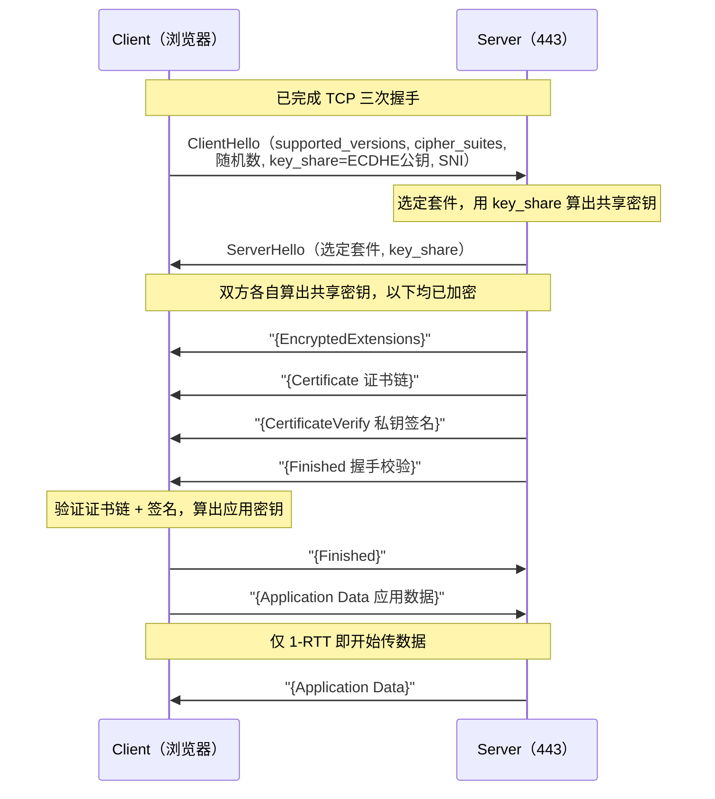
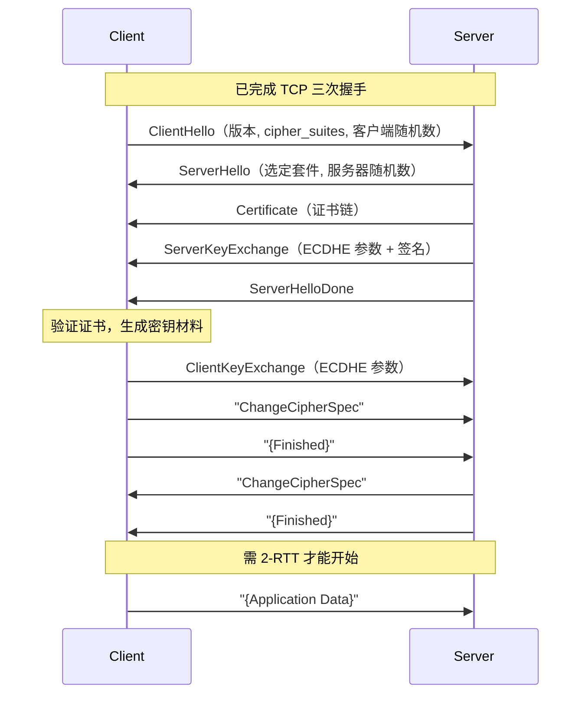
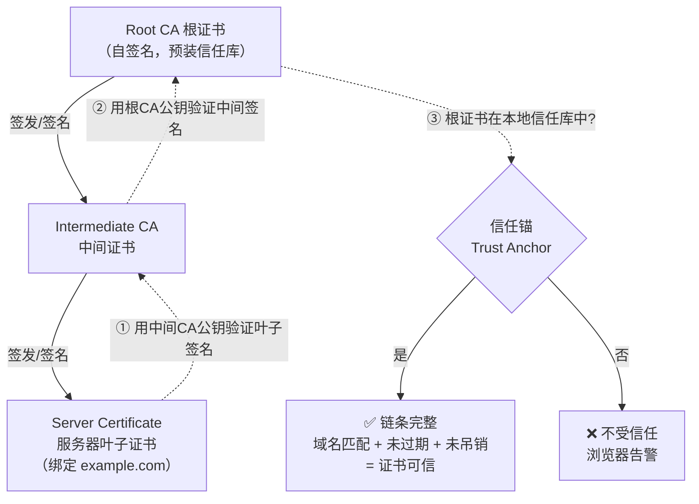

# 04 · HTTPS 与 TLS（HTTPS & TLS）
> HTTPS = HTTP over TLS：用 TLS 在 TCP 之上建立一条加密、防篡改、可验证身份的安全通道，再把普通 HTTP 报文塞进去传输。

## 📖 知识讲解

### 一、HTTPS 到底是什么

HTTPS 并不是一个新协议，而是 **HTTP + TLS** 的组合。应用层的 HTTP 报文没有任何改动，只是不再直接交给 TCP，而是交给中间的 **TLS 记录层（Record Layer）** 加密后再走 TCP：

```
HTTP  ← 应用层报文（GET / POST …）完全不变
 │
TLS   ← 握手协商密钥 + 记录层加密/完整性保护  （默认端口 443）
 │
TCP   ← 可靠字节流
 │
IP
```

TLS（Transport Layer Security）是 SSL 的继任者。**SSL 2.0/3.0、TLS 1.0、TLS 1.1 均已废弃**（IETF RFC 8996 于 2021 年正式弃用 TLS 1.0/1.1），现代 Web 只应使用 **TLS 1.2（RFC 5246）** 和 **TLS 1.3（RFC 8446，2018 年发布）**，其中 TLS 1.3 是当前首选。

TLS 要同时解决三件事：

| 目标 | 手段 |
| --- | --- |
| **机密性** Confidentiality | 对称加密（AES-GCM、ChaCha20-Poly1305）加密应用数据 |
| **完整性** Integrity | AEAD 认证加密自带 MAC，防篡改 |
| **身份认证** Authentication | 数字证书 + CA 信任链，验证"你连的确实是这个域名的服务器" |

### 二、对称加密 vs 非对称加密（为什么两者都要）

- **对称加密（Symmetric）**：加密和解密用**同一把密钥**。速度快（有 AES-NI 硬件指令，吞吐可达 GB/s 级），适合加密大量应用数据。缺点是：这把密钥怎么安全地让通信双方都拿到？直接在网上发就被窃听了。
- **非对称加密（Asymmetric / 公钥加密）**：一对密钥（公钥公开、私钥保密），公钥加密只有私钥能解，私钥签名可用公钥验证。安全性来自数学难题（RSA 大数分解、ECC 椭圆曲线离散对数），但**运算慢**（比对称加密慢几个数量级），不适合加密海量数据。

**TLS 的核心思路：用非对称手段安全地"协商"出一把对称密钥，之后的应用数据全部用这把对称密钥加密。** 非对称只在握手阶段用，兼顾了安全与性能。

> 注意：现代 TLS 并不是"用服务器公钥加密对称密钥发过去"（那是老式 RSA 密钥交换，TLS 1.3 已删除），而是用 **ECDHE 密钥交换**双方各自算出同一个共享密钥，证书里的公钥只用于**签名验证身份**，见下文"前向保密"。

### 三、TLS 1.3 握手（1-RTT，重点）

TLS 1.3 把握手压缩到 **1-RTT**（一个往返即可开始发应用数据），相比 TLS 1.2 的 2-RTT 少一个往返，显著降低首字节延迟。关键在于**客户端在第一个包 ClientHello 里就把密钥交换材料 `key_share`（一个 ECDHE 临时公钥）带上了**，猜测服务器会选的曲线，从而把"协商参数"和"交换密钥"合并成一步。

流程（1-RTT）：

1. **ClientHello**：客户端发送 支持的 TLS 版本（`supported_versions`）、密码套件列表、随机数、`key_share`（ECDHE 临时公钥）、`server_name`（SNI，见下文）。
2. **ServerHello**：服务器选定密码套件、返回自己的 `key_share`。**此刻双方都能各自算出共享密钥**，服务器随即用它加密后续握手消息。紧接着（已加密）发送：
   - `EncryptedExtensions`
   - `Certificate`（证书链）
   - `CertificateVerify`（用私钥对握手内容签名，证明"我确实持有证书对应的私钥"）
   - `Finished`（对整个握手做 MAC 校验）
3. **客户端**验证证书链与签名，发送自己的 `Finished`。握手完成，**客户端可以立刻在同一个飞行中就发送应用数据**。

密码套件也简化了：TLS 1.3 只保留提供前向保密的 AEAD 套件（如 `TLS_AES_128_GCM_SHA256`），删除了 RSA 密钥交换、静态 DH、CBC、RC4、SHA-1 等一切不安全选项。

### 四、TLS 1.3 的 0-RTT 会话恢复

首次握手后，服务器可以下发一个 **PSK（Pre-Shared Key）/ session ticket**。下次连接时，客户端可在 ClientHello 中携带 `early_data`，**直接带着应用数据一起发出（0-RTT）**，无需等待握手完成，延迟接近于零。

代价与风险：**0-RTT 数据没有防重放保护**。攻击者可以截获并重复发送这段 early data。因此 **0-RTT 只应用于幂等、无副作用的请求**（如 GET 静态资源），绝不能用于会改变服务器状态的请求（下单、转账、POST 写操作）。服务器需自行做重放防护（如单次 ticket、时间窗口去重）。

### 五、TLS 1.2 握手（2-RTT，对比）

TLS 1.2 需要**两个往返**才能开始发应用数据，因为参数协商和密钥交换是分开的两步：

1. **ClientHello**（客户端 → 服务器）：版本、密码套件列表、客户端随机数。
2. **ServerHello + Certificate + ServerKeyExchange + ServerHelloDone**（服务器 → 客户端）：选定套件、服务器随机数、证书、（ECDHE 场景下）服务器的密钥交换参数与签名。
3. **ClientKeyExchange + ChangeCipherSpec + Finished**（客户端 → 服务器）：客户端的密钥交换参数、切换加密、握手校验。
4. **ChangeCipherSpec + Finished**（服务器 → 客户端）：服务器切换加密、握手校验。之后才开始发应用数据。

`ChangeCipherSpec` 是 TLS 1.2 特有的"从现在起启用刚协商的加密参数"信号；TLS 1.3 已取消该独立消息（仅为兼容中间设备保留一个空壳）。

### 六、数字证书与证书链

服务器要向客户端证明"我就是 example.com"，靠的是 **X.509 数字证书**。证书里含：域名（Subject / SAN）、服务器公钥、有效期、颁发者（Issuer），以及 **CA 用自己私钥对以上内容做的数字签名**。

验证不是一张证书说了算，而是一条**信任链（Chain of Trust）**：

```
根 CA 证书（Root CA）        ← 自签名，预装在操作系统/浏览器信任库中
   │  签发
中间 CA 证书（Intermediate） ← 由根 CA 签名
   │  签发
服务器证书（Leaf）           ← 由中间 CA 签名，绑定你的域名
```

客户端验证时**逐级用上一级的公钥验证下一级证书的签名**，一直追溯到本地信任库里预置的根证书。只要链条完整、每一环签名有效、域名匹配、未过期、未被吊销（CRL/OCSP），才判定可信。

- **CA 信任**：根 CA 是"信任锚"，其证书内置于操作系统/浏览器。CA 的职责是核验申请者确实拥有该域名后才签发。
- **自签名证书（Self-signed）**：自己给自己签，没有可信 CA 背书，浏览器会报"不受信任"警告。仅适合本地开发/内网测试。

### 七、前向保密（Forward Secrecy，ECDHE）

**前向保密**指：即使服务器的长期私钥日后泄露，攻击者也**无法解密之前录制的历史流量**。实现靠 **ECDHE（Elliptic Curve Diffie-Hellman Ephemeral）**——每次握手都生成**一次性的临时密钥对**，握手结束即丢弃。共享密钥由双方临时公钥现算得出，从不在网络上传输，也不依赖服务器长期私钥来加密它（长期私钥只用于签名）。TLS 1.3 **强制**所有连接都具备前向保密。

### 八、SNI 与 HSTS

- **SNI（Server Name Indication）**：一台服务器 IP 上常托管多个 HTTPS 站点。但服务器要"先看到你要访问哪个域名"才能返回对应证书——而域名信息在应用层。SNI 把目标域名放进 **ClientHello 明文扩展**，让服务器据此选证书。缺点是**明文暴露访问的域名**，改进方案 **ECH（Encrypted Client Hello）** 正在推进以加密 SNI。
- **HSTS（HTTP Strict Transport Security）**：服务器返回响应头 `Strict-Transport-Security: max-age=63072000; includeSubDomains; preload`，告诉浏览器"今后 N 秒内**只准用 HTTPS 访问本站**"。浏览器会自动把 `http://` 请求在本地改写为 `https://`，杜绝首次跳转被 SSL Stripping 中间人降级攻击。配合浏览器内置的 **HSTS Preload 列表**，可做到从第一次访问起就强制 HTTPS。

## 🔄 流程图 / 原理图

### 图 1：TLS 1.3 握手时序（1-RTT）



### 图 2：TLS 1.2 握手时序（2-RTT，对比）



### 图 3：证书链验证



## 💻 代码说明 / 抓包说明

### 用 openssl 查看握手与证书链

```bash
# 查看服务器返回的完整证书链、协商的 TLS 版本与密码套件
openssl s_client -connect example.com:443 -servername example.com -showcerts

# 只看证书有效期与域名（SAN）
echo | openssl s_client -connect example.com:443 -servername example.com 2>/dev/null \
  | openssl x509 -noout -dates -subject -ext subjectAltName

# 强制用 TLS 1.3 / TLS 1.2 分别握手，观察差异
openssl s_client -connect example.com:443 -tls1_3
openssl s_client -connect example.com:443 -tls1_2
```

- `-servername` 即发送 **SNI**，虚拟主机场景下不带它可能拿到默认证书。
- 输出里的 `Protocol : TLSv1.3`、`Cipher : TLS_AES_128_GCM_SHA256`、`Verify return code: 0 (ok)` 是重点。

### 用 Wireshark 抓包看握手

用过滤器 `tls.handshake` 观察：TLS 1.3 中 `ServerHello` 之后的 `Certificate`、`CertificateVerify`、`Finished` 均显示为 **Encrypted Handshake / Application Data**（因为 ServerHello 后就加密了）；而 TLS 1.2 的 `Certificate`、`ServerKeyExchange` 是**明文可见**的——这直观体现了 1.3 的隐私改进。`ClientHello` 里的 `server_name` 扩展即 SNI，明文可见。

## ▶️ 运行方式

本模块以文档 + 抓包为主，无需构建。验证方式：

```bash
# 1) 命令行观察真实 TLS 握手（需本机装 openssl，macOS/Linux 自带）
openssl s_client -connect www.cloudflare.com:443 -servername www.cloudflare.com -tls1_3

# 2) 浏览器 DevTools：打开任意 https 站点 → Security 面板
#    可查看证书链、协商的协议版本与密码套件

# 3) 在线检测站点安全评级（覆盖协议版本、证书链、前向保密等）
#    https://www.ssllabs.com/ssltest/
```

## ⚠️ 常见坑 / 最佳实践

- **证书过期 / 域名不匹配**：`NET::ERR_CERT_DATE_INVALID`、`ERR_CERT_COMMON_NAME_INVALID`。证书 SAN 必须包含实际访问的域名（现代浏览器已忽略 CN 只认 SAN）；用 ACME/Let's Encrypt 自动续期避免过期。
- **中间证书缺失（最经典的坑）**：服务器只配了叶子证书没配中间证书，导致部分客户端（信任库里没有该中间证书）无法构建完整链而报错。**服务器必须下发"叶子 + 中间"的完整链**（不含根，根在客户端本地）。用 `openssl s_client` 或 SSL Labs 检测 "Chain issues"。
- **混合内容（Mixed Content）**：HTTPS 页面里引用了 `http://` 的脚本/样式/图片。主动混合内容（script/iframe）会被浏览器**直接拦截**，被动内容（img）会告警。所有子资源都要用 `https://` 或协议相对/绝对 HTTPS。
- **仍启用 TLS 1.0/1.1**：已被 RFC 8996 废弃，PCI-DSS 等合规要求禁用。服务器应只开 **TLS 1.2 + 1.3**。
- **0-RTT 用错场景**：切勿把 0-RTT early data 用于非幂等请求，存在重放风险。
- **未配 HSTS 或 max-age 太短**：首次 http 访问仍可能被中间人降级。生产站点应配置足够长的 `max-age` 并考虑加入 preload 列表（注意 preload 一旦提交很难回退，先小步验证）。
- **误以为 HTTPS 加密了 URL 域名**：SNI 明文暴露访问的域名，路径/参数虽加密但域名可被网络侧观测（除非启用 ECH）。

## 🔗 官方文档

- MDN · 传输层安全（TLS）：https://developer.mozilla.org/zh-CN/docs/Web/Security/Transport_Layer_Security
- RFC 8446 · TLS 1.3：https://www.rfc-editor.org/rfc/rfc8446
- RFC 5246 · TLS 1.2：https://www.rfc-editor.org/rfc/rfc5246
- RFC 8996 · 弃用 TLS 1.0/1.1：https://www.rfc-editor.org/rfc/rfc8996
- Cloudflare Learning · What is TLS / SSL handshake：https://www.cloudflare.com/learning/ssl/what-is-a-ssl-certificate/
- MDN · HSTS：https://developer.mozilla.org/zh-CN/docs/Web/HTTP/Headers/Strict-Transport-Security
- MDN · 混合内容 Mixed content：https://developer.mozilla.org/zh-CN/docs/Web/Security/Mixed_content
