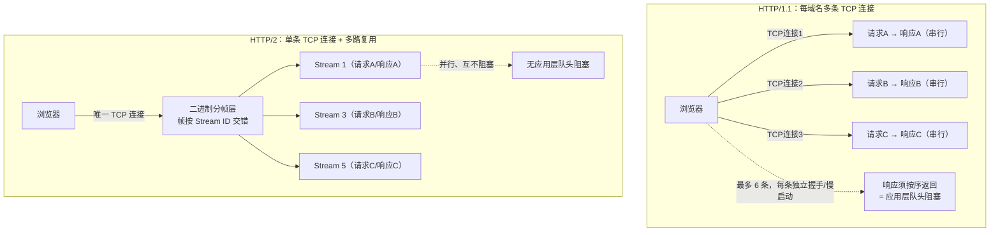
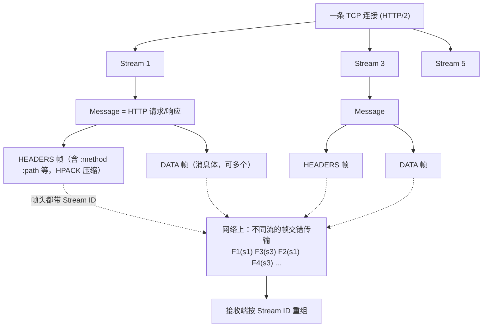
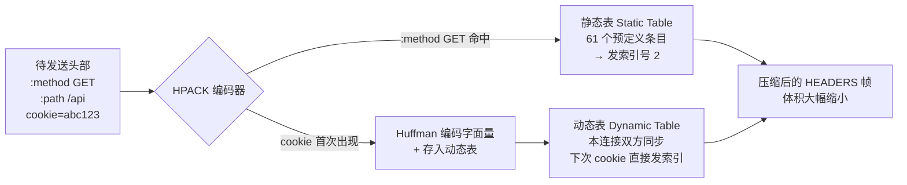

# 05 · HTTP/2（HTTP/2）
> HTTP/2 用二进制分帧层 + 单连接多路复用，解决 HTTP/1.1 的队头阻塞与连接低效，语义不变、性能大幅提升。

## 📖 知识讲解

### 一、HTTP/1.1 的痛点

HTTP/1.1（1997/1999）是纯文本、一问一答的协议，在现代动辄上百个子资源的页面下暴露出结构性瓶颈：

1. **队头阻塞（Head-of-Line Blocking，应用层）**：一个 TCP 连接上，请求必须**串行**收发。虽然有 pipelining（管线化）允许连续发多个请求，但响应仍须**按请求顺序返回**，排在前面的慢请求会卡住后面所有响应。实践中 pipelining 因兼容问题几乎无人启用。
2. **每域名多条 TCP 连接**：为了并发，浏览器对**同一域名最多开 6 条 TCP 连接**。每条连接都要三次握手 + TLS 握手 + 各自的 TCP 慢启动，开销大且占服务器资源。开发者还得靠"域名分片（domain sharding）"人为拆域名来突破 6 连接限制，属于反模式。
3. **头部冗余**：HTTP 是无状态的，每个请求都要携带一大坨重复的头（`Cookie`、`User-Agent`、`Accept` …），几百字节反复传输，浪费带宽。
4. **纯文本协议**：文本解析边界模糊、效率低、易出错。

### 二、HTTP/2 核心一：二进制分帧层（Binary Framing Layer）

HTTP/2 **保留 HTTP 全部语义**（方法、状态码、头部、URL 都不变），只改变"数据在网络上的组织与传输方式"。它在 HTTP 语义和 TCP 之间插入一个 **二进制分帧层**，把所有通信拆成更小的、二进制编码的 **帧（frame）**。三个关键概念：

- **Message（消息）**：一个完整的 HTTP 请求或响应，逻辑上对应一次请求/响应。
- **Frame（帧）**：HTTP/2 通信的**最小单位**，二进制格式。类型包括 `HEADERS`（头部）、`DATA`（消息体）、`SETTINGS`、`WINDOW_UPDATE`（流控）、`RST_STREAM`、`PRIORITY` 等。每个帧头都带一个 **Stream ID**，标明它属于哪个流。
- **Stream（流）**：一条连接内的**虚拟双向字节流**，承载一对请求/响应。每个流有唯一 ID。**多个流可以在同一个 TCP 连接上并行存在，帧交错（interleave）传输**。

层级关系：**一个连接 → 多个流 → 每个流 = 若干消息 → 每个消息 = 若干帧**。因为是二进制且每帧自带 Stream ID，接收端可以把乱序到达的帧按 Stream ID 重新组装，这正是多路复用的基础。

### 三、HTTP/2 核心二：多路复用（Multiplexing）

在**一条 TCP 连接**上，客户端可以同时发起任意多个请求，各请求的帧**交错**在同一连接里传输，服务器的响应帧同样交错返回，接收端按 Stream ID 归位。这带来：

- **彻底消除 HTTP 应用层队头阻塞**：慢响应不再阻塞其它响应，各流互不干扰（在应用层面）。
- **只需一条连接**：一个域名一条 TCP 连接搞定所有请求，省去多次握手/慢启动，域名分片、雪碧图、资源内联等 HTTP/1.1 时代的优化手段大多**不再需要甚至有害**。

### 四、HTTP/2 核心三：HPACK 头部压缩（RFC 7541）

HTTP/2 用 **HPACK** 专门压缩头部，由三部分组成：

1. **静态表（Static Table）**：一张预定义的、包含 61 个常见头部字段的固定表（如 `:method: GET`、`:status: 200`、`accept-encoding: gzip, deflate`）。命中时只需发一个**索引号**代替整个字段。
2. **动态表（Dynamic Table）**：连接维度、双方各自维护并同步更新的表，把本连接出现过的头部（如具体的 `cookie`、`user-agent`）加入。后续请求再出现相同头部时，同样用索引引用，**避免重复传输**。这是节省的大头。
3. **Huffman 编码**：对无法用索引表示的字面量字符串（新出现的值）做 Huffman 静态编码，进一步压缩字节数。

HPACK 相比 HTTP/1.1 明文头部可节省绝大部分头部开销。之所以不直接用 gzip（SPDY 早期用过），是因为压缩上下文跨请求会引入 **CRIME 攻击**风险；HPACK 是为安全而专门设计的。

### 五、流优先级（Stream Prioritization）

客户端可为每个流指定**权重（weight）**和**依赖关系（dependency）**，形成优先级树，提示服务器优先分配带宽给关键资源（如 CSS、首屏图片先于懒加载图片）。不过 RFC 7540 的优先级模型复杂且各家实现不一，效果参差，RFC 9113 已将其标记为**已废弃（deprecated）**，实践中更多靠客户端自身调度和 `Priority` 头（RFC 9218）的新方案。

### 六、服务端推送（Server Push）——已被废弃

**Server Push** 曾允许服务器在客户端请求 HTML 的同时，主动"推"送它预判客户端会用到的 CSS/JS，省一个往返。但实践中它**很难命中**（服务器不知道客户端缓存里已有什么，常推送已缓存资源造成浪费），收益不稳定甚至负优化。

**结论（重点）：Server Push 已被主流浏览器废弃。Chrome 自 106 版（2022 年）起移除对 HTTP/2 Server Push 的支持。** 现代替代方案：

- **`103 Early Hints`**：服务器在正式响应前先发一个 103 中间响应，携带 `Link: rel=preload`，让浏览器提前发起关键资源请求——由客户端主导，不会浪费。
- **`<link rel="preload">` / `preconnect`**：在 HTML 里声明式预加载关键资源。

### 七、HTTP/2 仍基于 TCP —— 遗留的 TCP 队头阻塞

HTTP/2 消除了**应用层**队头阻塞，但它**仍然跑在单条 TCP 之上**。TCP 是有序可靠字节流，**一旦某个 TCP 段丢包，整条连接的所有数据都要停下来等待重传**——即使丢的那个包只属于某一个 HTTP/2 流。这就是 **TCP 层队头阻塞**。多路复用把"所有流放进一条连接"，反而让丢包的影响面变大（HTTP/1.1 多连接时，一条连接丢包不影响其它连接）。这个 TCP 层的天花板无法在 TCP 内解决，正是催生 **HTTP/3 / QUIC** 的根本动因（见 06 模块）。

## 🔄 流程图 / 原理图

### 图 1：HTTP/1.1 多连接 vs HTTP/2 单连接多路复用



### 图 2：二进制分帧 —— Stream / Message / Frame 关系



### 图 3：HPACK 头部压缩（静态表 + 动态表 + Huffman）



## 💻 代码说明 / 抓包说明

### 确认站点是否走 HTTP/2

```bash
# curl：--http2 协商，观察响应行是否为 HTTP/2
curl -I --http2 https://www.cloudflare.com
# 输出首行 "HTTP/2 200" 即表示协商成功

# 查看 ALPN 协商结果（浏览器就是靠 TLS-ALPN 协商到 h2 的）
openssl s_client -connect www.cloudflare.com:443 -alpn h2 2>/dev/null | grep -i "ALPN"
# ALPN protocol: h2   ← 表示协商到 HTTP/2
```

浏览器 **DevTools → Network → 右键表头勾选 "Protocol" 列**，`h2` 即 HTTP/2、`http/1.1` 即 1.1、`h3` 即 HTTP/3。观察同一域名下多个请求是否**共用一条连接（Connection ID 相同）且并行**。

### 用 nghttp 观察帧

```bash
# nghttp（nghttp2 工具集）打印每个 frame，直观看到 HEADERS/DATA/SETTINGS 帧与 Stream ID
nghttp -v https://nghttp2.org
```

Wireshark 用过滤器 `http2` 可逐帧查看 `HEADERS`（含 HPACK 解码后的头部）、`DATA`、`SETTINGS`、`WINDOW_UPDATE` 帧及其 Stream ID。

## ▶️ 运行方式

本模块以文档 + 抓包为主，无需构建：

```bash
# 1) 一行验证 HTTP/2
curl -I --http2 https://www.cloudflare.com

# 2) 本地起一个 HTTP/2 服务器体验（Node 内置 http2，需自签证书）
#    生成本地自签证书：
openssl req -x509 -newkey rsa:2048 -nodes -keyout key.pem -out cert.pem -days 365 -subj "/CN=localhost"
#    server.js 见下（node server.js 后浏览器访问 https://localhost:8443）

# 3) 浏览器 DevTools → Network → Protocol 列，观察 h2 与连接复用
```

```js
// server.js —— Node 内置 http2 最小示例（演示单连接多路复用）
const http2 = require('http2');
const fs = require('fs');
// http2.createSecureServer：浏览器要求 HTTP/2 必须走 TLS（h2）
const server = http2.createSecureServer({
  key: fs.readFileSync('key.pem'),
  cert: fs.readFileSync('cert.pem'),
});
server.on('stream', (stream, headers) => {
  // 每个请求是一个 stream；多个 stream 复用同一条 TCP 连接
  stream.respond({ ':status': 200, 'content-type': 'text/html' });
  stream.end('<h1>Hello HTTP/2</h1>');
});
server.listen(8443, () => console.log('https://localhost:8443'));
```

## ⚠️ 常见坑 / 最佳实践

- **浏览器里 HTTP/2 必须用 HTTPS**：规范允许明文 h2c，但**所有主流浏览器只在 TLS 上启用 HTTP/2**，并通过 **ALPN** 在 TLS 握手时协商到 `h2`。所以"上 HTTP/2"的前提是先上 HTTPS。
- **别再用 HTTP/1.1 时代的优化**：域名分片、雪碧图、资源内联、合并文件在 HTTP/2 下**多余甚至有害**（破坏多路复用、影响缓存粒度）。回归"小而多"的资源拆分。
- **Server Push 已过时**：Chrome 106 起移除，不要再依赖。改用 `103 Early Hints` 或 `<link rel="preload">`。
- **多路复用没有消除 TCP 队头阻塞**：网络丢包率高时，HTTP/2 单连接的丢包会拖累所有流，表现甚至可能不如 HTTP/1.1 多连接。彻底解决要靠 HTTP/3（QUIC）。
- **流优先级实现不可靠**：RFC 9113 已弃用原优先级模型，别过度依赖，交给客户端调度或用新的 `Priority` 头。
- **连接数并非无限**：单连接虽好，但服务器对单连接的并发流数有 `SETTINGS_MAX_CONCURRENT_STREAMS` 限制（常见 100~250），超出会排队。

## 🔗 官方文档

- RFC 9113 · HTTP/2（现行标准，取代 RFC 7540）：https://www.rfc-editor.org/rfc/rfc9113
- RFC 7541 · HPACK 头部压缩：https://www.rfc-editor.org/rfc/rfc7541
- web.dev · Introduction to HTTP/2：https://web.dev/articles/performance-http2
- HTTP/2 官方站：https://http2.github.io/
- Chrome 官方 · 移除 HTTP/2 Server Push：https://developer.chrome.com/blog/removing-push
- MDN · HTTP/2 与 Early Hints（103）：https://developer.mozilla.org/zh-CN/docs/Web/HTTP/Status/103
- RFC 9218 · Extensible Prioritization（新优先级方案）：https://www.rfc-editor.org/rfc/rfc9218
