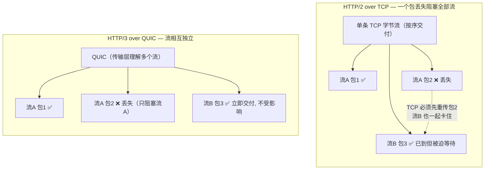
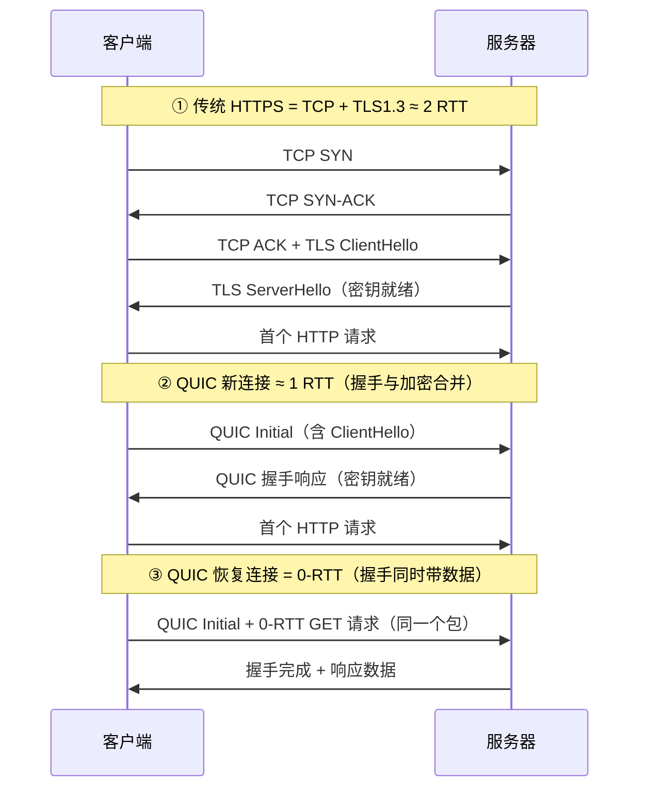
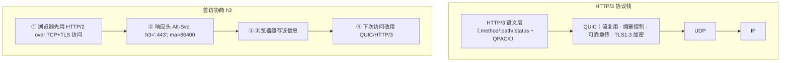

# 06 · HTTP/3 与 QUIC（HTTP/3 & QUIC）

> HTTP/3 把底层传输从 TCP 换成了跑在 **UDP** 之上的 **QUIC** 协议，用一套自带加密、自带多路复用、支持 0-RTT 与连接迁移的新传输，彻底解决了 HTTP/2 也无法根治的 **TCP 层队头阻塞**问题。

## 📖 知识讲解

### 为什么 HTTP/2 还不够：TCP 层队头阻塞

HTTP/2 用二进制分帧 + 多路复用，在**应用层**解决了 HTTP/1.1 的队头阻塞（HTTP/1.1 一条连接同一时刻只能处理一个请求）。但 HTTP/2 的所有流仍然跑在**同一条 TCP 连接**上，而 TCP 是"字节流按序可靠交付"的协议：

- 一旦某个 TCP 报文段丢包，TCP 必须等它重传到达后，才能把后续已经收到的字节交给上层——即使那些字节属于**另一个完全无关的 HTTP 流**。
- 结果：一个包丢失，会**卡住这条连接上的所有流**。这就是 **TCP 层队头阻塞（HoL blocking）**，是 HTTP/2 无法从应用层解决的硬伤，在丢包率高的移动/弱网环境尤其明显。

**根因在于"多路复用发生在 TCP 之上"**：TCP 只看到一条字节流，不知道上面有多个独立的逻辑流。要根治，必须让传输层本身就理解"流"的概念——这正是 QUIC 做的事。

### QUIC：跑在 UDP 上的新传输层

QUIC（RFC 9000）由 Google 提出、IETF 标准化，是一个**用户态**的传输协议，构建在 **UDP** 之上（UDP 只提供最基本的端口复用与不可靠数据报，把可靠性、拥塞控制、多路复用全都留给 QUIC 自己实现）。

为什么选 UDP 而不是造一个全新的传输协议？因为**中间设备（NAT、防火墙、路由器）只认识 TCP 和 UDP**，部署全新协议号的报文会被大量丢弃。跑在 UDP 上能穿透现有网络，同时把协议逻辑放在用户态，**升级不用改操作系统内核**（TCP 在内核里，迭代极慢）。

QUIC 的核心特性：

1. **流是传输层原语**：QUIC 原生支持多个独立的 **stream**，每个流有自己的顺序保证。**某个流丢包只阻塞它自己**，其它流照常交付——从传输层根除队头阻塞。
2. **加密内建（强制 TLS 1.3）**：QUIC 把 TLS 1.3 直接融进握手，没有"明文的 QUIC"。连传输头部的大部分字段都被加密/鉴权。
3. **连接合并握手**：传统 HTTPS 要先 TCP 三次握手（1 RTT）再 TLS 握手（TLS 1.3 是 1 RTT），共 2 RTT 才能发第一个请求。QUIC 把传输握手与加密握手合并，**新连接 1 RTT**、**恢复连接 0-RTT** 就能带上应用数据。
4. **连接迁移（Connection Migration）**：连接由一个 **Connection ID** 标识，而不是传统的"四元组（源IP+源端口+目的IP+目的端口）"。手机从 Wi-Fi 切到 4G 时 IP 变了，TCP 连接会断、要重连；QUIC 只要 Connection ID 不变，连接就能无缝迁移，不中断下载/通话。

### 0-RTT：恢复连接时"边握手边发数据"

TLS 1.3 引入了会话恢复。QUIC 利用它：客户端第一次连接后会缓存服务器的参数，**再次连接时可以在第一个报文里就带上应用数据（0-RTT data）**，无需等握手完成。这对"打开 App 立即请求"的场景省下宝贵的一个 RTT。

代价与风险：0-RTT 数据存在**重放攻击**风险（攻击者截获并重发 0-RTT 报文），所以**只有幂等的请求（如 GET）才应走 0-RTT**，有副作用的请求（POST 下单）必须等握手完成再发。

### HTTP/3 = HTTP 语义 + QUIC 传输 + QPACK

HTTP/3（RFC 9114）本身其实很"薄"：它复用了与 HTTP/2 相同的 HTTP 语义（方法、状态码、伪首部 `:method`/`:path`/`:status`），只是把承载方式换成了 QUIC 流：

- 每个 HTTP 请求/响应占用一个 QUIC 双向流，天然独立、互不阻塞。
- 头部压缩从 HTTP/2 的 **HPACK** 换成 **QPACK**（RFC 9204）。原因：HPACK 依赖"头部按严格顺序处理"的动态表，而 QUIC 的流是乱序到达的，HPACK 的顺序假设会引入队头阻塞。QPACK 重新设计了动态表的同步机制，允许头部块乱序处理，避免把队头阻塞又从传输层带回应用层。

### 协议协商：怎么知道服务器支持 HTTP/3

浏览器默认先用 HTTP/1.1 或 HTTP/2（over TCP+TLS）连接。服务器在响应里带一个 **`Alt-Svc`（Alternative Services）** 头告知"我也支持 h3"：

```
Alt-Svc: h3=":443"; ma=86400
```

浏览器记下这个信息（缓存 `ma` 秒），**下次**就尝试用 QUIC/HTTP/3 连接同一站点。也有 **HTTPS 类型的 DNS 记录**可以在 DNS 阶段就告知支持 h3，进一步省去首次的 TCP 回退。所以 HTTP/3 通常是"第二次访问才用上"。

### 三代 HTTP 传输栈对比

| 维度 | HTTP/1.1 | HTTP/2 | HTTP/3 |
|---|---|---|---|
| 传输层 | TCP | TCP | **QUIC / UDP** |
| 加密 | TLS 可选（叠加） | TLS 可选（实际强制） | **TLS 1.3 内建强制** |
| 多路复用 | ❌（队头阻塞） | ✅ 应用层多路复用 | ✅ **传输层多路复用** |
| 队头阻塞 | 应用层 + TCP 层都有 | 仅剩 **TCP 层** | **彻底消除** |
| 头部压缩 | 无 | HPACK | **QPACK** |
| 建连 RTT | TCP 1 + TLS 1~2 | TCP 1 + TLS 1 | **1 RTT / 0-RTT** |
| 连接迁移 | ❌ | ❌ | ✅ **Connection ID** |

## 🔄 流程图 / 原理图

### 图 1：TCP 队头阻塞 vs QUIC 独立流（核心差异）



### 图 2：建连 RTT 对比（HTTPS/TCP vs QUIC 1-RTT vs 0-RTT）



### 图 3：HTTP/3 协议栈与协商流程



## 💻 代码说明 / 观察说明

本模块为**纯原理**，不含可运行 demo（浏览器与 Node 对 HTTP/3 的支持需特定服务器与证书，超出免装范畴）。可通过以下方式观察真实的 HTTP/3：

- **Chrome DevTools → Network 面板**：右键表头勾选 **Protocol** 列，值为 `h3` 即走了 HTTP/3（`h2` 为 HTTP/2，`http/1.1` 为 1.1）。访问 `https://cloudflare.com`、`https://www.google.com` 等站点，注意**通常要刷新第二次**（首次靠 `Alt-Svc` 学习到 h3）才会显示 `h3`。
- **`chrome://net-export`**：录制一段网络日志，再用 [netlog-viewer](https://netlog-viewer.appspot.com/) 打开，可看到 QUIC 会话、0-RTT、连接迁移等事件。
- **命令行**：新版 `curl --http3 https://cloudflare-quic.com/`（需编译进 HTTP/3 支持）可直接验证。
- **`chrome://flags`** 里可强制开关 QUIC 协议，用于对比测试。

## ▶️ 运行方式

本模块以阅读文档 + 看图为主，无需运行。动手观察见上一节：用 Chrome DevTools 的 Protocol 列区分 `h3`/`h2`/`http/1.1`，感受"第二次访问才升级到 HTTP/3"的协商过程。

## ⚠️ 常见坑 / 最佳实践

- **HTTP/3 首次访问一般用不上**：因为要先靠 `Alt-Svc` 或 HTTPS DNS 记录发现 h3，浏览器第一次仍走 TCP。别在只刷新一次时就断定"没启用 HTTP/3"。
- **UDP 被封会回退**：部分企业网络/防火墙限制或降速 UDP（历史上 UDP 常被当作低优先级），此时浏览器会**回退到 HTTP/2 over TCP**。所以服务端必须同时支持 h2 作为兜底，不能只上 h3。
- **0-RTT 只能用于幂等请求**：0-RTT 数据可被重放攻击，规范要求服务端**只对幂等请求接受 0-RTT**。前端不要指望 POST 走 0-RTT 提速。
- **"HTTP/3 = HTTP over UDP" 是过度简化**：真正干活的是 QUIC，HTTP/3 只是把 HTTP 语义映射到 QUIC 流上。UDP 本身不可靠，可靠性/拥塞控制/加密全由 QUIC 实现。
- **QUIC 有 CPU 开销**：加密全部字段 + 用户态实现，早期 QUIC 的 CPU 占用高于内核 TCP。大流量服务需评估，但对多数前端场景弱网收益远大于此。
- **连接迁移不是"永不断线"**：它解决的是 IP 变化（Wi-Fi↔蜂窝）时不重连；若网络彻底中断仍会断，应用层该做的重连/重试逻辑照旧要有。

## 🔗 官方文档

- RFC 9000 · QUIC: A UDP-Based Multiplexed and Secure Transport：https://www.rfc-editor.org/rfc/rfc9000
- RFC 9114 · HTTP/3：https://www.rfc-editor.org/rfc/rfc9114
- RFC 9204 · QPACK 头部压缩：https://www.rfc-editor.org/rfc/rfc9204
- MDN · HTTP/3（演进）：https://developer.mozilla.org/zh-CN/docs/Web/HTTP/Guides/Evolution_of_HTTP
- MDN · Alt-Svc 头：https://developer.mozilla.org/zh-CN/docs/Web/HTTP/Reference/Headers/Alt-Svc
- web.dev · HTTP/3 与 QUIC：https://web.dev/articles/performance-http3
- Cloudflare Learning · What is HTTP/3：https://www.cloudflare.com/learning/performance/what-is-http3/
