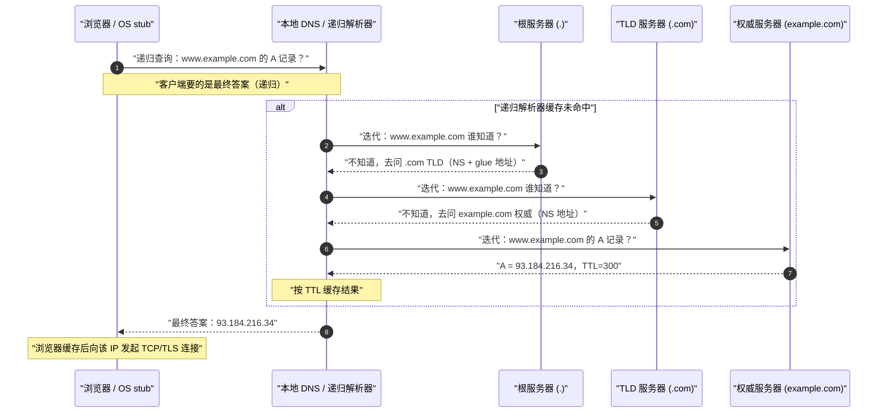
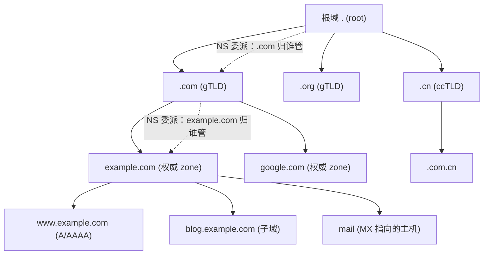
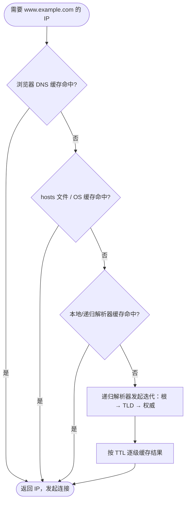

# 07 · DNS 域名解析（Domain Name System）
> DNS 是把人类易记的域名（`www.example.com`）翻译成机器路由用的 IP 地址（`93.184.216.34`）的一套**全球分布式、分层缓存**的数据库系统，是几乎每一次网络访问的第一步。

## 📖 知识讲解

### 1. DNS 是什么、解决什么问题
计算机之间通信靠 IP 地址，但 IP 是一串数字（IPv4 `93.184.216.34`、IPv6 `2606:2800:220:1:248:1893:25c8:1946`），人根本记不住，而且服务器 IP 会变。DNS 引入一层**间接**：人和链接里只写域名，访问时再由 DNS 实时把域名解析成当前 IP。这样服务器换 IP、做负载均衡、按地域返回不同 IP 都对用户透明。

DNS 本质是一个**分布式数据库**：全世界没有任何一台机器存着所有域名，而是按域名的层级把数据**分片**存到不同机构的服务器上，通过**委派（delegation）**把"某个子域名归谁管"一级级往下授权。

### 2. 域名的层级结构（从右往左读）
域名是**倒过来**的树状结构，越靠右层级越高：

```
www.blog.example.com.
└┬┘ └┬┘ └──┬──┘ └┬┘ └ 根域（root，那个常被省略的末尾点 .）
 │   │     │    └── ─ 顶级域 TLD（Top-Level Domain）：com / org / cn / io ...
 │   │     └────────  二级域 SLD：example（向注册商购买的部分）
 │   └──────────────  三级域 / 子域：blog
 └──────────────────  主机名 / 更深子域：www
```

- **根域 Root（`.`）**：树根，全球 13 组根服务器（`a.root-servers.net`~`m.root-servers.net`，实际通过 Anycast 有上千个物理节点）。它不知道 `example.com` 的 IP，但知道"`.com` 归哪些 TLD 服务器管"。
- **顶级域 TLD**：分通用顶级域 gTLD（`.com`/`.org`/`.net`/`.app`）和国家顶级域 ccTLD（`.cn`/`.jp`/`.uk`）。TLD 服务器知道"`example.com` 的权威服务器是谁（NS 记录）"。
- **权威域名服务器（Authoritative Name Server）**：真正**保存并回答** `example.com` 各条记录（A/AAAA/MX...）的服务器，是这个域名解析的"最终答案来源"。通常是域名托管商（Cloudflare、DNSPod、Route 53）。

### 3. 递归查询 vs 迭代查询（核心）
这是 DNS 最容易混的两个概念，关键区别在**"谁替谁把活干完"**：

- **递归查询（Recursive）**：客户端（浏览器/操作系统 stub resolver）对**本地 DNS / 递归解析器（Recursive Resolver）**说："我要 `www.example.com` 的 IP，你**直接把最终答案给我**，中间过程我不管。" 递归解析器有义务要么给出最终 IP，要么给出错误。stub → recursive 这一段是**递归**。
- **迭代查询（Iterative）**：递归解析器为了拿到答案，去问根、TLD、权威服务器时用的是**迭代**：它问根"`www.example.com` 谁知道？"，根不给最终答案，只回"你去问 `.com` 的 TLD 服务器（这是它们的地址）"；解析器再问 TLD，TLD 回"你去问 `example.com` 的权威服务器"；解析器再问权威，权威才给最终 IP。每一步被问者只回"我不知道，但下一步该问谁"，由**发起者自己一跳跳迭代**。

一句话记忆：**客户端把包袱甩给递归解析器（递归）；递归解析器亲自跑腿一级级问（迭代）。**

### 4. 一次完整解析的多级缓存查找顺序
浏览器输入域名后，系统按"由近及远、命中就返回"的顺序找 IP，任何一级命中都不再往下走：

1. **浏览器 DNS 缓存**：浏览器自身缓存最近解析结果（Chrome 可在 `chrome://net-internals/#dns` 查看）。
2. **操作系统缓存 + hosts 文件**：先查 `hosts`（Linux/macOS `/etc/hosts`，Windows `C:\Windows\System32\drivers\etc\hosts`）——命中直接用，hosts 优先级高于 DNS 查询；再查系统 DNS 缓存（Windows `ipconfig /displaydns`）。
3. **本地 DNS / 递归解析器缓存**：一般是运营商 DNS 或 `8.8.8.8`/`1.1.1.1`/`223.5.5.5`。它自己也有缓存，命中直接返回。
4. **递归解析器发起迭代**：缓存没有才依次问 **根 → TLD → 权威**，拿到答案后按 TTL 缓存并返回给客户端。

### 5. 常见记录类型（Resource Record）
| 类型 | 作用 | 示例值 |
|---|---|---|
| **A** | 域名 → IPv4 | `93.184.216.34` |
| **AAAA** | 域名 → IPv6 | `2606:2800:220:1::1946` |
| **CNAME** | 别名，指向另一个域名（再继续解析） | `example.com.cdn.cloudflare.net.` |
| **NS** | 指明该域名的权威服务器 | `ns1.cloudflare.com.` |
| **MX** | 邮件服务器（带优先级数字） | `10 mail.example.com.` |
| **TXT** | 任意文本，常用于 SPF/DKIM/域名所有权验证 | `"v=spf1 include:_spf.google.com ~all"` |
| **SOA** | 起始授权，记录主 NS、管理员邮箱、序列号、各种 TTL | 每个 zone 有且仅一条 |

### 6. TTL 与缓存
每条记录都带 **TTL（Time To Live，秒）**，告诉各级缓存"这条结果可缓存多久"。TTL 越大缓存命中率越高、解析越快、源站压力越小，但**改记录后生效越慢**（旧值最长要等 TTL 秒才过期）。要迁移 IP 前，通常提前把 TTL 调小（如 300s）再改。

### 7. 传输层：为什么 DNS 主要用 UDP 53
DNS 查询走 **UDP 端口 53**：一问一答、报文小、无需建连，快且省资源；丢了重发即可。但两种情况用 **TCP 53**：① 响应过大（传统 UDP 512 字节上限，即使有 EDNS0 扩展，超过路径 MTU 仍可能回退）会置 **TC（Truncated）标志位**，客户端改用 TCP 重查；② **区域传送（AXFR/IXFR）**——主从权威服务器之间同步整个 zone 数据，必须可靠传输，用 TCP。

### 8. 现代加密 DNS 与智能调度
传统 DNS 明文传输，存在被监听、被篡改（DNS 劫持/污染）的问题。现代方案：
- **DoH（DNS over HTTPS）**：DNS 查询封装进 HTTPS（443 端口），和普通网页流量混在一起，难以识别和封锁。浏览器（Firefox/Chrome）内置支持。
- **DoT（DNS over TLS）**：DNS 走专用 TLS 通道，固定 **853 端口**，加密但端口独立、易被网络识别。
- **智能 DNS / GeoDNS**：权威服务器根据请求来源（递归解析器 IP，或 EDNS Client Subnet 透传的客户端网段）返回**就近/最优**的 IP，是 CDN 调度的基础（见 08-cdn）。

## 🔄 流程图 / 原理图

### 图 1：一次完整解析时序（递归 + 迭代）
浏览器对本地 DNS 是**递归**（要最终答案）；本地 DNS 对根/TLD/权威是**迭代**（一跳跳问）。



### 图 2：域名层级树（委派关系）


### 图 3：客户端多级缓存查找顺序


## 💻 代码说明 / 抓包说明

本模块以原理讲解为主。可用系统自带命令观察真实解析过程，无需写代码：

```bash
# dig 显示完整解析：ANSWER 段是最终记录，QUERY TIME 是耗时
dig www.example.com A

# +trace 手动模拟递归解析器的「迭代」全过程：根 → TLD → 权威 一跳跳打印
dig +trace www.example.com

# 只看某类型记录 / 指定用哪个递归解析器（这里用 Cloudflare 1.1.1.1）
dig MX example.com
dig @1.1.1.1 www.example.com

# 查看 CNAME 链
dig www.github.com CNAME

# macOS/Linux：查看 SOA 与 TTL（结果里 TTL 会随缓存倒计时）
dig example.com SOA
```

抓包看协议字段（Wireshark 过滤 `dns`）：可见 **Transaction ID**、**Flags**（QR 查询/响应、RD 期望递归、RA 支持递归、TC 截断）、**Questions / Answer RRs**、以及基于 **UDP 53** 的事实；响应过大时会看到 TC 置位后客户端改走 TCP 重查。

## ▶️ 运行方式

无需构建。在终端直接运行上面的 `dig`（macOS/Linux 自带；Windows 可用 `nslookup www.example.com` 或安装 `dig`）。
- 看 Chrome 内部 DNS 缓存：地址栏输入 `chrome://net-internals/#dns`，可清空并观察。
- 看/清系统缓存：Windows `ipconfig /displaydns`、`ipconfig /flushdns`；macOS `sudo dscacheutil -flushcache; sudo killall -HUP mDNSResponder`。

## ⚠️ 常见坑 / 最佳实践

1. **TTL 与生效延迟**：改了 DNS 记录不会立刻全网生效，旧值会在各级缓存里存活最长 TTL 秒。要换 IP，**提前数小时把 TTL 降到 300s**，等旧 TTL 过期后再修改，切换才快。别指望"改完立即生效"。
2. **递归 vs 迭代别记反**：客户端→递归解析器是递归（甩锅要答案）；解析器→根/TLD/权威是迭代（自己跑腿）。面试高频。
3. **CNAME 不能与其它记录共存**，且**根域（zone apex，如 `example.com` 本身）不能用 CNAME**。因为根域必须有 SOA/NS 记录，而 CNAME 要求"该名下不能有任何其它记录"，二者冲突。想让根域指向 CDN，用厂商的 **ALIAS / ANAME / CNAME flattening**（在权威侧把 CNAME 目标解析成 A 记录再返回）。
4. **DNS 劫持 / 污染**：明文 DNS 易被中间人返回假 IP（劫持）或被投毒污染缓存。对策：用可信递归解析器 + **DoH/DoT** 加密，权威侧部署 **DNSSEC** 做签名校验防篡改。
5. **hosts 优先级最高**：本机 `hosts` 里写死的条目会绕过一切 DNS 查询，调试时很有用（把域名指到本地/测试环境），但改完忘了删会导致"线上好好的，就我这台打不开"。
6. **别把 DNS 当负载均衡的全部**：DNS 轮询（多条 A 记录）粒度粗、受缓存影响、无法感知后端健康，通常配合 CDN/GSLB/健康检查一起用（见 08-cdn）。

## 🔗 官方文档

- RFC 1034（DNS 概念与机制）: https://www.rfc-editor.org/rfc/rfc1034
- RFC 1035（DNS 实现与报文格式）: https://www.rfc-editor.org/rfc/rfc1035
- RFC 8484（DNS over HTTPS / DoH）: https://www.rfc-editor.org/rfc/rfc8484
- MDN · DNS 术语: https://developer.mozilla.org/zh-CN/docs/Glossary/DNS
- Cloudflare Learning · What is DNS: https://www.cloudflare.com/learning/dns/what-is-dns/
