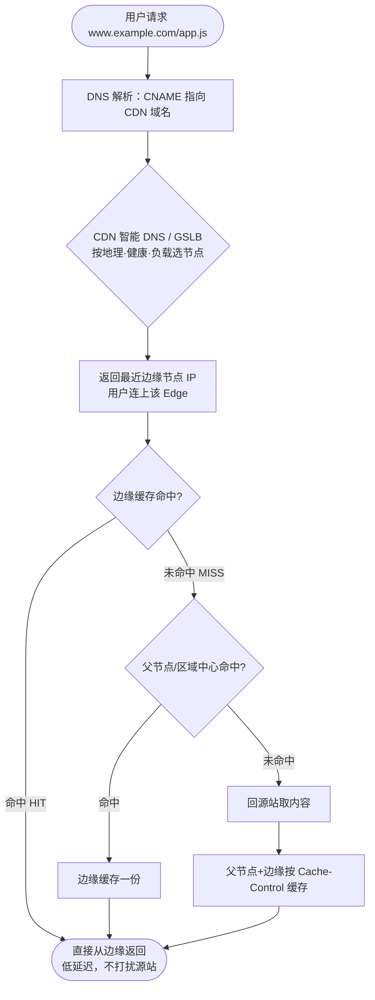
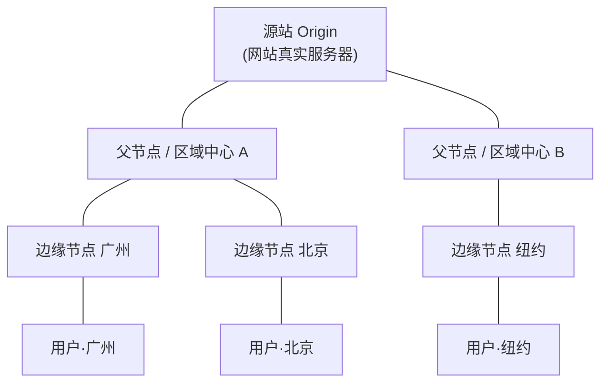
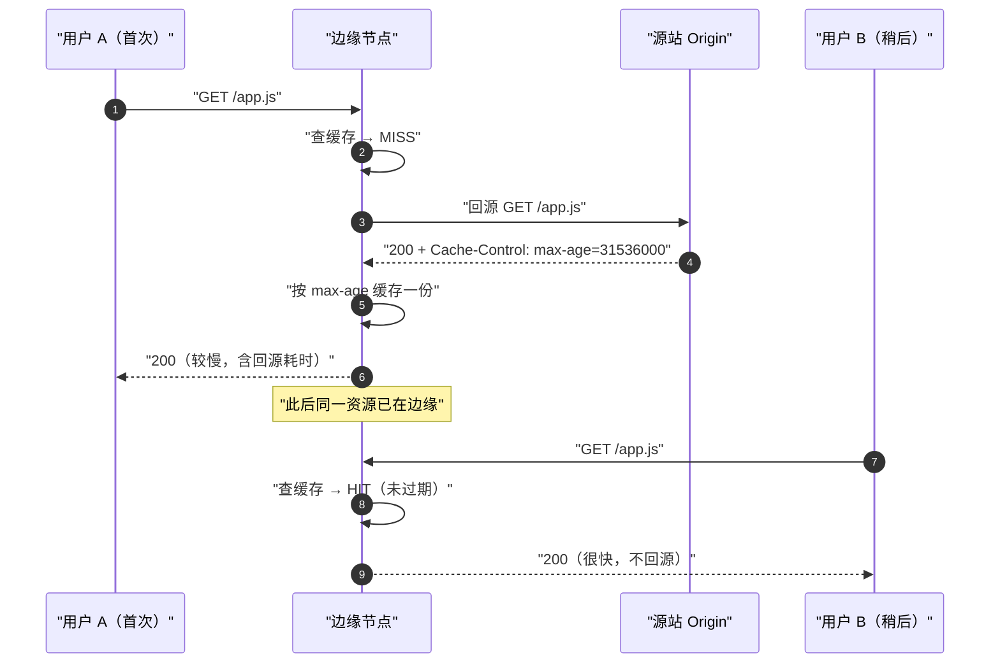

# 08 · CDN 内容分发网络（Content Delivery Network）
> CDN 是一张遍布全球的**边缘节点缓存网络**，把网站的静态内容"复制"到离用户最近的机房，用户就近取内容，从而**降低延迟、减轻源站压力、扛住流量峰值**。

## 📖 知识讲解

### 1. CDN 是什么、解决什么问题
没有 CDN 时，全世界用户访问同一个源站（origin server）——比如源站在北京，广州和纽约的用户请求都要长途奔袭到北京机房，**物理距离带来的往返时延（RTT）** 无法回避，图片/视频等大文件加载慢；而且所有请求都压在源站上，一旦流量激增（大促、热点），源站带宽和 CPU 直接被打爆。

CDN 的解法：在全球各地部署大量**边缘节点（Edge / PoP，Point of Presence）**，把静态资源缓存一份到边缘。用户请求被**调度**到最近的边缘节点，命中缓存就直接从本地返回，不必回到源站。于是：
- **降延迟**：内容离用户近，RTT 小，首字节时间（TTFB）短。
- **减源站压力 / 省带宽**：大量请求在边缘就地消化，源站只处理少量"回源"请求（回源计费通常更贵，命中率越高越省钱）。
- **抗峰值 / 抗攻击**：海量边缘节点分摊流量，天然具备削峰和抗 DDoS 能力。

### 2. 核心原理一：边缘节点缓存
边缘节点本质是一台带大容量缓存的反向代理。第一次有人请求某资源时边缘没有（**未命中 miss**），它去源站取回、**按缓存规则存一份**再返回给用户；之后其他用户请求同一资源就**命中（hit）**，直接从边缘返回，不再打扰源站。

- **缓存键（Cache Key）**：边缘用什么来区分"这是不是同一个资源"。默认常是 `Host + URL path + query`，也可配置忽略某些参数（如营销追踪参数 `utm_*`）以提升命中率，或按 `Cookie`/`Accept-Encoding`/设备类型拆分缓存。
- **缓存时长**：优先看源站返回的 `Cache-Control: s-maxage` / `max-age`（见 09-http-cache），也可在 CDN 控制台按目录/后缀覆盖配置（如 `.jpg` 缓存 30 天、`.html` 不缓存）。

### 3. 核心原理二：智能调度（把用户导向最近的边缘）
"怎么让用户请求落到最近的节点"是 CDN 的关键，主流三种机制常组合使用：

- **DNS 调度 / CNAME 到 CDN 域名**：最经典。网站把自己的域名 `www.example.com` 用 **CNAME** 指向 CDN 分配的域名（如 `www.example.com.cdn-provider.net`）。用户解析域名时，CDN 的**权威 DNS（GeoDNS/智能 DNS）** 根据递归解析器来源 IP（或 EDNS Client Subnet 透传的用户网段）判断用户地理/网络位置，**返回就近边缘节点的 IP**。这就是 07-dns 里"智能 DNS/GeoDNS"的实战应用。
- **GSLB（Global Server Load Balancing，全局负载均衡）**：在 DNS 调度基础上再叠加**节点健康、负载、链路质量**等因素综合选优——不仅"最近"，还要"这个节点没挂、没过载、去它的网络通畅"。
- **Anycast**：多个物理边缘节点**共用同一个 IP**，靠 BGP 路由让网络自动把用户数据包送到路由意义上最近的那个节点。切换快、抗 DDoS 强（攻击流量被分散到各节点），Cloudflare 等广泛使用。

### 4. 回源（Back-to-Origin）与多级缓存
边缘节点**未命中**时要向上取内容，这个过程叫**回源**。为避免每个边缘都直接冲击源站，CDN 通常做**多级缓存**：

`用户 → 边缘节点(Edge) → 父节点/区域中心(Parent/Regional) → 源站(Origin)`

边缘 miss 先回父节点，父节点也 miss 才真正回源站。这样源站只面对少数几个父节点，回源请求被大幅收敛。多个边缘共享父节点缓存，命中率更高、源站更稳。

### 5. 缓存命中率、刷新与预热
- **缓存命中率（Hit Ratio）** = 命中请求数 / 总请求数，是 CDN 的核心指标。命中率高 = 源站压力小、用户快、回源费用低。
- **缓存刷新（Purge / Refresh）**：源站内容更新后，边缘可能还缓存着旧版本。主动调 CDN 的刷新接口让指定 URL/目录缓存**失效**，下次请求重新回源取新内容。
- **缓存预热（Prefetch / Preload）**：新版本上线**前**，主动让边缘节点提前把资源从源站拉好缓存好。这样上线瞬间用户请求就直接命中，避免大量并发同时 miss 一起回源（见"回源风暴"）。

### 6. 动态加速（DSA）
CDN 天生适合**静态**内容（图片、JS/CSS、视频、字体——内容对所有人一样、可缓存）。但**动态**内容（个性化页面、API、登录态相关）因人而异、不能缓存。对动态请求，CDN 提供 **DSA（Dynamic Site Acceleration，动态站点加速）**：不缓存内容，而是优化**传输链路**——用户就近接入边缘，边缘与源站之间走 CDN 优选的骨干专线/私网路由（**路由优选**）、保持长连接、TCP/TLS 参数调优，减少动态请求的中间跳数和握手开销。

### 7. 静态资源与 CDN 的配合
前端工程化里，静态资源上 CDN 的最佳姿势是**内容哈希文件名 + 长强缓存**：
- 打包产物带 hash，如 `app.3f9a2c.js`。内容变则 hash 变、文件名变，是一个全新 URL。
- 对带 hash 的静态资源设 `Cache-Control: max-age=31536000, immutable`，CDN 边缘和浏览器都可长期强缓存，**永不失效**（因为一旦改动就是新文件名，天然绕开旧缓存）。
- 引用这些资源的 **HTML 则不缓存或用协商缓存**（`no-cache`），保证用户总能拿到指向新 hash 文件的最新 HTML。二者配合，兼得"缓存命中率高"与"更新即时生效"（缓存策略细节见 09-http-cache）。

## 🔄 流程图 / 原理图

### 图 1：一次请求的调度与命中/回源全流程


### 图 2：CDN 拓扑（用户 / 边缘 / 父节点 / 源站）


### 图 3：首次未命中回源 vs 二次命中


## 💻 代码说明 / 抓包说明

本模块以原理为主。判断资源是否走了 CDN、是否命中，看**响应头**即可（浏览器 DevTools → Network → 选中请求 → Headers）：

```http
# 典型 CDN 命中标识（不同厂商字段名不同）
X-Cache: HIT                 # HIT=命中边缘缓存；MISS=回源了
X-Cache-Hits: 3
Age: 120                     # 该资源在 CDN 缓存里已存活的秒数（>0 说明命中缓存）
Via: 1.1 varnish             # 经过了 CDN 代理
Cf-Cache-Status: HIT         # Cloudflare 的命中状态：HIT / MISS / EXPIRED / DYNAMIC
Server: cloudflare
Cache-Control: public, max-age=31536000, immutable
```

命令行验证：
```bash
# 看响应头里的缓存状态与 Age（-I 只取 header）
curl -I https://cdn.jsdelivr.net/npm/vue@3/dist/vue.global.js

# 看域名是否 CNAME 到了 CDN（07-dns 的知识点在这里落地）
dig www.某网站.com CNAME
```

要点：`Age` 大于 0、`X-Cache/Cf-Cache-Status: HIT` 表示命中边缘；连续刷新两次，第二次通常更快且 `Age` 增大。动态接口一般显示 `DYNAMIC`/`MISS`，说明未被缓存（符合动态内容不宜强缓存）。

## ▶️ 运行方式

无需构建，用浏览器与终端观察真实 CDN 即可：
1. 打开任一使用公共 CDN 的页面（如 jsDelivr / unpkg 上的库），DevTools → Network，勾选查看 `Age`、`X-Cache`、`Cf-Cache-Status` 等响应头。
2. 终端跑上面的 `curl -I` 和 `dig ... CNAME`，对照"是否 CNAME 到 CDN 域名""是否命中缓存"。
3. 刷新页面对比首次（可能 MISS）与二次（HIT）的耗时差异。

## ⚠️ 常见坑 / 最佳实践

1. **缓存未更新——必须主动刷新**：改了源站文件但 URL 没变，边缘仍返回旧内容。要么**改文件名（hash）**天然绕开，要么上线后调 CDN **Purge** 刷新对应 URL。别只改源站就以为全网更新了。
2. **回源风暴（Cache Stampede）**：大量边缘缓存同时过期，海量请求瞬间一起回源，把源站打垮。对策：**上线前预热**、给热点资源设合理 TTL 并错峰、CDN 侧开启**回源合并/请求折叠**（同一资源的并发回源合并成一个）。
3. **HTML/接口别设强缓存**：动态内容或频繁更新的 HTML 若被 CDN 长时间强缓存，用户会看到旧页面甚至串号（把 A 用户的个性化页缓存给 B）。HTML 用 `no-cache`/短 TTL，含用户态的接口用 `private`/`no-store`，并配置 CDN 不缓存这些路径。
4. **跨域字体 / CORS**：字体、通过 `fetch`/`<script crossorigin>` 引用的资源走 CDN 时，源站需返回正确的 `Access-Control-Allow-Origin`，且 CDN 缓存键要按 `Origin` 区分（配置 `Vary: Origin`），否则会出现"某个 Origin 拿到不带 CORS 头的缓存副本"导致跨域失败。
5. **缓存键设计**：默认可能把带无关 query（如 `?utm_source=...`）的相同资源当成不同缓存，白白降低命中率并放大回源；应配置**忽略无关参数**。反之，对确实按参数变化的内容不要错误合并缓存。
6. **动态加速 ≠ 缓存**：DSA 加速的是链路，不缓存内容；别期望 DSA 能像静态缓存一样零回源。真正能缓存的内容才谈命中率。

## 🔗 官方文档

- MDN · CDN 术语: https://developer.mozilla.org/zh-CN/docs/Glossary/CDN
- Cloudflare Learning · What is a CDN: https://www.cloudflare.com/learning/cdn/what-is-a-cdn/
- web.dev · Content delivery networks (CDNs): https://web.dev/articles/content-delivery-networks
- MDN · HTTP Caching（缓存指令，配合 CDN）: https://developer.mozilla.org/zh-CN/docs/Web/HTTP/Guides/Caching
