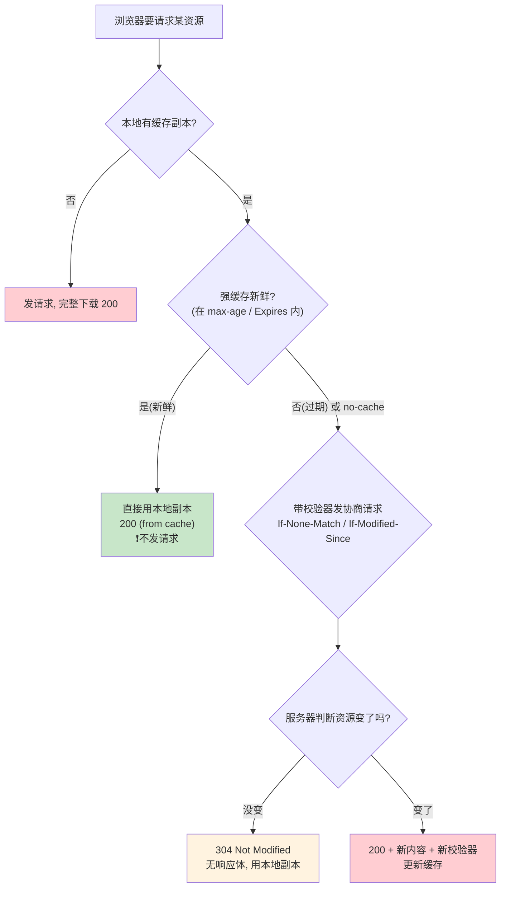
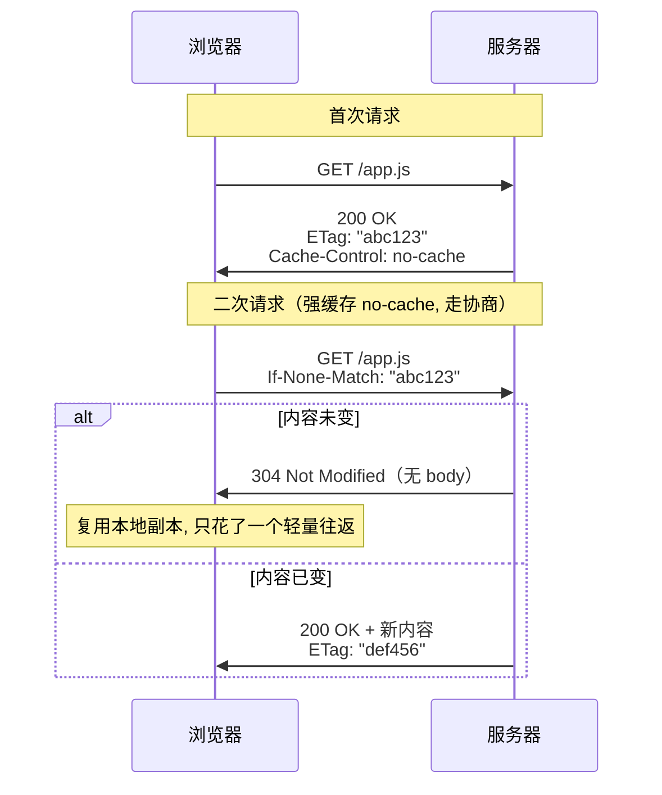
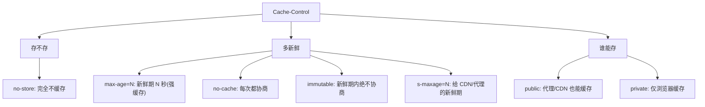

# 09 · HTTP 缓存（HTTP Caching）

> HTTP 缓存让浏览器把资源存在本地，下次直接复用，**少发甚至不发请求**。它分两大类：**强缓存**（本地够新就直接用，连服务器都不问）与**协商缓存**（问一句服务器"变了没"，没变就回 304 用本地）。用好缓存是前端性能优化的第一杠杆。

## 📖 知识讲解

### 缓存的两大类：强缓存 vs 协商缓存

浏览器发起请求前，会先看本地有没有该资源的缓存副本，并按下面的顺序决策：

| 类型 | 判断依据（响应头） | 命中时行为 | 是否发请求 | Network 表现 |
|---|---|---|---|---|
| **强缓存** | `Cache-Control: max-age` / `Expires` | 直接用本地副本 | **不发** | `200 (from disk/memory cache)` |
| **协商缓存** | `ETag`/`If-None-Match`、`Last-Modified`/`If-Modified-Since` | 问服务器，未变则用本地 | **发**（但很轻） | `304 Not Modified` |

核心区别：**强缓存新鲜时根本不产生网络请求（最快）；协商缓存一定会发一次请求，只是命中时服务器回 304 不带响应体（省的是响应体流量，不省往返）。**

### 强缓存：`Cache-Control`（首选）与 `Expires`（旧）

- **`Cache-Control`（HTTP/1.1，优先级高于 Expires）** 是现代缓存的主力，常用指令：
  - `max-age=<秒>`：资源的**新鲜期**。从收到响应算起，这段时间内的副本视为"新鲜"，直接用，不发请求。
  - `no-cache`：**每次都要走协商缓存**（"用之前先问一下服务器")——注意它**不是**"不缓存"！
  - `no-store`：**真正的不缓存**，任何副本都不存，每次都完整下载（用于敏感数据、支付页面）。
  - `private`：只允许**浏览器**缓存（含用户私有数据时用）；`public`：允许中间代理/CDN 也缓存。
  - `immutable`：告诉浏览器"这资源在新鲜期内绝不会变"，即便用户按刷新键也别发协商请求。配合内容 hash 文件名（`app.a1b2c3.js`）是最佳实践。
  - `s-maxage=<秒>`：专门给**共享缓存（CDN/代理）**用的新鲜期，覆盖 `max-age`。
- **`Expires`（HTTP/1.0）**：一个绝对到期时间点（GMT），如 `Expires: Wed, 21 Oct 2026 07:28:00 GMT`。缺点是依赖客户端本地时钟，时钟不准就失效。**已被 `Cache-Control: max-age` 取代**，仅作兼容兜底。

### 协商缓存：强缓存过期后的"二次确认"

当强缓存过期（或本就是 `no-cache`），浏览器**不会立刻重新下载**，而是带上"校验器"去问服务器"我这份还能用吗"。两套校验器：

1. **`ETag` / `If-None-Match`（优先，更精确）**
   - 服务器首次响应带 `ETag: "abc123"`——它是资源内容的指纹（通常是内容 hash 或版本号）。
   - 浏览器下次请求带 `If-None-Match: "abc123"`。
   - 服务器比对：内容没变 → 回 **`304 Not Modified`**（无响应体，浏览器用本地副本）；变了 → 回 `200` + 新内容 + 新 ETag。

2. **`Last-Modified` / `If-Modified-Since`（较弱，精度到秒）**
   - 服务器带 `Last-Modified: <资源最后修改时间>`。
   - 浏览器下次带 `If-Modified-Since: <上次的时间>`。
   - 服务器比对：资源修改时间 ≤ 该时间 → 回 `304`；否则回 `200` + 新内容。

**为什么 ETag 优先于 Last-Modified**：Last-Modified 只精确到**秒**，1 秒内多次修改无法区分；而且"文件被重新生成但内容没变"（如构建、部署）会导致修改时间变但内容没变，白白重新下载。ETag 基于内容指纹，更精确。若两者都存在，服务器**以 ETag（If-None-Match）为准**。

### 完整决策流程（浏览器视角）

浏览器拿到一个请求，决策顺序是：**强缓存 → 协商缓存 → 重新下载**。

1. 有本地副本且**强缓存新鲜**（在 `max-age` / `Expires` 内）？→ 直接用，`200 (from cache)`，**不发请求**。
2. 强缓存过期 / `no-cache`？→ 带校验器发**协商请求**：
   - 服务器回 `304`？→ 用本地副本（更新新鲜期）。
   - 服务器回 `200` + 新内容？→ 用新内容并更新缓存。
3. 没有本地副本 / `no-store`？→ 完整下载。

### 刷新方式对缓存的影响（易被忽略）

- **普通导航 / 点链接**：完整走强缓存 → 协商缓存。
- **按 F5 / 刷新键**：多数浏览器会**跳过强缓存、直接走协商缓存**（对资源带 `If-Modified-Since`/`If-None-Match`），所以你按刷新常看到一堆 304。
- **强制刷新（Ctrl/Cmd+Shift+R）**：**跳过所有缓存**，给请求加 `Cache-Control: no-cache`，全部重新下载。
- DevTools 勾选 **Disable cache**：开发时禁用缓存，等价于每次强制刷新——所以调试缓存策略时要**取消勾选**才能观察到真实命中。

### 典型缓存策略搭配（最佳实践）

- **带 hash 的静态资源**（`app.a1b2c3.js`、图片、字体）：`Cache-Control: max-age=31536000, immutable`。内容变了文件名就变，可放心永久强缓存。
- **HTML 入口文件**：`Cache-Control: no-cache`（或很短的 max-age）+ ETag。保证用户总能拿到引用了最新 hash 资源的页面。
- **API 数据**：多数 `no-store` 或短 `max-age`；用户私有数据加 `private`。
- 这套组合就是"HTML 不缓存保证更新入口，带 hash 的资源永久缓存"的现代前端缓存范式。

## 🔄 流程图 / 原理图

### 图 1：强缓存 + 协商缓存完整决策图（核心）



### 图 2：协商缓存的一次 304 往返（时序）



### 图 3：Cache-Control 常用指令关系



## 💻 代码说明

Demo `cache-server.js`（纯 Node 内置 `http`，**无需安装依赖**）用一个页面演示四条缓存路径：

- **`/strong.js`** → `Cache-Control: max-age=60`：强缓存。60 秒内刷新，DevTools 显示 `200 (from disk cache)`，**服务端终端不会打印新日志**（证明请求根本没发出）。
- **`/immutable.js`** → `max-age=31536000, immutable`：一年强缓存 + 不可变，连按刷新也不协商。
- **`/etag.js`** → 用 `crypto` 对内容算 MD5 作 `ETag`，下发 `no-cache`。二次请求带 `If-None-Match`，内容没变服务端回 **304**（终端打印"304 未修改"）。
- **`/lastmod.js`** → 用 `Last-Modified` + `If-Modified-Since` 演示另一套协商校验器，命中同样回 304。

关键代码点：协商缓存的服务端逻辑就是"**读请求里的校验头 → 与当前资源的 ETag/修改时间比对 → 相同则 `res.writeHead(304)` 且 `res.end()` 不带 body，不同则回 200 + 完整内容**"。想模拟"资源更新"：修改 `ASSET_CONTENT` 后重启服务，ETag 随之改变，浏览器的协商请求就会拿到新的 200。

## ▶️ 运行方式

```bash
cd 17-network-protocols/09-http-cache
node cache-server.js
# 浏览器打开 http://localhost:3000
```

观察方法：

1. 打开 DevTools → Network，**取消勾选 Disable cache**（否则看不到命中）。
2. 反复刷新首页并点开各资源，对比 Status 列：`/strong.js` 很快变成 `200 (from cache)`；`/etag.js`、`/lastmod.js` 显示 `304`。
3. 看运行 `node cache-server.js` 的终端日志：命中协商缓存时打印"304 未修改"，强缓存命中时**根本没有新日志**（请求没到服务器）。
4. 也可用 curl 直接验证 304：

```bash
curl -v http://localhost:3000/etag.js                              # 首次拿到 200 + ETag
curl -v -H 'If-None-Match: "<把上面的ETag填这>"' http://localhost:3000/etag.js  # 命中 304
```

## ⚠️ 常见坑 / 最佳实践

- **`no-cache` ≠ 不缓存**：它是"每次都协商"，仍会缓存副本。真正不缓存是 **`no-store`**。这是最高频的误解。
- **调试时忘了关 Disable cache**：DevTools 勾着它会禁用所有缓存，导致你以为缓存策略没生效。观察缓存务必取消勾选。
- **强缓存更新不及时**：给 HTML 设了长 `max-age`，改了页面用户却拿不到新版——因为强缓存期内根本不发请求。**HTML 应 `no-cache`/短 max-age，只有带 hash 的静态资源才长期强缓存。**
- **Last-Modified 精度只到秒**：1 秒内多次修改、或内容没变但文件被重新生成（部署），都会误判。优先用 ETag。
- **ETag 在多机部署下要小心**：若各服务器对同一文件算出不同 ETag（如用了 inode），会导致协商永远不命中、反复 200。多机集群要保证 ETag 一致（用内容 hash 而非文件元信息）。
- **POST 等非幂等请求默认不缓存**：缓存主要针对 GET/HEAD。别指望 POST 响应被缓存。
- **CDN 缓存要用 `s-maxage` 分开控制**：浏览器和 CDN 的新鲜期可以不同，`s-maxage` 只作用于共享缓存（详见 08-cdn 模块）。

## 🔗 官方文档

- MDN · HTTP 缓存：https://developer.mozilla.org/zh-CN/docs/Web/HTTP/Guides/Caching
- MDN · Cache-Control：https://developer.mozilla.org/zh-CN/docs/Web/HTTP/Reference/Headers/Cache-Control
- MDN · ETag：https://developer.mozilla.org/zh-CN/docs/Web/HTTP/Reference/Headers/ETag
- MDN · Last-Modified：https://developer.mozilla.org/zh-CN/docs/Web/HTTP/Reference/Headers/Last-Modified
- RFC 9111 · HTTP Caching：https://www.rfc-editor.org/rfc/rfc9111
- web.dev · HTTP caching：https://web.dev/articles/http-cache
