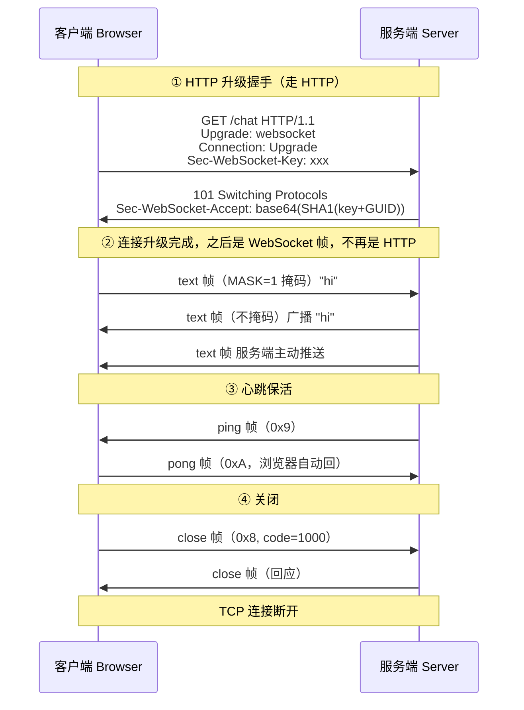
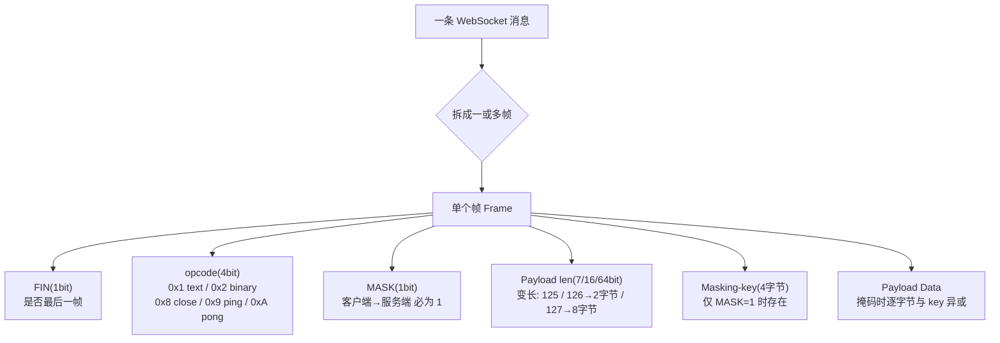
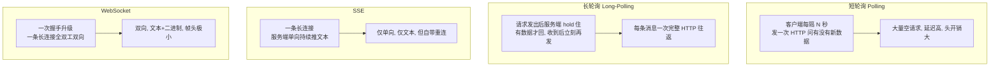

# 10 · WebSocket（WebSocket）

> WebSocket 在一条 TCP 连接上提供**全双工、长连接**的通信通道：一次基于 HTTP 的握手升级之后，客户端和服务端可以随时互相主动推送数据，彻底摆脱 HTTP "一问一答、服务端不能主动开口" 的限制。

## 📖 知识讲解

### WebSocket 解决什么问题

HTTP 是**半双工的请求-响应模型**：必须客户端先发请求，服务端才能回一条响应，服务端无法主动把数据"推"给客户端。可现实中大量场景需要服务端主动推送——聊天、弹幕、实时行情、协同编辑、在线游戏、消息通知。在 WebSocket 之前，前端只能用这些"打补丁"的办法模拟实时：

| 方案 | 原理 | 问题 |
|---|---|---|
| **短轮询 Polling** | 客户端每隔几秒发一次 HTTP 请求问"有没有新数据" | 延迟高、大量请求空跑，HTTP 头开销巨大 |
| **长轮询 Long-Polling** | 请求发出后服务端 hold 住不回，有数据才回，客户端收到后立刻再发起下一个 | 每条消息仍是一次完整 HTTP 往返，连接反复建立 |
| **SSE（Server-Sent Events）** | 基于 HTTP，服务端单向持续推送文本流 | 只能**服务端→客户端单向**，且只能传文本 |

WebSocket 一次握手后就建立**持久的双向通道**：一条连接、极小的帧头开销（最小 2 字节）、双方都能随时发消息、支持文本和二进制。这才是"真·实时"。

### 握手：基于 HTTP Upgrade 升级

WebSocket 复用了 HTTP 来完成第一步握手（这样能顺利穿过防火墙、复用 80/443 端口）。**客户端发起一个特殊的 HTTP GET 请求**：

```http
GET /chat HTTP/1.1
Host: example.com
Upgrade: websocket
Connection: Upgrade
Sec-WebSocket-Key: dGhlIHNhbXBsZSBub25jZQ==
Sec-WebSocket-Version: 13
```

- `Upgrade: websocket` + `Connection: Upgrade`：告诉服务器"我想把这条 HTTP 连接升级成 WebSocket"。
- `Sec-WebSocket-Key`：客户端随机生成的 16 字节值经 base64 编码，用于握手校验（**不是加密，只是防止非 WebSocket 端误响应**）。
- `Sec-WebSocket-Version: 13`：RFC 6455 定义的版本号。

**服务端若同意，回 `101 Switching Protocols`**：

```http
HTTP/1.1 101 Switching Protocols
Upgrade: websocket
Connection: Upgrade
Sec-WebSocket-Accept: s3pPLMBiTxaQ9kYGzzhZRbK+xOo=
```

其中 `Sec-WebSocket-Accept` 的算法是协议写死的：

```
Sec-WebSocket-Accept = base64( SHA1( Sec-WebSocket-Key + "258EAFA5-E914-47DA-95CA-C5AB0DC85B11" ) )
```

这个 `258EAFA5-...` 是 RFC 6455 规定的**魔法 GUID 常量**。客户端拿到 101 后会自己算一遍并比对，验证对方"确实是懂 WebSocket 协议的服务器"。**收到 101 之后，这条 TCP 连接就不再跑 HTTP 了，改跑 WebSocket 帧协议。**

> 本模块 `server.js` 手动实现了这段 Accept 计算并打印出来，运行时你能在控制台亲眼看到握手过程。

### 升级后：WebSocket 帧协议（Framing）

握手完成后，数据以**帧（frame）**为单位传输，不再有 HTTP 头。RFC 6455 定义的帧结构（前两字节最关键）：

```
 0               1               2               3
 0 1 2 3 4 5 6 7 8 9 0 1 2 3 4 5 6 7 8 9 0 1 2 3 ...
+-+-+-+-+-------+-+-------------+-------------------------------+
|F|R|R|R|opcode |M| Payload len |  Extended payload length ...  |
|I|S|S|S| (4)   |A|    (7)      |   (16/64 位，视 len 而定)      |
|N|V|V|V|       |S|             |                               |
| |1|2|3|       |K|             |                               |
+-+-+-+-+-------+-+-------------+ - - - - - - - - - - - - - - - +
|     Masking-key (4 字节，仅当 MASK=1 时存在)    |  Payload...  |
+-----------------------------------------------+---------------+
```

- **FIN（1 bit）**：是否是消息的最后一帧。一条大消息可拆成多帧，最后一帧 FIN=1。
- **opcode（4 bit）**：帧类型。`0x1`=text 文本、`0x2`=binary 二进制、`0x0`=continuation 续帧、`0x8`=close 关闭、`0x9`=ping、`0xA`=pong。ping/pong/close 属于**控制帧**。
- **MASK（1 bit）+ Masking-key（4 字节）**：**客户端发往服务端的帧必须掩码**（MASK=1，用 4 字节 key 对 payload 逐字节异或）。这是强制要求，目的是防止恶意页面构造出看起来像 HTTP 请求的数据去污染中间代理缓存（缓存投毒）。**服务端发往客户端的帧则必须不掩码。**
- **Payload length（7 / 7+16 / 7+64 bit）**：变长编码。0~125 直接用 7 位；126 表示后面 2 字节是真实长度；127 表示后面 8 字节是真实长度。

### 心跳 ping/pong 保活

长连接最大的敌人是**静默断开**：网线被拔、客户端崩溃、NAT/防火墙因连接空闲太久悄悄回收映射——这些情况下 TCP 两端可能都不会立刻收到 FIN/RST，形成"半开连接"，一方以为还连着，其实早断了。

解决办法是**心跳**：一端定时发 `ping`（控制帧 0x9），对端必须尽快回 `pong`（0xA）。**若在约定时间内没收到 pong，就判定连接已死，主动断开并触发重连。** 本模块服务端每 30 秒 ping 一次，上一轮没回 pong 的连接直接 `terminate`。浏览器原生 `WebSocket` 不暴露主动发 ping 的 API，通常由**服务端主导心跳**，或在应用层自定义心跳消息。

### 与 SSE / HTTP 对比

| 特性 | HTTP 请求 | SSE | WebSocket |
|---|---|---|---|
| 方向 | 请求-响应（客户端主动） | 服务端→客户端**单向** | **全双工双向** |
| 连接 | 一次一断（keep-alive 可复用） | 一条长连接持续推 | 一条长连接持续双向 |
| 数据类型 | 任意 | 仅**文本** | 文本 + **二进制** |
| 协议 | HTTP | HTTP（`text/event-stream`） | 握手用 HTTP，之后是 ws 帧 |
| 自动重连 | 无 | 浏览器**内置**（`EventSource`） | 需**自己实现** |
| 适用 | 普通接口 | 通知、行情、日志流等单向推送 | 聊天、协同、游戏等强交互双向 |

选型口诀：**只要服务端单向推文本，SSE 更简单（自带重连）；要双向、要二进制，才上 WebSocket。**

## 🔄 流程图 / 原理图

### 图 1：完整生命周期（握手 101 → 双向通信 → ping/pong → close）



### 图 2：WebSocket 帧结构



### 图 3：短轮询 / 长轮询 / SSE / WebSocket 对比



## 💻 代码说明

Demo 是一个最小聊天室：多个浏览器标签页连上同一个服务器，任一人发消息全员可见，服务端定时心跳探活。

### `server.js`（依赖 ws 库）

- **挂在 http.Server 上**：WebSocket 握手本质是 HTTP 请求，所以用 `WebSocketServer({ noServer: true })` + 手动监听 `server.on('upgrade')`，这样能在握手前打印关键 HTTP 头。
- **手算 Sec-WebSocket-Accept**：`crypto.createHash('sha1').update(key + GUID).digest('base64')`，把 RFC 6455 的握手算法演示出来，再交给 `wss.handleUpgrade` 完成 101 响应。
- **广播**：`broadcast()` 遍历 `wss.clients`，对 `readyState === 1`（OPEN）的连接 `send`。
- **心跳**：每个连接有 `isAlive` 标记；`ws.on('pong')` 里置回 `true`；30 秒定时器里，上一轮没回 pong（`isAlive===false`）的连接 `ws.terminate()` 强杀，否则置 `false` 后 `ws.ping()`。
- **事件**：`message`（收消息并广播）、`close`（带 code/reason）、`error`。

### `client.html`（浏览器原生 WebSocket）

- `new WebSocket('ws://localhost:3000/chat')` 发起握手；`onopen/onmessage/onclose/onerror` 四个回调。
- **断线重连**：`onclose` 里用**指数退避**（1s→2s→4s…最多 30s）定时 `connect()`，避免服务器刚挂就被重连打爆。
- **客户端帧自动掩码**：`ws.send(text)` 时浏览器底层自动加 MASK，JS 无感知。
- 浏览器不能主动发 ping，心跳由服务端主导，浏览器自动回 pong。

## ▶️ 运行方式

```bash
cd 17-network-protocols/10-websocket
npm install          # 安装 ws 依赖
node server.js       # 启动 WebSocket 服务，监听 ws://localhost:3000
```

然后用浏览器直接打开同目录的 `client.html`（**开两三个标签页**），在任一页输入消息回车，其它页会实时收到——这就是全双工广播。观察服务端控制台，能看到握手的 HTTP 头、Accept 计算、以及每 30 秒的 ping/pong 心跳日志。

> 想看帧和掩码：用 Chrome DevTools → Network → 选中那条 ws 请求 → Messages 面板，可看到每一帧的方向和内容；用 Wireshark 抓包能看到客户端帧的 MASK 位与 masking-key。

## ⚠️ 常见坑 / 最佳实践

- **必须自己实现断线重连**：WebSocket 不像 SSE 自带重连。网络抖动、服务重启都会断连，务必在 `onclose` 里做**指数退避重连**（别用固定间隔，否则服务器一挂就被雪崩重连打死）。
- **必须做心跳检测**：光靠 TCP 无法及时发现半开连接（拔网线、NAT 超时回收）。要用 ping/pong（或应用层心跳消息）主动探活，没响应就断开重连。
- **wss 与混合内容（Mixed Content）**：HTTPS 页面里**不能**连 `ws://`（明文），浏览器会拦截。生产环境页面是 https 就必须用 `wss://`（TLS 加密的 WebSocket）。
- **代理 / 负载均衡对长连接的影响**：很多反向代理（Nginx）默认会因空闲超时切断长连接，需要显式配置 `proxy_read_timeout` 拉长、并转发 `Upgrade`/`Connection` 头（`proxy_set_header Upgrade $http_upgrade;`）。企业防火墙也可能杀掉长连接，心跳还能起到"保活防超时"的作用。
- **客户端帧必须掩码**：这是 RFC 6455 强制的，浏览器自动做；如果你手写非浏览器客户端，发帧忘了掩码，规范的服务端会直接以 `1002`（协议错误）关闭连接。
- **一条连接一个消息才有意义**：控制帧（ping/pong/close）的 payload 不能超过 125 字节，且不能被分片。
- **鉴权**：WebSocket 握手是 HTTP 请求，可带 Cookie 或在 URL query 里带 token 鉴权；但握手后没有逐消息的鉴权机制，敏感操作要在应用层校验。

## 🔗 官方文档

- RFC 6455 The WebSocket Protocol：https://www.rfc-editor.org/rfc/rfc6455
- MDN WebSocket API：https://developer.mozilla.org/zh-CN/docs/Web/API/WebSockets_API
- MDN 编写 WebSocket 服务器：https://developer.mozilla.org/zh-CN/docs/Web/API/WebSockets_API/Writing_WebSocket_servers
- ws 库（Node 最流行的 WebSocket 实现）：https://github.com/websockets/ws
- MDN Server-Sent Events（对比）：https://developer.mozilla.org/zh-CN/docs/Web/API/Server-sent_events
