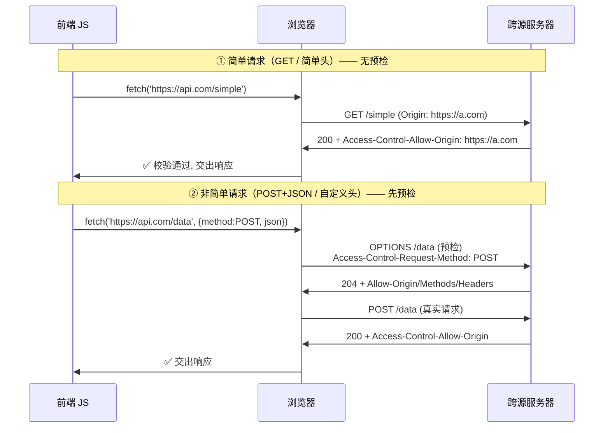
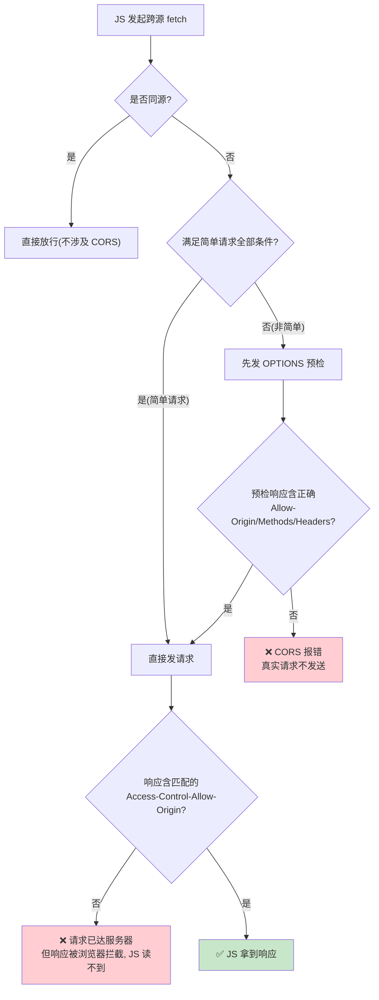
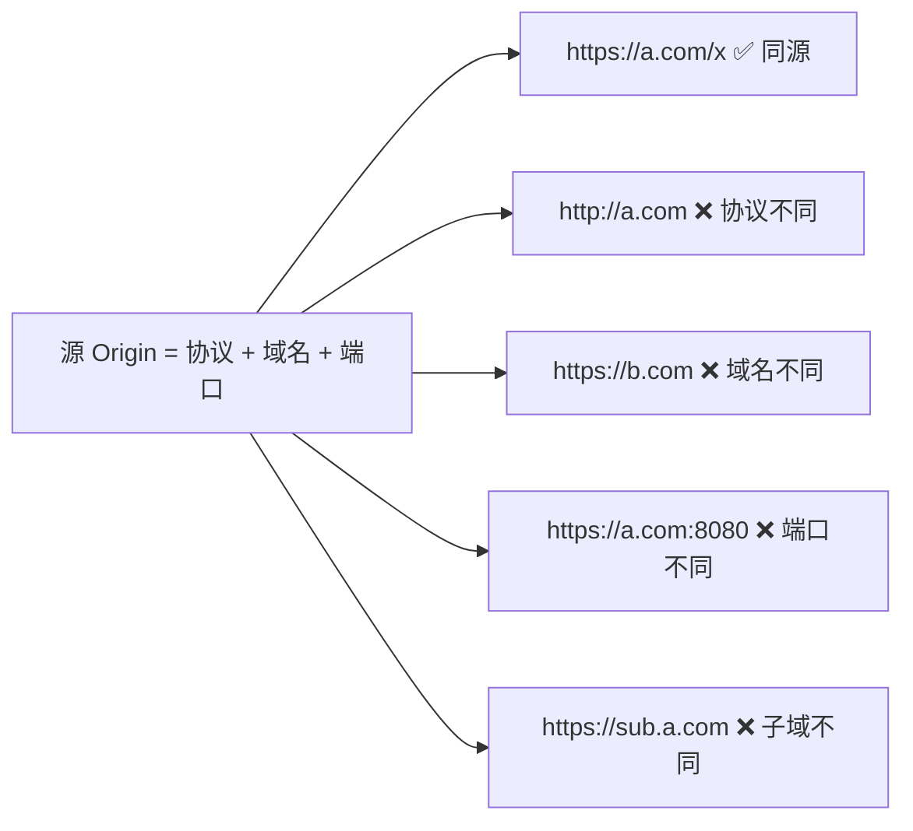

# 11 · 跨域资源共享（CORS）

> 浏览器出于安全默认执行**同源策略**：一个源的脚本不能随意读取另一个源的响应。**CORS（Cross-Origin Resource Sharing）** 是一套基于 HTTP 头的机制，让服务器可以显式声明"我允许哪些源来访问我"，从而在受控前提下打破同源限制。

## 📖 知识讲解

### 同源策略：一切的前提

**源（Origin）= 协议 + 域名 + 端口**，三者完全相同才算同源。

| 对比 URL | 与 `https://a.com/page` 是否同源 | 原因 |
|---|---|---|
| `https://a.com/other` | ✅ 同源 | 协议/域名/端口都同 |
| `http://a.com/page` | ❌ | 协议不同（http vs https） |
| `https://b.com/page` | ❌ | 域名不同 |
| `https://a.com:8080/page` | ❌ | 端口不同 |
| `https://sub.a.com/page` | ❌ | 子域名也算不同域 |

**同源策略（Same-Origin Policy）** 是浏览器的核心安全基石：默认情况下，页面脚本发起的跨源请求，**浏览器会阻止 JS 读取其响应**（也限制读取跨源的 DOM、Cookie 等）。这是为了防止恶意站点 A 用你的登录态偷偷去读站点 B 的用户数据（CSRF/信息泄露类攻击的一部分防线）。

注意几个**不受**同源策略读取限制的历史例外：``、`<script>`、`<link>`、`<video>`、表单提交等标签可以跨源加载资源（但 JS 读不到其内容）。CORS 要解决的是 **`fetch`/`XMLHttpRequest` 这类需要 JS 读取响应**的跨源请求。

### CORS 如何工作：服务器用响应头"授权"

CORS 的关键点：**放行与否由浏览器根据服务器返回的响应头决定，而不是由前端代码决定**。即使请求发出去了、服务器也处理了，只要响应里缺少正确的 `Access-Control-Allow-Origin`，**浏览器就会拦下响应、不给 JS 读**，并在控制台报 CORS 错误。

核心响应头：

- **`Access-Control-Allow-Origin`**：允许访问的源。可以是具体源 `https://a.com`，或通配 `*`（但**带凭证时不能用 `*`**）。这是最关键的一个头，缺了它跨域一定失败。
- `Access-Control-Allow-Methods`：（预检响应）允许的 HTTP 方法。
- `Access-Control-Allow-Headers`：（预检响应）允许携带的自定义请求头。
- `Access-Control-Allow-Credentials: true`：允许请求携带 Cookie 等凭证。
- `Access-Control-Max-Age`：预检结果可缓存的秒数，减少重复预检。
- `Access-Control-Expose-Headers`：允许 JS 读取的**响应头**白名单（默认 JS 只能读到几个安全头）。

### 两类请求：简单请求 vs 非简单请求（预检）

CORS 把跨源请求分成两类，处理方式不同。

**① 简单请求（Simple Request）**：同时满足以下条件，浏览器**直接发送**，不预检：

- 方法是 `GET`、`HEAD` 或 `POST` 之一；
- 只包含 CORS 安全的请求头（如 `Accept`、`Accept-Language`、`Content-Language`、`Content-Type`）；
- 且 `Content-Type` 只能是 `application/x-www-form-urlencoded`、`multipart/form-data`、`text/plain` 三者之一；
- 没有自定义请求头（如 `X-Custom-Header`）、请求未注册 ReadableStream 上传等。

简单请求就是"一次普通请求 + 服务器响应带 `Access-Control-Allow-Origin`"，浏览器验证通过就放行响应。

**② 非简单请求 → 触发预检（Preflight）**：只要不满足上面全部条件（例如用了 `PUT`/`DELETE`、`Content-Type: application/json`、或带了自定义头），浏览器会**先自动发一个 `OPTIONS` 预检请求**"问路"：

```http
OPTIONS /api/data HTTP/1.1
Origin: https://a.com
Access-Control-Request-Method: POST          ← 我等下要用什么方法
Access-Control-Request-Headers: content-type, x-custom-header  ← 我要带哪些头
```

服务器若同意，回：

```http
HTTP/1.1 204 No Content
Access-Control-Allow-Origin: https://a.com
Access-Control-Allow-Methods: GET, POST, PUT, DELETE, OPTIONS
Access-Control-Allow-Headers: Content-Type, X-Custom-Header
Access-Control-Max-Age: 600
```

**只有预检通过，浏览器才发真正的请求**（所以 Network 面板里会看到"一条 OPTIONS + 一条真实请求"两条）。预检是浏览器自动完成的，前端代码无感知——你只写了一个 `fetch`，却看到两条请求，就是这个原因。为什么要预检？为了保护那些**不支持 CORS 的老服务器**：在真正执行可能有副作用的 `PUT`/`DELETE` 前，先用无害的 OPTIONS 征得同意。

### 携带凭证（Cookie）：`credentials`

默认跨域请求**不带 Cookie**。要带需两边配合：

- 前端：`fetch(url, { credentials: 'include' })`（或 XHR 的 `withCredentials = true`）。
- 服务端：`Access-Control-Allow-Credentials: true`，且 **`Access-Control-Allow-Origin` 必须是具体源，不能是 `*`**（安全约束：允许带凭证又允许任意源等于门户大开）。`SameSite` Cookie 属性也会影响跨站携带（详见 12 模块）。

### CORS 报错不等于请求没发出去

一个巨大的认知误区：看到控制台的 CORS 红字报错，以为"请求被拦截没发出去"。实际上**简单请求是真的发到了服务器、服务器也执行了**（可能已经改了数据库！），只是**响应被浏览器拦下不给 JS 读**。预检请求则是在 OPTIONS 阶段就被挡住，真实请求才没发。所以 CORS 是**保护"读取响应"的机制，不是防篡改的机制**——防副作用要靠 CSRF token 等手段。

## 🔄 流程图 / 原理图

### 图 1：简单请求 vs 预检请求（核心对比）



### 图 2：浏览器 CORS 决策流程



### 图 3：同源判定（协议+域名+端口）



## 💻 代码说明

Demo：`server.js`（纯 Node 内置 `http`，**无需依赖**）+ `client.html`。

- **`server.js`** 是一个跨域 API（端口 4000）。核心是 `setCorsHeaders()` 给每个响应加上 `Access-Control-Allow-*` 头；并**单独处理 `OPTIONS` 方法**——收到预检就打印浏览器问的 `Access-Control-Request-Method`/`-Headers`，然后回 `204` + 许可头。`/api/simple`（GET）是简单请求路径，`/api/preflight`（POST + JSON）会先被浏览器预检。
- **`client.html`** 用 `fetch` 分别打两个接口：
  - `simple()` 发 `GET`，不带触发预检的头 → **简单请求**，Network 里只有 1 条。
  - `preflight()` 发 `POST` + `Content-Type: application/json` + `X-Custom-Header` → **非简单请求**，浏览器先发 OPTIONS，Network 里出现 2 条（OPTIONS + POST）。

把 `client.html` 用 `file://` 或别的端口打开，它对 `localhost:4000` 的请求就是跨源的，从而触发整套 CORS 流程。

## ▶️ 运行方式

```bash
cd 17-network-protocols/11-cors
node server.js          # 启动跨域 API，监听 http://localhost:4000
```

然后**双击打开 `client.html`**（`file://` 协议，与 4000 端口不同源，制造跨域）。打开 DevTools → Network：

1. 点"简单请求"：Network 只出现 **1 条** `/api/simple`。
2. 点"预检请求"：Network 出现 **2 条**——先一条 `OPTIONS /api/preflight`（Type 为 preflight），再一条 `POST /api/preflight`。
3. 看运行 `node server.js` 的终端：预检时会打印浏览器问的方法与头。

想复现 CORS 报错：把 `server.js` 里 `setCorsHeaders` 那行注释掉重启，前端 fetch 就会报经典的 `No 'Access-Control-Allow-Origin' header` 错误。

## ⚠️ 常见坑 / 最佳实践

- **CORS 是浏览器行为，不是服务器拒绝**：报 CORS 错时，请求往往已经到达服务器、甚至执行了副作用，只是响应被浏览器拦下。**用 curl/Postman 请求同一接口不会有 CORS 错**（它们不执行同源策略），别据此误判"接口没问题"。
- **带凭证时 `Allow-Origin` 不能用 `*`**：`credentials: 'include'` + `Access-Control-Allow-Origin: *` 会被浏览器拒绝，必须回具体源，且加 `Access-Control-Allow-Credentials: true`。
- **预检也要正确响应**：很多后端只处理了 GET/POST 忘了 `OPTIONS`，导致非简单请求卡在预检。框架（Express `cors` 中间件、Spring `@CrossOrigin`）能自动处理，手写要记得放行 OPTIONS。
- **`Content-Type: application/json` 会触发预检**：这是前端最常"莫名多一条 OPTIONS"的原因——发 JSON 就是非简单请求。想避开预检可改用简单 `Content-Type`，但通常直接正确配置预检更合理。
- **想读自定义响应头要 `Expose-Headers`**：默认 JS 只能读到少数安全响应头，要读 `X-Total-Count` 之类需服务端 `Access-Control-Expose-Headers` 显式暴露。
- **开发用代理绕过 CORS**：本地开发常用 Vite/webpack 的 `proxy` 把请求转发到后端，使浏览器看来是同源——但这只是开发便利，生产仍需后端正确配置 CORS。
- **CORS 不能替代鉴权**：它只控制"哪个源能读响应"，不验证用户身份。安全仍靠 token/session + 后端校验。

## 🔗 官方文档

- MDN · 跨源资源共享（CORS）：https://developer.mozilla.org/zh-CN/docs/Web/HTTP/Guides/CORS
- MDN · 同源策略：https://developer.mozilla.org/zh-CN/docs/Web/Security/Same-origin_policy
- MDN · 预检请求（Preflight）：https://developer.mozilla.org/zh-CN/docs/Glossary/Preflight_request
- MDN · Access-Control-Allow-Origin：https://developer.mozilla.org/zh-CN/docs/Web/HTTP/Reference/Headers/Access-Control-Allow-Origin
- WHATWG Fetch 标准 · CORS protocol：https://fetch.spec.whatwg.org/#http-cors-protocol
- web.dev · Cross-Origin Resource Sharing：https://web.dev/articles/cross-origin-resource-sharing
