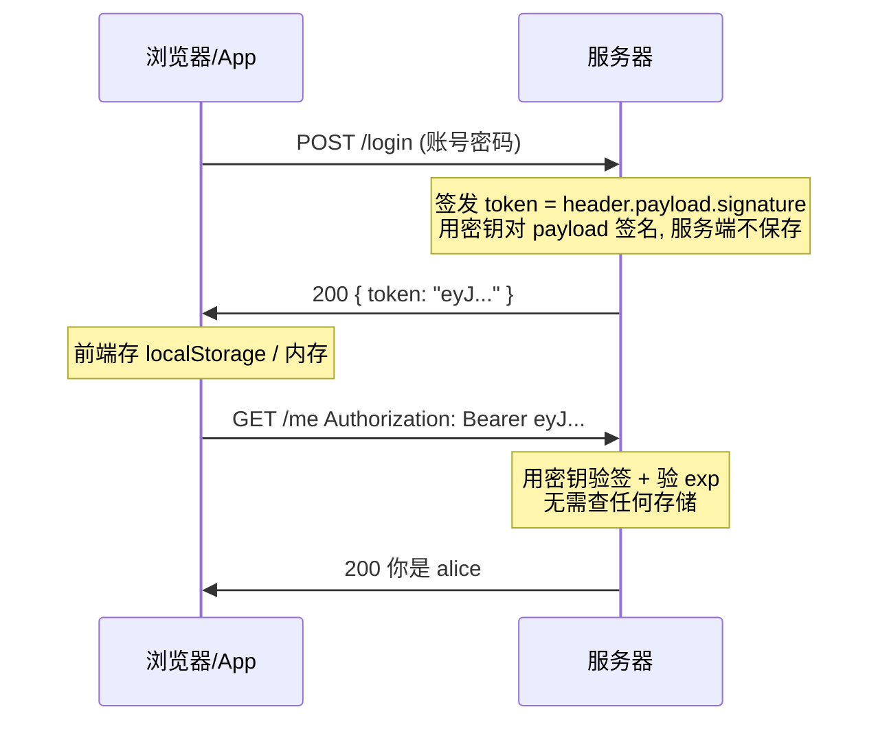
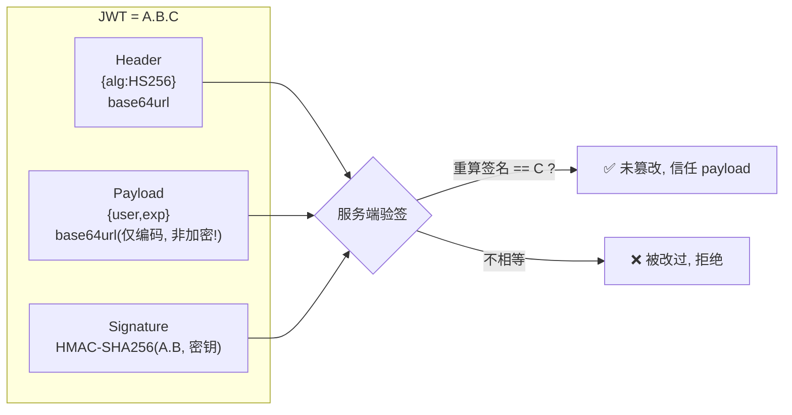
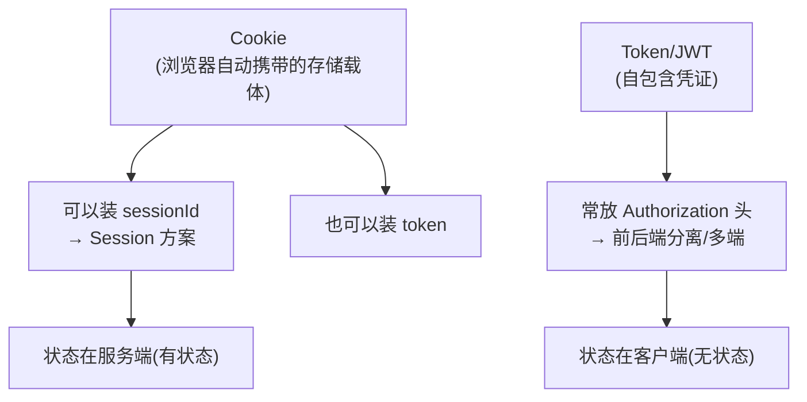

# 12 · 会话保持：Cookie / Session / Token（Cookie, Session & Token）

> HTTP 是**无状态**的——服务器天生不认识"你是谁、上一次请求是不是你发的"。为了让登录态、购物车这些跨请求的信息延续下去，就需要**会话保持**机制。主流三条路线：**Cookie 存标识、Session 在服务端存状态、Token（JWT）把状态签名后交给客户端保管**。

## 📖 知识讲解

### 问题起点：HTTP 无状态

每个 HTTP 请求都是独立的，服务器处理完一个请求就"忘了"它。可 Web 应用需要"记住"用户：登录后访问下一个页面还得是登录态。解决办法都是同一个思路——**给每个用户发一个凭证，请求时带上，服务器据此认出他**。区别只在于"凭证里放什么、状态存在哪"。

### Cookie：浏览器自动携带的小数据

**Cookie** 是服务器通过响应头 `Set-Cookie` 种到浏览器、之后浏览器**自动**在每个同域请求的 `Cookie` 头里带回的键值对。它是"会话保持"的载体（本身只是存储机制，存什么由你定）。

```http
响应：Set-Cookie: sessionId=abc123; HttpOnly; Secure; SameSite=Lax; Max-Age=3600; Path=/
请求：Cookie: sessionId=abc123        ← 浏览器之后自动带上，无需前端写代码
```

关键属性（安全相关，务必掌握）：

- **`HttpOnly`**：JS 的 `document.cookie` **读不到**这个 cookie。防止 XSS 攻击脚本窃取会话 cookie。存登录凭证必加。
- **`Secure`**：只在 HTTPS 连接下发送，防明文泄露。
- **`SameSite`**：控制跨站请求是否携带 cookie，防 CSRF：
  - `Strict`：完全不跨站带（最严，可能影响从外站链接跳转的登录态）。
  - `Lax`（现代浏览器默认）：安全的顶级导航（如点链接 GET 跳转）会带，跨站的 POST/iframe/img 不带。
  - `None`：跨站也带，但**必须同时加 `Secure`**（用于第三方嵌入场景）。
- **`Max-Age` / `Expires`**：有效期。都不设就是**会话 cookie**（关浏览器即失效）。
- **`Domain` / `Path`**：控制 cookie 作用的域名与路径范围。

### Session：状态存在服务端（有状态）

**Session（服务端会话）** 的思路：**真正的用户数据存在服务器**（内存 / Redis / 数据库），只把一个随机、无意义的 **sessionId** 通过 Cookie 发给浏览器。

- 登录成功 → 服务端生成 sessionId，把 `{用户信息}` 存进服务端会话存储，`Set-Cookie: sessionId=xxx`。
- 后续请求 → 浏览器自动带 `Cookie: sessionId=xxx` → 服务端用它作 key **查出会话数据**，认出用户。

特点：**状态在服务端**（有状态）。sessionId 本身不含信息、就算被看到也无意义（除非被盗用）。要"踢人下线"很简单——服务端删掉那条会话即可。代价：服务器要为每个在线用户保存会话，**多台服务器要共享会话存储**（否则请求被负载均衡打到没有该 session 的机器上就掉登录），通常用 Redis 集中存。

### Token / JWT：状态签名后交给客户端（无状态）

**Token 方案（典型是 JWT，JSON Web Token）** 反过来：**服务端不存会话**，登录成功后签发一个自包含的 token，把用户信息**编码 + 签名**后整个交给客户端保管，之后客户端每次请求把它带上，服务端**验签**即可确认身份，无需查任何存储。

**JWT 结构**：三段用 `.` 连接，`header.payload.signature`：

- **Header**：`{"alg":"HS256","typ":"JWT"}`，声明签名算法。
- **Payload**：`{"user":"alice","exp":...}`，放用户信息与过期时间等**声明（claims）**。
- **Signature**：`HMAC-SHA256(base64(header) + "." + base64(payload), 服务端密钥)`。

> ⚠️ Header 和 Payload 只是 **base64url 编码，不是加密**——任何人都能解开看到内容。**别在 JWT 里放密码等敏感信息**。签名的作用是**防篡改**：改了 payload 而没有密钥就算不出正确签名，服务端验签会失败。

携带方式：通常放在 **`Authorization: Bearer <token>`** 请求头里（前端从 localStorage/内存取出手动加，**不走 Cookie 自动携带**——因此天然不受 CSRF 影响，但存 localStorage 又暴露在 XSS 下，各有取舍）。

特点：**无状态**——服务端不保存 token，横向扩展容易（任何一台机器都能独立验签，不需共享存储）。代价：**难以主动失效**（token 签发后在过期前一直有效，想立即"踢人"得额外维护黑名单，等于又引入了状态）；token 里带信息，体积比 sessionId 大，每次请求都传。

### Session vs Token 对比（选型核心）

| 维度 | Cookie + Session（有状态） | Token / JWT（无状态） |
|---|---|---|
| 状态存哪 | **服务端**（Redis/DB） | **客户端**（token 自包含） |
| 服务端存储 | 需要，且多机要共享 | **不需要**（验签即可） |
| 传递方式 | Cookie 自动携带 | 手动放 `Authorization` 头（也可放 cookie） |
| 横向扩展 | 需共享 session 存储 | **天然友好** |
| 主动失效/踢人 | **容易**（删服务端会话） | 难（要黑名单/短期 token+刷新） |
| 跨域/跨端 | Cookie 受同源/SameSite 限制 | **灵活**，App/小程序/多端通用 |
| CSRF 风险 | 有（Cookie 自动带）→ 靠 SameSite/CSRF token | 放头里则**天然免疫** |
| XSS 风险 | HttpOnly 可挡住 JS 窃取 | 存 localStorage 则暴露于 XSS |
| 体积 | sessionId 很小 | 较大（含 payload+签名） |

选型经验：

- **传统 Web / 同域、需要强会话控制（随时踢人）** → Cookie + Session 更稳。
- **前后端分离、多端（App/小程序/H5）、微服务、需要无状态横向扩展** → Token/JWT 更合适。
- 现代常见折中：**短期 access token（无状态，几分钟~几小时）+ 长期 refresh token（可撤销）**，兼顾无状态与可控失效。

### 一次登录到鉴权的完整链路

不管哪种方案，本质都是"**登录发凭证 → 请求带凭证 → 服务端验凭证认出你**"三步，区别只在凭证形态和状态存放位置。

## 🔄 流程图 / 原理图

### 图 1：Cookie + Session 流程（有状态）

```mermaid
sequenceDiagram
    participant B as 浏览器
    participant S as 服务器
    participant R as 会话存储(Redis/内存)
    B->>S: POST /login (账号密码)
    S->>R: 存 session: sessionId → {user:alice}
    S->>B: 200 Set-Cookie: sessionId=abc; HttpOnly
    Note over B: 浏览器保存 cookie
    B->>S: GET /me  Cookie: sessionId=abc（自动带）
    S->>R: 用 sessionId 查会话
    R->>S: {user:alice}
    S->>B: 200 你是 alice
    Note over S,R: 状态在服务端, 删除该 session 即可踢人
```

### 图 2：Token / JWT 流程（无状态）



### 图 3：JWT 结构与验签



### 图 4：三者关系（Cookie 是载体，Session/Token 是策略）



## 💻 代码说明

Demo `server.js`（纯 Node 内置 `http` + `crypto`，**无需依赖**）在一个服务里同时演示两条路线：

**A. Cookie + Session（有状态）**

- `/login-session`：`crypto.randomBytes` 生成 sessionId，把 `{user:'alice'}` 存进服务端的 `sessions` Map，用 `Set-Cookie: sessionId=...; HttpOnly; SameSite=Lax` 下发。
- `/me-session`：`parseCookies` 解析请求的 Cookie 头，用 sessionId 查 `sessions` Map 认出用户。**注意登录后访问它前端一行代码没写 cookie，是浏览器自动带的。**

**B. Token / JWT（无状态）**

- `signToken()` 手写了 JWT 三段式：`base64url(header).base64url(payload).HMAC-SHA256签名`，演示 token 如何自包含 + 防篡改。
- `/login-token`：签发 token 直接返回在 JSON 里（服务端**不保存**）。
- `/me-token`：从 `Authorization: Bearer` 取 token，`verifyToken()` 重算签名比对（验篡改）+ 验 `exp`（验过期），**全程不查任何存储**。

对比点一目了然：session 方案服务端有个 `sessions` Map（状态在服务端）；token 方案服务端没有任何存储（状态在客户端 token 里）。

## ▶️ 运行方式

```bash
cd 17-network-protocols/12-cookie-session-token
node server.js          # 监听 http://localhost:5000
```

浏览器打开 http://localhost:5000 ，打开 DevTools：

1. **Session 路线**：点 `/login-session` → 在 Network 的响应头看到 **`Set-Cookie: sessionId=...`**；在 Application → Cookies 看到该 cookie（标着 HttpOnly）。再点 `/me-session`，看请求头**自动带了 `Cookie: sessionId=...`**，返回 `你是 alice`。
2. **Token 路线**：点页面上"演示 Token 全流程"按钮，Console/输出框会显示拿到的 token 和带 `Authorization: Bearer` 后的鉴权结果。
3. 看运行服务的终端日志，对比两种方式服务端行为的差异（session 查内存 vs token 只验签）。

用 curl 也能快速验证（已实测）：

```bash
# Token：登录拿 token，再带 token 访问
curl -s http://localhost:5000/login-token
curl -s -H "Authorization: Bearer <上面的token>" http://localhost:5000/me-token
# Session：-c 存 cookie，-b 回传 cookie
curl -s -c ck.txt http://localhost:5000/login-session
curl -s -b ck.txt http://localhost:5000/me-session
```

## ⚠️ 常见坑 / 最佳实践

- **JWT 的 payload 不是加密的**：只是 base64 编码，谁都能解码看内容。**绝不放密码、身份证等敏感信息**；签名只保证不被篡改，不保证保密。
- **会话 cookie 必加 `HttpOnly`**：否则 XSS 脚本能通过 `document.cookie` 偷走登录态。再配 `Secure`（仅 HTTPS）+ `SameSite`（防 CSRF）。
- **JWT 难主动失效**：签发后到期前一直有效。想"改密码后旧 token 立即失效""踢人下线"，得维护黑名单或用短期 token + refresh token——这等于又引入了服务端状态，别迷信"JWT 天生无状态就万能"。
- **别把大量数据塞进 JWT**：它每个请求都要传，越大越费带宽；且改数据要重签发。放少量身份标识即可，详细数据仍按需查库。
- **Session 多机要共享存储**：负载均衡下，会话存在单机内存会导致"这次登录下次掉线"。用 Redis 等集中存储，或用 sticky session（不推荐）。
- **CSRF 与 XSS 的取舍**：Cookie 自动携带 → 有 CSRF 风险（靠 SameSite/CSRF token 防）；token 放 `Authorization` 头不自动带 → 免 CSRF，但存 localStorage 又暴露于 XSS。没有绝对安全，要针对性防护。
- **`SameSite=None` 必须配 `Secure`**：现代浏览器强制，否则该 cookie 被丢弃。第三方嵌入/跨站场景要注意。
- **token 过期与时钟**：`exp` 用服务器时间校验；前端别信任本地时间判断过期，以服务端 401 为准并触发刷新流程。

## 🔗 官方文档

- MDN · 使用 HTTP Cookie：https://developer.mozilla.org/zh-CN/docs/Web/HTTP/Guides/Cookies
- MDN · Set-Cookie：https://developer.mozilla.org/zh-CN/docs/Web/HTTP/Reference/Headers/Set-Cookie
- MDN · SameSite cookies：https://developer.mozilla.org/zh-CN/docs/Web/HTTP/Reference/Headers/Set-Cookie/SameSite
- MDN · Authorization 头：https://developer.mozilla.org/zh-CN/docs/Web/HTTP/Reference/Headers/Authorization
- RFC 6265 · HTTP State Management（Cookie）：https://www.rfc-editor.org/rfc/rfc6265
- RFC 7519 · JSON Web Token（JWT）：https://www.rfc-editor.org/rfc/rfc7519
- JWT 官方介绍：https://jwt.io/introduction
- web.dev · SameSite cookies 说明：https://web.dev/articles/samesite-cookies-explained
