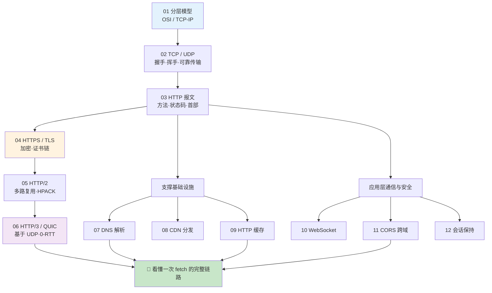
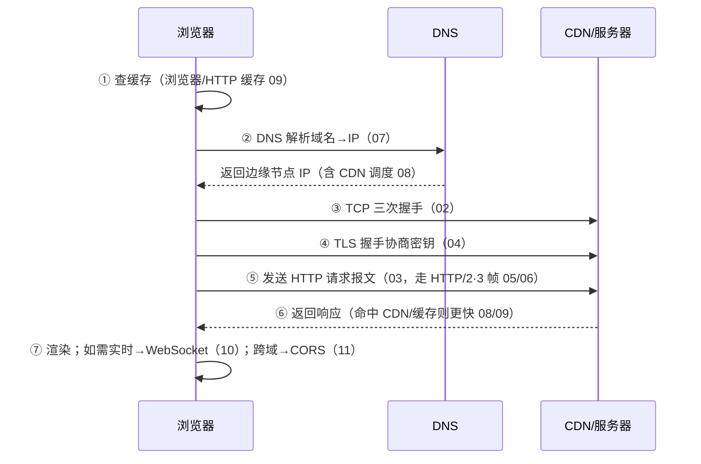

# 17 · 网络协议底层原理（Network Protocols）

> 从「一根网线上的比特」到「浏览器里的一次 `fetch`」，把 Web 通信的每一层拆开讲透。本工程属于**「原理」类**：以**深度文档 + 大量 Mermaid 图**为主、demo 为辅，配套一篇《[原理详解.md](./原理详解.md)》把 TCP/IP → HTTP 演进 → HTTPS → HTTP/2·3 → 缓存/跨域 串成完整体系。全部对照 MDN / RFC / web.dev 权威文档整理。

---

## 📚 模块索引

| 模块 | 知识点 | 核心内容 | 类型 |
| --- | --- | --- | --- |
| [01-osi-tcpip-model](./01-osi-tcpip-model/) | 分层模型 📊 | OSI 七层 vs TCP/IP 四层、数据封装/解封装 | 纯文档 |
| [02-tcp-udp](./02-tcp-udp/) | TCP / UDP 📊 | 三次握手、四次挥手、状态机、UDP 对比 | 纯文档 |
| [03-http-message](./03-http-message/) | HTTP 报文 📊 | 请求/响应报文、方法、状态码、首部 | 文档 + node demo |
| [04-https-tls](./04-https-tls/) | HTTPS / TLS 📊 | TLS 1.3/1.2 握手、证书链、前向保密 | 纯文档 |
| [05-http2](./05-http2/) | HTTP/2 📊 | 多路复用、二进制分帧、HPACK、服务端推送 | 纯文档 |
| [06-http3-quic](./06-http3-quic/) | HTTP/3 / QUIC 📊 | 基于 UDP、0-RTT、连接迁移、队头阻塞 | 纯文档 |
| [07-dns](./07-dns/) | DNS 解析 📊 | 递归 vs 迭代、域名层级、记录类型、缓存 | 纯文档 |
| [08-cdn](./08-cdn/) | CDN 分发 📊 | 边缘缓存、调度、回源、命中率 | 纯文档 |
| [09-http-cache](./09-http-cache/) | HTTP 缓存 📊 | 强缓存 vs 协商缓存、Cache-Control、ETag/304 | 文档 + node demo |
| [10-websocket](./10-websocket/) | WebSocket 📊 | Upgrade 握手、帧结构、心跳、全双工 | 文档 + node ws demo |
| [11-cors](./11-cors/) | 跨域 CORS 📊 | 同源策略、简单请求 vs 预检 OPTIONS | 文档 + node demo |
| [12-cookie-session-token](./12-cookie-session-token/) | 会话保持 📊 | Cookie / Session / Token(JWT) 对比选型 | 文档 + node demo |

📊 = 含重点原理图 / 时序图。**建议先通读 [原理详解.md](./原理详解.md) 建立全局体系，再逐模块深入。**

---

## 🗺️ 学习路线

**三阶段建议：**

1. **传输地基**（01→02）：先搞清分层模型和 TCP/UDP，这是所有上层协议的物理/传输基础。
2. **HTTP 协议主线**（03→04→05→06）：从明文 HTTP 报文，到 HTTPS 加密，再到 HTTP/2、HTTP/3 的性能演进——这是前端最该吃透的一条线。
3. **周边基础设施与应用层**（07~12）：DNS 找到服务器、CDN 就近加速、缓存少发请求；WebSocket 做实时、CORS 处理跨域、Cookie/Token 保持会话。

---

## 🔗 一次 `https://example.com` 请求都发生了什么？

---

## ▶️ 运行说明

本工程**以阅读文档 + 看图为主**，多数模块无需运行。带 demo 的模块：

| 模块 | 依赖 | 运行 |
| --- | --- | --- |
| 03-http-message | 无（Node 内置） | `node server.js` 后访问 `http://localhost:3000` |
| 09-http-cache | 无（Node 内置） | `node cache-server.js` 观察 200/304 |
| 10-websocket | `ws` 库 | `npm install && node server.js`，再开 `client.html` |
| 11-cors | 无（Node 内置） | `node server.js`，再开 `client.html` |
| 12-cookie-session-token | 无（Node 内置） | `node server.js` 观察 Set-Cookie |

- 环境：Node.js LTS 18/20/22+；用 Chrome DevTools 的 **Network** 面板对照观察协议、缓存、握手最直观。
- 想看真实抓包：可用 [Wireshark](https://www.wireshark.org/) 观察 TCP 握手 / TLS，`chrome://net-export` 观察 HTTP/2·3。

---

## 📖 配套原理长文

👉 **[原理详解.md](./原理详解.md)** —— 本工程核心交付物，把「分层模型 → TCP/IP → HTTP 演进 → HTTPS → HTTP/2/3 → DNS/CDN/缓存 → 跨域/会话」串成一条完整的知识体系，配 15+ 张 Mermaid 图与相邻方案对比、常见误区。

---

> 📌 所有内容对照 [MDN HTTP](https://developer.mozilla.org/zh-CN/docs/Web/HTTP)、[RFC 编辑器](https://www.rfc-editor.org/)、[web.dev](https://web.dev/)、[Cloudflare Learning](https://www.cloudflare.com/learning/) 等权威资料整理，各模块 README 末尾附具体链接。
