# 网络协议底层原理 · 原理详解

> 本文是 `17-network-protocols` 工程的核心交付物。目标不是罗列"怎么用"，而是把 Web 通信从**一根网线上的比特**到**浏览器里一次 `fetch` 的完整链路**讲透：分层模型 → TCP/IP → HTTP 协议演进（1.0→1.1→2→3）→ HTTPS 加密 → DNS/CDN/缓存 → 跨域/会话保持。全文对照 MDN / RFC / web.dev / Cloudflare Learning，配 16 张 Mermaid 图。当前时间 2026 年，采用近版本知识。

---

## 目录

1. [为什么要分层：一切的地基](#一为什么要分层一切的地基)
2. [TCP/IP：可靠传输如何炼成](#二tcpip可靠传输如何炼成)
3. [HTTP 的诞生与演进主线](#三http-的诞生与演进主线)
4. [HTTPS：给 HTTP 套上加密外壳](#四https给-http-套上加密外壳)
5. [HTTP/2：一条连接跑满带宽](#五http2一条连接跑满带宽)
6. [HTTP/3 / QUIC：干脆重造传输层](#六http3--quic干脆重造传输层)
7. [DNS：先得找到服务器在哪](#七dns先得找到服务器在哪)
8. [CDN：把内容搬到用户家门口](#八cdn把内容搬到用户家门口)
9. [HTTP 缓存：最快的请求是不请求](#九http-缓存最快的请求是不请求)
10. [跨域与会话：浏览器安全模型](#十跨域与会话浏览器安全模型)
11. [终章：串起一次完整请求](#十一终章串起一次完整请求)
12. [常见误区速查](#十二常见误区速查)

---

## 一、为什么要分层：一切的地基

网络通信的复杂度极高——从"电信号如何在铜线里传播"到"JSON 如何在两个进程间交换"。工程界用**分层**来驯服这种复杂度：**每一层只干一件事，只依赖下一层提供的能力，只对上一层暴露简单接口**。这样任意一层的实现都可以独立替换（网线换成光纤、TCP 换成 QUIC），而不影响其它层。

**OSI 七层**是理论参考模型，**TCP/IP 四层（或五层）**是实际互联网采用的模型：

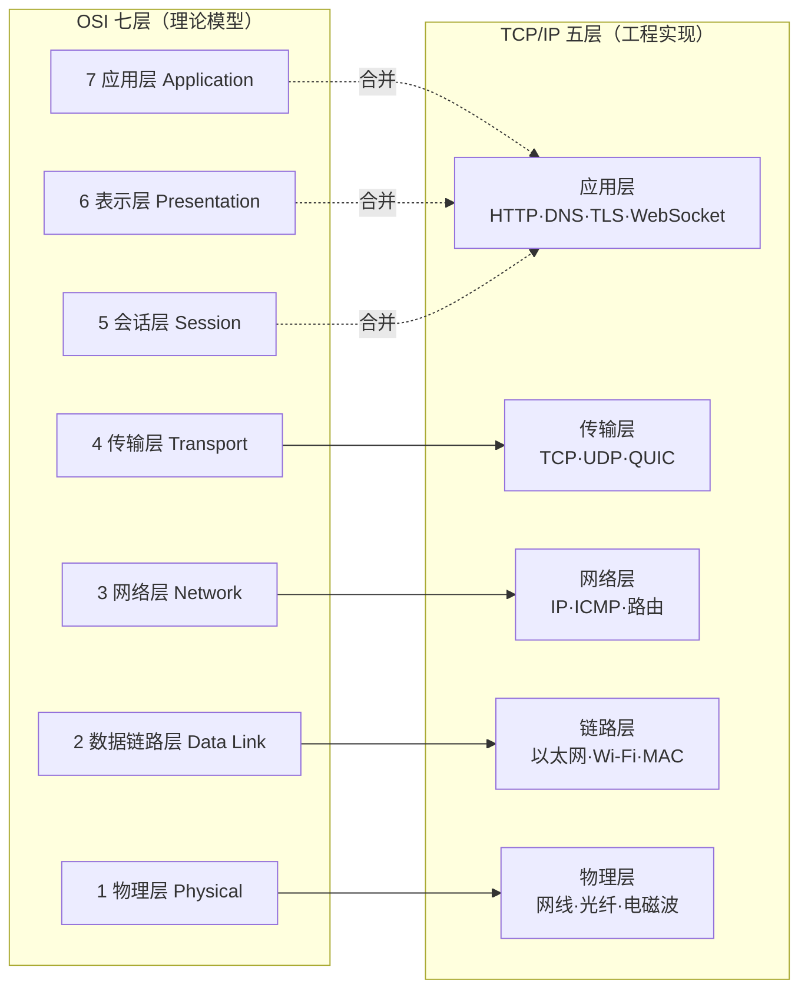
```mermaid
graph LR
    subgraph OSI["OSI 七层（理论模型）"]
        O7["7 应用层 Application"]
        O6["6 表示层 Presentation"]
        O5["5 会话层 Session"]
        O4["4 传输层 Transport"]
        O3["3 网络层 Network"]
        O2["2 数据链路层 Data Link"]
        O1["1 物理层 Physical"]
    end
    subgraph TCPIP["TCP/IP 五层（工程实现）"]
        T5["应用层<br/>HTTP·DNS·TLS·WebSocket"]
        T4["传输层<br/>TCP·UDP·QUIC"]
        T3["网络层<br/>IP·ICMP·路由"]
        T2["链路层<br/>以太网·Wi-Fi·MAC"]
        T1["物理层<br/>网线·光纤·电磁波"]
    end
    O7 -.合并.-> T5
    O6 -.合并.-> T5
    O5 -.合并.-> T5
    O4 --> T4
    O3 --> T3
    O2 --> T2
    O1 --> T1
```

**数据封装（Encapsulation）**：数据从应用层往下走，每经过一层就被套上一层"信封"（加头部 header），到物理层变成比特流发出去；对端收到后自下而上层层拆信封（解封装 Decapsulation）。每一层的数据单元（PDU）有专门名字：

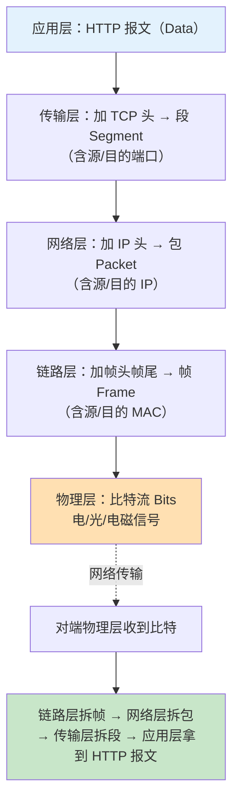
```mermaid
flowchart TD
    A["应用层：HTTP 报文（Data）"] --> B["传输层：加 TCP 头 → 段 Segment<br/>（含源/目的端口）"]
    B --> C["网络层：加 IP 头 → 包 Packet<br/>（含源/目的 IP）"]
    C --> D["链路层：加帧头帧尾 → 帧 Frame<br/>（含源/目的 MAC）"]
    D --> E["物理层：比特流 Bits<br/>电/光/电磁信号"]
    E -.网络传输.-> F["对端物理层收到比特"]
    F --> G["链路层拆帧 → 网络层拆包<br/>→ 传输层拆段 → 应用层拿到 HTTP 报文"]
    style A fill:#e3f2fd
    style E fill:#ffe0b2
    style G fill:#c8e6c9
```

> **关键认知**：分层是**抽象模型**，不是严格的代码结构。现实里 TLS 就横跨"会话/表示"的模糊地带（常被说成"4.5 层"）；QUIC 更是把传输层和加密层揉在了一起。别把模型当教条，它的价值是提供**共同的词汇表**。

详见模块 [01-osi-tcpip-model](./01-osi-tcpip-model/)。

---

## 二、TCP/IP：可靠传输如何炼成

IP 层只负责"尽力而为"地把包送到目的 IP——**可能丢包、可能乱序、可能重复**。要在这种不可靠的地基上盖起可靠的 Web，靠的是传输层的 **TCP**。而对实时性要求高、能容忍丢包的场景（DNS、音视频、游戏、QUIC），则用轻量的 **UDP**。

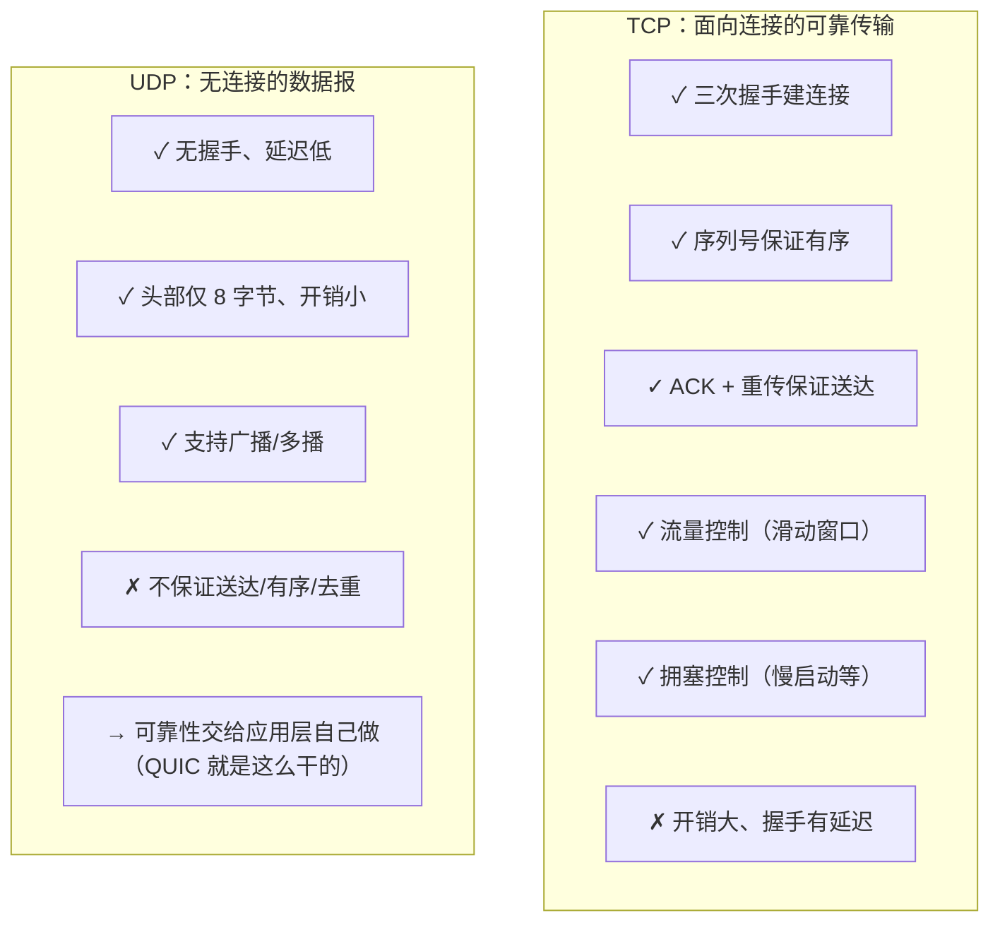
```mermaid
graph TB
    subgraph TCP["TCP：面向连接的可靠传输"]
        TC1["✓ 三次握手建连接"]
        TC2["✓ 序列号保证有序"]
        TC3["✓ ACK + 重传保证送达"]
        TC4["✓ 流量控制（滑动窗口）"]
        TC5["✓ 拥塞控制（慢启动等）"]
        TC6["✗ 开销大、握手有延迟"]
    end
    subgraph UDP["UDP：无连接的数据报"]
        UD1["✓ 无握手、延迟低"]
        UD2["✓ 头部仅 8 字节、开销小"]
        UD3["✓ 支持广播/多播"]
        UD4["✗ 不保证送达/有序/去重"]
        UD5["→ 可靠性交给应用层自己做<br/>（QUIC 就是这么干的）"]
    end
```

### 三次握手：为什么是三次而不是两次

握手的目的是**双方都确认对方的收发能力正常**，并交换初始序列号（ISN）。

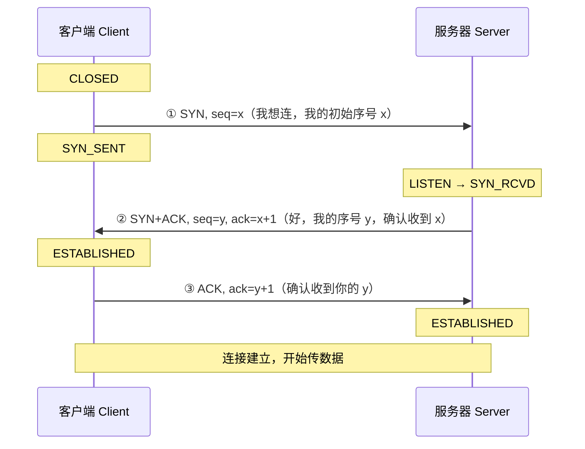
```mermaid
sequenceDiagram
    participant C as 客户端 Client
    participant S as 服务器 Server
    Note over C: CLOSED
    C->>S: ① SYN, seq=x（我想连，我的初始序号 x）
    Note over C: SYN_SENT
    Note over S: LISTEN → SYN_RCVD
    S->>C: ② SYN+ACK, seq=y, ack=x+1（好，我的序号 y，确认收到 x）
    Note over C: ESTABLISHED
    C->>S: ③ ACK, ack=y+1（确认收到你的 y）
    Note over S: ESTABLISHED
    Note over C,S: 连接建立，开始传数据
```

**为什么两次不够？** 若只有两次，服务器无法确认"客户端能收到自己的包"。更关键的是防止**历史失效的连接请求**：一个在网络里滞留很久的旧 SYN 突然到达，若两次握手就直接建连，会白白占用资源。第三次 ACK 让服务器确认这是一个"当前有效"的连接。

### 四次挥手：为什么比握手多一次

因为 TCP 是**全双工**的，两个方向要**各自关闭**。服务器收到客户端的 FIN 后，可能还有数据没发完，所以先回 ACK，等自己数据发完再单独发 FIN——ACK 和 FIN 不能合并，于是成了四次。

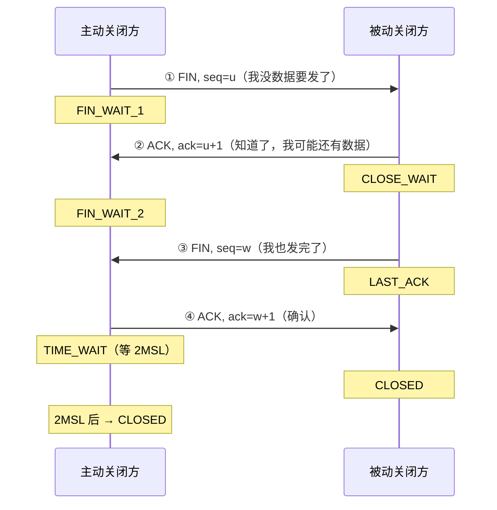
```mermaid
sequenceDiagram
    participant C as 主动关闭方
    participant S as 被动关闭方
    C->>S: ① FIN, seq=u（我没数据要发了）
    Note over C: FIN_WAIT_1
    S->>C: ② ACK, ack=u+1（知道了，我可能还有数据）
    Note over S: CLOSE_WAIT
    Note over C: FIN_WAIT_2
    S->>C: ③ FIN, seq=w（我也发完了）
    Note over S: LAST_ACK
    C->>S: ④ ACK, ack=w+1（确认）
    Note over C: TIME_WAIT（等 2MSL）
    Note over S: CLOSED
    Note over C: 2MSL 后 → CLOSED
```

**TIME_WAIT 存在 2MSL（报文最大生存时间的两倍）** 的原因：① 确保最后那个 ACK 能到达对端（若丢了，对端重发 FIN，本端还能重发 ACK）；② 让本次连接的所有残留报文在网络中自然消亡，避免污染下一个复用相同四元组的连接。

TCP 完整状态机：

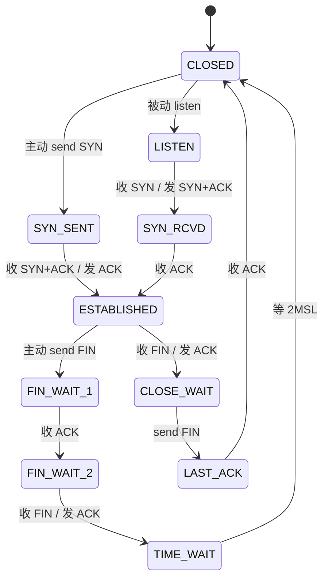
```mermaid
stateDiagram-v2
    [*] --> CLOSED
    CLOSED --> SYN_SENT: 主动 send SYN
    CLOSED --> LISTEN: 被动 listen
    SYN_SENT --> ESTABLISHED: 收 SYN+ACK / 发 ACK
    LISTEN --> SYN_RCVD: 收 SYN / 发 SYN+ACK
    SYN_RCVD --> ESTABLISHED: 收 ACK
    ESTABLISHED --> FIN_WAIT_1: 主动 send FIN
    ESTABLISHED --> CLOSE_WAIT: 收 FIN / 发 ACK
    FIN_WAIT_1 --> FIN_WAIT_2: 收 ACK
    FIN_WAIT_2 --> TIME_WAIT: 收 FIN / 发 ACK
    CLOSE_WAIT --> LAST_ACK: send FIN
    LAST_ACK --> CLOSED: 收 ACK
    TIME_WAIT --> CLOSED: 等 2MSL
```

详见模块 [02-tcp-udp](./02-tcp-udp/)。

---

## 三、HTTP 的诞生与演进主线

有了可靠的 TCP 通道，应用层就能定义"两个进程说什么话"——这就是 **HTTP**。它是**无状态、基于请求-响应、文本可读**的协议。

一次 HTTP 交互由**请求报文**和**响应报文**组成，结构对称：

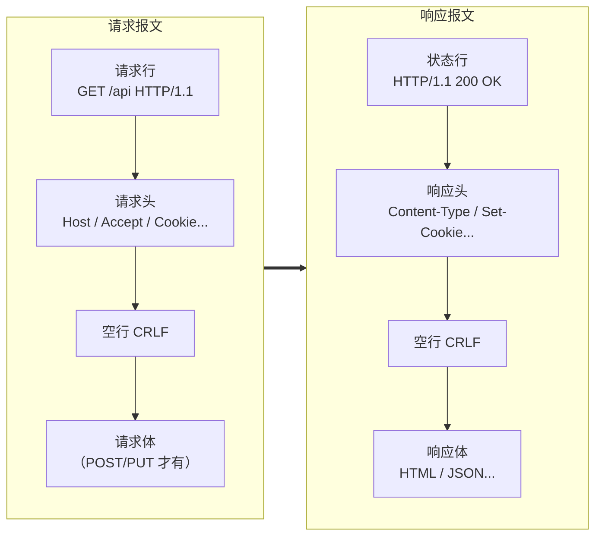
```mermaid
flowchart LR
    subgraph REQ["请求报文"]
        R1["请求行<br/>GET /api HTTP/1.1"]
        R2["请求头<br/>Host / Accept / Cookie..."]
        R3["空行 CRLF"]
        R4["请求体<br/>（POST/PUT 才有）"]
        R1 --> R2 --> R3 --> R4
    end
    subgraph RES["响应报文"]
        S1["状态行<br/>HTTP/1.1 200 OK"]
        S2["响应头<br/>Content-Type / Set-Cookie..."]
        S3["空行 CRLF"]
        S4["响应体<br/>HTML / JSON..."]
        S1 --> S2 --> S3 --> S4
    end
    REQ ==> RES
```

**方法**表达意图，其中**安全性**（是否只读不改服务器状态）和**幂等性**（多次执行效果同一次）是核心属性：

| 方法 | 语义 | 安全 | 幂等 |
| --- | --- | --- | --- |
| GET | 获取资源 | ✓ | ✓ |
| HEAD | 只取头不取体 | ✓ | ✓ |
| OPTIONS | 查询能力（CORS 预检用） | ✓ | ✓ |
| PUT | 整体替换 | ✗ | ✓ |
| DELETE | 删除 | ✗ | ✓ |
| POST | 提交/新建 | ✗ | ✗ |
| PATCH | 局部修改 | ✗ | ✗ |

**状态码**五大类，是服务器对请求结果的"分类回执"：

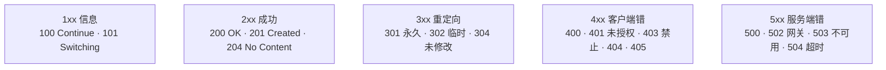
```mermaid
graph TB
    C1["1xx 信息<br/>100 Continue · 101 Switching"] 
    C2["2xx 成功<br/>200 OK · 201 Created · 204 No Content"]
    C3["3xx 重定向<br/>301 永久 · 302 临时 · 304 未修改"]
    C4["4xx 客户端错<br/>400 · 401 未授权 · 403 禁止 · 404 · 405"]
    C5["5xx 服务端错<br/>500 · 502 网关 · 503 不可用 · 504 超时"]
```

### 演进主线一览

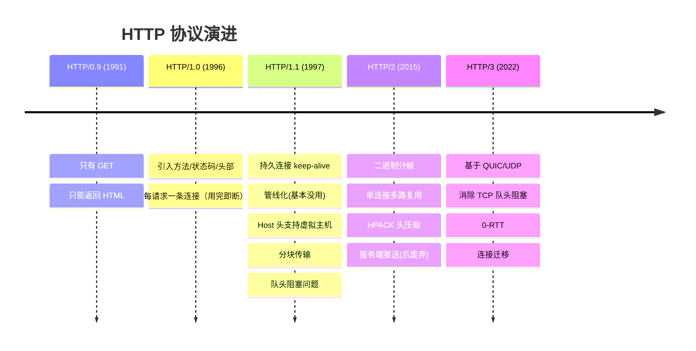
```mermaid
timeline
    title HTTP 协议演进
    HTTP/0.9 (1991) : 只有 GET : 只能返回 HTML
    HTTP/1.0 (1996) : 引入方法/状态码/头部 : 每请求一条连接（用完即断）
    HTTP/1.1 (1997) : 持久连接 keep-alive : 管线化(基本没用) : Host 头支持虚拟主机 : 分块传输 : 队头阻塞问题
    HTTP/2 (2015) : 二进制分帧 : 单连接多路复用 : HPACK 头压缩 : 服务端推送(后废弃)
    HTTP/3 (2022) : 基于 QUIC/UDP : 消除 TCP 队头阻塞 : 0-RTT : 连接迁移
```

**HTTP/1.1 的核心痛点**（催生了 2 和 3）：
- **队头阻塞（HoL Blocking）**：一条 TCP 连接上请求必须按序响应，前一个慢就堵住后面所有。
- **多连接开销**：浏览器只好对每个域名开 6 条 TCP 连接来"并行"，每条都要握手、各自拥塞控制。
- **头部冗余**：每个请求都重复带一大坨 Cookie、User-Agent 等明文头。

详见模块 [03-http-message](./03-http-message/)。

---

## 四、HTTPS：给 HTTP 套上加密外壳

明文 HTTP 在链路上任何一跳都能被**窃听、篡改、冒充**。HTTPS = **HTTP over TLS**，在 TCP 和 HTTP 之间插入 TLS 层，解决三件事：**加密（防窃听）、完整性（防篡改）、身份认证（防冒充）**。

核心是**混合加密**：用**非对称加密**（慢，但能在不安全信道上安全地协商）来交换一个**对称密钥**，之后所有数据用**对称加密**（快）传输。

### TLS 1.3 握手（1-RTT，当前主流）

TLS 1.3（RFC 8446）大幅简化握手：客户端在第一个包就"押注"发出密钥参数（key_share），一个来回（1-RTT）就能开始传应用数据。

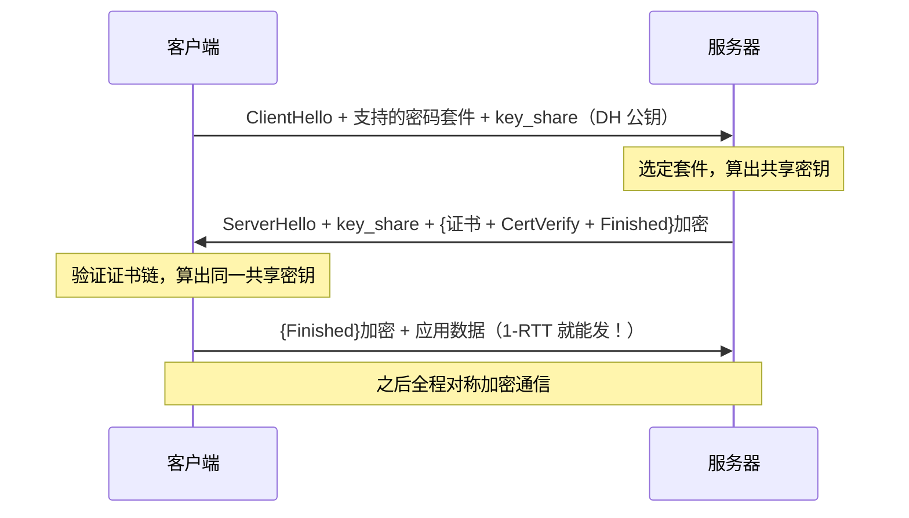
```mermaid
sequenceDiagram
    participant C as 客户端
    participant S as 服务器
    C->>S: ClientHello + 支持的密码套件 + key_share（DH 公钥）
    Note over S: 选定套件，算出共享密钥
    S->>C: ServerHello + key_share + {证书 + CertVerify + Finished}加密
    Note over C: 验证证书链，算出同一共享密钥
    C->>S: {Finished}加密 + 应用数据（1-RTT 就能发！）
    Note over C,S: 之后全程对称加密通信
```

对比 **TLS 1.2（2-RTT）**——要多一个来回才能协商完密钥：

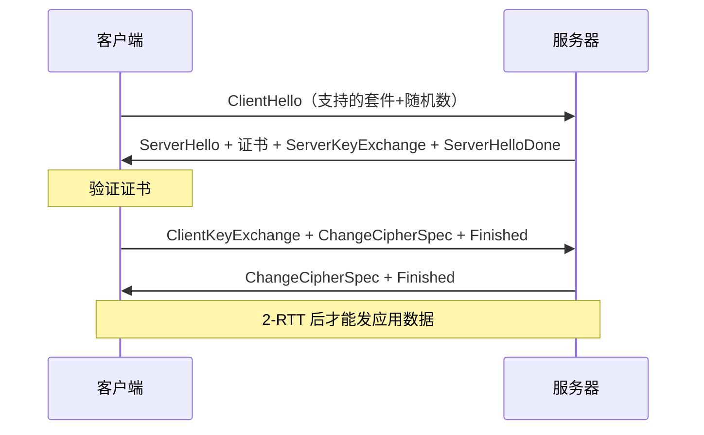
```mermaid
sequenceDiagram
    participant C as 客户端
    participant S as 服务器
    C->>S: ClientHello（支持的套件+随机数）
    S->>C: ServerHello + 证书 + ServerKeyExchange + ServerHelloDone
    Note over C: 验证证书
    C->>S: ClientKeyExchange + ChangeCipherSpec + Finished
    S->>C: ChangeCipherSpec + Finished
    Note over C,S: 2-RTT 后才能发应用数据
```

### 证书链：凭什么信任这个公钥

服务器给的公钥怎么证明"确实属于 example.com 而不是中间人伪造的"？靠 **CA（证书颁发机构）的数字签名**构成的**信任链**：

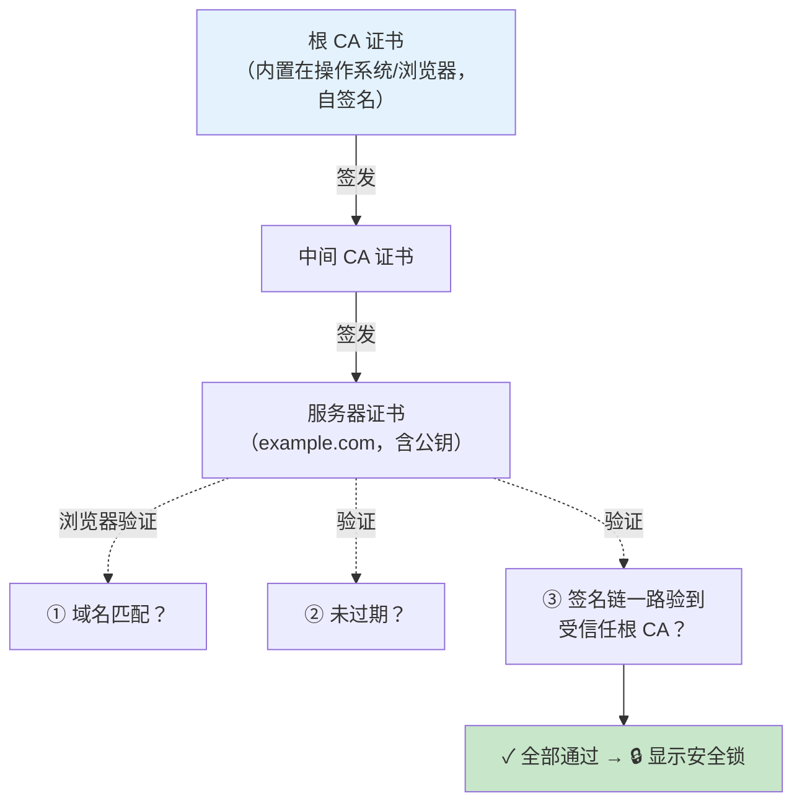
```mermaid
graph TD
    Root["根 CA 证书<br/>（内置在操作系统/浏览器，自签名）"] -->|签发| Inter["中间 CA 证书"]
    Inter -->|签发| Leaf["服务器证书<br/>（example.com，含公钥）"]
    Leaf -.浏览器验证.-> V1["① 域名匹配？"]
    Leaf -.验证.-> V2["② 未过期？"]
    Leaf -.验证.-> V3["③ 签名链一路验到<br/>受信任根 CA？"]
    V3 --> OK["✓ 全部通过 → 🔒 显示安全锁"]
    style Root fill:#e3f2fd
    style OK fill:#c8e6c9
```

浏览器逐级用上级证书的公钥验证下级证书的签名，直到某个受信任的**根 CA**（预装在系统里）。任一环断裂（域名不符、过期、中间证书缺失、根不受信）都会报警告。**前向保密（Forward Secrecy）**：TLS 1.3 强制用 ECDHE 临时密钥，即使服务器私钥日后泄露，也无法解密以前抓到的流量。

详见模块 [04-https-tls](./04-https-tls/)。

---

## 五、HTTP/2：一条连接跑满带宽

HTTP/2（RFC 9113）不改变 HTTP 语义（方法、状态码、头部含义都一样），只改变**在网络上如何编码传输**。核心是引入**二进制分帧层**。

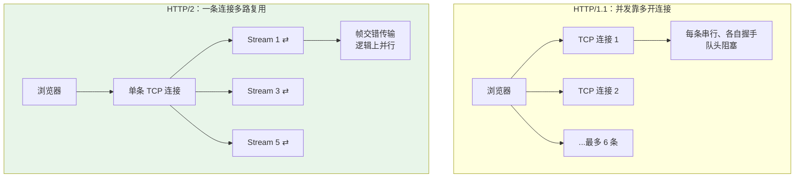
```mermaid
graph TB
    subgraph H1["HTTP/1.1：并发靠多开连接"]
        A1["浏览器"] --> C1["TCP 连接 1"]
        A1 --> C2["TCP 连接 2"]
        A1 --> C3["...最多 6 条"]
        C1 --> D1["每条串行、各自握手<br/>队头阻塞"]
    end
    subgraph H2["HTTP/2：一条连接多路复用"]
        A2["浏览器"] --> C4["单条 TCP 连接"]
        C4 --> S1["Stream 1 ⇄"]
        C4 --> S2["Stream 3 ⇄"]
        C4 --> S3["Stream 5 ⇄"]
        S1 --> D2["帧交错传输<br/>逻辑上并行"]
    end
    style H2 fill:#e8f5e9
```

关键概念的层级关系：

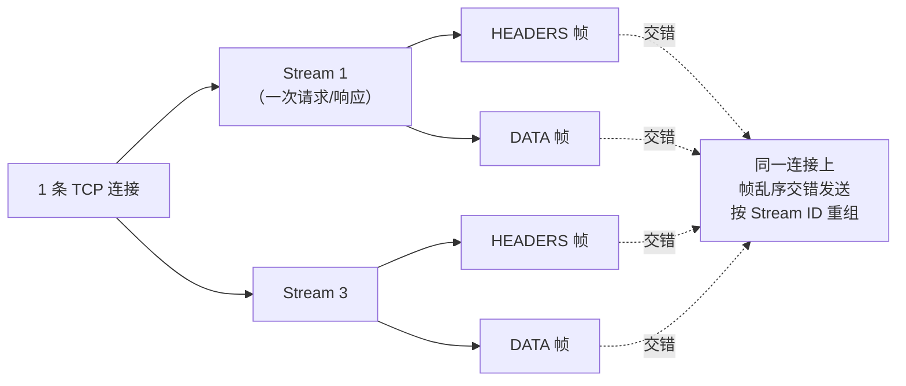
```mermaid
graph LR
    Conn["1 条 TCP 连接"] --> St1["Stream 1<br/>（一次请求/响应）"]
    Conn --> St2["Stream 3"]
    St1 --> F1["HEADERS 帧"]
    St1 --> F2["DATA 帧"]
    St2 --> F3["HEADERS 帧"]
    St2 --> F4["DATA 帧"]
    F1 -.交错.-> Wire["同一连接上<br/>帧乱序交错发送<br/>按 Stream ID 重组"]
    F2 -.交错.-> Wire
    F3 -.交错.-> Wire
    F4 -.交错.-> Wire
```

- **多路复用（Multiplexing）**：一条 TCP 连接上并发多个 Stream，帧交错传输、按 Stream ID 重组——单连接内彻底消灭了 HTTP 层队头阻塞。
- **HPACK 头压缩**（RFC 7541）：用**静态表**（预定义常见头）+ **动态表**（本连接出现过的头）+ Huffman 编码，把重复的 `Cookie`、`User-Agent` 压成一个索引号。
- **服务端推送（Server Push）**：曾想让服务器主动推资源，但**实践中收益小、易推错、已被主流浏览器废弃（Chrome 106 起移除）**，现用 `103 Early Hints` + `preload` 替代。

**但 HTTP/2 有个天花板**：它仍跑在 TCP 上。TCP 保证字节流有序，一旦某个 TCP 包丢了，**所有** Stream 都得等它重传——**TCP 层的队头阻塞**是 HTTP/2 无法解决的。这就逼出了 HTTP/3。

详见模块 [05-http2](./05-http2/)。

---

## 六、HTTP/3 / QUIC：干脆重造传输层

既然 TCP 的有序字节流是队头阻塞的根源，HTTP/3（RFC 9114）的思路很激进：**抛弃 TCP，改用基于 UDP 的 QUIC（RFC 9000）**。UDP 本身不管顺序，QUIC 在其上自己实现了多路复用、可靠性和加密。

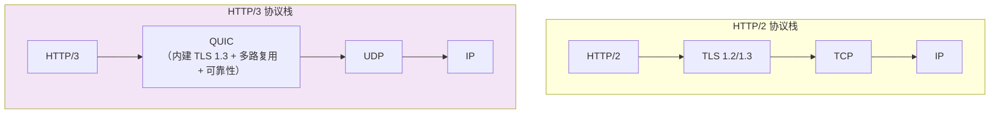
```mermaid
graph TB
    subgraph S2["HTTP/2 协议栈"]
        A1["HTTP/2"] --> A2["TLS 1.2/1.3"]
        A2 --> A3["TCP"]
        A3 --> A4["IP"]
    end
    subgraph S3["HTTP/3 协议栈"]
        B1["HTTP/3"] --> B2["QUIC<br/>（内建 TLS 1.3 + 多路复用 + 可靠性）"]
        B2 --> B3["UDP"]
        B3 --> B4["IP"]
    end
    style S3 fill:#f3e5f5
```

**QUIC 三大杀手锏：**

1. **消除队头阻塞**：QUIC 的每个 Stream 独立管理丢包重传，某个流丢包**只**阻塞它自己，其它流照常前进。

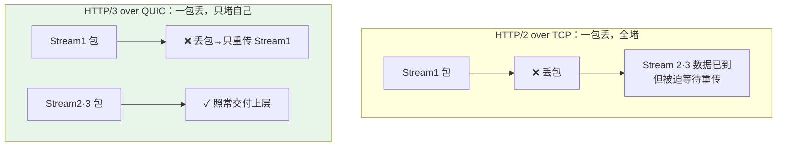
```mermaid
graph TB
    subgraph TCP2["HTTP/2 over TCP：一包丢，全堵"]
        P1["Stream1 包"] --> X["❌ 丢包"]
        X --> Block["Stream 2·3 数据已到<br/>但被迫等待重传"]
    end
    subgraph QUIC2["HTTP/3 over QUIC：一包丢，只堵自己"]
        Q1["Stream1 包"] --> XX["❌ 丢包→只重传 Stream1"]
        Q2["Stream2·3 包"] --> Pass["✓ 照常交付上层"]
    end
    style QUIC2 fill:#e8f5e9
```

2. **握手更快（0-RTT / 1-RTT）**：QUIC 把**传输握手和 TLS 1.3 加密握手合二为一**。首次连接 1-RTT，重访同一服务器可用 **0-RTT**——第一个包就带上应用数据。

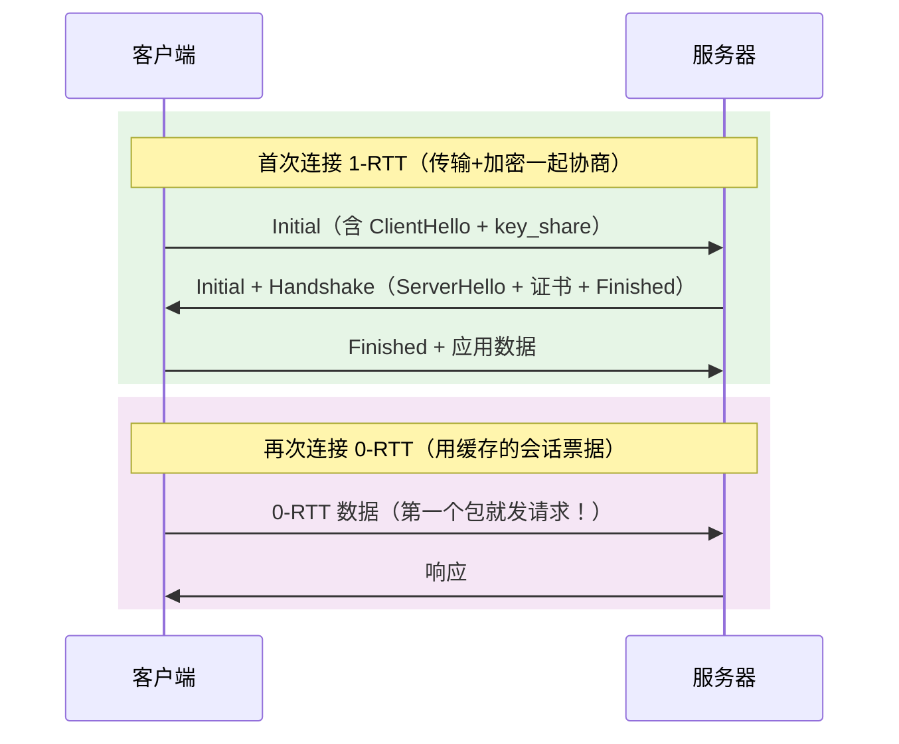
```mermaid
sequenceDiagram
    participant C as 客户端
    participant S as 服务器
    rect rgb(230,245,230)
    Note over C,S: 首次连接 1-RTT（传输+加密一起协商）
    C->>S: Initial（含 ClientHello + key_share）
    S->>C: Initial + Handshake（ServerHello + 证书 + Finished）
    C->>S: Finished + 应用数据
    end
    rect rgb(245,230,245)
    Note over C,S: 再次连接 0-RTT（用缓存的会话票据）
    C->>S: 0-RTT 数据（第一个包就发请求！）
    S->>C: 响应
    end
```

3. **连接迁移（Connection Migration）**：TCP 连接由「源 IP + 源端口 + 目的 IP + 目的端口」四元组标识，手机从 Wi-Fi 切到 4G，IP 变了连接就断。QUIC 用一个与网络路径无关的 **Connection ID** 标识连接，切网时连接**不中断**，视频不卡。

浏览器通过 `Alt-Svc` 响应头得知服务器支持 HTTP/3，后续升级。**注意**：部分网络封禁/限速 UDP，此时需回退到 TCP（HTTP/2）；0-RTT 数据有**重放攻击**风险，只应用于幂等请求。

详见模块 [06-http3-quic](./06-http3-quic/)。

---

## 七、DNS：先得找到服务器在哪

前面所有协议都假设"已经知道服务器 IP"。但用户输入的是 `example.com`——把**域名翻译成 IP** 的分布式数据库就是 **DNS**。域名是分层的，解析也是分层的：

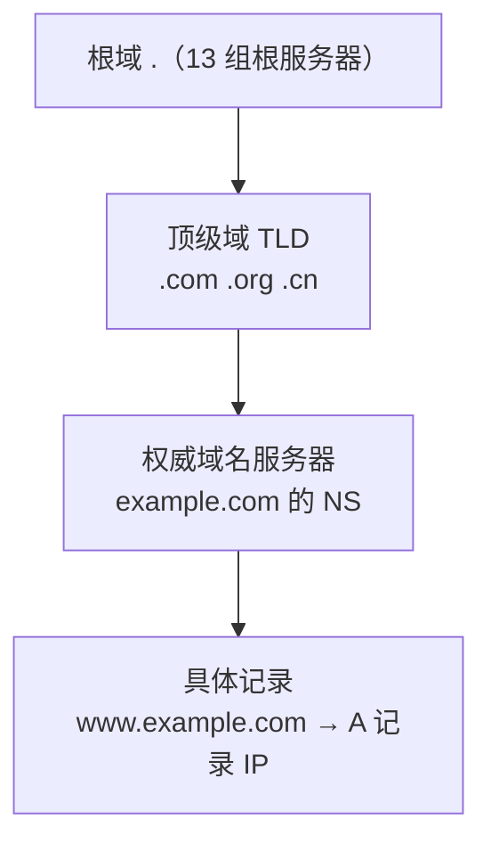
```mermaid
graph TD
    Root["根域 .（13 组根服务器）"] --> TLD["顶级域 TLD<br/>.com .org .cn"]
    TLD --> SLD["权威域名服务器<br/>example.com 的 NS"]
    SLD --> Host["具体记录<br/>www.example.com → A 记录 IP"]
```

**递归查询 vs 迭代查询**：客户端对本地/递归解析器发起**递归**查询（"你负责给我最终答案"）；递归解析器再对根、TLD、权威服务器逐级发**迭代**查询（"你不知道就告诉我该问谁"）：

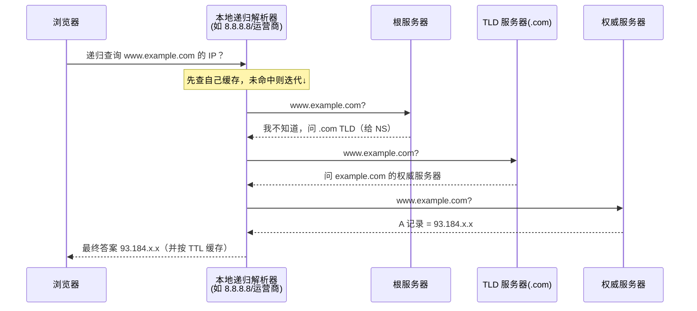
```mermaid
sequenceDiagram
    participant B as 浏览器
    participant L as 本地递归解析器<br/>(如 8.8.8.8/运营商)
    participant R as 根服务器
    participant T as TLD 服务器(.com)
    participant A as 权威服务器
    B->>L: 递归查询 www.example.com 的 IP？
    Note over L: 先查自己缓存，未命中则迭代↓
    L->>R: www.example.com?
    R-->>L: 我不知道，问 .com TLD（给 NS）
    L->>T: www.example.com?
    T-->>L: 问 example.com 的权威服务器
    L->>A: www.example.com?
    A-->>L: A 记录 = 93.184.x.x
    L-->>B: 最终答案 93.184.x.x（并按 TTL 缓存）
```

**多级缓存**让绝大多数解析根本走不到根服务器：

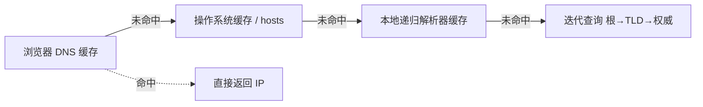
```mermaid
flowchart LR
    A["浏览器 DNS 缓存"] -->|未命中| B["操作系统缓存 / hosts"]
    B -->|未命中| C["本地递归解析器缓存"]
    C -->|未命中| D["迭代查询 根→TLD→权威"]
    A -.命中.-> Hit["直接返回 IP"]
```

常见记录：**A**（IPv4）、**AAAA**（IPv6）、**CNAME**（别名，CDN 就靠它）、**MX**（邮件）、**NS**（域名服务器）、**TXT**、**SOA**。DNS 走 **UDP 53**（快、报文小），大响应或区域传送用 TCP。现代还有加密 DNS：**DoH**（over HTTPS）、**DoT**（over TLS），防止 DNS 被窃听/劫持。

详见模块 [07-dns](./07-dns/)。

---

## 八、CDN：把内容搬到用户家门口

跨洋访问源站，物理距离带来的延迟是硬伤。**CDN（内容分发网络）** 在全球部署**边缘节点**，把静态内容缓存到离用户最近的地方，**就近返回**：降延迟、减源站压力、抗流量峰值、防攻击。

CDN 与 DNS 深度绑定：域名 CNAME 到 CDN 域名，CDN 的**智能调度**（GSLB 全局负载均衡 / Anycast）根据用户地理位置和节点负载，把用户**导向最优边缘节点**：

```mermaid
flowchart TD
    U["用户请求 img.example.com"] --> DNS["DNS 解析<br/>CNAME → CDN 调度系统"]
    DNS --> GSLB{"智能调度<br/>选最近/最优节点"}
    GSLB --> Edge["最近边缘节点"]
    Edge --> Hit{"缓存命中？"}
    Hit -->|命中| Fast["✓ 直接返回（毫秒级）"]
    Hit -->|未命中| Parent["回源：父节点 → 源站取"]
    Parent --> Origin["源站 Origin"]
    Origin --> Cache["边缘缓存下来<br/>下次就命中"]
    Cache --> Fast
    style Fast fill:#c8e6c9
    style Origin fill:#ffe0b2
```

首次未命中 vs 二次命中的对比：

```mermaid
sequenceDiagram
    participant U as 用户
    participant E as 边缘节点
    participant O as 源站
    Note over U,O: 首次（Cache Miss）
    U->>E: 请求资源
    E->>O: 回源拉取
    O-->>E: 返回内容
    E->>E: 缓存（按 Cache-Control）
    E-->>U: 返回内容（较慢）
    Note over U,O: 二次（Cache Hit）
    U->>E: 请求同一资源
    E-->>U: 直接命中返回（快）
```

CDN 的缓存策略与第九节的 HTTP 缓存头**协同**：源站用 `Cache-Control: s-maxage` 控制 CDN 缓存时长，用带 hash 的文件名（`app.a1b2c3.js`）实现"内容变则 URL 变"，配合缓存刷新/预热管理更新。**坑**：更新后要主动刷新 CDN、回源风暴、跨域字体需正确 CORS、动态内容不宜强缓存。

详见模块 [08-cdn](./08-cdn/)。

---

## 九、HTTP 缓存：最快的请求是不请求

浏览器本地就有一套 HTTP 缓存机制，分**强缓存**和**协商缓存**两层。核心思想：**能不发请求就不发（强缓存），非发不可就问"变了没"（协商缓存），没变就只回一个不带体的 304**。

```mermaid
flowchart TD
    Start["发起请求"] --> HasCache{"本地有缓存副本？"}
    HasCache -->|无| Network["走网络请求 → 200"]
    HasCache -->|有| Fresh{"强缓存未过期？<br/>Cache-Control: max-age / Expires"}
    Fresh -->|新鲜| UseLocal["✓ 直接用本地<br/>200 (from memory/disk cache)<br/>不发请求"]
    Fresh -->|已过期| Revalidate["发协商请求<br/>If-None-Match: ETag<br/>If-Modified-Since: Last-Modified"]
    Revalidate --> Changed{"服务器：变了吗？"}
    Changed -->|没变| NotModified["304 Not Modified<br/>不带响应体 → 用本地副本"]
    Changed -->|变了| New["200 + 新内容 + 新缓存头"]
    style UseLocal fill:#c8e6c9
    style NotModified fill:#dcedc8
```

**强缓存**由 `Cache-Control`（优先）和 `Expires`（HTTP/1.0 遗留）控制。`Cache-Control` 常用指令：

| 指令 | 含义 |
| --- | --- |
| `max-age=N` | 资源 N 秒内新鲜，期间不发请求 |
| `no-cache` | **每次都要向服务器校验**（走协商），≠ 不缓存 |
| `no-store` | **真正不缓存**，什么都不存 |
| `private` | 只能存在浏览器（不能存共享缓存/CDN） |
| `public` | 共享缓存也可存 |
| `s-maxage=N` | 只对共享缓存（CDN）生效，覆盖 max-age |
| `must-revalidate` | 过期后必须校验，不许用陈旧副本 |
| `immutable` | 内容永不变，刷新页面也不重新校验 |
| `stale-while-revalidate=N` | 后台校验期间先用陈旧副本，体验更平滑 |

**协商缓存**的两组对照头：

```mermaid
sequenceDiagram
    participant B as 浏览器
    participant S as 服务器
    Note over B: 首次
    B->>S: GET /app.js
    S-->>B: 200 + ETag:"abc123" + Cache-Control:no-cache
    Note over B: 再次（强缓存需校验）
    B->>S: GET /app.js<br/>If-None-Match:"abc123"
    alt 内容未变
        S-->>B: 304 Not Modified（无响应体，省带宽）
        Note over B: 用本地副本
    else 内容已变
        S-->>B: 200 + 新内容 + 新 ETag
    end
```

- **ETag / If-None-Match**：内容指纹，精确（推荐），有强/弱之分。
- **Last-Modified / If-Modified-Since**：修改时间，精度只到秒，且"改了又改回"无法识别。

**最佳实践**（对照 MDN）：
- HTML 入口文件：`Cache-Control: no-cache`（每次校验，保证能拿到最新版本）。
- 带 hash 的静态资源：`Cache-Control: max-age=31536000, immutable`（一年强缓存，改了就换 URL）。
- MDN 明确建议用 `no-cache` 而非老式的 `max-age=0, must-revalidate`；分清 **`no-cache`（要校验）** 和 **`no-store`（不存）**。

详见模块 [09-http-cache](./09-http-cache/)。

---

## 十、跨域与会话：浏览器安全模型

### 同源策略与 CORS

浏览器的**同源策略**是安全基石：只有**协议、域名、端口三者全同**才算同源，跨源的脚本默认不能读取对方响应。但真实业务常需跨源调 API，**CORS（跨源资源共享）** 就是服务器"授权"跨源访问的标准机制。

CORS 分两类请求。**简单请求**（GET/HEAD/POST + 受限 Content-Type 等）直接发，浏览器带上 `Origin`，服务器回 `Access-Control-Allow-Origin` 就放行。**非简单请求**（PUT/DELETE、自定义头、`application/json` 等）浏览器会**先发一个 OPTIONS 预检**，问服务器"我能用这个方法/带这些头吗"，通过后才发真实请求：

```mermaid
sequenceDiagram
    participant B as 浏览器
    participant S as 服务器（跨源）
    Note over B,S: 非简单请求 → 先预检
    B->>S: OPTIONS /api（预检）<br/>Origin + Access-Control-Request-Method: PUT<br/>Access-Control-Request-Headers: Content-Type
    S-->>B: 204<br/>Access-Control-Allow-Origin: https://app.com<br/>Access-Control-Allow-Methods: PUT<br/>Access-Control-Allow-Headers: Content-Type<br/>Access-Control-Max-Age: 600
    Note over B: 预检通过（可缓存 Max-Age 秒）
    B->>S: PUT /api（真实请求）
    S-->>B: 200 + Access-Control-Allow-Origin
```

判定流程：

```mermaid
flowchart TD
    Req["跨源请求"] --> Simple{"是简单请求吗？<br/>方法∈GET/HEAD/POST<br/>且头/Content-Type 受限"}
    Simple -->|是| Direct["直接发，带 Origin"]
    Simple -->|否| Pre["先发 OPTIONS 预检"]
    Pre --> Pass{"服务器允许？"}
    Pass -->|是| Real["发真实请求"]
    Pass -->|否| Fail["❌ 浏览器拦截，报 CORS 错误"]
    Direct --> Check{"响应有<br/>Access-Control-Allow-Origin？"}
    Check -->|有且匹配| OK["✓ 脚本可读响应"]
    Check -->|无| Block["❌ 拦截"]
    style OK fill:#c8e6c9
    style Fail fill:#ffcdd2
```

**带凭证**（`credentials: include`）时，`Access-Control-Allow-Origin` 不能用通配符 `*`，必须回具体源，且要 `Access-Control-Allow-Credentials: true`。**坑**：`*` 与凭证不能共存、预检结果用 `Max-Age` 缓存、多源场景配 `Vary: Origin`。

### 会话保持：Cookie / Session / Token

HTTP 无状态，但登录态要跨请求保持。三种主流方案：

```mermaid
graph LR
    subgraph CS["Cookie-Session（服务端有状态）"]
        A1["登录成功"] --> A2["服务端存 Session 数据<br/>下发 sessionId"]
        A2 --> A3["浏览器 Cookie 存 sessionId"]
        A3 --> A4["每次请求自动带 Cookie<br/>服务端查 Session"]
    end
    subgraph TK["Token/JWT（服务端无状态）"]
        B1["登录成功"] --> B2["签发 JWT<br/>header.payload.signature"]
        B2 --> B3["客户端存 JWT"]
        B3 --> B4["请求带 Authorization: Bearer<br/>服务端验签，无需查库"]
    end
```

```mermaid
sequenceDiagram
    participant C as 客户端
    participant S as 服务器
    Note over C,S: 方案一：Session
    C->>S: 登录
    S-->>C: Set-Cookie: sessionId=xxx (HttpOnly)
    C->>S: 后续请求自动带 Cookie
    S->>S: 用 sessionId 查服务端 Session
    Note over C,S: 方案二：Token(JWT)
    C->>S: 登录
    S-->>C: 返回 JWT
    C->>S: Authorization: Bearer <JWT>
    S->>S: 本地验签（不查库）
```

| 维度 | Cookie-Session | Token / JWT |
| --- | --- | --- |
| 状态 | 服务端有状态（要存 Session） | 无状态（服务端不存） |
| 扩展 | 多机需共享 Session | 天然适合分布式/微服务 |
| 跨域/移动端 | 受同源/Cookie 限制 | 方便（放 header） |
| 主动失效 | 容易（删 Session） | 难（需黑名单/短过期+Refresh Token） |
| 体积 | 小（只存 id） | 较大（每次带完整 JWT） |

**安全交叉点**：Cookie 的 `HttpOnly` 防 XSS 窃取、`Secure` 只走 HTTPS、`SameSite=Lax/Strict/None` 防 CSRF（现代浏览器默认 Lax）。JWT 存 `localStorage` 有 XSS 风险，存 Cookie 又有 CSRF 风险——没有银弹，要按场景权衡。

详见模块 [11-cors](./11-cors/) 与 [12-cookie-session-token](./12-cookie-session-token/)。WebSocket（模块 [10](./10-websocket/)）则用 HTTP `Upgrade` 握手升级成全双工长连接，用于实时通信，是对请求-响应模型的补充。

---

## 十一、终章：串起一次完整请求

现在把所有拼图拼起来。当你在浏览器输入 `https://www.example.com` 并回车：

```mermaid
sequenceDiagram
    autonumber
    participant B as 浏览器
    participant DNS as DNS
    participant CDN as CDN边缘/服务器
    B->>B: 查 HTTP 缓存（强缓存命中则直接用，结束）【09】
    B->>DNS: 解析 www.example.com（多级缓存→递归/迭代）【07】
    DNS-->>B: 返回最优边缘节点 IP（CDN 调度）【08】
    B->>CDN: TCP 三次握手建连【02】
    B->>CDN: TLS 1.3 握手，验证书链、协商密钥【04】
    Note over B,CDN: 若支持 HTTP/3，则 QUIC 一步完成传输+加密【06】
    B->>CDN: 发送 HTTP 请求（HTTP/2·3 二进制帧、多路复用、HPACK）【03·05】
    CDN->>CDN: 边缘命中直接返回；未命中回源【08】
    CDN-->>B: 响应（带 Cache-Control/ETag 供下次缓存）【09】
    B->>B: 解析渲染；跨域 API 走 CORS【11】；<br/>实时数据升级 WebSocket【10】；<br/>登录态靠 Cookie/Token【12】
```

一句话总览各层如何协作：

```mermaid
graph LR
    DNS["07 DNS<br/>找到 IP"] --> TCP["02 TCP<br/>建可靠连接"]
    TCP --> TLS["04 TLS<br/>加密+认证"]
    TLS --> HTTP["03 HTTP<br/>请求/响应"]
    HTTP --> V["05/06 HTTP2·3<br/>性能优化"]
    HTTP --> CACHE["09 缓存<br/>少发请求"]
    HTTP --> CDN["08 CDN<br/>就近加速"]
    HTTP --> SEC["11/12 CORS·会话<br/>安全边界"]
    HTTP --> WS["10 WebSocket<br/>实时补充"]
    style HTTP fill:#fff3e0
```

---

## 十二、常见误区速查

| 误区 | 正解 |
| --- | --- |
| "三次握手是为了传数据" | 是为了**双向确认收发能力 + 交换初始序列号**，第三次防历史失效连接。 |
| "TIME_WAIT 是 bug 应该关掉" | 它保证最后 ACK 送达、清理残留报文；高并发短连接才需调优，别盲目禁用。 |
| "HTTP/2 彻底解决了队头阻塞" | 只解决了 **HTTP 层**；它仍跑在 TCP 上，**TCP 层队头阻塞**要靠 HTTP/3 才解决。 |
| "HTTP/2 的服务端推送很好用" | 已被主流浏览器**废弃**（Chrome 106 移除），改用 `103 Early Hints` + `preload`。 |
| "HTTP/3 更快是因为用了 UDP" | UDP 只是载体；真正的收益是 QUIC 的**独立流丢包恢复、握手合并(0-RTT)、连接迁移**。 |
| "`Cache-Control: no-cache` 表示不缓存" | 它表示**每次都要校验**（走协商缓存）；**`no-store`** 才是真的不存。 |
| "有了 HTTPS 就绝对安全" | HTTPS 只保证**传输层**安全，防不了 XSS、CSRF、弱口令、证书信任被破坏等。 |
| "CORS 是后端的跨域限制" | 跨域限制来自**浏览器同源策略**；CORS 是服务器**放行**跨域的授权机制，服务器之间调用无此限制。 |
| "预检 OPTIONS 是多余的请求" | 它是浏览器的**安全保护**，防止未授权的非简单请求真正打到服务器；可用 `Max-Age` 缓存减少。 |
| "JWT 比 Session 更安全" | 各有取舍：JWT 无状态但**难主动失效**；存储位置带来 XSS/CSRF 不同风险，按场景选。 |
| "DNS 每次都要问根服务器" | 绝大多数请求命中**多级缓存**（浏览器/系统/递归解析器），根本走不到根。 |
| "分层模型是严格的代码结构" | 它是**抽象参考模型**；TLS 跨层、QUIC 融合传输与加密，现实实现常打破分层。 |

---

## 🔗 权威文档索引

- **HTTP 总览**：[MDN Web Docs · HTTP](https://developer.mozilla.org/zh-CN/docs/Web/HTTP)
- **TCP**：[RFC 9293](https://www.rfc-editor.org/rfc/rfc9293)；**UDP**：RFC 768
- **HTTP 语义**：[RFC 9110](https://www.rfc-editor.org/rfc/rfc9110)；**缓存**：[RFC 9111](https://www.rfc-editor.org/rfc/rfc9111)
- **TLS 1.3**：[RFC 8446](https://www.rfc-editor.org/rfc/rfc8446)
- **HTTP/2**：[RFC 9113](https://www.rfc-editor.org/rfc/rfc9113)；**HPACK**：RFC 7541
- **HTTP/3**：[RFC 9114](https://www.rfc-editor.org/rfc/rfc9114)；**QUIC**：RFC 9000；**QPACK**：RFC 9204
- **DNS**：RFC 1034 / 1035；**WebSocket**：[RFC 6455](https://www.rfc-editor.org/rfc/rfc6455)
- **CORS**：[MDN · CORS](https://developer.mozilla.org/zh-CN/docs/Web/HTTP/Guides/CORS)；**缓存指南**：[web.dev · HTTP Cache](https://web.dev/articles/http-cache)
- **HTTP/2·3 性能**：[web.dev](https://web.dev/)；[Cloudflare Learning](https://www.cloudflare.com/learning/)
