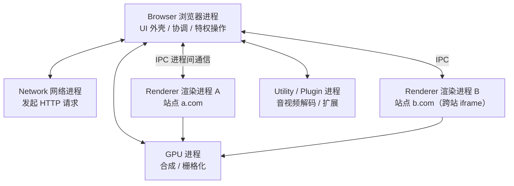
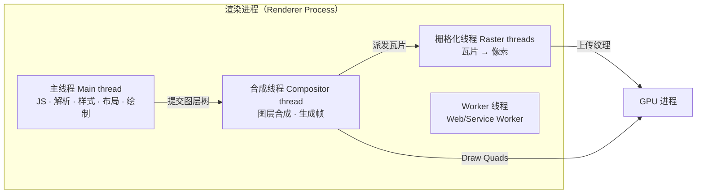

# 01 · 浏览器多进程架构（Browser Multi-Process Architecture）

> 现代浏览器不是"一个程序"，而是一堆各司其职的进程协作的操作系统级应用。理解进程/线程划分，是理解渲染、事件循环、安全沙箱的地基。

## 📖 知识讲解

早期浏览器是**单进程**的：一个标签页崩溃 → 整个浏览器挂掉；一个插件卡死 → 所有页面卡死。现代 Chrome/Edge 采用**多进程架构（multi-process architecture）**，把不同职责拆到独立进程，用**进程隔离**换取稳定性与安全性。

### 核心进程（Chrome 为例）

| 进程 | 数量 | 职责 |
|------|------|------|
| **Browser 浏览器进程** | 1 个 | 主进程。管理地址栏、书签、前进后退等 UI（"chrome" 外壳），协调其它进程；负责网络请求、文件访问等**特权操作** |
| **Renderer 渲染进程** | 每个站点 1 个（Site Isolation） | 把 HTML/CSS/JS 变成可交互页面。**所有页面内容都在这里跑**，被严格沙箱隔离，无法直接访问文件系统 |
| **GPU 进程** | 1 个 | 处理来自各进程的 GPU 任务（合成、栅格化），与页面隔离 |
| **Network 网络进程** | 1 个 | 发起网络请求（从 Browser 进程中独立出来） |
| **Plugin / Utility 进程** | 多个 | 插件、音视频解码、扩展等辅助任务 |

> 权威依据：Chrome 开发者文档《Inside look at modern web browser》Part 1 — Browser / Renderer / GPU / Plugin 四类核心进程，一个渲染进程一个站点（Site Isolation）。

### 为什么要多进程？三大收益

1. **稳定性（Stability）**：一个标签页崩溃只影响自己，不会拖垮整个浏览器。
2. **安全性（Security）**：操作系统可对进程做权限限制。处理不可信网页内容的渲染进程被**沙箱化（sandbox）**，不能随意读写文件。
3. **站点隔离（Site Isolation）**：跨站 iframe 用独立渲染进程，防止跨域数据窃取，抵御 Meltdown / Spectre 这类利用 CPU 漏洞的旁路攻击。

代价：进程之间不共享内存，每个渲染进程都要有一份自己的 JS 引擎等基础设施，**更费内存**。所以 Chrome 有"进程数上限"策略，内存吃紧时会让同站多个标签共用一个渲染进程。

### 渲染进程内部的线程（关键！）

渲染进程是多线程的，前端性能问题几乎都和"**主线程**"有关：

- **主线程（Main thread）**：跑 JS、解析 HTML/CSS、计算样式、布局（Layout）、绘制（Paint）。**它是单线程的**——JS 和渲染抢同一个线程，这正是"JS 会卡住页面渲染"的根因。
- **合成线程（Compositor thread）**：管理图层合成、生成帧，独立于主线程，因此"只改合成属性的动画"能不卡主线程。
- **栅格化线程（Raster threads）**：把图层瓦片（tiles）转成 GPU 内存里的像素。
- **Worker 线程**：运行 Web Worker / Service Worker 的 JS，不阻塞主线程。

## 🔄 原理图

### 进程关系总览



### 渲染进程内部线程分工



## 💻 代码说明 · 观察进程与线程

浏览器自带工具即可"看见"这套架构，无需写代码：

1. **Chrome 任务管理器**：菜单 → 更多工具 → 任务管理器（Shift+Esc）。可看到每个标签页、每个扩展、GPU 进程各占一行，各自的内存/CPU。
2. **验证站点隔离**：打开一个含**跨站 iframe** 的页面，任务管理器里会出现两个渲染进程（主页面一个、iframe 一个）。
3. **主线程被 JS 阻塞**：在控制台跑下面这段死循环，会发现页面**完全卡死**（点击、滚动都无响应）——因为 JS 和渲染共用主线程：

```js
// ⚠️ 演示用：主线程被独占 3 秒，页面在这期间完全无法响应
const end = Date.now() + 3000;
while (Date.now() < end) {} // 忙等，霸占主线程
console.log('主线程终于空出来了');
```

把它换成 Web Worker 里跑，页面就不会卡——这就是多线程的意义。

## ▶️ 运行方式

- 打开 Chrome/Edge，`Shift+Esc` 打开任务管理器观察进程。
- 控制台粘贴上面的死循环片段，感受主线程阻塞。
- 地址栏输入 `chrome://process-internals/` 查看站点隔离细节。

## ⚠️ 常见坑 / 最佳实践

- **"JS 是单线程"更准确的说法**：是"渲染进程的**主线程**一次只能干一件事"。浏览器整体是多进程多线程的。
- **别在主线程做重计算**：大循环、复杂 JSON 解析、加解密应放到 **Web Worker**，否则页面卡顿掉帧。
- **进程多 ≠ 一定更快**：进程隔离带来内存开销，移动端/低配设备会退化为同站共享进程。
- **扩展也是进程**：某些扩展常驻内存/CPU，排查卡顿时先看任务管理器。

## 🔗 官方文档

- [Inside look at modern web browser (Part 1) - 进程架构](https://developer.chrome.com/blog/inside-browser-part1)
- [Inside look at modern web browser (Part 3) - 渲染进程线程](https://developer.chrome.com/blog/inside-browser-part3)
- [进程模型与站点隔离 - Chromium 文档](https://www.chromium.org/developers/design-documents/process-models/)
- [Site Isolation - web.dev](https://web.dev/articles/site-isolation)
