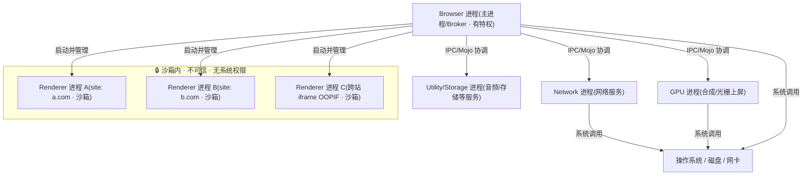
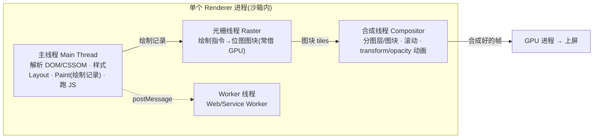
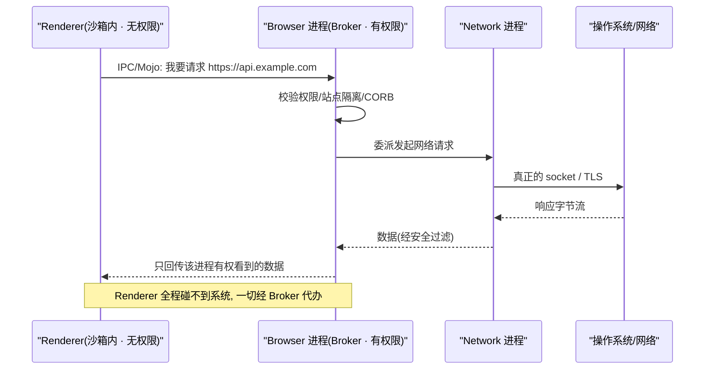

# 01 · 浏览器多进程架构（Browser Architecture）

> 现代浏览器不是一个进程，而是一整套协作的进程集群：一个 Browser 主进程居中调度，多个 Renderer 进程各自渲染一个站点，再加上 GPU、Network、Utility 等专职进程。多进程换来的是稳定性、安全性与并行性——一个标签页崩了，不拖垮整个浏览器。

## 📖 知识讲解

### 为什么从单进程走向多进程

早期浏览器（含早期 IE、老 Firefox）把 UI、渲染、网络、JS 引擎、插件全塞进一个进程。三大问题绕不开：

- **稳定性**：任一网页触发崩溃或死循环，整个浏览器连同其它标签页一起挂掉。
- **安全性**：渲染引擎要解析来自任意网站的不可信 HTML/CSS/JS，一旦被攻破就等于直接拿到系统权限。
- **性能**：所有工作挤在一个进程里，无法真正利用多核，一个慢标签页会卡住全部。

Chrome 2008 年用**多进程架构**给出答案：把不同职责拆进彼此隔离的进程，用**操作系统的进程边界**当作故障边界与安全边界。一个 Renderer 崩溃只表现为"喔，此网页无法打开"，其它标签页安然无恙。

### Chrome 的主要进程类型

- **Browser 进程（主进程 / Broker）**：浏览器的大脑与唯一"特权"进程。负责地址栏、书签、前进后退等浏览器 UI（chrome UI），管理权限、账号，并**协调、启动、销毁所有其它进程**。它是唯一能自由访问文件系统与系统资源的进程，其它进程要碰系统资源都得通过它代办。
- **Renderer 进程（渲染进程）**：把 HTML/CSS/JS 变成你看到的像素。内部跑 **Blink 渲染引擎 + V8 JavaScript 引擎**。**每个站点（site）通常一个独立 Renderer**（见站点隔离），且被**沙箱**牢牢关住——它不可信，所以不给它任何直接的系统权限。
- **GPU 进程**：统一处理来自各 Renderer 与浏览器 UI 的 GPU 任务（合成、光栅化、上屏）。独立出来一是隔离 GPU 驱动的不稳定/漏洞，二是把 GPU 访问集中管理。
- **Network 进程（网络服务）**：服务化（Servicification）后从 Browser 进程独立出来，专职 HTTP/HTTPS、DNS、缓存、Cookie 读写、TLS。独立后网络栈崩溃不牵连主进程，也便于沙箱化。
- **Utility 进程**：承载各类"服务"，如音频、Storage Service、数据解码、CORS 处理等。Network、Storage 本质都是跑在 Utility 类型进程里的服务。
- **Storage 进程 / 服务**：管理 IndexedDB、Cache Storage、LocalStorage 等持久化。
- **Plugin / Extension 进程**：插件（如已淘汰的 Flash PPAPI）、扩展相关逻辑各自隔离运行。

> 一句话记忆：**Browser 进程有特权、被信任；Renderer 进程无特权、不可信、被沙箱关着**。安全模型的核心就是这条信任边界。

### 站点隔离 Site Isolation

早期 Chrome 只做到"每个 tab 一个进程"，但同一进程里仍可能混入跨站 iframe。**Spectre / Meltdown（2018）** 这类**推测执行侧信道攻击**证明：只要恶意代码和敏感数据在**同一地址空间**，就有可能越过 JS 的逻辑边界把数据读出来。

**站点隔离**把安全边界升级为**进程边界**：

- **每个 site（注意是 site 而非 origin，按 eTLD+1 划分，如 `https://example.com`）独占一个 Renderer 进程**。
- **跨站 iframe** 被拆到**独立的 Renderer 进程**里渲染（Out-of-Process iframes，OOPIF）。
- 敏感数据（另一个站点的响应体）**根本不会进入**你这个恶意站点的进程内存，Spectre 想读也无从读起。
- 配合 **CORB / ORB（跨站资源读取拦截）** 从网络层就拦住不该给这个进程的数据。

代价是进程更多、内存更高，所以 Chrome 会做进程复用与降级策略（见"取舍"）。桌面端默认全量开启，移动端按内存能力分级。

### Renderer 进程内部的线程模型

一个 Renderer 进程内是**多线程**协作，重点理解主线程为什么是瓶颈：

- **主线程（Main Thread）**：几乎干了所有活——解析 HTML 构建 DOM、算 CSSOM/样式、**Layout（布局）**、**Paint（生成绘制指令 / 绘制记录）**，以及**执行 JavaScript**。JS 与渲染都在这条线程上，所以**长任务 JS 会阻塞渲染**，掉帧就是这么来的。
- **合成线程（Compositor Thread）**：独立于主线程。把页面分成图层（layers）与图块（tiles），处理滚动与 `transform`/`opacity` 动画。只要动画能在合成线程完成，就算主线程忙也能顺滑滚动。
- **光栅线程（Raster / Rasterization Threads）**：把绘制指令真正光栅化成位图图块，通常一组线程并行，常借助 GPU。
- **Worker 线程**：`Web Worker` / `Service Worker` 跑在独立线程，做 CPU 密集或后台任务，不阻塞主线程。

主线程发出绘制记录 → 光栅线程出图块 → 合成线程把图块合成帧交给 GPU 进程上屏。合成/光栅这条路能绕开主线程，正是"只用 `transform`/`opacity` 做动画最省"的底层原因（详见回流重绘模块）。

### 沙箱 Sandbox 机制

Renderer 是**不可信**的，因此运行在**操作系统级沙箱**里：不能直接读写文件、不能直接发网络请求、不能直接调用大多数系统调用。它想干任何"实事"，都得通过 **IPC（进程间通信，Chromium 里主要是 Mojo）** 向 Browser 进程（Broker）**请求代办**：

```
Renderer（无权限·沙箱内） --IPC/Mojo--> Browser（Broker·有权限） --> 操作系统 / 磁盘 / 网络
```

这样即便攻击者攻破了 Renderer，也被沙箱困在里面，拿不到系统权限；要造成真正危害还得再打穿 Browser 进程这道防线（沙箱逃逸），门槛陡增。**站点隔离 + 沙箱**是 Chrome 安全模型的两根支柱。

### 进程模型的取舍与复用策略

多进程不是免费的——**每个进程有独立内存**，V8/Blink 的基础设施在每个 Renderer 里都要各来一份，进程一多内存开销显著。Chrome 因此在"隔离度"与"内存"之间动态权衡：

- **进程数上限**：Chrome 设有 Renderer 进程数量软上限（与机器内存相关）。超过后**同站点的多个标签会复用同一个 Renderer 进程**。
- **进程模型可切换**：`process-per-site-instance`（默认）、`process-per-site`、`process-per-tab`、`single-process`（仅调试用）。默认按"站点实例"分配，兼顾隔离与开销。
- **内存不足降级**：低内存设备（尤其 Android）会放宽隔离粒度、减少进程数以保可用性。
- **进程回收**：后台不活跃、内存吃紧时，Chrome 会冻结甚至丢弃（discard）后台标签页的进程，回到前台再重建。

## 🔄 流程图 / 原理图

### 图 1 · Chrome 进程全景与信任边界



### 图 2 · Renderer 进程内部的线程分工



### 图 3 · 沙箱下 Renderer 请求系统资源的 IPC 流程



## 💻 代码说明 / 观察说明

本模块是**纯原理文档，没有可运行的 demo**。理解架构最好的方式是**直接观察真实浏览器进程**。以下入口在 Chrome / Edge（Chromium 内核）中亲手验证：

- **`chrome://process-internals`**：查看站点隔离（Site Isolation）状态、每个进程绑定了哪些站点（SiteInstance）、跨站 iframe 是否 OOPIF。看架构的第一站。
- **浏览器任务管理器（`Shift + Esc`，或菜单 → 更多工具 → 任务管理器）**：逐进程列出 Browser、GPU、Network、每个标签/扩展的 Renderer，及各自的内存、CPU、进程 ID。可右键勾选更多列（如"进程 ID""GPU 内存"）。**打开几个不同网站的标签，观察它们的 PID 是否不同**，直观感受站点隔离。
- **`chrome://discards`**：查看各标签页的进程状态（活跃 / 冻结 / 已丢弃），可手动触发 discard，观察后台进程的回收与重建。
- **`chrome://gpu`**：GPU 进程的能力、硬件加速与合成状态。
- **`chrome://memory-internals` / `about:memory`**：更细的分进程内存剖析。

**动手小实验**：打开任务管理器 → 新开三个标签分别访问三个不同站点 → 看到三个独立 Renderer（PID 各异）；再打开同一站点的第二个标签 → 观察它是否**复用**了同一进程（进程复用策略）；最后在某个标签控制台执行 `while(true){}` 死循环，看到**只有那一个 Renderer 卡死 / 被终止**，其余标签照常——这就是故障隔离。

## ▶️ 运行方式

**本模块以文档为主，无需 `npm`、无 demo 页面。** 学习步骤：

1. 通读上文「知识讲解」，建立"进程职责 + 信任边界 + 线程分工"的整体心智模型。
2. 打开 Chrome/Edge，按「观察说明」依次访问 `chrome://process-internals`、任务管理器（`Shift+Esc`）、`chrome://discards`，把文字对应到真实进程上。
3. 做那个「动手小实验」，亲眼确认站点隔离与故障隔离。
4. 带着"主线程是唯一瓶颈""合成 / 光栅可绕开主线程"两个结论，进入后续的渲染流水线、回流重绘、合成层模块。

## ⚠️ 常见坑 / 最佳实践

- **别把 Renderer 当成"整个浏览器"**：你的 JS 只活在一个沙箱 Renderer 里，读写文件、发请求、访问 Cookie 都是 Browser / Network 进程在**代办**，天然有 IPC 开销和权限校验。
- **"每个 tab 一个进程"是过时说法**：正确说法是**按 site 划分**，还会因进程上限而**复用**；跨站 iframe 会被拆到独立进程（OOPIF）。
- **site ≠ origin**：站点隔离按 **eTLD+1** 划分（`a.example.com` 与 `b.example.com` 同 site），而同源策略按 origin（scheme + host + port）。二者边界不同，别混。
- **主线程是稀缺资源**：DOM、样式、布局、绘制记录、JS **全挤在主线程**。长任务 JS 直接阻塞渲染与输入响应——这正是要拆 Web Worker、用 `requestIdleCallback`、切分长任务的根因。
- **动画尽量走合成线程**：`transform`/`opacity` 可只在合成线程完成，即便主线程繁忙也不掉帧；改 `top/left/width` 会拽回主线程做布局。
- **进程多 = 内存高**：多进程用内存换稳定与安全。低内存设备上 Chrome 会降级隔离粒度，别假设所有环境都全量站点隔离。
- **调试进程崩溃**：用任务管理器定位是哪个进程（Renderer / GPU / Network）挂了；GPU 相关花屏 / 黑屏优先查 `chrome://gpu`，可尝试关硬件加速对比定位。

## 🔗 官方文档

- [Inside look at modern web browser (Part 1)：架构与进程 - Chrome for Developers](https://developer.chrome.com/blog/inside-browser-part1)
- [Inside look at modern web browser (Part 2)：导航发生了什么 - Chrome for Developers](https://developer.chrome.com/blog/inside-browser-part2)
- [Inside look at modern web browser (Part 3)：Renderer 进程内部 - Chrome for Developers](https://developer.chrome.com/blog/inside-browser-part3)
- [Inside look at modern web browser (Part 4)：合成与输入 - Chrome for Developers](https://developer.chrome.com/blog/inside-browser-part4)
- [Site Isolation 站点隔离 - Chromium 官方文档](https://www.chromium.org/Home/chromium-security/site-isolation/)
- [Chrome 沙箱设计（Sandbox）- Chromium 官方文档](https://chromium.googlesource.com/chromium/src/+/main/docs/design/sandbox.md)
- [进程模型与站点隔离（Process Model）- Chromium 官方文档](https://www.chromium.org/developers/design-documents/process-models/)
- [Web Workers API - MDN](https://developer.mozilla.org/zh-CN/docs/Web/API/Web_Workers_API)
- [Same-origin policy 同源策略 - MDN](https://developer.mozilla.org/zh-CN/docs/Web/Security/Same-origin_policy)
