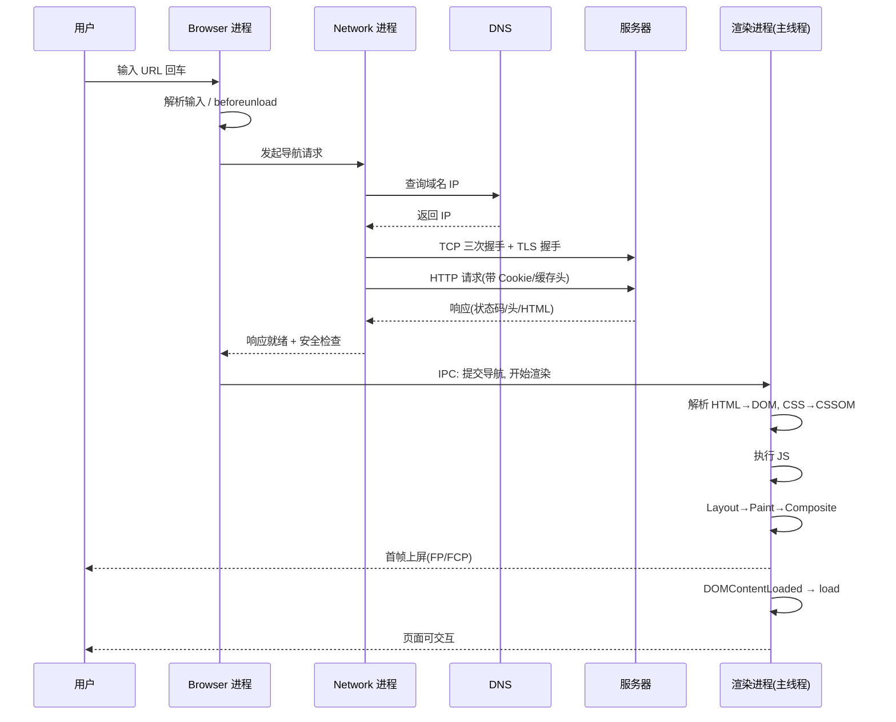
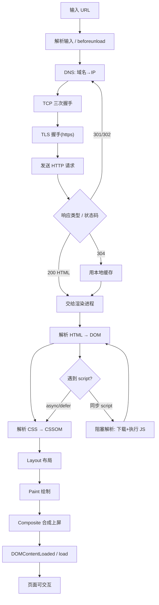

# 02 · 从输入 URL 到页面展示（URL to Render）

> "在地址栏输入 URL 到看到页面"这一路发生了什么？这是前端面试的"终极串讲题"，把 DNS、TCP/TLS、HTTP、导航、渲染、事件循环全串起来。

## 📖 知识讲解

整个过程可分为**四大阶段**：导航（Navigation）→ 网络（Network）→ 解析渲染（Parse & Render）→ 交互（Interaction）。前两步主要在 **Browser/Network 进程**，后两步在**渲染进程主线程**。

### 一、导航开始（Browser 进程）

1. **处理输入**：判断你输入的是搜索词还是 URL；补全协议。
2. **beforeunload**：若当前页有 `beforeunload` 监听，先询问是否离开。
3. **URL 解析**：拆出协议、域名、端口、路径、查询串、哈希。

### 二、网络请求（Network 进程）

4. **DNS 解析**：域名 → IP。查询顺序：浏览器缓存 → 操作系统缓存 → hosts → 本地 DNS 服务器（递归查询根/顶级/权威域名服务器）。
5. **建立 TCP 连接**：三次握手（SYN → SYN-ACK → ACK）。
6. **TLS 握手**（https）：协商加密套件、交换证书、生成会话密钥。
7. **发送 HTTP 请求**：带上 Cookie、缓存校验头（`If-None-Match`/`If-Modified-Since`）等。
8. **服务器响应**：返回状态码 + 响应头 + HTML 主体。此处会走**缓存判定**（304 用本地缓存）、**重定向**（301/302 则回到第 4 步）。
9. **响应处理**：根据 `Content-Type` 决定如何处理（HTML 交给渲染进程）；安全检查（Safe Browsing、CORB）。

### 三、交给渲染进程（渲染开始）

10. Browser 进程通过 IPC 通知渲染进程"开始渲染"，把数据流"喂"给它。
11. **构建 DOM**：主线程边收字节边解析 HTML → DOM 树。
12. **子资源加载**：遇到 `<link>`/`<script>`/``，**预加载扫描器（preload scanner）**提前并行下载。
13. **构建 CSSOM**：解析 CSS。
14. **执行 JS**：遇到没有 `async`/`defer` 的 `<script>` 会**阻塞解析**，等下载 + 执行完再继续。
15. **渲染流水线**：Style → Layout → Paint → Composite（详见模块 03），像素上屏。

### 四、可交互

16. 首帧绘制后触发 `DOMContentLoaded`（DOM 就绪）、`load`（含所有子资源）。主线程开始处理输入事件，页面可交互。

## 🔄 原理图

### 全流程时序（大流程图）

### 一张流程图记全过程

## 💻 关键点说明

- **为什么 script 会阻塞解析？** JS 可能 `document.write` 改变 DOM，也可能读取样式，所以默认同步执行。用 `defer`（延到 DOM 解析完、按序执行）或 `async`（下载完立即执行、不保序）避免阻塞。
- **CSS 阻塞渲染但不阻塞解析**：CSSOM 没建好不能进入 Layout，所以 CSS 是"渲染阻塞资源"。放 `<head>` 里尽早下载。
- **预加载扫描器**：主线程解析被 JS 卡住时，另一个轻量解析器会先扫一遍 HTML，把图片/CSS/JS 提前并行下载，缩短总时长。

## ▶️ 运行方式

- 打开任意网站，F12 → **Network 面板**：观察 DNS、连接、TTFB、下载各段耗时（点单个请求看 Timing）。
- F12 → **Performance 面板**录制一次加载：能看到 Parse HTML、Recalculate Style、Layout、Paint、Composite 各阶段。
- `chrome://net-export/` 可导出网络日志细看 DNS/连接过程。

## ⚠️ 常见坑 / 最佳实践

- **减少阻塞渲染资源**：关键 CSS 内联、非关键 CSS 异步；JS 尽量 `defer`。
- **DNS 预解析 / 预连接**：`<link rel="dns-prefetch">`、`<link rel="preconnect">` 提前完成 DNS/TCP/TLS。
- **HTTP 缓存 + CDN**：命中 304 或强缓存可跳过大量网络耗时（见模块 09）。
- **别把首屏依赖藏在同步 JS 里**：会拉长白屏时间（FCP 变差）。

## 🔗 官方文档

- [Inside look at modern web browser (Part 2) - 导航](https://developer.chrome.com/blog/inside-browser-part2)
- [Populating the page: how browsers work - MDN](https://developer.mozilla.org/en-US/docs/Web/Performance/Guides/How_browsers_work)
- [Critical rendering path - web.dev](https://web.dev/articles/critical-rendering-path)
- [Preload scanner - web.dev](https://web.dev/articles/preload-scanner)
