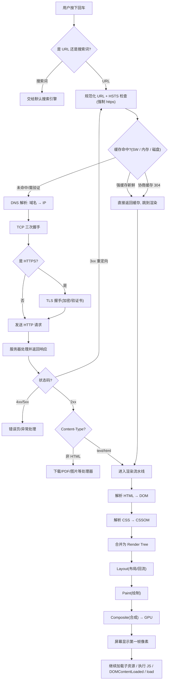
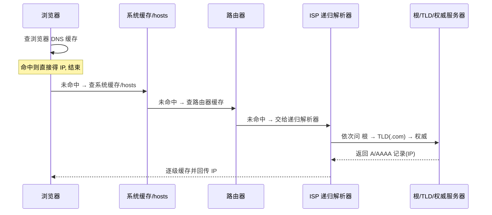
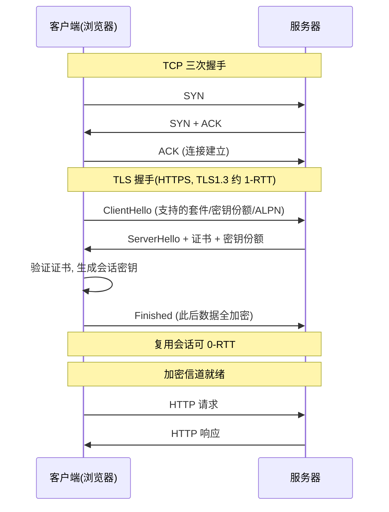
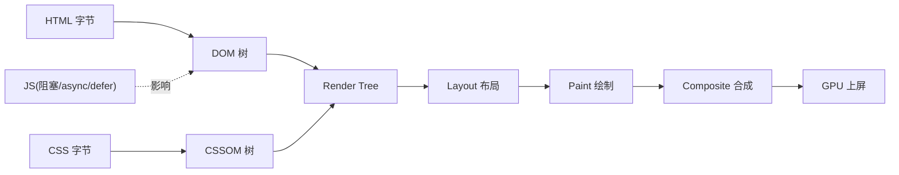

# 02 · 从 URL 到页面呈现（URL to Render）

> 在地址栏敲下回车到屏幕出现第一个像素，浏览器要走完「URL 解析 → 缓存 → DNS → 建连 → 请求响应 → 解析渲染 → 合成上屏」一整条链路。这是前端面试最经典的一道大题，本文按阶段讲透，并给一张贯穿全程的大流程图。

## 📖 知识讲解

### 阶段 0 · URL 解析与处理

按下回车，浏览器先判断你输入的是**搜索词还是 URL**：不含合法主机/协议、含空格的一般当搜索词丢给默认搜索引擎；像 URL 的则补全协议（省略 `https://` 时现代浏览器默认尝试 HTTPS），并做 IDN/百分号编码等规范化。

关键一步是 **HSTS 检查**：浏览器内置一份 HSTS 预加载列表 + 本地记录，命中的域名会在**发出任何请求前**就把 `http://` 强制改写成 `https://`，根本不给明文请求出门的机会。随后解析出 `scheme / host / port / path / query / fragment` 各部分。若当前页有 `beforeunload` 监听，还会先询问是否离开。

### 阶段 1 · 缓存检查（命中即返回，链路提前结束）

真正发请求前，浏览器按顺序查一路缓存，任一命中且新鲜就直接返回，后面 DNS/建连全部省掉：

1. **Service Worker**：若注册了 SW，`fetch` 事件先交给它，可从 Cache Storage 返回或自定义策略（离线优先/网络优先）。
2. **HTTP 缓存（Memory Cache → Disk Cache）**：内存缓存极快但随页面关闭失效，磁盘缓存持久。依据 `Cache-Control` / `Expires` 判断**强缓存**是否新鲜；未过期直接用（`from memory/disk cache`）。
3. **协商缓存**：强缓存过期后带 `If-None-Match`(ETag) / `If-Modified-Since` 询问服务器，`304 Not Modified` 则复用本地副本。

> 缓存体系的完整细节在模块 `09-browser-cache-system` 展开，这里只讲它在主链路中的位置。

### 阶段 2 · DNS 解析（域名 → IP）

缓存没命中，需要知道服务器 IP。DNS 也是**逐级缓存**的：

浏览器 DNS 缓存 → 操作系统缓存 / `hosts` 文件 → 本地路由器缓存 → ISP 的**递归解析器**。递归解析器若也没有，就从**根域名服务器**问起 → **TLD 服务器**（如 `.com`）→ **权威域名服务器**，最终拿到 A/AAAA 记录里的 IP。现代浏览器还可能走 **DoH（DNS over HTTPS）** 加密解析，并用 `<link rel="dns-prefetch">` 提前解析。

### 阶段 3 · 建立连接（TCP 三次握手 + TLS 握手）

拿到 IP，与服务器建立 **TCP 连接**：三次握手（SYN → SYN-ACK → ACK）确认双方收发能力。HTTPS 还要在 TCP 之上做 **TLS 握手**：协商加密套件、校验证书、交换密钥，之后数据全程加密。TLS 1.3 把握手压缩到 **1-RTT**（会话复用可 0-RTT）。若走 **HTTP/2** 会在 TLS 的 ALPN 阶段协商出来，多路复用同一连接；**HTTP/3** 则基于 QUIC(UDP)，把传输层与 TLS 合并，进一步降延迟。

### 阶段 4 · 发送 HTTP 请求，服务器处理并响应

连接就绪，浏览器发出请求行 + 请求头（`Host`、`User-Agent`、`Accept`、`Cookie` 等）。服务器（可能经过 CDN、反向代理、后端应用、数据库）处理后返回响应：

- **状态码**：`2xx` 成功、`3xx` 重定向、`4xx` 客户端错误、`5xx` 服务端错误。
- **3xx 重定向**：`301/302/307/308` 时浏览器读 `Location` 头**重新发起请求**，链路从阶段 0/1 再走一遍（重定向多会明显拖慢首屏）。
- 响应头里的 `Content-Type`、`Content-Encoding`(gzip/br)、`Cache-Control`、`Set-Cookie` 决定后续处理。

### 阶段 5 · 接收响应，按 Content-Type 分派

浏览器读 `Content-Type` 决定怎么处理这坨字节：`text/html` 交给渲染引擎解析；`application/pdf`、图片、下载类各走各的处理器。同时做安全检查（Safe Browsing、跨源读取拦截）。是 HTML，就进入渲染流水线。

### 阶段 6 · 渲染流水线（概貌）

拿到 HTML 字节流后，渲染引擎（Blink）大致走这几步：

1. **解析 HTML → 构建 DOM 树**：边下载边解析；**预加载扫描器**会提前扫出 `<link>`/`<script>`/`` 并行下载。
2. **解析 CSS → 构建 CSSOM 树**：CSS 是**渲染阻塞**资源，CSSOM 没就绪不会进入渲染。
3. **JavaScript 的影响**：`<script>` 默认**阻塞解析**（要下载+执行，可能还阻塞在 CSSOM 后）；`async` 下载完立即执行（不保证顺序）；`defer` 延到 DOM 解析完、`DOMContentLoaded` 前按序执行。
4. **合并为 Render Tree（渲染树）**：DOM + CSSOM 合并，剔除 `display:none` 等不可见节点。
5. **Layout（布局/回流）**：计算每个节点的几何位置与尺寸。
6. **Paint（绘制）**：把节点转成一条条绘制指令，填充像素到各图层。
7. **Composite（合成）→ GPU 上屏**：合成线程把图层交给 GPU 合成成最终画面，显示器刷新出第一帧。

> 渲染流水线的每一步细节（DOM/CSSOM 构建、分层、栅格化、合成线程）在模块 `03-rendering-pipeline` 深入，回流与合成优化见 `04`、`05`，这里只勾勒概貌，便于把它嵌进整条主链路。

### 阶段 7 · 关键渲染路径、首屏与后续加载

**关键渲染路径（Critical Rendering Path, CRP）**指从字节到首帧像素、最短必经的那条路：HTML→DOM、CSS→CSSOM、合并→Layout→Paint。优化首屏就是**缩短 CRP**：减少关键资源数、体积和往返。首帧之后，浏览器继续加载图片、懒加载资源、执行剩余 JS，触发 `DOMContentLoaded`（DOM 就绪）和 `load`（所有资源就绪），页面进入可交互状态。

### 阶段 8 · 连接管理与页面卸载

HTTP/1.1 默认 **`Connection: keep-alive`** 复用 TCP 连接，避免每个资源都重新握手；HTTP/2/3 更进一步多路复用。用户离开页面时触发 `beforeunload` / `pagehide` / `unload`，可用 `navigator.sendBeacon` 上报埋点；连接进入 idle 池等待复用或按超时关闭。

## 🔄 流程图 / 原理图

### 图 1 · 贯穿全程大流程图（从 URL 输入到像素上屏）

### 图 2 · DNS 逐级解析时序

### 图 3 · 连接建立时序（TCP 三次握手 + TLS 握手）

### 图 4 · 渲染流水线概貌（详见模块 03）

## 💻 代码说明 / 观察说明

本模块是**纯原理文档，无 demo 代码**，用 DevTools 亲手观察各阶段耗时最有体感：

- **Network 面板** → 点任一请求 → **Timing** 标签，可看到分解耗时：
  - `Queueing` / `Stalled`：排队与连接复用等待
  - `DNS Lookup`：DNS 解析耗时（缓存命中则为 0）
  - `Initial connection` + `SSL`：TCP + TLS 握手耗时
  - `Request sent` / `Waiting (TTFB)`：请求发送到首字节到达（服务器处理时间）
  - `Content Download`：响应体下载
- 命中缓存时 Size 列显示 `(memory cache)` / `(disk cache)`，Timing 几乎为 0，直观印证「阶段 1 命中即返回」。
- **Performance 面板**录制一次刷新，可看到主线程上的 `Parse HTML`、`Recalculate Style`、`Layout`、`Paint`、`Composite Layers` 各段。
- **性能指标**：关注 `TTFB`、`FCP`（首次内容绘制）、`LCP`（最大内容绘制），对应「首屏」体验。

## ▶️ 运行方式

以文档理解为主，配合浏览器实测：

1. 打开任意网站，F12 → **Network**，勾选 `Disable cache` 刷新一次，逐项查看 Timing 各阶段耗时。
2. 取消勾选 `Disable cache` 再刷新，对比：多数静态资源变成 `from cache`，DNS/连接耗时消失 —— 体会缓存对链路的短路。
3. 地址栏输入 `chrome://net-internals/#dns` 可查看/清空浏览器 DNS 缓存；`chrome://net-export/` 可导出完整网络日志细看 DNS/连接。
4. 访问一个会重定向的地址（如 `http://` 版被 301 到 `https://`），在 Network 里看到两条请求，理解 3xx 回到链路起点。
5. Performance 录制刷新，观察渲染流水线各阶段落在主线程的时间线。

## ⚠️ 常见坑 / 最佳实践

- **减少重定向**：每次 3xx 都要重新走一遍 DNS/建连/请求，串行重定向对首屏杀伤大；配置好 HSTS 预加载可省掉 http→https 那一跳。
- **善用缓存与 CDN**：合理设置 `Cache-Control` / `ETag`，把静态资源就近 CDN，直接短路掉 DNS 之后的大半链路。
- **提前建连**：用 `<link rel="preconnect">` / `dns-prefetch` 对关键第三方域名提前做 DNS + TCP + TLS，把握手成本藏在解析前。
- **别让 JS 阻塞渲染**：非关键脚本加 `defer`/`async`，关键 CSS 内联、非关键 CSS 异步加载，缩短关键渲染路径；别把首屏依赖藏在同步 JS 里。
- **升级协议**：HTTP/2 多路复用消除队头阻塞，HTTP/3(QUIC) 进一步降握手延迟；TLS 1.3 减少 RTT。
- **首字节慢多半在后端**：TTFB 高优先排查服务器处理与数据库，而非前端资源。
- **面试答题结构**：按「解析 URL → 缓存 → DNS → 建连 → 请求响应 → 渲染 → 合成上屏」分阶段说，每阶段点出关键机制（HSTS、协商缓存、三次握手、CRP），比流水账更得分。

## 🔗 官方文档

- [MDN · Populating the page: how browsers work（浏览器工作原理）](https://developer.mozilla.org/en-US/docs/Web/Performance/Guides/How_browsers_work)
- [MDN · 关键渲染路径 Critical rendering path](https://developer.mozilla.org/en-US/docs/Web/Performance/Guides/Critical_rendering_path)
- [web.dev · 渲染性能（Rendering performance）](https://web.dev/articles/rendering-performance)
- [web.dev · Preload scanner（预加载扫描器）](https://web.dev/articles/preload-scanner)
- [Chrome for Developers · Inside look at modern web browser（Part 2 导航）](https://developer.chrome.com/blog/inside-browser-part2)
- [MDN · HTTP 缓存](https://developer.mozilla.org/zh-CN/docs/Web/HTTP/Guides/Caching)
- [MDN · HSTS（Strict-Transport-Security）](https://developer.mozilla.org/zh-CN/docs/Web/HTTP/Reference/Headers/Strict-Transport-Security)
