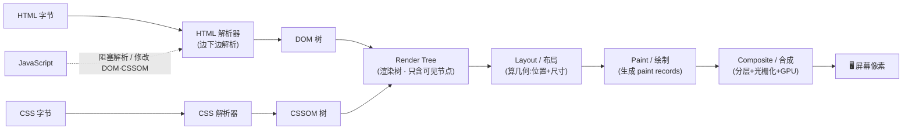
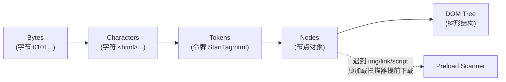
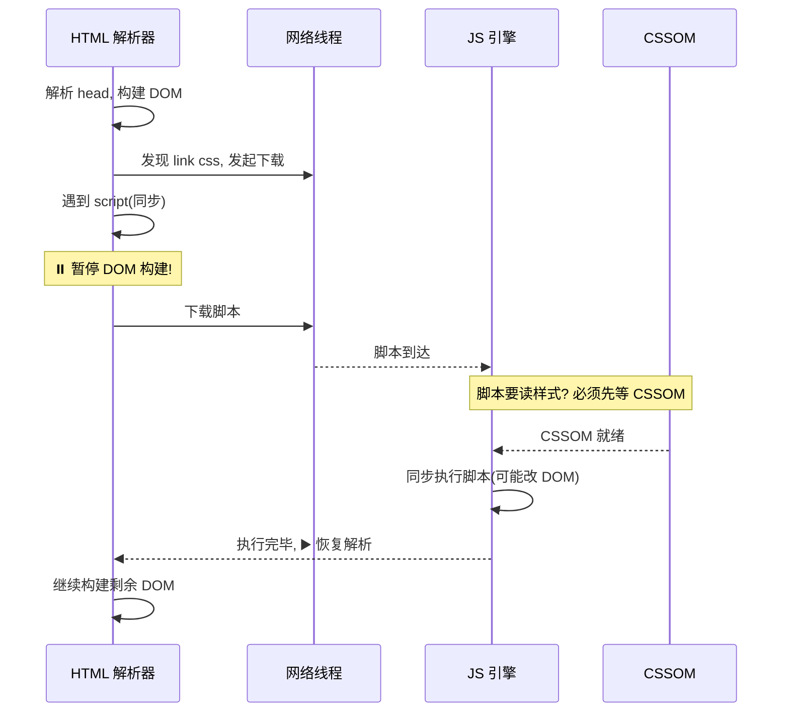
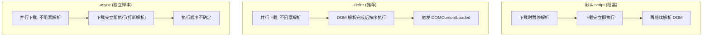

# 03 · 渲染流水线（Rendering Pipeline）

> 从一堆字节到屏幕上的像素，浏览器要走一条固定的流水线：**HTML → DOM，CSS → CSSOM，两者合并成 Render Tree，再经 Layout（布局）→ Paint（绘制）→ Composite（合成）上屏**。本模块讲透整条流水线的骨架，Layout/Paint/Composite 的细节留给模块 04、05。

## 📖 知识讲解

浏览器渲染进程（Renderer Process）拿到主线程从网络下载的 HTML 字节流后，会把它变成用户能看见的画面。这条从"数据"到"像素"的固定路径，就是**渲染流水线**，也叫**关键渲染路径（Critical Rendering Path, CRP）**。整条路径分六步。

### 1. 解析 HTML → 构建 DOM 树

浏览器无法直接理解 HTML 文本，需要逐层转换：

**字节（Bytes）→ 字符（Characters）→ 令牌（Tokens）→ 节点（Nodes）→ DOM 树**

- **字节 → 字符**：按响应头/`<meta charset>` 指定的编码（如 UTF-8）把字节解码成字符。
- **字符 → 令牌**：分词器（Tokenizer）按 HTML 规范把字符流切成 `<html>`、`<body>`、`<p>` 等开始/结束标签令牌。
- **令牌 → 节点 → DOM**：每个令牌生成一个节点对象，节点按标签的嵌套关系连成一棵**树**，这就是 **DOM（Document Object Model）**。它既是文档结构的内存表示，也是 JS 操作页面的 API。

关键点：**HTML 解析是"边下载边解析"的流式过程**，不必等整个文档下载完。解析器遇到 ``、`<link>`、`<script>` 等外部资源时，会交给网络线程去下载，自己继续往下解析。

**预加载扫描器（Preload Scanner）**：主解析器被脚本阻塞时（见下），浏览器还有一个轻量的"副解析器"——预加载扫描器，它抢先扫描后续 HTML，把 ``、`<link href>`、`<script src>` 等资源**提前发起下载**。这让下载与解析并行，大幅缩短加载时间。这也是为什么"把资源写在 HTML 里"比"用 JS 动态插入"更容易被提前发现。

### 2. 解析 CSS → 构建 CSSOM 树

与 HTML 类似，CSS 文本也经历 **字节 → 字符 → 令牌 → 节点 → CSSOM 树**。CSSOM（CSS Object Model）是一棵带**层叠与继承**关系的样式树：子节点继承父节点样式，再被更具体的规则覆盖。

**为什么 CSS 阻塞渲染？** 因为在样式完全确定前，浏览器不敢渲染——否则会出现"无样式内容闪烁（FOUC）"。所以 **CSSOM 必须构建完整才能进入渲染**，CSS 是**渲染阻塞（render-blocking）**资源。这就是"CSS 放 `<head>`、尽早下载"的根本原因：让 CSSOM 尽快就绪。

**选择器从右向左匹配**：面对 `.nav ul li a` 这样的选择器，引擎不是从 `.nav` 往下找，而是**从最右边的 key selector `a` 开始往左回溯**。因为符合最右单元的元素最少，从右往左能最快排除不匹配的元素。所以选择器越"右边越具体"越高效，避免过深、过于通用的后代选择器。

### 3. JavaScript 如何阻塞解析

`<script>`（无 `async`/`defer`）默认是**解析阻塞（parser-blocking）**的：

- HTML 解析器遇到 `<script>` 会**暂停 DOM 构建**，先下载（外链脚本）并**同步执行**脚本，执行完才继续解析。因为脚本可能 `document.write` 改变文档结构，浏览器不敢往下解析。
- 更隐蔽的一点：**脚本执行可能需要 CSSOM**。如果脚本要读取样式（如 `getComputedStyle`），浏览器必须**先等它前面的 CSS 下载并构建完 CSSOM，才能执行该脚本**。于是链条变成：**CSS 阻塞 JS，JS 阻塞 DOM 解析**。这就是"CSS 在前、又有同步脚本"时首屏变慢的元凶。

**`async` 与 `defer`**（仅对外链脚本有效）：

| 属性 | 下载 | 执行时机 | 是否阻塞 DOM 解析 | 执行顺序 |
| --- | --- | --- | --- | --- |
| 无（默认） | 立即，阻塞解析 | 下载完立即执行 | **是** | 按文档顺序 |
| `defer` | 并行下载，不阻塞 | **DOM 解析完成后**、`DOMContentLoaded` 前 | 否 | 按文档顺序 |
| `async` | 并行下载，不阻塞 | **下载完立即执行**（可能打断解析） | 下载不阻塞，执行时阻塞 | 谁先下载完谁先执行（乱序） |

口诀：**需要按顺序、依赖 DOM 的用 `defer`；相互独立的第三方脚本（统计、广告）用 `async`。**

### 4. 合并 DOM + CSSOM → Render Tree（渲染树）

渲染树只包含**页面上实际要显示的内容**。构建时遍历 DOM 可见节点，为每个节点匹配 CSSOM 中的样式：

- **排除不可见节点**：`<head>`、`<meta>`、`<script>` 等本就不渲染的节点，以及 `display: none` 的节点——它们**不在渲染树中**。
- **`visibility: hidden` 仍在渲染树里**（占位但不可见），`opacity: 0` 也在——只有 `display: none` 才彻底移除。
- **伪元素**（`::before`/`::after`）虽然不在 DOM 里，但会**进入渲染树**参与布局绘制。

结果是一棵"可见节点 + 计算后样式"的树，供后续布局使用。

### 5. Layout / Reflow：计算几何

有了渲染树（知道显示什么 + 什么样式），但还不知道**每个节点在视口里的确切位置和尺寸**。Layout（Chrome 也叫 Reflow）从渲染树根节点开始遍历，按**盒模型**计算每个节点的几何：宽高、坐标、边距。

- 输出是一个**盒模型盒子**，含精确的位置与大小。
- **相对单位需要在此换算成绝对像素**：`%`、`vw/vh`、`em/rem` 都要结合视口尺寸和父级尺寸算出 px。所以视口大小（`<meta name="viewport">`）会直接影响布局结果。
- 首次计算叫 **Layout**，后续因几何变化重新计算叫 **Reflow（回流）**——详见模块 04。

### 6. Paint：绘制成绘制指令

Layout 知道了"什么、在哪、多大"，但还没决定**画的先后与像素外观**。Paint 阶段把渲染树转成一系列**绘制指令（paint records）**：先画背景，再画边框、文字、阴影……严格遵守 CSS 的**绘制顺序（stacking / paint order）**。

复杂页面会被拆成**多个绘制层（layer）**分别绘制。哪些内容需要独立分层、`z-index` 与层叠上下文如何影响绘制顺序，是模块 05 的主题。这里只需知道：**Paint 产出的是"怎么画"的指令，不是最终像素。**

### 7. Composite：合成上屏

最后一步把绘制指令变成屏幕上的像素：

- **分层（Layer）与分块（Tile）**：合成线程把页面分成若干层、每层再切成小块 tile。
- **光栅化（Raster / Rasterization）**：把每个 tile 的绘制指令转成实际像素位图，通常**在 GPU 上完成**。
- **合成（Composite）**：合成线程（Compositor Thread）拿着各层光栅化好的 tile，按位置、层级、变换生成**合成帧（compositor frame）**，交给 GPU 显示。

关键优势：**合成发生在合成线程 + GPU，不占用主线程**。因此即便主线程被 JS 卡住，已经分好层的内容（如正在滚动、正在做 transform 动画的层）依然能流畅合成。

**只走合成、不碰 Layout/Paint 的属性**：`transform` 和 `opacity`。改这两个属性时，浏览器可以只让合成线程重新合成已有的层，**跳过昂贵的 Layout 和 Paint**——这就是"动画优先用 transform/opacity"的底层原因（模块 04、05 深入）。

### 关键渲染路径优化

优化 CRP 的核心是让首屏尽快出现，两个方向：

1. **减少关键资源数量与体积**：关键资源 = 阻塞首屏渲染的 CSS 和同步 JS。压缩、拆分、按需加载，把非关键 CSS/JS 异步化（`media` 查询、`defer`/`async`、动态加载）。
2. **缩短关键路径长度（往返次数）**：内联首屏关键 CSS、预连接/预加载关键资源、减少串行依赖，让浏览器少等几个 RTT。

> **本模块的定位**：讲清整条流水线的**骨架**。Layout 的回流细节、Paint/Composite 的分层机制，分别在 **04 回流重绘**、**05 合成层** 深入。

## 🔄 流程图 / 原理图

### 图 1 · 渲染流水线全景（主大图）



### 图 2 · DOM 树的构建（字节到节点树）



### 图 3 · 同步脚本如何阻塞解析（时序）



### 图 4 · async / defer / 默认脚本的执行时机对比



## 💻 代码说明

`index.html` 是一个免构建的单文件 demo：内联 CSS 放在 `<head>`（不阻塞地尽早构建 CSSOM），内联 JS 放在 `<body>` 尾部。页面提供一个按钮，点击后用浏览器原生 API 采集并展示流水线各阶段的"证据"。

关键代码片段：

```js
// 1. DOM 的存在与规模：统计整棵 DOM 树的节点数与深度
const total = document.getElementsByTagName('*').length;   // 所有元素节点数
function maxDepth(node) {                                   // DOM 树最大深度
  if (!node.children.length) return 1;
  return 1 + Math.max(...[...node.children].map(maxDepth));
}

// 2. CSSOM 的存在：document.styleSheets 就是构建好的 CSSOM 入口
const sheetCount = document.styleSheets.length;            // 样式表数量
let ruleCount = 0;
for (const sheet of document.styleSheets) {
  try { ruleCount += sheet.cssRules.length; } catch (e) {} // 跨域表读不到 cssRules
}

// 3. 渲染时机：Navigation Timing Level 2，各阶段相对 navigationStart 的耗时
const nav = performance.getEntriesByType('navigation')[0];
const domInteractive   = nav.domInteractive;              // DOM 解析完成、可交互
const domContentLoaded = nav.domContentLoadedEventEnd;    // DOMContentLoaded 结束
const loadEvent        = nav.loadEventEnd;                // load 完成(含子资源)
const fcp = performance.getEntriesByType('paint')
  .find(e => e.name === 'first-contentful-paint')?.startTime; // 首次内容绘制(FCP)
```

- **`document.styleSheets`** 直接暴露了 CSSOM——它证明 CSS 已被解析成结构化对象，而不只是文本。
- **`performance` Navigation Timing** 把"字节到达 → DOM 可交互 → DOMContentLoaded → load"的时间轴量化，让你直观看到**流水线各阶段的先后顺序**。
- **Paint Timing（FCP）** 标记"第一帧有意义内容出现在屏幕上"的时刻，正是 Layout→Paint→Composite 首次跑完的产物。

## ▶️ 运行方式

1. **直接双击 `index.html`**（或拖进浏览器），无需任何构建/服务器。
2. 点击页面上的 **"采集渲染流水线数据"** 按钮，查看 DOM 节点数、样式表/规则数、各 timing 数值。
3. 配合 DevTools 深入观察：
   - **F12 → Performance**：点录制并刷新页面，火焰图里能看到 `Parse HTML`、`Recalculate Style`（构建 CSSOM）、`Layout`、`Paint`、`Composite Layers` 一条条真实的流水线事件。
   - **F12 → 更多工具 → Rendering**：勾选 **Paint flashing** 看重绘区域，勾选 **Layer borders** 看合成层边界。
   - **F12 → Network**：把某个 `<script>` 从 `defer` 改成默认，对比 `DOMContentLoaded`（蓝线）出现的时机差异。

## ⚠️ 常见坑 / 最佳实践

- **CSS 放 `<head>` 尽早引入**：CSSOM 是渲染阻塞资源，越早构建完，首屏越早出现；避免用 `@import` 串行加载 CSS（多一个 RTT）。
- **JS 放 `<body>` 尾部或用 `defer`**：别让同步脚本卡住 DOM 构建。依赖 DOM、需保序的用 `defer`；独立第三方脚本用 `async`。
- **警惕"CSS 阻塞 JS 阻塞 DOM"链条**：`<head>` 里"CSS + 紧跟同步脚本"是首屏杀手，把脚本挪后或 `defer`。
- **避免超大 DOM**：节点数过多（一般建议 < 1500，深度 < 32，单节点子元素 < 60）会拖慢 DOM 构建、样式计算和布局。用虚拟列表、按需渲染。
- **选择器别写太深太泛**：`div > div > ul li a` 之类会加重样式匹配（从右向左回溯）成本，尽量用简短、语义化的 class。
- **动画走合成属性**：优先 `transform`/`opacity`，跳过 Layout/Paint（详见 04、05）。
- **首屏关键 CSS 可内联**，非关键 CSS 用 `media`/异步加载，缩短关键渲染路径。
- **善用预加载**：`<link rel="preload">` 关键字体/脚本，`preconnect` 关键第三方域，帮预加载扫描器和网络层提前工作。

## 🔗 官方文档

- [Inside look at modern web browser (Part 3) - Chrome for Developers](https://developer.chrome.com/blog/inside-browser-part3)
- [Critical rendering path - MDN](https://developer.mozilla.org/en-US/docs/Web/Performance/Guides/Critical_rendering_path)
- [Constructing the Object Model (DOM & CSSOM) - web.dev](https://web.dev/articles/critical-rendering-path/constructing-the-object-model)
- [Render-tree Construction, Layout, and Paint - web.dev](https://web.dev/articles/critical-rendering-path/render-tree-construction)
- [Populating the page: how browsers work - MDN](https://developer.mozilla.org/en-US/docs/Web/Performance/Guides/How_browsers_work)
- [Adding interactivity with JavaScript (async/defer) - web.dev](https://web.dev/articles/critical-rendering-path/adding-interactivity-with-javascript)
