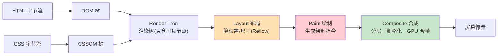
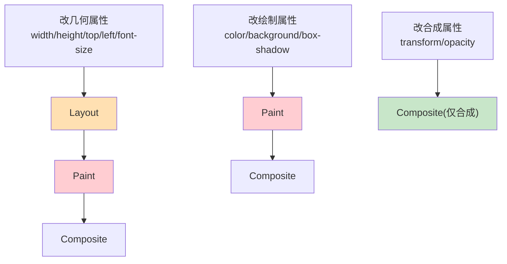

# 03 · 渲染流水线（Rendering Pipeline）

> DOM → CSSOM → Render Tree → Layout → Paint → Composite。这条"像素流水线"是浏览器把代码变成画面的核心，也是所有渲染性能优化的坐标系。

## 📖 知识讲解

渲染进程主线程把 HTML/CSS 转成屏幕像素，要经过固定的**流水线阶段**。Chrome 官方术语顺序如下（"关键渲染路径 Critical Rendering Path"）：

### ① Parse → DOM
主线程解析 HTML 字节流，构建 **DOM 树**（Document Object Model）。DOM 既是数据结构也是 JS 可操作的 API。解析是**增量**的，边下载边构建。

### ② Parse CSS → CSSOM
解析所有 CSS（外链、`<style>`、行内），构建 **CSSOM 树**，并为每个节点算出**计算样式（computed style）**——把继承、层叠、优先级都解析成最终值。

### ③ Render Tree（渲染树）
DOM + CSSOM 合并成**渲染树**，**只包含要显示的节点**：
- `display: none` 的节点**不在**渲染树（连盒子都不生成）。
- `visibility: hidden` 的节点**在**渲染树（占位但不可见）。
- `<head>`、`<script>` 等非可视节点不在渲染树。

### ④ Layout（布局 / 回流 Reflow）
遍历渲染树，计算每个节点的**几何信息**：确切的位置坐标 (x, y) 和尺寸（宽高、盒模型）。这一步也叫 **Reflow（回流）**。它是**全局**的——一个元素尺寸变了，可能牵连整棵树重排。

### ⑤ Paint（绘制）
把布局结果转成**绘制指令（paint records）**：以什么顺序、画什么（文字、颜色、边框、阴影、图片）。这里决定绘制顺序（受 `z-index`、层叠上下文影响）。此阶段只生成"怎么画"的记录，还没变成像素。

### ⑥ Composite（合成）
将页面拆成多个**合成层（layers）**，各层分别**栅格化（raster）**成瓦片像素，再由**合成线程 + GPU** 把这些层按正确顺序"贴"到一起生成最终帧（Draw Quads）。合成在**主线程之外**，所以只触发合成的变化（如 `transform`/`opacity`）最流畅。

> 关键区分：**Layout 和 Paint 在主线程，Composite 在合成线程/GPU**。这决定了"改什么属性最省"（详见模块 04、05）。

## 🔄 原理图

### 渲染流水线全景



### DOM 与 CSSOM 如何合成渲染树

```mermaid
graph TD
    subgraph DOMtree["DOM"]
        d1["body"] --> d2["p"]
        d1 --> d3["div.hidden<br/>display:none"]
    end
    subgraph CSSOMtree["CSSOM"]
        c1["body{font:16px}"]
        c2["p{color:red}"]
        c3[".hidden{display:none}"]
    end
    DOMtree --> R["渲染树"]
    CSSOMtree --> R
    R --> r1["body(可见)"]
    R --> r2["p(可见,红字)"]
    R -. div.hidden 被剔除 .-> x["✗ 不进入渲染树"]
```

### 三类变更触发的流水线长度（性能核心图）



一句话：**动画首选 transform / opacity**，因为它跳过 Layout 和 Paint，只走合成，最省、最流畅。

## 💻 关键点说明

- **计算样式 ≠ 你写的样式**：CSSOM 阶段会把 `em`/`%`/继承/`inherit` 都解析成绝对值。`getComputedStyle()` 读到的就是这个结果。
- **渲染树节点 ≠ DOM 节点数**：一个 DOM 元素可能生成多个盒子（如多行文本），`display:none` 则不生成。
- **一帧的预算是 16.7ms**（60fps）：Layout + Paint + Composite 必须挤进这个时间，否则掉帧。

## ▶️ 运行方式

- F12 → **Performance**：录制交互，展开某一帧可看到 Recalculate Style / Layout / Paint / Composite Layers 的耗时条。
- F12 → **Rendering** 面板：勾选 "Paint flashing" 会把重绘区域高亮成绿色；勾 "Layer borders" 看合成层边界。
- F12 → **Layers** 面板：3D 查看页面被拆成了哪些合成层。

## ⚠️ 常见坑 / 最佳实践

- **别在一帧里反复读写样式**：读取 `offsetWidth` 等会强制同步布局（见模块 04）。
- **优先用合成属性做动画**：`transform`/`opacity` > 改 `left`/`top`。
- **减少绘制区域**：大面积 `box-shadow`、`filter`、渐变重绘很贵。
- **`content-visibility: auto`**：可跳过屏幕外内容的布局与绘制，显著提升长页面首屏。

## 🔗 官方文档

- [How browsers work - web.dev](https://web.dev/articles/howbrowserswork)
- [Critical rendering path - web.dev](https://web.dev/articles/critical-rendering-path)
- [Inside look at modern web browser (Part 3) - 渲染](https://developer.chrome.com/blog/inside-browser-part3)
- [渲染性能 - web.dev](https://web.dev/articles/rendering-performance)
