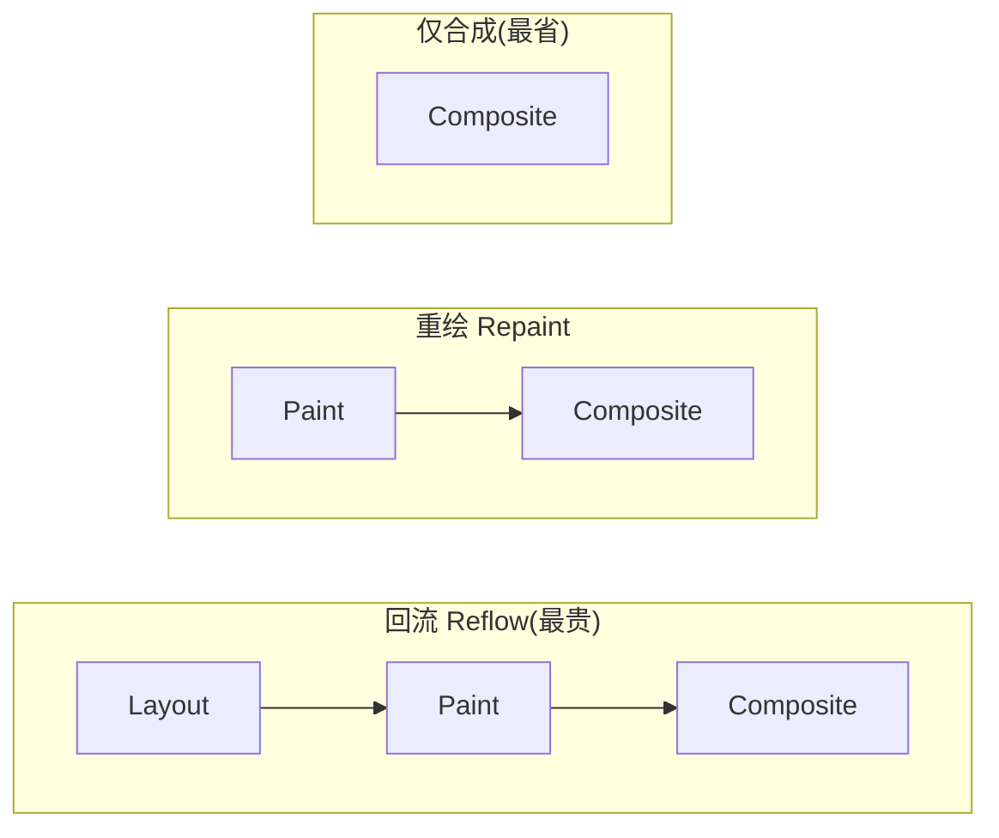
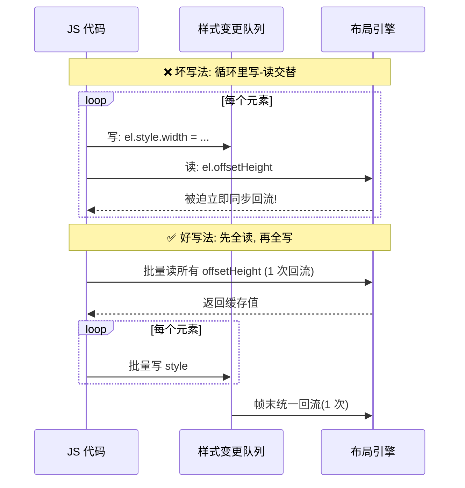

# 04 · 回流与重绘（Reflow & Repaint）

> 回流（Reflow / Layout）= 重新算几何；重绘（Repaint / Paint）= 重新画像素。回流一定引起重绘，重绘不一定引起回流。这是渲染性能优化的第一课。

## 📖 知识讲解

页面首次渲染要走完整流水线。之后每次改动，浏览器会**尽量只重跑必要阶段**：

- **回流 Reflow（= Layout）**：元素的**几何属性**变化（尺寸、位置、增删可见节点）→ 重新计算布局树。**代价最高**，因为可能连锁影响其它元素甚至整棵树。
- **重绘 Repaint（= Paint）**：只是**外观**变化（颜色、背景、`visibility`、阴影）而几何不变 → 跳过 Layout，直接重画像素。比回流便宜，但仍占用主线程。
- **仅合成**：只改 `transform`/`opacity` → 连 Paint 都跳过，只在合成线程/GPU 处理，最便宜（见模块 05）。

**关系：回流 → 必然重绘 → 必然合成；重绘 → 必然合成；合成不回头。**

### 哪些操作触发回流？

- 增删/移动 DOM 节点、改 `display`
- 改宽高、内外边距、边框、`top/left/right/bottom`、`font-size`、`line-height`
- 改变窗口尺寸（resize）、字体加载完成
- 读取"**布局相关属性**"（会强制刷新布局，见下）

### 哪些操作只触发重绘？

- `color`、`background-color`、`background-image`、`box-shadow`、`outline`、`visibility`、`border-color`

### ⚡ 强制同步布局 / 布局抖动（Layout Thrashing）

浏览器为省事会**批量合并**多次样式修改，在合适时机才回流一次。但如果你**改了样式后立刻读取布局属性**，浏览器为了给你准确值，被迫**立即同步回流**——这叫**强制同步布局（Forced Synchronous Layout）**。在循环里反复"写-读-写-读"，就是**布局抖动**，性能杀手。

会强制刷新布局的读取属性（读它们会触发 reflow）：
`offsetTop/Left/Width/Height`、`clientTop/…`、`scrollTop/…`、`getBoundingClientRect()`、`getComputedStyle()`、`window.getComputedStyle`、`scrollIntoView()` 等。

**优化口诀：先批量读，再批量写（read-then-write / 分离读写）。**

## 🔄 原理图

### 回流 vs 重绘 vs 合成 走过的流水线



### 布局抖动是怎么产生的



## 💻 代码说明 · demo

`index.html` 提供三组可点按钮，用 `performance.now()` 实测耗时对比：

1. **回流按钮**：循环修改 1000 个元素的 `width`（几何属性）→ 触发大量回流。
2. **重绘按钮**：循环修改这些元素的 `background-color`（外观属性）→ 只重绘。
3. **合成按钮**：用 `transform: translateX()` 移动 → 只合成，最快最顺。
4. **布局抖动对比**：同样的操作，"写-读交替" vs "先读后写"，实测耗时差好几倍。

关键代码（分离读写，消灭布局抖动）：

```js
// ❌ 布局抖动：每次循环都强制同步回流
for (const el of boxes) {
  el.style.width = el.offsetWidth + 10 + 'px'; // 写完立刻读 offsetWidth
}

// ✅ 分离读写：先一次性读，再一次性写，只回流一次
const widths = boxes.map(el => el.offsetWidth); // 批量读
boxes.forEach((el, i) => {
  el.style.width = widths[i] + 10 + 'px';       // 批量写
});
```

## ▶️ 运行方式

浏览器直接打开 `index.html`，点击各按钮看耗时数字；配合 F12 → Performance 录制，或 Rendering 面板勾 "Paint flashing" 观察重绘区域高亮。

## ⚠️ 常见坑 / 最佳实践

- **分离读写**：同一帧内先读全部布局属性，再统一写样式。
- **批量 DOM 操作**：用 `DocumentFragment`、`display:none` 改完再显示、或克隆离线节点，减少回流次数。
- **用 class 一次改多个样式**，别逐条改 `style`。
- **动画用 `transform/opacity`**，别用 `top/left/width`。
- **`requestAnimationFrame`** 里做写操作，让浏览器在帧内统一回流。
- **让元素脱离文档流**（`position: absolute/fixed`）可缩小回流影响范围。

## 🔗 官方文档

- [避免大型、复杂的布局与布局抖动 - web.dev](https://web.dev/articles/avoid-large-complex-layouts-and-layout-thrashing)
- [坚持仅合成器属性 - web.dev](https://web.dev/articles/stick-to-compositor-only-properties-and-manage-layer-count)
- [What forces layout/reflow - Paul Irish](https://gist.github.com/paulirish/5d52fb081b3570c81e3a)
