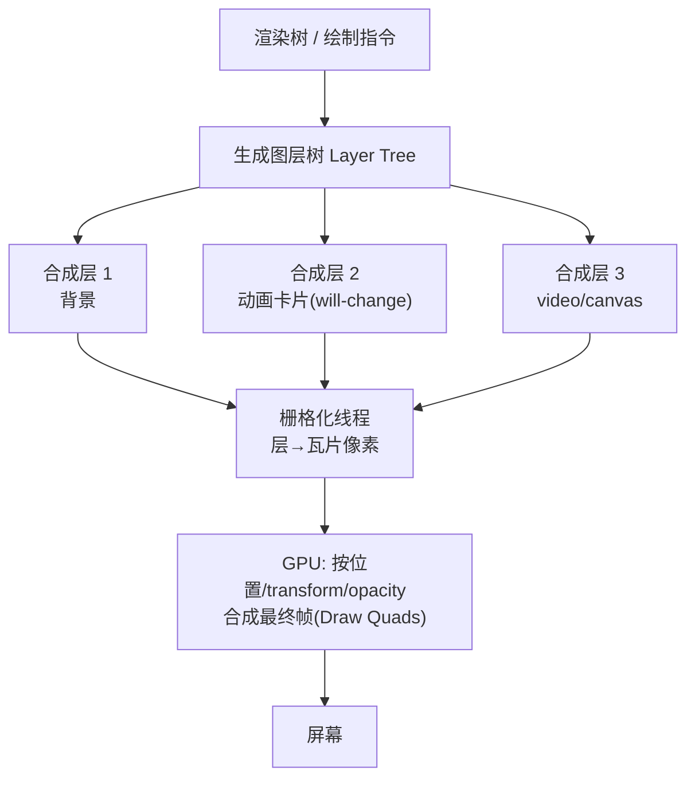
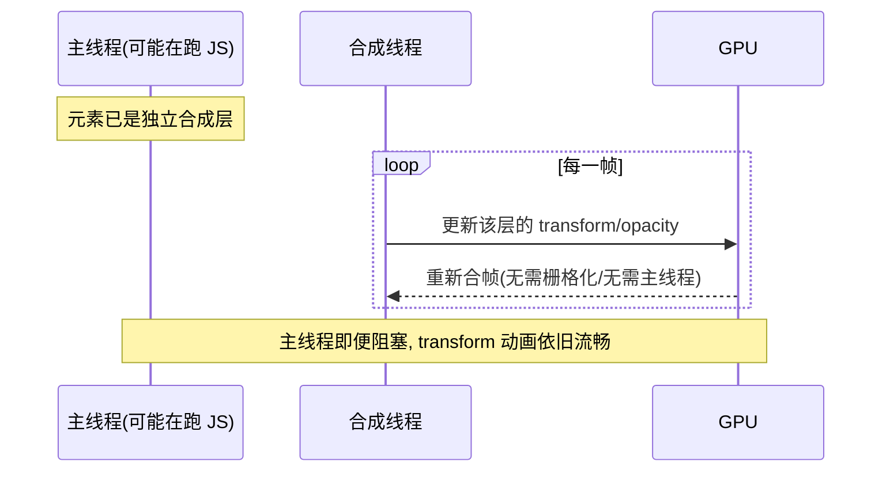

# 05 · 合成层与 GPU 加速（Compositing Layers & will-change）

> 把页面拆成独立"图层"，各层单独栅格化、由 GPU 合帧——这就是丝滑动画的秘密。用好合成层能让动画绕过主线程；用错则内存爆炸、越优化越卡。

## 📖 知识讲解

### 什么是合成层（Compositing Layer）

渲染流水线最后一步 Composite 会把页面切成若干**合成层**。每层：
1. 被**栅格化线程**独立转成瓦片像素（raster）；
2. 由**合成线程**告诉 GPU 各层的位置/变换，GPU 把它们"贴"成最终帧（Draw Quads）。

好处：**某一层变化时，只需重新合成，不必重画其它层**。而且 `transform`/`opacity` 这类变化连栅格化都不用重做，只是让 GPU 换个位置/透明度重贴——所以在**合成线程**就能完成，**完全不占主线程**，即便主线程正忙于 JS，动画依然流畅。

### 什么会创建独立合成层？

浏览器根据启发式规则"提升（promote）"元素为独立层，常见触发条件：
- `transform: translateZ(0)` / `translate3d(...)`（经典"hack"）
- `will-change: transform` / `will-change: opacity`
- `<video>`、`<canvas>`、WebGL、`<iframe>`
- CSS 动画作用于 `transform`/`opacity`
- `position: fixed`（部分情况）
- 有 3D 变换、或被有层的元素以特定方式重叠

### will-change：主动提示浏览器

`will-change` 告诉浏览器"这个元素将要变化，请提前准备好独立层"，避免动画**开始瞬间**才临时提层导致的卡顿：

```css
.card { will-change: transform; }  /* 提前提层 */
```

⚠️ **不能滥用**：每个合成层都要占 GPU 内存（一张与元素等大的纹理）。给几百个元素都加 `will-change`，内存暴涨反而更卡。原则：**只在真正要动画的元素上加，动画结束后移除**。

### GPU 加速的边界

- **GPU 擅长**：位移、缩放、旋转、透明度合成——用 `transform`/`opacity` 做动画。
- **GPU 不管**：布局、文字排版、复杂 `filter`/`box-shadow` 的栅格化仍可能回到 CPU/主线程。
- **层爆炸（Layer Explosion）**：一个元素提层，可能被迫把它上面重叠的兄弟元素也提层，层数指数增长，得不偿失。

## 🔄 原理图

### 分层 → 栅格化 → GPU 合成



### 为什么 transform 动画不卡主线程



## 💻 代码说明 · demo

`index.html` 并排两个动画方块，同时让主线程**周期性地忙 200ms**（模拟卡顿）：

- **左块**用 `left` 做位移动画（每帧回流）——主线程一忙就明显掉帧、卡顿。
- **右块**用 `transform: translateX` + `will-change: transform`——即使主线程在忙，动画依然顺滑。

配合 F12 → Layers 面板可看到右块是独立合成层。核心对比：

```css
/* ❌ 触发回流的动画：每帧都要 Layout */
.left  { animation: moveLeft 2s infinite alternate; }
@keyframes moveLeft { to { left: 300px; } }

/* ✅ 仅合成的动画：GPU 处理，不占主线程 */
.right { will-change: transform; animation: moveRight 2s infinite alternate; }
@keyframes moveRight { to { transform: translateX(300px); } }
```

## ▶️ 运行方式

浏览器打开 `index.html`，点"让主线程忙起来"按钮，对比左右两块的流畅度。打开 F12 → **Layers** 面板看合成层，或 **Rendering** 面板勾 "Layer borders"。

## ⚠️ 常见坑 / 最佳实践

- **`will-change` 用完就撤**：动画结束用 JS 把它设回 `auto`，释放 GPU 内存。
- **别给几十上百个元素统一加 `will-change`**：层爆炸 → 内存飙升 → 更卡。
- **`translateZ(0)` 是老 hack**：现代优先用 `will-change`，语义更清晰。
- **合成动画只认 `transform`/`opacity`**：`filter` 有时也可，但 `width`/`box-shadow` 动画仍走回流/重绘。
- **移动端 GPU 内存有限**：过多大尺寸合成层会触发纹理上传瓶颈甚至崩溃。

## 🔗 官方文档

- [坚持仅合成器属性并管理层数量 - web.dev](https://web.dev/articles/stick-to-compositor-only-properties-and-manage-layer-count)
- [will-change - MDN](https://developer.mozilla.org/zh-CN/docs/Web/CSS/will-change)
- [GPU 加速合成 - Chromium 文档](https://www.chromium.org/developers/design-documents/gpu-accelerated-compositing-in-chrome/)
- [Animations and performance - web.dev](https://web.dev/articles/animations-guide)
