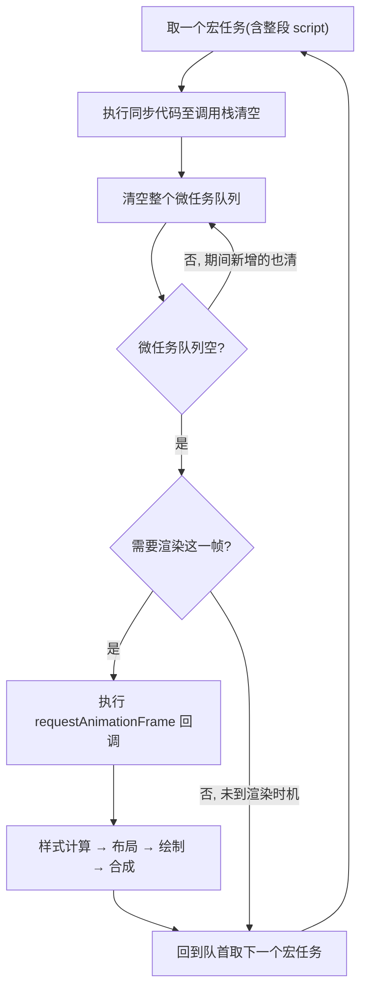
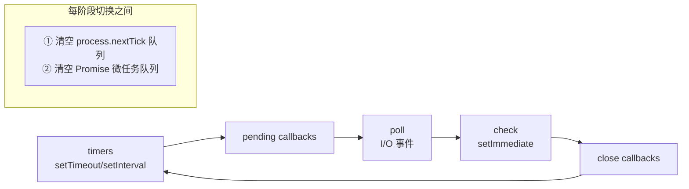

# 06 · 事件循环深入（Event Loop Deep Dive）

> 事件循环让单线程 JS 能协调异步而不卡死。本模块在"宏任务/微任务"基础上深入：渲染时机、requestAnimationFrame、浏览器 vs Node 的差异，以及一堆经典输出题。

## 📖 知识讲解

### 一轮事件循环的完整时序（HTML 规范）

浏览器的事件循环每一轮（一个 tick）大致是：

1. 从**任务队列（task queue，宏任务）**取**一个**任务执行（整段 script 也是一个宏任务）。
2. 执行完后，**清空整个微任务队列（microtask queue）**——期间新产生的微任务也一并清掉。
3. **可选的渲染阶段**：执行 `requestAnimationFrame` 回调 → 计算样式/布局 → 绘制。浏览器按需（通常约每 16.7ms）才渲染一次，不是每个 tick 都渲染。
4. 回到第 1 步取下一个宏任务。

**核心记忆**：`同步 → 清空微任务 → (可能渲染) → 一个宏任务 → 清空微任务 → …`

### 宏任务 vs 微任务

| | 宏任务 macrotask | 微任务 microtask |
|---|---|---|
| 例子 | `setTimeout`、`setInterval`、`MessageChannel`、I/O、UI 事件、整段 script | `Promise.then/catch/finally`、`await` 后续、`queueMicrotask`、`MutationObserver` |
| 每轮执行数量 | **一个** | **全部清空** |
| 时机 | 每轮循环取一个 | 每个宏任务/回调结束后立即清空 |

### requestAnimationFrame 的位置

`rAF` 回调既不是宏任务也不是普通微任务：它在**渲染阶段之前、每帧执行一次**。适合做动画（与刷新率同步、屏幕不可见时自动暂停）。执行顺序上：当前宏任务 → 微任务清空 → rAF 回调 → 布局绘制。

### 浏览器 vs Node 的差异（面试高频）

Node 的事件循环由 **libuv** 实现，分**阶段（phases）**轮转：`timers → pending → poll → check → close`。关键差异：

1. **`process.nextTick` 优先级最高**：Node 有独立的 nextTick 队列，**在每个阶段切换前、甚至先于 Promise 微任务**清空。优先级：`nextTick` > `Promise 微任务` > 其它。
2. **`setImmediate`（check 阶段）vs `setTimeout(0)`（timers 阶段）**：主模块里两者顺序不确定；但在 I/O 回调内部，`setImmediate` 一定先于 `setTimeout`。
3. **微任务清空时机**：现代 Node（v11+）已与浏览器对齐——**每个宏任务后**就清空微任务；老版本 Node 是每个阶段跑完才清，导致同样代码输出不同。

## 🔄 原理图

### 浏览器事件循环一轮



### Node.js 事件循环阶段



## 💻 代码说明 · 经典输出题

`demo.js` 收录多道经典题，浏览器和 Node 均可跑（`node demo.js`）。以下为核心一题：

```js
console.log('1 script start');

setTimeout(() => console.log('2 setTimeout'), 0);

Promise.resolve()
  .then(() => console.log('3 promise then 1'))
  .then(() => console.log('4 promise then 2'));

(async function () {
  console.log('5 async start');
  await null;                 // await 后面等价于 .then，属微任务
  console.log('6 after await');
})();

queueMicrotask(() => console.log('7 queueMicrotask'));

console.log('8 script end');
```

**浏览器输出顺序**：

```
1 script start
5 async start        ← async 函数体在 await 前是同步执行
8 script end
3 promise then 1     ← 微任务：先入队的 Promise.then
6 after await        ← 微任务：await 之后
7 queueMicrotask     ← 微任务：按入队顺序在最后
4 promise then 2     ← 第二个 .then 要等第一个 then 执行后才入队
2 setTimeout         ← 宏任务，最后
```

要点：
- `async` 函数在遇到第一个 `await` 前是**同步**执行（输出 5）。
- 三个微任务按**入队顺序**执行：`then1`(3) → `await 后`(6) → `queueMicrotask`(7)。
- `.then` 链的第二环 `then2`(4) 必须等第一环执行完才被排入微任务队列，所以排在 6、7 之后。
- `setTimeout`(2) 是宏任务，等所有微任务清空后才轮到。

`demo.js` 里还有 `nextTick vs Promise`、`setImmediate vs setTimeout` 的 Node 专属题。

## ▶️ 运行方式

- 浏览器：打开 `index.html`，F12 控制台看输出（页面也会把顺序渲染出来）。
- Node：`node demo.js`，对照浏览器观察 `process.nextTick`/`setImmediate` 的差异。

## ⚠️ 常见坑 / 最佳实践

- **微任务会"饿死"渲染**：在微任务里无限产生新微任务，会一直清不空，阻塞渲染和宏任务。
- **`setTimeout(fn, 0)` 不是 0ms**：HTML 规定嵌套超过 5 层的定时器最小间隔被钳制到 **4ms**。
- **`await` 不是"同步等待"**：它把后续代码变成微任务，别以为会顺序往下走。
- **拆分长任务**：用 `setTimeout`/`scheduler.postTask` 把大计算切成多个宏任务，让出主线程保住交互（INP）。
- **Node 版本差异**：v11 前后微任务清空时机不同，跨版本行为要实测。

## 🔗 官方文档

- [事件循环 - MDN](https://developer.mozilla.org/zh-CN/docs/Web/JavaScript/Reference/Execution_model)
- [深入理解微任务 - MDN](https://developer.mozilla.org/zh-CN/docs/Web/API/HTML_DOM_API/Microtask_guide)
- [The Node.js Event Loop - Node 官方](https://nodejs.org/en/learn/asynchronous-work/event-loop-timers-and-nexttick)
- [Tasks, microtasks, queues and schedules - Jake Archibald](https://jakearchibald.com/2015/tasks-microtasks-queues-and-schedules/)
