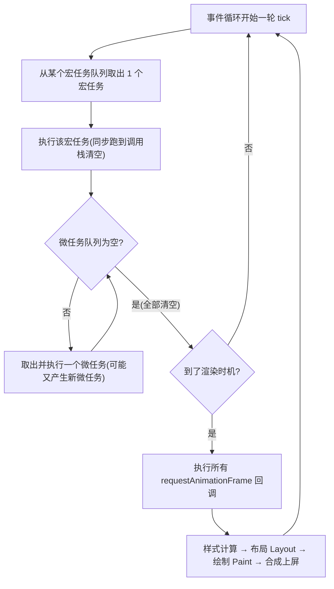
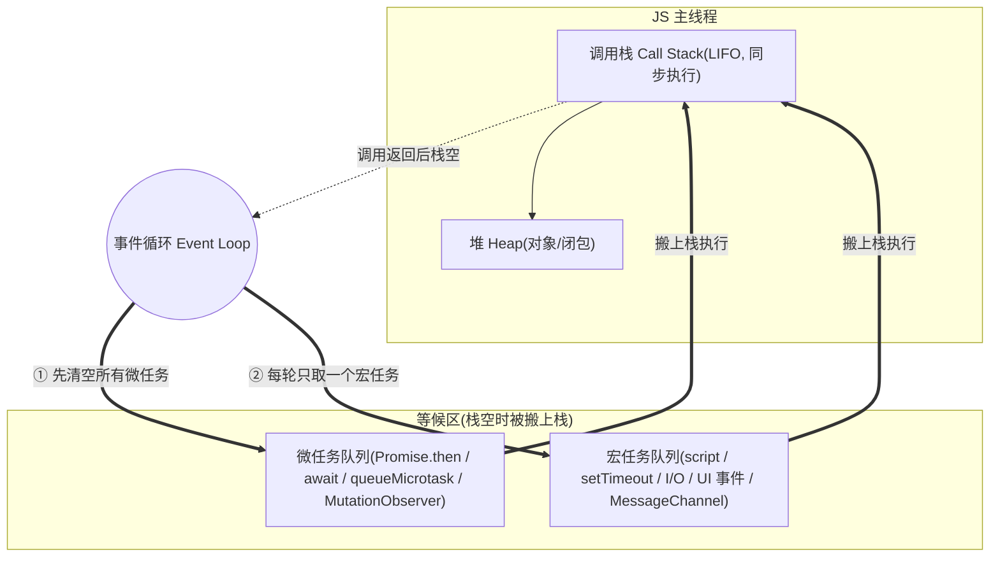
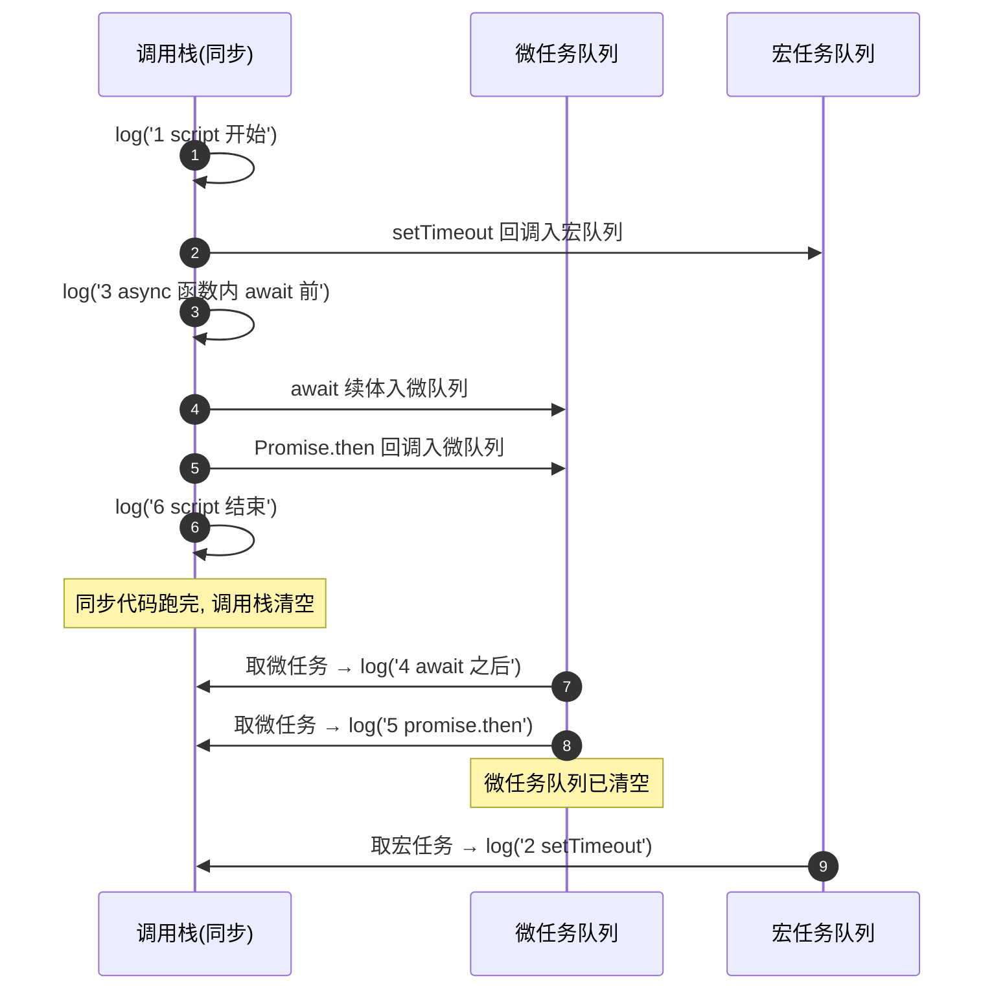

# 06 · 事件循环深入（Event Loop Deep Dive）

> JS 是单线程的，靠**事件循环（Event Loop）**协调异步。一句话记住它：**每跑完一个宏任务，就把微任务队列全部清空，需要时再渲染一帧，然后进入下一轮。**

## 📖 知识讲解

### 单线程模型：调用栈 + 堆 + 队列

JS 引擎只有一条主线程执行代码，核心三件套：

- **调用栈 Call Stack**：函数调用的 LIFO 栈。每调用一个函数就压栈，返回就出栈。**栈非空时线程是「忙」的**，任何任务都得等栈清空。栈内代码是**同步、不可打断**的。
- **堆 Heap**：对象、闭包等引用类型分配内存的地方，非结构化。
- **任务队列 Task Queues**：异步回调的等候区。分两大类——**宏任务队列（可有多个）**和**微任务队列**。事件循环负责把队列里的回调**在栈空时**搬上调用栈执行。

「单线程」指 **JS 执行**是单线程；定时器计时、网络 I/O、渲染合成等由浏览器其它线程/进程并行完成，完成后把回调「投递」进对应队列。

### 宏任务 macrotask（规范里叫 task）

一次事件循环迭代**只取一个**宏任务执行。常见来源：

- `<script>` 整体作为**第一个宏任务**
- `setTimeout` / `setInterval`
- I/O、UI 交互事件（click、scroll 派发的回调）
- `MessageChannel` 的 `postMessage`、window `postMessage`
- `setImmediate`（Node / 旧 IE）
- `requestAnimationFrame` **不是**宏任务，见下文渲染时机

### 微任务 microtask（规范里叫 microtask / jobs）

- `Promise.then` / `catch` / `finally` 的回调
- `queueMicrotask(fn)`
- `MutationObserver` 回调
- `await` 表达式**之后的代码**（本质是 `.then` 的续体）

### 🔑 关键规则：微任务一次清空到底

事件循环的灵魂规则：**每个宏任务执行完毕、以及每当调用栈清空（一次回调返回）时，都会立即把整个微任务队列全部清空**——注意是「**全部**」：如果执行微任务的过程中又产生了新的微任务，也会在**本轮**一并执行掉，直到微任务队列彻底为空，才继续下一步。

这就是为什么 `Promise.then` 里再 `Promise.then` 会**紧接着**执行，而不会让 `setTimeout` 插队。

### 渲染时机 & requestAnimationFrame

浏览器**不是**每个宏任务后都渲染，而是尽量对齐显示器刷新率（约每 16.7ms 一帧）。一帧内的顺序大致是：

```
执行一个宏任务 → 清空微任务 →（若到了渲染时机）执行所有 rAF 回调 → 样式计算 → 布局 → 绘制 → 合成上屏
```

所以 **`requestAnimationFrame` 的回调在「微任务清空之后、真正绘制之前」执行**，约每帧一次，是做视觉动画的正确入口。它既不是宏任务也不是微任务，属于「渲染步骤」的一部分。

### setTimeout(0) 的真相

`setTimeout(fn, 0)` 并不会「立刻」执行：

- 它只是把回调放进宏任务队列，要等当前宏任务 + 所有微任务跑完、且轮到它才执行。
- HTML 规范规定：当**嵌套层级 ≥ 5** 时，最小延迟被**钳制到 4ms**。所以密集嵌套的 `setTimeout(0)` 实际每次至少隔 4ms。
- 想要「尽快、无 4ms 钳制」的宏任务，可用 `MessageChannel`。

### await 的本质

`async/await` 是 Promise 的语法糖。遇到 `await x`：

1. 先**同步**求值右侧 `x`；
2. 函数在此**暂停**，把 `await` **之后的所有代码**注册成一个微任务（等价于 `Promise.resolve(x).then(续体)`）；
3. 控制权交还调用者，继续往下跑同步代码；
4. 等本轮微任务处理到该续体时，再恢复执行。

所以 `await` 后面的 `console.log` 总是排在「当前同步代码之后、下一个宏任务之前」的微任务时机。

### 与 Node.js 事件循环的差异（简要）

浏览器只有「宏/微」两层；Node 基于 **libuv**，一次循环分 **6 个阶段**：`timers`（setTimeout/Interval）→ `pending callbacks` → `idle/prepare` → `poll`（I/O）→ `check`（setImmediate）→ `close callbacks`。关键区别：

- **`process.nextTick` 队列优先级高于 Promise 微任务**，每个阶段切换间都会先清空 nextTick 再清空微任务。
- `setImmediate`（check 阶段）与 `setTimeout(0)`（timers 阶段）的先后不稳定，取决于进入循环的时机。
- 新版 Node（≥ 11）已让每个宏任务后都清微任务，行为向浏览器靠拢。

### ⚠️ 微任务饥饿（starvation）

由于微任务会「一次清空到底」，如果你在微任务里**不断产生新的微任务**（如递归 `queueMicrotask` / `Promise.then`），事件循环会**永远卡在清微任务这一步**，导致宏任务和渲染**被饿死**——页面卡死、无法响应点击、动画停摆。**长耗时/可切分的工作应放宏任务（setTimeout / MessageChannel）而非微任务。**

## 🔄 流程图 / 原理图

### 图 1 · 事件循环一次迭代（tick）的完整循环



### 图 2 · 调用栈 / 宏队列 / 微队列 三者关系



### 图 3 · 经典题的执行时序（对应下方「例题一」）



## 💻 代码说明 / 经典输出题

### 例题一 · Promise + setTimeout + async/await 混合

```js
console.log('1 script 开始');

setTimeout(() => console.log('2 setTimeout'), 0);

async function foo() {
  console.log('3 async 函数内(await 前, 同步)');
  await Promise.resolve();
  console.log('4 await 之后(微任务)');
}
foo();

Promise.resolve().then(() => console.log('5 promise.then'));

console.log('6 script 结束');
```

**逐步分析**（把每一步入栈/入队/出队讲清楚）：

| 步骤 | 发生的事 | 调用栈 | 微队列 | 宏队列 | 输出 |
| --- | --- | --- | --- | --- | --- |
| ① | 执行 `<script>`（第一个宏任务） | 满 | 空 | 空 | `1 script 开始` |
| ② | `setTimeout` 注册 | | | `[setTimeout]` | |
| ③ | 调用 `foo()`，await 前同步执行 | 满 | | `[setTimeout]` | `3 async 函数内...` |
| ④ | 遇 `await`，续体入微队列，foo 暂停返回 | | `[await续体]` | `[setTimeout]` | |
| ⑤ | `Promise.then` 注册 | | `[await续体, then]` | `[setTimeout]` | |
| ⑥ | 同步最后一行 | | 同上 | 同上 | `6 script 结束` |
| ⑦ | 脚本宏任务结束 → **清空微队列** | | 依次出队 | | `4 await 之后` → `5 promise.then` |
| ⑧ | 微队列空 → 取下一个宏任务 | | 空 | | `2 setTimeout` |

**最终输出：**

```
1 script 开始
3 async 函数内(await 前, 同步)
6 script 结束
4 await 之后(微任务)
5 promise.then
2 setTimeout
```

要点：`await Promise.resolve()` 后的代码变成微任务，因此 `4` 和 `5` 都在同步代码（`6`）之后、`setTimeout`（`2`）之前；`4` 先于 `5` 是因为它先入队。

### 例题二 · 微任务嵌套 + requestAnimationFrame + setTimeout

```js
console.log('1 同步开始');

setTimeout(() => console.log('2 setTimeout(宏)'), 0);

requestAnimationFrame(() => console.log('3 rAF(渲染前)'));

Promise.resolve().then(() => {
  console.log('4 微任务A');
  Promise.resolve().then(() => console.log('5 微任务A里再产生的微任务'));
});

Promise.resolve().then(() => console.log('6 微任务B'));

console.log('7 同步结束');
```

**逐步分析：**

1. 同步阶段依次输出 `1`、`7`；期间 `setTimeout` 入宏队列，`rAF` 入「渲染回调」列表，两个 `.then` 入微队列 `[A, B]`。
2. 脚本宏任务结束 → **清空微队列**：先 `A` 输出 `4`，A 内部又产生一个微任务 `5`；接着队列里还有 `B`，输出 `6`；此时队列多了刚产生的 `5`，**同一轮继续清空**，输出 `5`。微队列彻底空。
3. 到了渲染时机 → 执行 rAF 回调，输出 `3`，随后浏览器完成样式/布局/绘制。
4. 下一轮 tick 取宏任务 `setTimeout`，输出 `2`。

**最终输出（多数情况下）：**

```
1 同步开始
7 同步结束
4 微任务A
6 微任务B
5 微任务A里再产生的微任务
2 setTimeout(宏)
3 rAF(渲染前)
```

要点：`5` 虽然在 `A` 内部产生，但**不会等到下一轮**——微任务「一次清空到底」，所以排在 `6` 之后、同轮结束前。`rAF`（`3`）在微任务全清后、绘制前执行。`setTimeout`（`2`）与 `rAF`（`3`）谁先，取决于宏任务与渲染帧的时机：多数情况 `2` 先（宏任务无需等帧），但若正好卡在帧边界也可能相反——demo 里可多点几次观察。

### demo 关键代码

`index.html` 用一个 `log()` 把每条输出**按顺序渲染成带序号的列表**（而不只是打到 console），这样宏/微任务的真实顺序在页面上肉眼可见：

```js
// 把输出同时写到页面列表和 console，序号自增
let seq = 0;
function log(msg, type) {
  seq++;
  const li = document.createElement('li');
  li.className = 'row ' + (type || 'sync'); // sync/micro/macro/raf 用不同颜色
  li.textContent = seq + '. ' + msg;
  outputEl.appendChild(li);
  console.log(seq, msg);
}
```

每个示例按钮点击时先清空列表，再运行对应的经典代码，页面即时呈现执行顺序。

## ▶️ 运行方式

浏览器**直接打开** `index.html`（免构建、无依赖）。页面上有多个按钮：

- 「例题一：Promise+async」「例题二：rAF+微任务嵌套」——点击后下方列表按真实顺序逐条显示输出，不同颜色区分同步/微任务/宏任务/rAF。
- 「微任务饥饿演示」——点击后不断递归 `queueMicrotask`，可观察到页面/按钮在一段时间内**卡死无法响应**，直观感受 starvation（demo 里限制了次数，跑完会自动恢复）。

也可打开 F12 Console 对照页面列表，两处顺序一致。

## ⚠️ 常见坑 / 最佳实践

- **别指望 `setTimeout(fn, 0)` 立即执行**：它要排在所有微任务之后，且嵌套 ≥5 层被钳制到 4ms。要「无钳制的尽快宏任务」用 `MessageChannel`。
- **`await` 会让后续代码变微任务**：循环里大量 `await` 会串行化并制造大量微任务，注意顺序与性能。
- **微任务饥饿**：可切分的重活放宏任务（`setTimeout`/`MessageChannel`），别在微任务里递归产生微任务，否则饿死渲染。
- **视觉更新用 `requestAnimationFrame`**：它在绘制前执行，改样式最跟手；别用 `setTimeout` 做动画。
- **不要在微任务里做重计算**：会阻塞本轮渲染，页面掉帧。
- **Node 里 `process.nextTick` 优先级最高**，滥用同样会饿死事件循环，谨慎使用。
- **跨浏览器/Node 差异**：涉及 `setTimeout` vs `setImmediate` 顺序时不要依赖固定次序。

## 🔗 官方文档

- [并发模型与事件循环 - MDN](https://developer.mozilla.org/zh-CN/docs/Web/JavaScript/EventLoop)
- [microtask 微任务指南 - MDN](https://developer.mozilla.org/zh-CN/docs/Web/API/HTML_DOM_API/Microtask_guide)
- [HTML 规范 · Event loops 处理模型](https://html.spec.whatwg.org/multipage/webappapis.html#event-loops)
- [Jake Archibald · Tasks, microtasks, queues and schedules](https://jakearchibald.com/2015/tasks-microtasks-queues-and-schedules/)
- [Jake Archibald · "In The Loop"（JSConf 演讲）](https://www.youtube.com/watch?v=cCOL7MC4Pl0)
- [使用 queueMicrotask 深入微任务 - MDN](https://developer.mozilla.org/zh-CN/docs/Web/API/Window/queueMicrotask)
- [The Node.js Event Loop 官方指南](https://nodejs.org/en/learn/asynchronous-work/event-loop-timers-and-nexttick)
