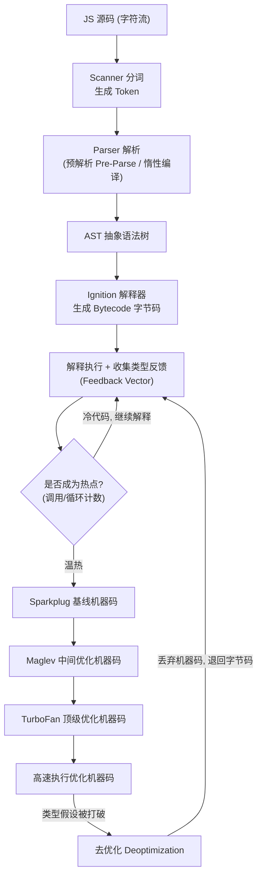
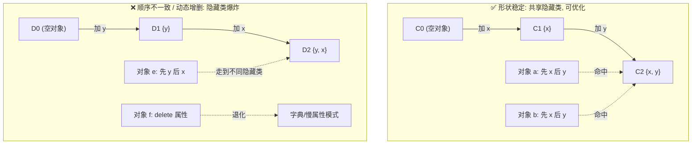
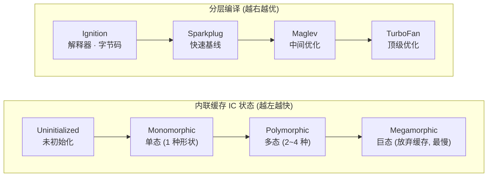

# 07 · V8 引擎工作原理（V8 Engine）

> V8 把一段 JS 源码变成能跑的机器码：Scanner 分词 → Parser 建 AST → Ignition 解释器生成并执行字节码 → 收集类型反馈 → 热点函数交给 Maglev / TurboFan 编译成优化机器码。核心思想只有两句：**先快速跑起来，再择机把热代码编译得飞快；一旦优化假设被打破，就退回来重跑。**

## 📖 知识讲解

### V8 是什么

V8 是 Google 用 **C++** 编写的高性能 **JavaScript + WebAssembly 引擎**，驱动着 Chrome、Node.js、Deno、Electron 以及基于 Chromium 的 Edge。它既能独立嵌入（Node 就是「V8 + libuv + Node API」），也可以通过官方调试壳 **`d8`** 单独运行。V8 的看家本领是**即时编译（JIT, Just-In-Time Compilation）**：不像传统解释器逐行慢跑，也不像 C++ 那样全量提前编译（AOT），而是**运行时**根据代码的真实执行情况动态编译，把「跑得最多的热点代码」编译成高度优化的机器码。

### 执行管线：从源码到机器码

一段 JS 进入 V8 后大致走这几步：

1. **Scanner（扫描器 / 分词器）**：把源码字符流切成 **token**（关键字、标识符、运算符、字面量……）。
2. **Parser（解析器）**：把 token 组织成 **AST（抽象语法树, Abstract Syntax Tree）**。这里有一个关键优化——**预解析（Pre-Parse）与惰性编译（Lazy Compilation）**：绝大多数函数在定义时并不会被立刻完整解析编译，V8 只做一次「预解析」快速扫过、检查语法、记录函数边界，**等到真正被调用时才做完整解析**。因为真实页面里很多函数一辈子都不会执行，惰性编译能显著缩短启动时间、省内存。
3. **Ignition（点火器，基线解释器）**：把 AST 编译成紧凑的 **字节码（Bytecode）**，然后逐条解释执行。字节码比机器码小得多，解决了早期 V8「全量编译机器码太吃内存」的问题。程序**一开始都在 Ignition 里跑**。
4. **类型反馈（Feedback / Type Feedback）**：Ignition 执行时会顺手记录「某个变量实际是什么类型」「某处属性访问命中了哪种对象结构」等运行时信息，存进 **Feedback Vector**。这是后续优化编译的燃料。
5. **优化编译器（TurboFan / Maglev）**：某个函数被调用得足够多、变成**热点（hot）**后，V8 会把它连同收集到的类型反馈一起，交给优化编译器，编译成**高度优化的机器码**。之后同一函数的调用直接跑机器码，快上一个数量级。

### 分层编译（Tiered Compilation）——2026 年的 V8 管线

「一步到位编译成最优机器码」是不划算的：优化编译本身很慢，对只跑几次的代码得不偿失。所以现代 V8 采用**分层编译**，让代码随着「热度」升温逐层进阶，在**启动速度**和**峰值性能**之间取得平衡：

| 层级 | 名称 | 角色 | 产物 | 特点 |
| --- | --- | --- | --- | --- |
| Tier 0 | **Ignition** | 基线解释器 | 字节码 | 启动最快、内存最省，收集类型反馈 |
| Tier 1 | **Sparkplug** | 快速基线编译器 | 非优化机器码 | 直接由字节码「一遍过」生成机器码，几乎不做优化，编译极快，消除解释开销 |
| Tier 2 | **Maglev** | 中间优化编译器（较新） | 较优机器码 | 用类型反馈做轻量优化，编译速度远快于 TurboFan，填补中间地带 |
| Tier 3 | **TurboFan** | 顶级优化编译器 | 高度优化机器码 | 基于 Sea-of-Nodes IR 做激进优化（内联、逃逸分析、类型特化），编译慢但产物最快 |

一个长期运行的热点函数的典型晋升路径是：**Ignition → Sparkplug → Maglev → TurboFan**。冷代码则一直待在 Ignition，不浪费编译资源。热点探测靠调用次数 / 循环回边计数等**计数器**触发升级。

### 隐藏类（Hidden Class / Shape / Map）

JS 是动态语言，对象属性可以随时增删，理论上每次访问属性都得像查字典一样按名字查找，很慢。V8 的解法是给对象加一层**隐藏类**（V8 内部叫 **Map**，学术上叫 **Shape**）：结构相同（属性名、顺序、类型都一致）的对象**共享同一个隐藏类**，隐藏类里记录了「属性 `x` 在对象内存的第几个槽位（offset）」。这样属性访问就退化成「按固定偏移量取值」，接近静态语言的速度。

关键在于：**隐藏类是随属性变化「转移」的**。给对象加一个新属性，就会从旧隐藏类**过渡（transition）**到一个新隐藏类。因此——

- **按相同顺序初始化相同属性的对象，会走到同一个隐藏类，能共享、能被优化。**
- 如果**在不同代码路径上以不同顺序添加属性**，或**动态增删属性**，就会产生一堆互不相同的隐藏类，优化随之失效。
- `delete obj.x` 尤其糟糕：它常常让对象退化成「字典模式 / 慢属性模式（dictionary mode）」，彻底放弃隐藏类优化。

**最佳实践：在构造函数里一次性、以固定顺序初始化所有属性，保持「对象形状稳定」。**

### 内联缓存（Inline Cache, IC）

有了隐藏类，V8 进一步用 **内联缓存** 加速属性访问。第一次执行 `obj.x` 时，V8 记住「这个访问点遇到的隐藏类是 M，`x` 的偏移是 3」，缓存在该调用点上。下次再执行到这里，只要对象隐藏类还是 M，就**跳过查找直接取偏移 3**。IC 根据在同一访问点见过多少种隐藏类，分为几种状态：

- **单态 Monomorphic**：只见过 **1 种**隐藏类。最快，可被优化编译器彻底内联。
- **多态 Polymorphic**：见过 **少数几种**（通常 ≤4）隐藏类。V8 缓存多条，还行但稍慢。
- **巨态 Megamorphic**：见过**太多**种隐藏类，V8 放弃逐个缓存，退回到全局哈希表查找。最慢，优化基本失效。

让同一处代码始终处理**形状一致**的对象，就是在维持 IC 处于单态、把性能锁在最优区间。

### 去优化（Deoptimization）

优化编译是一场**赌博**：TurboFan/Maglev 基于「过去观察到的类型」做了大量假设（比如「这个参数一直是小整数 SMI」）并据此生成特化机器码。一旦运行时**假设被打破**——比如某次调用突然传进来一个字符串、或对象换了隐藏类——优化代码就不再正确。此时 V8 触发**去优化（Deopt）**：丢弃优化机器码，**回退到 Ignition 字节码**继续执行，并重新收集反馈。

去优化会造成**性能骤降**（本来跑机器码，突然掉回解释执行）。更糟的是**反复去优化 / 优化震荡（deopt loop）**：函数优化了又被打回、打回了又优化。这通常源于「同一函数被喂了类型不稳定的输入」。因此**保持类型稳定**（别让一个变量一会儿是数字一会儿是字符串、别让一个函数处理形状迥异的对象）是写出可被 V8 持续优化的代码的核心。

### 数组的快 / 慢元素（Packed / Holey Elements）

V8 对数组也有内部「元素类型（elements kind）」优化，从快到慢大致是：

- **PACKED_SMI_ELEMENTS**：连续、全是小整数，最快。
- **PACKED_DOUBLE_ELEMENTS** → **PACKED_ELEMENTS**：连续但含浮点 / 含引用类型。
- **HOLEY_* （空洞数组）**：数组里有「洞」（`hole`），即存在未赋值的下标。

一旦数组变「holey」，V8 每次读取都得多做一次「这个位置是不是洞」的检查，并可能沿原型链查找，明显变慢。制造空洞的典型操作：`new Array(100)` 预分配、`arr[100] = x`（越界跳跃赋值）、`delete arr[i]`。而且**元素类型只能单向退化、不能升级回去**。此外**混合类型数组**（`[1, 'a', {}, 2.5]`）会被迫用最通用（最慢）的表示。**最佳实践：数组连续填充、类型统一、避免稀疏。**

### 与垃圾回收（GC）的衔接

V8 的另一半是内存管理：对象在**堆（Heap）**上分配，由 **Orinoco** 垃圾回收器（分代式：新生代 Scavenger + 老生代 Mark-Compact，配合并发 / 增量回收）自动回收。编译执行与 GC 相互影响——比如去优化产生的废弃机器码、隐藏类元数据都要占堆。本模块只点到为止，**内存分配、分代回收、内存泄漏排查等细节见模块 08（GC 与内存管理）**。

## 🔄 流程图 / 原理图

### 图 1 · V8 执行管线大图（含反馈回路与去优化）



### 图 2 · 隐藏类的共享与过渡



### 图 3 · 内联缓存状态迁移 与 分层编译层级



## 💻 代码说明 / 观察说明

本模块**纯文档**，不含可运行 demo，但 V8 提供了一整套「把黑盒打开」的观察手段。以下命令均基于 Node（其底层就是 V8）或 V8 调试壳 `d8`。

### 观察字节码：`--print-bytecode`

```bash
node --print-bytecode --print-bytecode-filter=add demo.js
```

对应的示例代码：

```js
function add(a, b) {
  return a + b;
}
add(1, 2);
```

你会看到 Ignition 为 `add` 生成的字节码指令（`Ldar`、`Add`、`Return` 等）以及关联的 Feedback Vector 槽位——这就是「源码 → 字节码」这一步的真实产物。

### 观察优化与去优化：`--trace-opt` / `--trace-deopt`

```bash
node --trace-opt --trace-deopt demo.js
```

配一段会触发**去优化**的代码，直观感受「类型突变 → 优化假设失效 → 回退」：

```js
function addFields(obj) {
  return obj.x + obj.y; // IC 记住某个隐藏类
}

// 先反复喂「形状一致」的对象, 让它优化
for (let i = 0; i < 100000; i++) {
  addFields({ x: 1, y: 2 });          // x,y 都是 SMI, 单态, 会被优化
}

// 再突然换类型 / 换形状, 触发 Deopt
addFields({ x: 'hello', y: 'world' }); // 参数类型突变 → 去优化, 日志里会打印 deoptimizing
addFields({ y: 2, x: 1 });             // 属性顺序不同 → 不同隐藏类, IC 变多态
```

日志里会出现 `marking … for optimization`（升级）与 `deoptimizing`（回退）字样，把「优化—去优化」的赌博过程摊开给你看。

### 观察隐藏类 / IC：`d8` 的 `%` 内建函数

用 `d8 --allow-natives-syntax`（或 `node --allow-natives-syntax`）可调用 V8 内部函数，直接打印一个对象的隐藏类和优化状态：

```js
const a = { x: 1, y: 2 };
const b = { x: 3, y: 4 };
const c = { y: 5, x: 6 };            // 顺序不同

%DebugPrint(a);   // 打印隐藏类 (map) 地址
%DebugPrint(b);   // 与 a 相同 map —— 共享隐藏类
%DebugPrint(c);   // map 不同 —— 顺序不一致导致隐藏类分裂
%HaveSameMap(a, b); // true
%HaveSameMap(a, c); // false
```

### 其它可视化手段

- **`chrome://tracing`** 或 **DevTools → Performance**：录制运行时轨迹，看编译 / 去优化事件在时间线上的分布。
- **DevTools → Memory / Performance**：观察堆与 GC（详见模块 08）。
- **`--trace-ic`**：打印内联缓存的状态迁移（单态 → 多态 → 巨态）。
- **`--print-opt-code`**：打印 TurboFan 生成的最终机器码（进阶）。

## ▶️ 运行方式

本模块以**阅读文档 + 动手观察**为主，**不需要 `npm install`**，只要本机装了 Node.js（自带 V8）即可。把上面的代码片段存成一个 `.js` 文件，然后：

```bash
# 看字节码
node --print-bytecode demo.js

# 看优化 / 去优化过程
node --trace-opt --trace-deopt demo.js

# 看内联缓存状态迁移
node --trace-ic demo.js

# 用内部函数打印隐藏类 / 优化状态
node --allow-natives-syntax demo.js
```

如果想用官方调试壳 `d8`，可通过 `jsvu`、`npx v8-compile-cache` 相关工具或直接下载 V8 预编译包获得 `d8`，用法与上面 `node` 参数一致。图形化观察则打开 Chrome，访问 `chrome://tracing` 录制，或在 DevTools 的 Performance / Memory 面板中实时查看。**这些都是只读观察，不改动任何项目文件。**

## ⚠️ 常见坑 / 最佳实践

- **保持对象形状稳定**：在构造函数 / 对象字面量里**以固定顺序一次性初始化所有属性**，让同类对象共享隐藏类、让 IC 停在单态。
- **别用 `delete`**：`delete obj.x` 常把对象打入慢属性（字典）模式，优化全失效。要「清空」就赋 `undefined` 或 `null`，或重建对象。
- **别在运行中途给对象加新属性**：热路径里的对象结构应在创建时就定型。
- **避免混合类型数组**：数组里别混放整数、浮点、字符串、对象；连续填充、类型统一，远离 `holey`（空洞）数组，别用 `arr[bigIndex] = x` 制造稀疏。
- **保持函数参数类型稳定**：同一个函数别一会儿传数字一会儿传字符串，否则触发反复去优化（deopt loop），比不优化还慢。
- **别过早微优化**：V8 极其聪明，绝大多数「手写优化」是负收益。**先写清晰、类型稳定、形状一致的代码，用 profiler 找到真正的热点后再针对性优化**——过早为了迎合引擎写「奇技淫巧」往往适得其反。
- **理解「先解释后编译」**：代码前几次跑得慢是正常的（还在 Ignition / 收集反馈），做基准测试时要预热（warm-up）足够次数，否则测的是解释执行而非优化后的峰值性能。

## 🔗 官方文档

- [V8 官方博客 · Blog](https://v8.dev/blog)
- [Ignition 解释器 · Firing up the Ignition interpreter](https://v8.dev/blog/ignition-interpreter)
- [Sparkplug 快速基线编译器 · Sparkplug — a non-optimizing JavaScript compiler](https://v8.dev/blog/sparkplug)
- [Maglev 中间优化编译器 · Maglev - V8's Fastest Optimizing JIT](https://v8.dev/blog/maglev)
- [隐藏类与内联缓存 · JavaScript engine fundamentals: Shapes and Inline Caches](https://mathiasbynens.be/notes/shapes-ics)
- [优化原型 · JavaScript engine fundamentals: optimizing prototypes](https://mathiasbynens.be/notes/prototypes)
- [元素类型 packed/holey · Elements kinds in V8](https://v8.dev/blog/elements-kinds)
- [背景编译 · Background compilation](https://v8.dev/blog/background-compilation)
- [V8 文档站 · Documentation](https://v8.dev/docs)
- [Chrome for Developers · JavaScript](https://developer.chrome.com/docs/)
- [MDN · JavaScript engine 概念](https://developer.mozilla.org/en-US/docs/Web/JavaScript)
