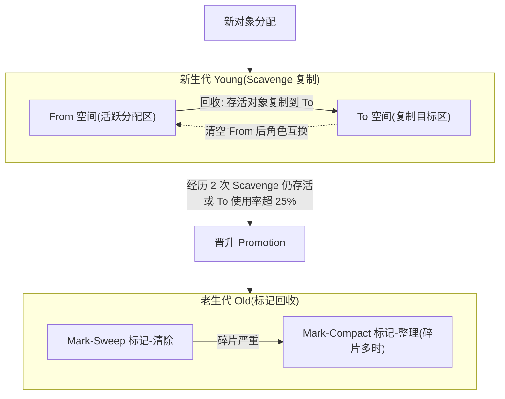
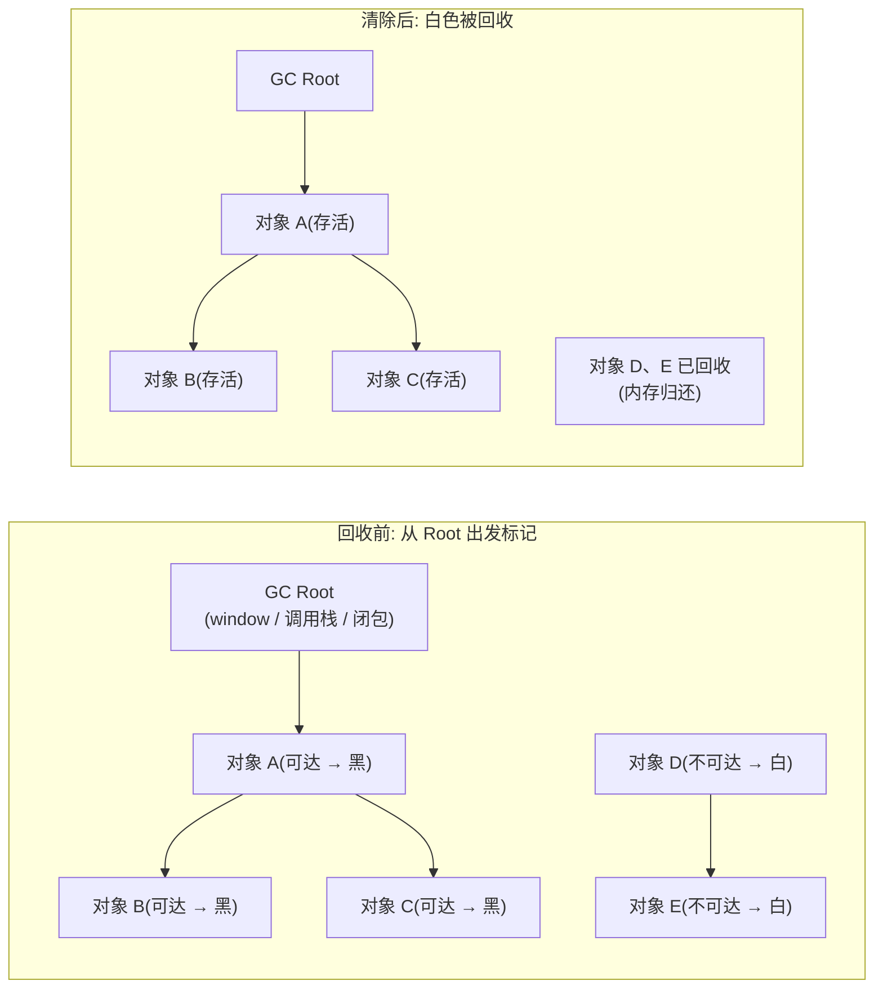
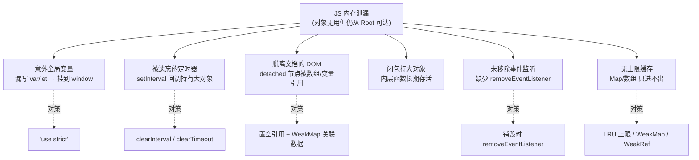

# 08 · 垃圾回收与内存管理（GC & Memory）

> 你不需要手动 `free()`，但你必须理解 V8 什么时候能回收、什么时候不能——GC 只回收「不可达」的对象，写出泄漏的代码，垃圾回收器也无能为力。

## 📖 知识讲解

### 内存的一生：分配 → 使用 → 释放

不管什么语言，内存都走三步：

1. **分配 Allocate**：声明变量、`new`、字面量 `{}` / `[]` / 函数，V8 自动划一块内存。
2. **使用 Use**：读写这块内存。
3. **释放 Release**：不再需要时归还。C 语言靠手动 `free`，JS 靠**垃圾回收器（GC）自动**完成——但「自动」不等于「不会泄漏」。

### 栈内存 vs 堆内存

| | 栈 Stack | 堆 Heap |
|---|---|---|
| 存什么 | 基本类型值（`number/boolean/null/undefined/小整数`）、对象的**引用地址** | 对象、数组、函数、闭包等**引用类型**的实体 |
| 大小 | 小、固定、编译期可知 | 大、动态 |
| 管理 | 函数调用入栈、返回出栈，自动 | **GC 负责回收** |
| 速度 | 极快 | 较慢 |

关键理解：`const obj = { a: 1 }` 中，`obj` 这个「引用地址」在栈上，`{ a: 1 }` 这个实体在堆上。GC 管的是**堆**。

### 可达性 Reachability 与 GC Roots

现代 JS 引擎判断「垃圾」的唯一标准是**可达性**：从一组「根 GC Roots」出发，凡是能通过引用链走到的对象都是「活的」，走不到的就是垃圾，可以回收。

**GC Roots 包含：**

- **全局对象**：浏览器里的 `window` / `globalThis`
- **当前调用栈**：正在执行的函数的局部变量、参数
- **活动的闭包**：被内层函数引用、尚未销毁的外层作用域变量

一个对象只要**从任意一个 root 可达**，就不会被回收。反过来说——**泄漏的本质，就是你以为不用了、但它仍从某个 root 可达。**

### 为什么不用「引用计数」？循环引用缺陷

早期方案是**引用计数**：每个对象记录「有多少引用指向我」，归零就回收。简单，但有**致命的循环引用问题**：

```js
function leak() {
  const a = {};
  const b = {};
  a.ref = b;   // b 的计数 = 1
  b.ref = a;   // a 的计数 = 1
  // 函数返回后 a、b 谁都不再被外部使用
}
// 引用计数：a、b 互相引用，计数永远 ≥ 1 → 永远不回收 → 泄漏
```

而**可达性 / 标记法**从 root 出发，`a`、`b` 都走不到 → 判为垃圾，正确回收。所以现代引擎（V8）一律用**基于可达性的标记算法**，不用引用计数。

### V8 分代式回收 Generational GC

V8 基于一个经验规律——**「代际假说」：绝大多数对象创建后很快就死（朝生夕死），活下来的少数会活很久**。于是把堆分成两代，用不同策略：

#### 新生代 Young Generation（小、回收频繁）

- 空间小（每个 semi-space 通常几 MB ~ 十几 MB），存放新分配的对象。
- 算法：**Scavenge（Cheney 复制算法）**。把新生代分成大小相等的两半：**From 空间**和 **To 空间**。
  1. 新对象都分配在 From。
  2. From 满了触发回收：从 root 出发，把**存活对象复制到 To 空间**（同时紧凑排列，无碎片）。
  3. From 里剩下的全是垃圾，整块清空。
  4. **From 和 To 角色互换**，如此往复。
- **晋升 Promotion**：一个对象若**在两次 Scavenge 后仍存活**（或复制时 To 空间使用超过 25%），说明它是「长寿对象」，被移动到老生代。
- 代价：牺牲一半空间换极快的回收速度，适合「大量朝生夕死」的场景。

#### 老生代 Old Generation（大、回收慢）

存放晋升上来的长寿对象，空间大（可达 GB 级），复制算法太浪费，改用：

- **标记-清除 Mark-Sweep**：标记所有可达对象 → 清除未标记的。缺点：留下**内存碎片**。
- **标记-整理 Mark-Compact**：在标记-清除基础上，把存活对象**向一端移动整理**，消除碎片，代价是移动开销。V8 在碎片严重时才用它。

### 三色标记、增量与并发——对抗「卡顿」

朴素的标记-清除要**Stop-The-World（STW）**：暂停 JS 执行，完成整轮标记清除。老生代很大时，STW 可能几十上百毫秒，页面直接卡死掉帧。V8 的 **Orinoco** 项目用一系列技术把停顿打散：

- **三色标记 Tri-color Marking**：给对象三种颜色——
  - ⚪ **白色**：未访问（初始，可能是垃圾）
  - ⚫ **灰色**：自己已访问、但引用的子对象还没访问完（在待处理队列里）
  - ⚫⚫ **黑色**：自己和所有子引用都访问完（确定存活）

  标记过程就是把灰色对象逐个变黑、把它的白色孩子染灰，直到没有灰色。结束时白色即垃圾。

- **增量标记 Incremental Marking**：把一整轮标记**切成许多小片**，穿插在 JS 执行的间隙里做一点、还给主线程一点，避免一次长 STW。
- **并发标记 Concurrent Marking**：标记工作放到**后台辅助线程**，与主线程 JS **同时**进行，主线程几乎不停。
- **惰性清扫 Lazy Sweeping**：清扫（回收空间）不必一次做完，按需在后续分配时逐页清扫。

### 写屏障 Write Barrier——保证并发标记的正确性

增量 / 并发标记有个危险：标记进行到一半、JS 还在跑，如果此时**把一个白色对象挂到了已经标记完的黑色对象上**，而灰色队列已经处理完，这个白色对象会被漏标、被误当垃圾回收——程序崩溃。

**写屏障**就是拦在「对象引用赋值」这个动作上的一小段检查逻辑：当发生 `black.field = white` 这样的写入时，写屏障把白色对象重新染成灰色（重新入队），保证它不被漏标。这是并发/增量 GC 正确性的基石。

### 常见 JS 内存泄漏（重点）

泄漏 = 对象已经没用、但仍从某个 GC root 可达，GC 不敢回收：

1. **意外的全局变量**：非严格模式下漏写 `var/let/const`，`leaked = ...` 直接挂到 `window`，永不回收。（用 `'use strict'` 规避）
2. **被遗忘的定时器 / 回调**：`setInterval` 的回调闭包持有外部大对象，忘了 `clearInterval`，对象和定时器一起长生。
3. **脱离文档的 DOM（Detached Nodes）**：把 DOM 从页面移除，但 JS 里仍有变量/数组引用它，节点及其整棵子树都无法回收。**最常见、最隐蔽**。
4. **闭包持有大对象**：内层函数引用了外层的大变量，只要内层函数活着，大对象就跟着活。
5. **未清理的事件监听**：`addEventListener` 后组件销毁却没 `removeEventListener`，监听器闭包持有上下文。
6. **无上限的缓存**：用普通对象/数组/`Map` 做缓存，只进不出，越堆越大。

### 弱引用：WeakMap / WeakRef / FinalizationRegistry

它们让「引用」**不阻止 GC 回收目标**，是防泄漏利器：

- **`WeakMap` / `WeakSet`**：键是对象且为**弱引用**。若某个 key 对象在别处已无强引用，即使它还在 WeakMap 里，也能被回收，对应条目自动消失。**天然适合做「DOM 节点 → 附加数据」的关联缓存**，节点被移除时数据自动释放。
- **`WeakRef`**：包一层弱引用，`.deref()` 取目标；目标可能已被回收而返回 `undefined`。适合可有可无的缓存。
- **`FinalizationRegistry`**：注册回调，在目标被 GC 回收后**大约**触发（时机不保证、不精确），用于清理外部资源，**不能依赖它做核心逻辑**。

### 如何排查——DevTools Memory 面板

- **Heap snapshot（堆快照）**：抓某一时刻整个堆的对象。经典手法：**操作前抓一张 → 执行可疑操作 → 手动 GC → 再抓一张**，用 **Comparison** 视图看哪些对象数量只增不减。快照里搜 `Detached` 可直接定位脱离文档的 DOM。
- **Allocation instrumentation on timeline（分配时间线）**：录制期间实时显示分配，蓝色竖条是新分配、灰色是已回收；**始终蓝色不变灰** = 泄漏点。
- **Detached elements（脱离元素）**：Chrome 新增的专项工具，一键列出所有 detached DOM 及引用者。
- **代码内自查**：`performance.memory`（Chrome 私有、非标准、精度受限）；标准 API `performance.measureUserAgentSpecificMemory()`（需跨源隔离 COOP/COEP，返回更准确的分类内存）。

## 🔄 流程图 / 原理图

### 图 1 · 分代结构与晋升



### 图 2 · 标记-清除前后的可达性



### 图 3 · 常见内存泄漏分类



## 💻 代码说明

`index.html` 是一个**可对照的内存泄漏演示台**，纯 HTML + 内联 JS，无需构建。核心是三组按钮和一个实时计数。

**「💥 制造泄漏」按钮**——两种真实泄漏叠加：

```js
const leakedNodes = [];   // 全局数组：GC root 可达，成为泄漏的「锚」
const timers = [];        // 保存定时器 id

function makeLeak() {
  // 泄漏 1：创建 DOM、加子树，但不挂进页面(detached)，只被全局数组持有
  for (let i = 0; i < 200; i++) {
    const el = document.createElement('div');
    el.innerHTML = '<span>泄漏节点</span>'.repeat(50); // 撑大体积，快照更明显
    leakedNodes.push(el);   // ← 关键：脱离文档却被全局引用，GC 无法回收
  }
  // 泄漏 2：定时器闭包持有一个大数组，且从不 clearInterval
  const big = new Array(100000).fill('*');
  const id = setInterval(() => { void big.length; }, 60000);
  timers.push(id);
}
```

**「✅ 正确释放」按钮**——把上面两种泄漏都解开：

```js
function cleanUp() {
  leakedNodes.length = 0;              // 断开全局数组对 detached 节点的引用
  timers.forEach(clearInterval);        // 清掉所有定时器，闭包随之可回收
  timers.length = 0;
}
```

**「🔍 WeakMap 对照」按钮**——展示弱引用不阻止回收：用 `WeakMap` 关联节点数据，节点一旦无强引用即可整体回收。

### Memory 面板排查步骤（跟着做一遍）

1. F12 → **Memory** 面板 → 选 **Heap snapshot** → 抓第 1 张（基线）。
2. 回页面多次点「💥 制造泄漏」，让计数涨上去。
3. 回 Memory 面板点垃圾桶图标手动 GC → 抓第 2 张。
4. 快照顶部选 **Comparison**（与第 1 张对比），看 `Delta` 列——`Detached HTMLDivElement`、`(array)` 数量只增不减，就是泄漏证据。
5. 在快照过滤框输入 `Detached`，可直接列出所有脱离文档的节点及**保留它的引用链（Retainers）**。
6. 点「✅ 正确释放」→ 再手动 GC → 抓第 3 张对比，`Detached` 节点数应归零，证明泄漏被解除。
7. 进阶：切到 **Allocation instrumentation on timeline** 录制，边点「制造泄漏」边看蓝条不变灰。

## ▶️ 运行方式

用浏览器（建议 Chrome）**直接双击打开** `index.html` 即可，无需服务器、无需 npm。

页面上有实时计数（已泄漏节点数 / 活动定时器数）和操作日志。配合 **F12 → Memory 面板**按上面的「排查步骤」抓 Heap snapshot 对比，就能亲眼看到泄漏与回收。

> 安全提示：demo 每次点「制造泄漏」只分配 200 个节点 + 1 个定时器，并有上限保护和「一键释放」，不会真把浏览器搞崩；观察完记得点「✅ 正确释放」。

## ⚠️ 常见坑 / 最佳实践

| 泄漏场景 | 对策 |
|---|---|
| 漏写声明产生全局变量 | 文件头 `'use strict'`；用 ESLint `no-undef` |
| `setInterval`/`setTimeout` 忘清 | 组件销毁时 `clearInterval/clearTimeout`；SPA 路由离开时统一清理 |
| 移除 DOM 但 JS 仍引用（detached） | 移除后把引用**置 `null`**；关联数据用 `WeakMap` |
| `addEventListener` 未配对移除 | 销毁时 `removeEventListener`；或用 `AbortController` 的 `signal` 一次性移除 |
| 闭包无意中长期持有大对象 | 缩小闭包捕获范围；用完的大变量手动置 `null` |
| 缓存无上限只进不出 | 加 **LRU / 容量上限**；键为对象时用 `WeakMap`；可选值用 `WeakRef` |
| 依赖 `FinalizationRegistry` 做核心清理 | ❌ 时机不保证，只做**兜底**，核心资源必须显式释放 |
| 用 `delete obj.x` 期望立刻省内存 | GC 是异步、按需触发的，`delete`/置 null 只是**断开引用**，回收时机由 V8 决定 |

**心法**：GC 只回收「不可达」对象。排查泄漏就是回答一个问题——**「这个本该死掉的对象，到底还被哪条引用链从 root 拴着？」** Retainers 视图就是用来看这条链的。

## 🔗 官方文档

- [Trash talk: the Orinoco garbage collector - v8.dev](https://v8.dev/blog/trash-talk)
- [Concurrent marking in V8 - v8.dev](https://v8.dev/blog/concurrent-marking)
- [Memory management - MDN](https://developer.mozilla.org/en-US/docs/Web/JavaScript/Memory_management)
- [WeakMap - MDN](https://developer.mozilla.org/en-US/docs/Web/JavaScript/Reference/Global_Objects/WeakMap)
- [WeakRef - MDN](https://developer.mozilla.org/en-US/docs/Web/JavaScript/Reference/Global_Objects/WeakRef)
- [Record heap snapshots - Chrome DevTools](https://developer.chrome.com/docs/devtools/memory-problems/heap-snapshots)
- [Fix memory problems - Chrome DevTools](https://developer.chrome.com/docs/devtools/memory-problems)
- [measureUserAgentSpecificMemory() - MDN](https://developer.mozilla.org/en-US/docs/Web/API/Performance/measureUserAgentSpecificMemory)
