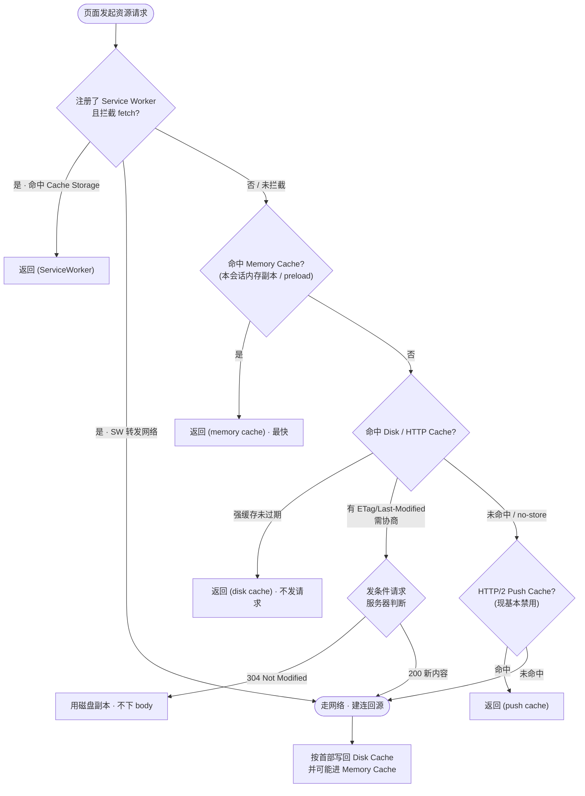
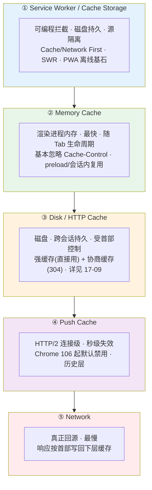
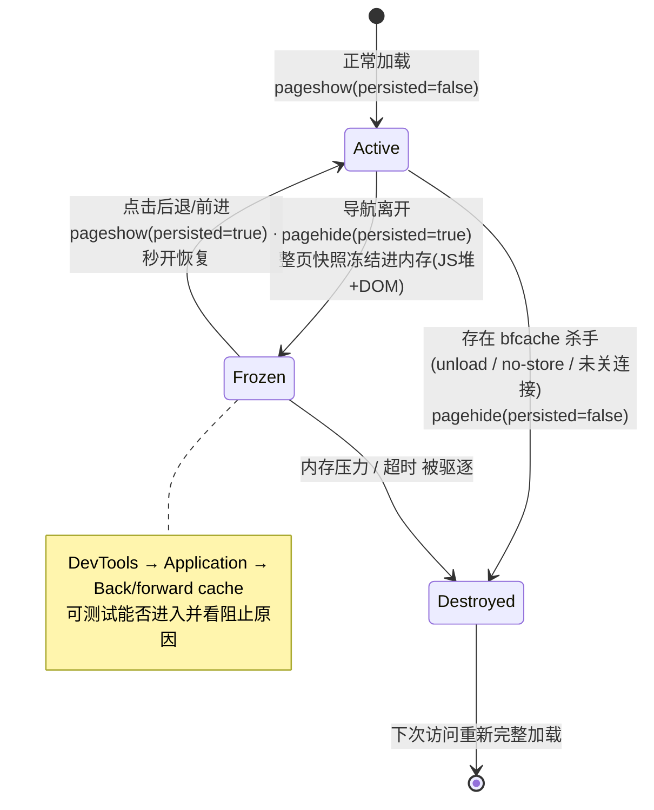

# 09 · 浏览器缓存体系（Browser Cache System）

> 浏览器拿一个资源，不是「有缓存 / 没缓存」的二元判断，而是自上而下穿过**多级缓存**：Service Worker → Memory Cache → Disk/HTTP Cache →（HTTP/2）Push Cache → 网络。本模块从浏览器内部实现视角讲清这套层次与查找顺序；HTTP 缓存首部的细节（Cache-Control / ETag / 304）在 `17-network-protocols/09-http-cache` 已单独讲透，这里只做串联与定位。

## 📖 知识讲解

很多人一提「浏览器缓存」就想到 `Cache-Control` 和 304。但那只是**磁盘缓存这一层**受 HTTP 首部控制的规则。站在浏览器实现的角度，一次资源请求会依次询问多个缓存层，**任何一层命中就直接返回、不再往下走**，全部落空才真正发起网络请求。

### 缓存查找顺序（自上而下，命中即返回）

1. **Service Worker Cache（Cache Storage）** —— 最外层、**可编程**。
   如果页面注册了 Service Worker 且它监听了 `fetch` 事件，那么**每一个**同源发出的请求都会先经过 SW。SW 用 Cache Storage API 决定是「从缓存拿」「走网络」还是「先缓存后台再更新」。它是唯一由开发者完全掌控的缓存层，也是 PWA 离线能力的基石。注意：SW 本身不存数据，数据存在 **Cache Storage**（与 SW 生命周期解耦的独立存储）里。

2. **Memory Cache（内存缓存）** —— 最快、最短命。
   资源直接躺在渲染进程的内存里，命中几乎零耗时。它随**页面 / Tab 的生命周期**存在：关闭 Tab 基本就没了。典型来源是同一个页面会话里被**重复引用**的资源、`<link rel="preload">` 预加载的资源、以及一次导航中被多处引用的同一张图/同一个脚本。Memory Cache **在很大程度上忽略 `Cache-Control` 的语义**（比如 `no-cache` 的资源仍可能从内存复用），它优先考虑「这个字节我刚刚就在内存里，直接给你」。

3. **Disk Cache / HTTP Cache（磁盘缓存）** —— 持久、跨会话，受 HTTP 首部严格控制。
   这才是大家熟悉的「HTTP 缓存」：**强缓存**（`Cache-Control` / `Expires`，命中直接用不发请求）与**协商缓存**（`ETag` / `Last-Modified`，发条请求问服务器，命中返回 `304 Not Modified` 不带 body）都发生在这一层。它写在磁盘上，关掉浏览器再打开依然在，容量也远大于内存缓存。**强缓存 vs 协商缓存的首部细节请看 `17-09`，本模块只需记住：它们都处在「Disk/HTTP Cache 层」。**

4. **Push Cache（HTTP/2 Server Push）** —— 已边缘化，了解即可。
   HTTP/2 曾允许服务器在客户端请求前「推」资源，推来的资源暂存在 Push Cache，只在**当前连接**存活、时间极短。由于收益有限、容易推错、且 HTTP/3 未继续这条路，Chrome 已在 106 版本**默认禁用 HTTP/2 Server Push**，现代实践基本改用 `<link rel="preload">` / `103 Early Hints`。这里仅作历史层次补全。

5. **网络（Network）** —— 以上全部落空，才真正建连、发请求、回源。

### DevTools Network 里怎么看命中了哪一层

打开 F12 → Network 面板，看 **Size 列**：

| Size 列显示 | 含义（命中的层） |
| --- | --- |
| `(ServiceWorker)` | 由 Service Worker 的 `fetch` 处理返回（可能来自 Cache Storage，也可能是 SW 转发的网络响应） |
| `(memory cache)` | 命中 **Memory Cache**，未读磁盘、未发请求 |
| `(disk cache)` | 命中 **Disk/HTTP Cache**（强缓存直接用磁盘副本） |
| 具体字节数（如 `12.3 kB`） | 走了网络（可能是首次，也可能是协商缓存 `304` 后拿的完整/校验响应） |
| `(prefetch cache)` / `(push cache)` | 命中预取 / HTTP/2 推送缓存（后者已少见） |

一个经验判断：**同一个资源，首次刷新常显示 `(disk cache)`，而在同一页面二次触发时更容易显示 `(memory cache)`**——因为它已经被这次会话装进了内存。

### Service Worker + Cache Storage：可编程缓存策略

SW 把「缓存策略」从「浏览器写死的规则」变成「你写的 JS 逻辑」。常见几种（更完整的 PWA 落地见 `28-pwa`）：

- **Cache First（缓存优先）**：先查 Cache Storage，命中就返回，没有再走网络并回填。适合**长期不变的静态资源**（带 hash 的 JS/CSS/字体）。
- **Network First（网络优先）**：先走网络，成功就用并更新缓存，失败（离线）再退回缓存。适合**要求新鲜**的接口/HTML。
- **Stale-While-Revalidate（先旧后更新）**：立刻返回缓存里的旧副本让页面秒开，同时**后台**发请求拉新版本写回缓存，下次访问就是新的。体验与新鲜度的折中，最常用。
- 还有 **Cache Only** / **Network Only** 等退化形态。

这套能力让页面在**完全离线**时仍可打开（离线兜底页、离线可用的应用外壳 App Shell），是 PWA 的核心。

### 各级缓存的生命周期 / 容量 / 清除

| 缓存层 | 存储位置 | 生命周期 | 容量 | 受 HTTP 首部控制？ | 清除时机 |
| --- | --- | --- | --- | --- | --- |
| Service Worker / Cache Storage | 磁盘（源隔离） | 由代码显式增删；随源的存储配额 | 大（受 origin 配额，可数十~数百 MB+） | 否，完全由代码控制 | 代码 `caches.delete`、清站点数据、配额驱逐 |
| Memory Cache | 渲染进程内存 | 页面 / Tab 存活期间 | 小，随内存压力被回收 | 基本忽略 | 关 Tab、导航离开、内存吃紧即弃 |
| Disk / HTTP Cache | 磁盘 | 跨会话持久 | 大（浏览器统一管理，按 LRU 驱逐） | **是**（Cache-Control / ETag 等） | 过期、`no-store`、清缓存、容量驱逐 |
| Push Cache | 当前 HTTP/2 连接 | 连接关闭即失效（秒级） | 很小 | 部分 | 连接断开、超时 |

**隐私 / 无痕（Incognito）模式差异**：无痕窗口的 Disk Cache、Cache Storage、Cookie、localStorage 等都写在**临时、内存态**的隔离区里，**关闭所有无痕窗口时整体销毁**，不落到常规磁盘、也不与常规会话共享。因此无痕下你几乎每次都像「首次访问」，缓存红利很弱，测试首屏性能反而更接近全新用户。

### bfcache（Back/Forward Cache，前进 / 后退缓存）

bfcache 是一个**容易被忽略但收益极大**的缓存层，它缓存的**不是某个资源，而是整张页面**。

当用户从 A 页跳到 B 页，浏览器不会立刻销毁 A，而是把 A 的**完整快照——包括 JavaScript 堆、DOM 树、乃至执行上下文——原样冻结在内存里**。当用户点「后退」回到 A，浏览器直接把这个冻结的页面**解冻恢复**，无需重新解析 HTML、重跑 JS、重新请求资源，实现真正的**瞬时秒开**。这与前面几层「缓存字节」的机制完全不同——它缓存的是「活着的页面状态」。

**进入 / 恢复时触发的事件**：

- `pagehide`：页面即将被冻结进 bfcache（或被卸载）时触发。事件对象的 `event.persisted === true` 表示页面被存入了 bfcache（而非彻底销毁）。
- `pageshow`：页面显示时触发。**首次加载**也会触发，但此时 `event.persisted === false`；若是**从 bfcache 恢复**，`event.persisted === true`——这是判断「本次是 bfcache 秒回」的标准手段，可在此刷新时间敏感的数据（如未读数、购物车）。

**哪些情况会让页面无法进入 bfcache（常见「杀手」）**：

- 页面注册了 **`unload` 事件**监听器（历史包袱最重的一条，应改用 `pagehide`）。
- 响应头带 **`Cache-Control: no-store`**（尤其是主文档，常见于登录态敏感页）。
- 页面存在**未关闭的连接**：打开的 `IndexedDB` 事务、进行中的 `fetch`/XHR、未关闭的 WebSocket / WebRTC 等。
- 使用了 `window.opener` 关联、或某些权限/嵌入场景。

Chrome DevTools 的 **Application → Back/forward cache** 面板可一键测试当前页能否进入 bfcache，并列出**具体阻止原因**，是排查的首选工具。

### HTTP 缓存分区（Cache Partitioning）

早期浏览器的 HTTP Cache 是**全局共享**的：只要 URL 相同，A 站和 B 站请求同一个 CDN 上的 `jquery.js` 会命中同一份缓存。这带来两个问题：**跨站追踪**（通过探测某资源是否已缓存、加载快慢，推断你访问过哪些站）与**信息泄露**。

现代浏览器（Chrome 86+、Firefox、Safari）引入**缓存分区**：缓存的 key 从「单纯的资源 URL」扩展为 **`(顶级站点, 当前框架站点, 资源 URL)`** 这样的多元组。于是**同一个 CDN 资源在不同顶级站点下各存一份、互不命中**。

代价是：曾经指望「公共 CDN 跨站共享缓存」的性能红利**消失了**（这也是近年推荐「自托管关键静态资源 + 长缓存」的原因之一）；收益是**关闭了一大类跨站追踪与探测攻击**。对开发者而言，这解释了为什么「明明用户在别的站加载过同名库，你的站首次访问依然要重新下载」。

## 🔄 流程图 / 原理图

### 图 1 · 资源请求的多级缓存查找顺序



### 图 2 · 各级缓存层次与特性对比



### 图 3 · bfcache 页面的冻结与恢复



## 💻 代码说明 / 观察说明

本模块为**纯文档**，不含可运行 demo，重点在于用 DevTools 亲手观察各级缓存。

### 一、在 Network 面板辨认缓存层

1. 打开任意站点，F12 → **Network**，勾掉 `Disable cache`。
2. 首次加载，观察静态资源 **Size 列**：多为字节数（走网络）或 `(disk cache)`。
3. **不刷新**，在页面内触发二次使用同一资源（或普通刷新 F5），再看 Size：部分会变成 `(memory cache)`。
4. 若站点是 PWA / 注册了 SW，会看到 `(ServiceWorker)`——右键列头可加 **Priority**、**Protocol** 等列辅助判断。
5. 对比三种刷新：**普通刷新（F5）**走缓存校验；**硬性重新加载（Ctrl/Cmd+Shift+R）**跳过缓存强制回源；**清空缓存并硬性重新加载**（DevTools 开着时右键刷新按钮）连内存缓存一起清。

### 二、观察 Cache Storage（Service Worker 的缓存）

F12 → **Application → Storage → Cache Storage**，可展开每个 cache、查看具体缓存条目、手动删除。旁边 **Service Workers** 面板可看 SW 状态、勾 `Offline` 模拟离线、`Update on reload` 调试。

一小段 Cache API 示意（在 SW 里实现 Stale-While-Revalidate）：

```js
// service-worker.js —— 先返回缓存(秒开)，后台再更新缓存
self.addEventListener('fetch', (event) => {
  event.respondWith(
    caches.open('assets-v1').then(async (cache) => {
      const cached = await cache.match(event.request);
      const network = fetch(event.request).then((res) => {
        cache.put(event.request, res.clone()); // 后台回填新版本
        return res;
      });
      return cached || network; // 有旧副本先给旧的，同时后台刷新
    })
  );
});
```

### 三、测试 bfcache

F12 → **Application → Back/forward cache** → 点 **Test back/forward cache**：浏览器会自动导航离开再返回，报告本页**能否进入 bfcache**；若不能，会列出**具体阻止原因**（如 `unload handler`、`Cache-Control: no-store`、`WebSocket` 等）逐条修复。也可手写监听验证：

```js
window.addEventListener('pageshow', (e) => {
  if (e.persisted) console.log('本次是从 bfcache 秒回，刷新动态数据');
});
window.addEventListener('pagehide', (e) => {
  console.log('页面被冻结进 bfcache?', e.persisted);
});
```

> 关于 `chrome://cache`：旧版 Chrome 曾能用它浏览磁盘缓存条目，**新版已移除该内部页**。如今查看/管理缓存改用 DevTools（Network / Application）与 `chrome://net-export`、`chrome://net-internals` 等诊断页。

## ▶️ 运行方式

本模块以文档为主，无需 `npm`、无需构建。建议按以下步骤动手观察：

1. 用任意熟悉的站点，按上面「Network 面板辨认缓存层」走一遍，认全 `(memory cache)` / `(disk cache)` / `(ServiceWorker)` 三种标识。
2. 找一个 PWA（如很多文档站、掘金、Twitter/X），断网后刷新，感受 Service Worker + Cache Storage 的离线能力。
3. 在任意多页面站点上「进入详情页 → 点后退」，配合 `pageshow` 监听或 Application 面板，验证 bfcache 是否生效。
4. 打开一个无痕窗口重复步骤 1，对比缓存命中率的差异，理解隐私模式的临时性。

## ⚠️ 常见坑 / 最佳实践

- **合理设置 `Cache-Control`**：HTML 入口用 `no-cache`（每次校验，保证能更新）；带内容 hash 的静态资源用 `Cache-Control: max-age=31536000, immutable`（长缓存）。别给会变的资源上长强缓存，否则用户「刷不出新版本」。
- **hash 文件名 + 长缓存**：把 `app.[contenthash].js` 这类指纹文件名交给构建工具，内容一变文件名就变，天然解决「长缓存 + 要更新」的矛盾——这是现代前端缓存策略的地基。
- **别用 `unload` 事件**：它是 bfcache 头号杀手，且在移动端本就不可靠。需要「页面离开时保存/上报」用 `pagehide` 或 `visibilitychange`（配合 `navigator.sendBeacon`）。
- **主文档慎用 `Cache-Control: no-store`**：它会直接让页面**无法进入 bfcache**，牺牲前进后退秒开体验；仅在确有强隐私需求时使用。
- **离开页面时关掉连接**：未关闭的 IndexedDB 事务、进行中的请求、WebSocket 都会阻止 bfcache，页面隐藏时主动清理。
- **别再指望公共 CDN 跨站共享缓存**：缓存分区后收益已消失，关键静态资源倾向**自托管 + 长缓存**，既稳又快。
- **Memory Cache 不可控**：它基本忽略你的首部，别指望用 `no-cache` 阻止同页复用；真要「每次都新」需从架构层（不同 URL / 请求参数）解决。
- **改完 SW 缓存策略记得升级 cache 名**（如 `assets-v1 → v2`）并在 `activate` 里清理旧 cache，否则用户会一直吃旧缓存。

## 🔗 官方文档

- [Back/forward cache — web.dev](https://web.dev/articles/bfcache)
- [Prevent your page from being excluded from bfcache — Chrome DevTools](https://developer.chrome.com/docs/devtools/application/back-forward-cache)
- [The HTTP cache: your first line of defense — web.dev](https://web.dev/articles/http-cache)
- [Service Worker caching and HTTP caching — web.dev](https://web.dev/articles/service-worker-caching-and-http-caching)
- [Offline Cookbook（各种缓存策略）— web.dev](https://web.dev/articles/offline-cookbook)
- [Gaining security and privacy by partitioning the cache — Chrome Developers](https://developer.chrome.com/blog/http-cache-partitioning)
- [HTTP caching — MDN](https://developer.mozilla.org/en-US/docs/Web/HTTP/Guides/Caching)
- [Cache（Cache Storage API）— MDN](https://developer.mozilla.org/en-US/docs/Web/API/Cache)
- [Window: pageshow event — MDN](https://developer.mozilla.org/en-US/docs/Web/API/Window/pageshow_event)
- [Removing HTTP/2 Server Push from Chrome — Chrome Platform Status](https://developer.chrome.com/blog/removing-push)
