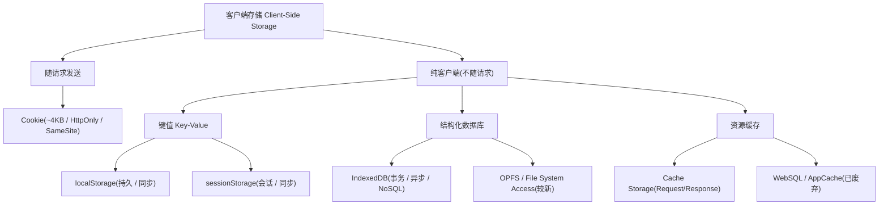
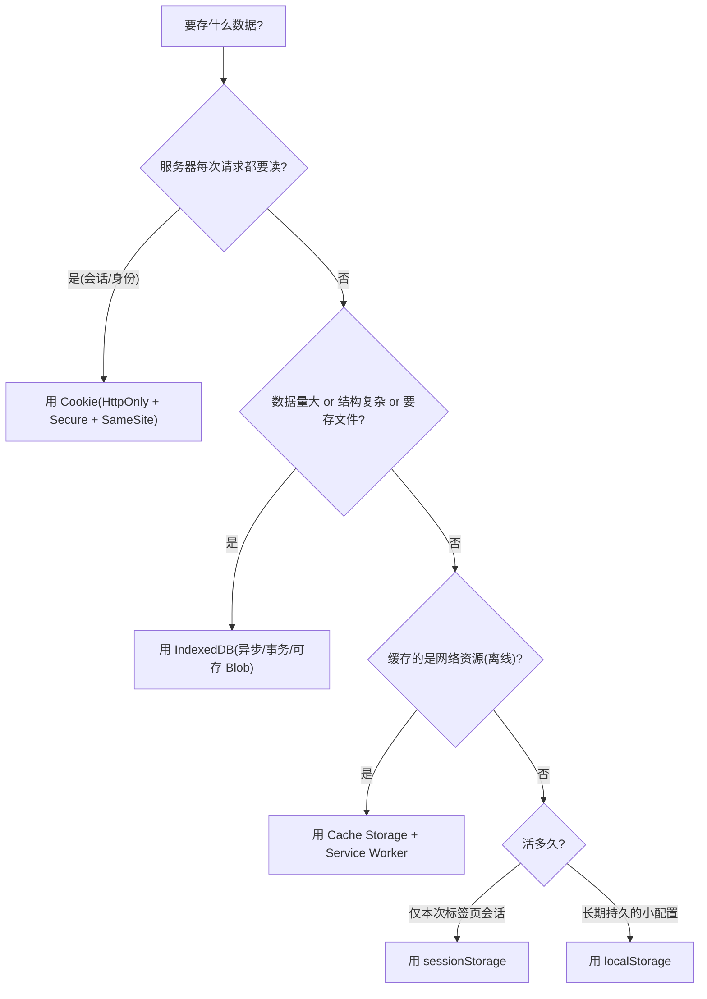

# 10 · 浏览器存储机制（Client-Side Storage）

> 浏览器给页面提供了一整套「就近存数据」的能力：从只能装 4KB 且每次请求都要背着走的 Cookie，到能装几百 MB 结构化数据、异步事务的 IndexedDB。**选对存储 = 用对容量 + 用对生命周期 + 用对同步/异步语义。**

## 📖 知识讲解

客户端存储解决三类问题：**保持身份/会话**、**缓存配置与状态**、**离线可用**。不同机制在容量、生命周期、API 形态、是否随请求发送上差别巨大，混用会踩性能与安全坑。

### 1. Cookie —— 会话与身份的老兵

Cookie 是唯一「会自动随请求走」的存储，这既是它的核心价值，也是它的原罪。

- **容量极小**：单个 Cookie 约 4KB，单域名条数有限（通常约 50 条）。
- **自动携带**：只要作用域匹配，**每一次同源请求**（图片、CSS、XHR、页面导航）都会在请求头 `Cookie:` 里带上它。存多了 = 每个请求都变胖 = 纯性能开销。所以 Cookie 只该放「服务器每次都要看的一点点东西」，典型是 **Session ID / 认证 token**。
- **生命周期**：不设 `Expires`/`Max-Age` 就是**会话 Cookie**（关浏览器即失效）；设了就是**持久 Cookie**，到期自动删。`Max-Age`（秒）优先级高于 `Expires`（绝对时间）。
- **作用域**：`Domain` 决定哪些主机能收到（设了 `Domain=example.com` 则子域也能收），`Path` 决定哪些路径能收到。
- **安全属性**（重点）：
  - `Secure`：只在 HTTPS 下发送。
  - `HttpOnly`：JS 的 `document.cookie` **读不到**，专防 XSS 窃取。放会话凭证必开。
  - `SameSite`：防 CSRF 的关键。`Strict`（跨站请求一律不带）/ `Lax`（默认值，顶级导航的 GET 会带，表单 POST/iframe/XHR 不带）/ `None`（跨站也带，但**必须同时 `Secure`**）。
- **第三方 Cookie 淘汰**：`SameSite=None` 的跨站 Cookie 正被各浏览器逐步限制/淘汰，广告追踪场景受冲击，替代方案（如 Privacy Sandbox）仍在演进。

### 2. Web Storage —— localStorage / sessionStorage

同一套 `Storage` API，只是生命周期不同。

- **同步、字符串键值**：`setItem/getItem/removeItem/clear`，**只能存字符串**（对象要 `JSON.stringify`）。
- **容量约 5–10MB**（各浏览器不一），**同源隔离**（协议+域名+端口）。
- **不随请求发送**——纯客户端，服务器看不到，省了 Cookie 的请求开销。
- **localStorage**：**持久**，除非手动 `removeItem/clear` 或用户清数据，否则一直在。适合放主题、语言、草稿等小量配置。
- **sessionStorage**：**跟随标签页会话**，关闭标签页即清；同一页面刷新/同标签内导航保留；**新开标签页不共享**（即使同源）。适合放「本次浏览的临时状态」。
- **性能坑**：**API 是同步的，直接阻塞主线程**。读写大字符串、或高频读写，会造成卡顿。别把它当数据库用。
- **`storage` 事件**：某个源的 localStorage 被**其它标签页**改动时，会在同源的其它标签页触发 `storage` 事件——**天然的跨标签页通信**手段（当前标签页自己改不会触发自己）。

### 3. IndexedDB —— 浏览器内置的事务型 NoSQL 数据库

真正用来「装大量结构化数据」的方案。

- **异步**：所有操作走请求/事件回调（或 Promise 封装），**不阻塞主线程**。
- **NoSQL 对象存储**：数据放在**对象仓库（object store）**里，每条记录是一个 JS 对象（可含 **Blob/File**，能存图片、文件）；用 **keyPath 主键** + **索引（index）** 查询。
- **事务（transaction）**：所有读写都在事务里进行，`readonly`/`readwrite`，保证原子性。
- **游标（cursor）**：遍历大量记录而不一次性装进内存。
- **版本升级 `onupgradeneeded`**：数据库结构（建 store、建 index）只能在版本升级回调里改；`indexedDB.open(name, version)` 提高 version 号即触发。
- **API 偏底层啰嗦**，实战常配 [`idb`](https://github.com/jakearchibald/idb) 等 Promise 封装库。

### 4. Cache Storage（Cache API）—— 存请求/响应对，做离线

- 键是 **Request**，值是 **Response**，专为缓存网络资源设计。
- 通常在 **Service Worker** 里配合 `fetch` 事件拦截请求，实现离线优先/网络优先策略（呼应模块 09 缓存系统、28-pwa）。
- 也可在主线程通过 `caches` 直接访问，但离线拦截必须靠 SW。

### 5. 历史与前沿

- **WebSQL**：已废弃，别用。
- **Application Cache（AppCache）**：已废弃，被 Service Worker + Cache Storage 取代。
- **Origin Private File System / File System Access API**：较新。OPFS 提供源私有、高性能的文件系统（适合 WASM、大文件流式写）；File System Access API 让 Web 应用（经用户授权）读写用户本地真实文件。

### 6. 存储配额与驱逐（Quota & Eviction）

- 浏览器按源分配配额，通常是磁盘可用空间的一个百分比，多源共享。
- **best-effort（默认）**：空间紧张时可能被**驱逐**（清除）。
- **persistent**：调用 `navigator.storage.persist()` 申请持久化，获批后不会在常规清理中被驱逐。
- `navigator.storage.estimate()` 可查已用/配额。

### 7. 安全与隐私

- **同源隔离**：存储按源（origin）隔离，A 站读不到 B 站。
- **隐私/无痕模式**：存储通常在会话结束时清空，配额也可能更小。
- **存储分区（Storage Partitioning）**：现代浏览器按**顶级站点**对第三方 iframe 的存储分区，防跨站追踪——同一个第三方在不同顶级站点下看到的存储是隔离的。

## 🔄 流程图 / 原理图

### 各存储机制多维对比大表

| 维度 | Cookie | localStorage | sessionStorage | IndexedDB | Cache Storage |
|---|---|---|---|---|---|
| **容量** | ~4KB / 条 | ~5–10MB | ~5–10MB | 数百 MB～GB（按配额） | 按配额（大） |
| **生命周期** | Expires/Max-Age，或关浏览器 | 持久，手动清 | 标签页会话结束即清 | 持久，手动清 | 持久，手动清 |
| **同步 / 异步** | 同步（`document.cookie`） | **同步（阻塞）** | **同步（阻塞）** | **异步** | **异步（Promise）** |
| **随请求发送** | ✅ 每次同源请求自动带 | ❌ | ❌ | ❌ | ❌ |
| **数据类型** | 字符串 | 字符串 | 字符串 | 结构化对象 / Blob / File | Request / Response |
| **作用域** | Domain + Path | 同源 | 同源 + 单标签页 | 同源 | 同源 |
| **可被 JS 读** | 除非 `HttpOnly` | ✅ | ✅ | ✅ | ✅ |
| **典型场景** | 会话/身份、CSRF token | 主题/语言/小配置 | 表单临时态、单次流程 | 大量结构化数据/离线数据 | 离线资源缓存（PWA） |

### 图 1 · 存储机制分类



### 图 2 · 选型决策流程



### 图 3 · Cookie 随请求自动携带的时序

```mermaid
sequenceDiagram
    participant B as 浏览器
    participant S as 服务器

    Note over B,S: 首次登录
    B->>S: POST /login (账号密码)
    S-->>B: 200 + Set-Cookie: sid=abc; HttpOnly; Secure; SameSite=Lax
    Note over B: 存入 Cookie Jar(JS 读不到, 因 HttpOnly)

    Note over B,S: 之后每个同源请求都自动带上
    B->>S: GET /api/profile Cookie: sid=abc
    S-->>B: 200 (识别 sid 返回用户数据)
    B->>S: GET /logo.png Cookie: sid=abc
    Note over B,S: 连图片请求也背着 Cookie —— 存越多每个请求越胖
```

## 💻 代码说明

`index.html` 是免构建单文件 demo，四个面板分别演示四种存储，每个面板都**实时回显当前存储内容**。

**localStorage / sessionStorage**（同步 API，写法一样）：

```js
localStorage.setItem(key, value);      // 只能存字符串
const v = localStorage.getItem(key);   // 读
localStorage.removeItem(key);          // 删
// sessionStorage 同名 API，区别仅在生命周期
```

**Cookie**（字符串拼接，注意属性）：

```js
// 写：路径 + 有效期 + SameSite（demo 为本地 file:// 未加 Secure）
document.cookie = `${k}=${encodeURIComponent(v)}; path=/; max-age=3600; SameSite=Lax`;
// 读：document.cookie 是一整串 "a=1; b=2"，要自己 split 解析
// 删：把 max-age 设为 0（或 expires 设为过去）
document.cookie = `${k}=; path=/; max-age=0`;
```

**IndexedDB**（原生 API，异步 + 事务 + 版本升级）：

```js
const req = indexedDB.open('demo-db', 1);
req.onupgradeneeded = (e) => {                 // 只有版本变化才进这里，建结构
  const db = e.target.result;
  db.createObjectStore('notes', { keyPath: 'id', autoIncrement: true });
};
req.onsuccess = (e) => { const db = e.target.result; /* 拿到连接 */ };

// 增：所有读写都在事务里
const tx = db.transaction('notes', 'readwrite');
tx.objectStore('notes').add({ text: '你好' });

// 查全部：用游标遍历
store.openCursor().onsuccess = (e) => {
  const cursor = e.target.result;
  if (cursor) { console.log(cursor.value); cursor.continue(); }
};
```

**Cache Storage / 配额**（可选面板）：用 `caches.open()` 写入一对 Request/Response，用 `navigator.storage.estimate()` 显示已用配额。

## ▶️ 运行方式

浏览器直接双击打开 `index.html`（无需服务器、无需构建）。操作各面板的按钮存取数据，页面会实时刷新显示。

**强烈建议配合 DevTools 观察**：F12 → **Application（应用）面板** → 左侧 **Storage** 下能分别看到 `Local Storage` / `Session Storage` / `Cookies` / `IndexedDB` / `Cache Storage` 的真实内容，和页面显示的对照。改完再刷新页面/关标签页，直观感受 localStorage 与 sessionStorage 的生命周期差异。

> 注意：`file://` 协议下 Cookie 的 `Secure`、Service Worker 与部分 Cache 行为受限。想完整体验 Cache Storage / SW，用 `npx serve` 之类起个本地 HTTP 服务（本 demo 不依赖构建）。

## ⚠️ 常见坑 / 最佳实践

- **localStorage / sessionStorage 是同步阻塞的**：别存大对象、别高频读写，会卡主线程。大数据用 IndexedDB。
- **别在客户端存储里放敏感信息**：localStorage/sessionStorage 都能被 JS（含 XSS 注入的脚本）读到。会话凭证放 **HttpOnly Cookie**。
- **Cookie 要瘦身**：它随每个请求发送，塞多了拖慢所有请求。只放 Session ID 级别的东西。
- **Cookie 安全三件套**：认证 Cookie 一律 `HttpOnly + Secure + SameSite`（`Lax` 起步，跨站才用 `None` 且必须 `Secure`），防 XSS 窃取与 CSRF。
- **Web Storage 只存字符串**：对象记得 `JSON.stringify` / `JSON.parse`，注意 `getItem` 不存在时返回 `null`。
- **IndexedDB 版本升级**：改表结构必须提高 `version` 号并在 `onupgradeneeded` 里做迁移；线上升级要考虑老用户数据迁移与多标签页占用（`versionchange` 事件）。
- **sessionStorage 不跨标签页**：新开标签页拿不到，别指望它做跨页共享；跨标签页用 `storage` 事件（localStorage）或 `BroadcastChannel`。
- **配额与驱逐**：默认 best-effort 存储可能被清；关键离线数据申请 `navigator.storage.persist()`，并用 `estimate()` 监控用量。
- **隐私模式 / 存储分区**：无痕下存储会话结束即清、配额更小；第三方 iframe 的存储按顶级站点分区，跨站共享会失效。

## 🔗 官方文档

- [Web Storage API - MDN](https://developer.mozilla.org/zh-CN/docs/Web/API/Web_Storage_API)
- [Using cookies - MDN](https://developer.mozilla.org/zh-CN/docs/Web/HTTP/Guides/Cookies)
- [Set-Cookie / SameSite - MDN](https://developer.mozilla.org/zh-CN/docs/Web/HTTP/Reference/Headers/Set-Cookie)
- [IndexedDB API - MDN](https://developer.mozilla.org/zh-CN/docs/Web/API/IndexedDB_API)
- [Cache API - MDN](https://developer.mozilla.org/zh-CN/docs/Web/API/Cache)
- [Storage for the web - web.dev](https://web.dev/articles/storage-for-the-web)
- [Persistent storage - web.dev](https://web.dev/articles/persistent-storage)
- [SameSite cookies explained - web.dev](https://web.dev/articles/samesite-cookies-explained)
- [Storage partitioning - Chrome for Developers](https://developer.chrome.com/docs/privacy-sandbox/storage-partitioning/)
- [Origin Private File System - MDN](https://developer.mozilla.org/zh-CN/docs/Web/API/File_System_API/Origin_private_file_system)
