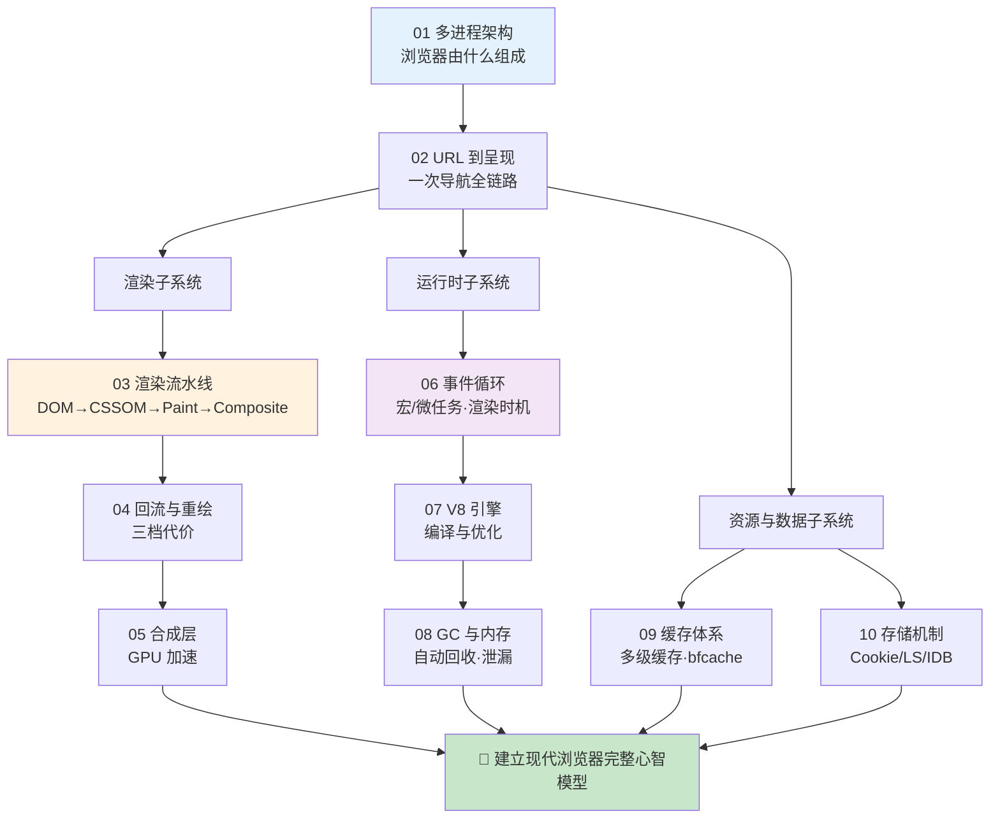

# 18 · 浏览器底层原理（Browser Principles）

> 从「敲下一个网址」到「像素点亮屏幕」，再到「JS 在引擎里如何被编译、内存如何被回收」——本工程把现代浏览器的**进程架构、导航、渲染流水线、事件循环、V8 引擎、垃圾回收、缓存与存储**逐层拆开讲透。本工程属于**「原理」类**：以**深度中文文档 + 大量 Mermaid 图**为主、demo 为辅，配套一篇《[原理详解.md](./原理详解.md)》把这些子系统串成一个完整心智模型。全部对照 **Chrome 开发者文档（Inside look at modern web browser 系列）/ web.dev / MDN / v8.dev** 权威资料整理，采用 2026 年近版本知识。

---

## 📚 模块索引

| 模块 | 知识点 | 核心内容 | 类型 |
| --- | --- | --- | --- |
| [01-browser-architecture](./01-browser-architecture/) | 多进程架构 📊 | Browser/Renderer/GPU/Network 进程、站点隔离、沙箱、线程模型 | 纯文档 |
| [02-url-to-render](./02-url-to-render/) | 输入 URL 到呈现 📊 | 全链路大流程图：URL 解析→缓存→DNS→TCP/TLS→请求→渲染 | 纯文档 |
| [03-rendering-pipeline](./03-rendering-pipeline/) | 渲染流水线 📊 | DOM→CSSOM→Render Tree→Layout→Paint→Composite | 文档 + demo |
| [04-reflow-repaint](./04-reflow-repaint/) | 回流与重绘 📊 | Reflow/Repaint/合成三档代价、布局抖动、分离读写 | 文档 + demo |
| [05-composite-layers](./05-composite-layers/) | 合成层 📊 | 图层/GPU 合成、`will-change`、层爆炸、只合成属性 | 文档 + demo |
| [06-event-loop-deep](./06-event-loop-deep/) | 事件循环深入 📊 | 宏/微任务、渲染时机、rAF、经典输出题 | 文档 + demo |
| [07-v8-engine](./07-v8-engine/) | V8 引擎 📊 | AST→字节码→JIT 分层编译、隐藏类、内联缓存、去优化 | 纯文档 |
| [08-gc-memory](./08-gc-memory/) | GC 与内存 📊 | 可达性、分代回收、标记清除/整理、内存泄漏排查 | 文档 + demo |
| [09-browser-cache-system](./09-browser-cache-system/) | 浏览器缓存体系 📊 | SW/内存/磁盘/Push 多级缓存查找、bfcache、缓存分区 | 纯文档 |
| [10-storage-mechanisms](./10-storage-mechanisms/) | 存储机制 📊 | Cookie/localStorage/sessionStorage/IndexedDB/Cache API 选型 | 文档 + demo |

📊 = 含重点原理图 / 时序图。**建议先通读 [原理详解.md](./原理详解.md) 建立全局心智模型，再逐模块深入。**

---

## 🗺️ 学习路线

**四阶段建议：**

1. **地基（01→02）**：先建立「浏览器是一堆协作进程」的骨架，再用「输入 URL 到呈现」这条主线把所有子系统串起来——这是整个工程的地图。
2. **渲染子系统（03→04→05）**：像素是怎么来的。从完整流水线，到回流/重绘的性能代价，再到 GPU 合成加速——前端性能优化最直接的一条线（04、05 已完成）。
3. **运行时子系统（06→07→08）**：JS 是怎么跑的。事件循环决定「何时执行」，V8 决定「如何编译执行」，GC 决定「内存如何回收」——理解卡顿、泄漏、性能陷阱的根源。
4. **资源与数据子系统（09→10）**：数据放哪、缓存怎么命中。多级缓存与 bfcache 决定「加载多快」，存储机制决定「数据存哪」。

> 提示：本工程与 `17-network-protocols`（网络协议）在导航链路的「网络部分」互补——本工程侧重浏览器**内部**如何处理，17 工程侧重**网络协议**本身；与 `23-performance-optimization`（性能优化）、`28-pwa` 也强相关，可交叉阅读。

---

## ▶️ 运行方式

- **纯文档模块**（01、02、07、09）：直接阅读 README + 原理详解，配合文中给出的 `chrome://` 页面、DevTools 面板观察。
- **含 demo 模块**（03、04、05、06、08、10）：浏览器直接打开对应目录的 `index.html` 即可（**免构建、无需 npm install**），配合 F12 DevTools 的 Performance / Rendering / Memory / Application 面板观察。

## 🔗 权威资料总入口

- Chrome 开发者文档 · Inside look at modern web browser（四部曲）：https://developer.chrome.com/blog/inside-browser-part1
- web.dev · Rendering performance / Critical Rendering Path：https://web.dev/learn/performance
- MDN · Web 性能与浏览器工作原理：https://developer.mozilla.org/zh-CN/docs/Web/Performance
- V8 官方博客：https://v8.dev/blog
