# 浏览器底层原理 · 原理详解

> 本文是 `18-browser-principles` 工程的**核心交付物**。目标不是罗列「怎么用」，而是把现代浏览器从**多进程架构**到**一次导航的完整链路**，再到**渲染流水线、事件循环、V8 编译、垃圾回收、缓存与存储**，串成一个**连贯的心智模型**——讲透 how / why / 底层机制。全文对照 **Chrome 开发者文档（Inside look at modern web browser 系列）/ web.dev / MDN / v8.dev**，配 17+ 张 Mermaid 图。当前时间 2026 年，采用近版本知识（含 Site Isolation、Sparkplug/Maglev、bfcache、缓存分区等）。

---

## 目录

1. [宏观：浏览器是一堆协作的进程](#一宏观浏览器是一堆协作的进程)
2. [导航：一次「输入 URL 到呈现」的全链路](#二导航一次输入-url-到呈现的全链路)
3. [渲染流水线：像素是怎么来的](#三渲染流水线像素是怎么来的)
4. [渲染性能：回流、重绘与合成三档代价](#四渲染性能回流重绘与合成三档代价)
5. [事件循环：JS 何时执行](#五事件循环js-何时执行)
6. [V8 引擎：JS 如何被编译执行](#六v8-引擎js-如何被编译执行)
7. [垃圾回收：内存如何自动释放](#七垃圾回收内存如何自动释放)
8. [缓存与存储：数据放哪、加载多快](#八缓存与存储数据放哪加载多快)
9. [终章：把所有子系统串成一张图](#九终章把所有子系统串成一张图)
10. [常见误区速查](#十常见误区速查)

---

## 一、宏观：浏览器是一堆协作的进程

早期浏览器是**单进程**的：所有标签页、渲染、插件、网络都跑在一个进程里。一个页面的死循环或崩溃，会拖垮整个浏览器；一个恶意页面的漏洞，可能直接读到你其它标签页的银行数据。现代浏览器（以 Chrome 为代表）改用**多进程架构**，用「隔离」换来**稳定性、安全性、并行性能**三大收益。

Chrome 的主要进程分工：

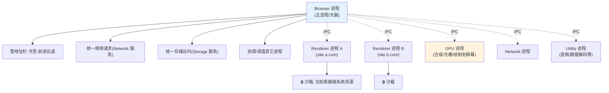

- **Browser 进程**：唯一的「主进程」，掌管浏览器 UI（地址栏、书签、前进后退按钮）、并把网络、存储收归为独立服务统一调度。
- **Renderer 进程**：负责把一个页面渲染出来，内部跑 **Blink 渲染引擎 + V8 引擎**。**每个站点（site）一个独立 Renderer**——这就是 **Site Isolation（站点隔离）**，让跨站数据被进程边界隔开，抵御 Spectre 这类旁路攻击。
- **GPU 进程**：集中处理来自各 Renderer 的合成与光栅化，最终把画面绘制到屏幕。
- **Network / Storage / Utility 进程**：服务化拆分，Browser 进程通过 **IPC（进程间通信）** 与它们协作。

关键的安全设计是**沙箱（sandbox）**：Renderer 进程**无权**直接访问文件系统、网络、系统调用——它想读文件或发请求，必须通过 IPC 请求 Browser 进程代办。这样即使页面里的 JS 攻破了 Renderer，也被关在沙箱里出不去。

**Renderer 进程内部又是多线程**：

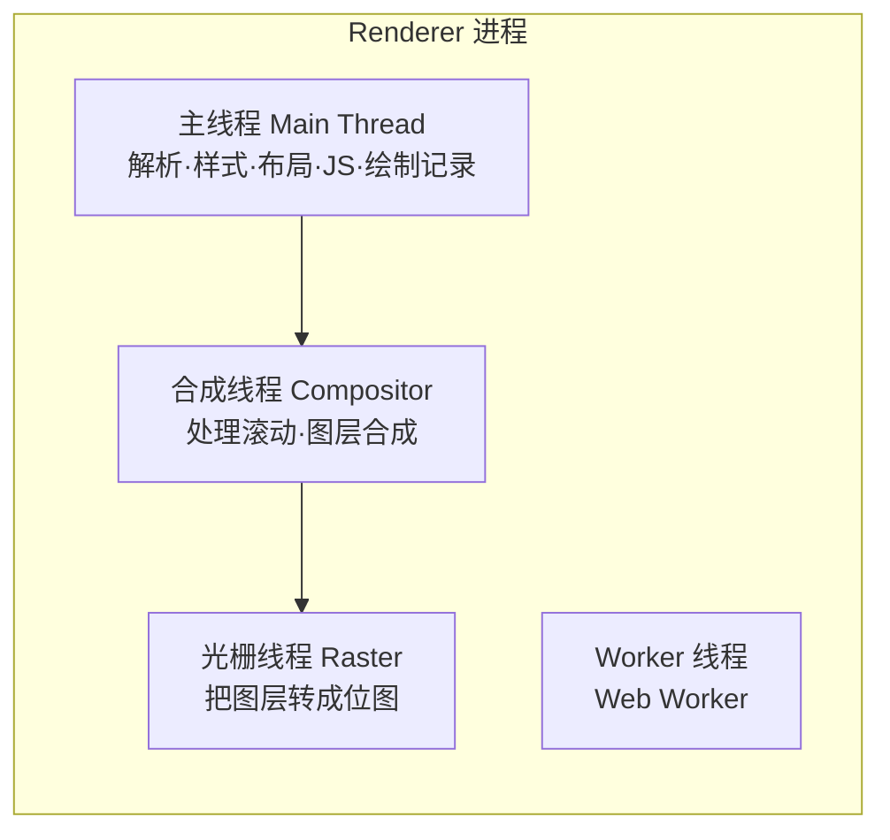

**主线程（main thread）是关键瓶颈**：JS 执行、DOM 构建、样式计算、布局、生成绘制指令都挤在这一条线程上。这正是「JS 长任务会卡住渲染」的根本原因——它们抢的是同一条线程。合成线程则相对独立，这也是为什么「只用 `transform`/`opacity` 做动画」能绕开主线程、保持顺滑（详见第四节）。

> 详见模块 [01-browser-architecture](./01-browser-architecture/)。观察工具：`chrome://process-internals`、任务管理器（Shift+Esc）。

---

## 二、导航：一次「输入 URL 到呈现」的全链路

这是前端面试的「终极大题」。把上一节的进程模型和后面的渲染流水线串起来，一次导航大致经历如下阶段：

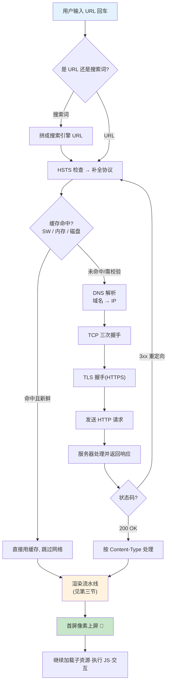

逐阶段拆解：

1. **URL 处理**：浏览器先判断输入是网址还是搜索词；命中 **HSTS** 列表的域名强制升级为 HTTPS。
2. **缓存检查（前置）**：在真正发网络请求前，浏览器先按 **Service Worker → 内存缓存 → 磁盘缓存** 的顺序查（详见第八节）。命中且新鲜就直接返回，最快的请求是**不请求**。
3. **DNS 解析**：把域名解析成 IP。查找顺序：浏览器 DNS 缓存 → 操作系统缓存 / hosts → 路由器 → ISP 递归解析器 →（根 → TLD → 权威服务器）。

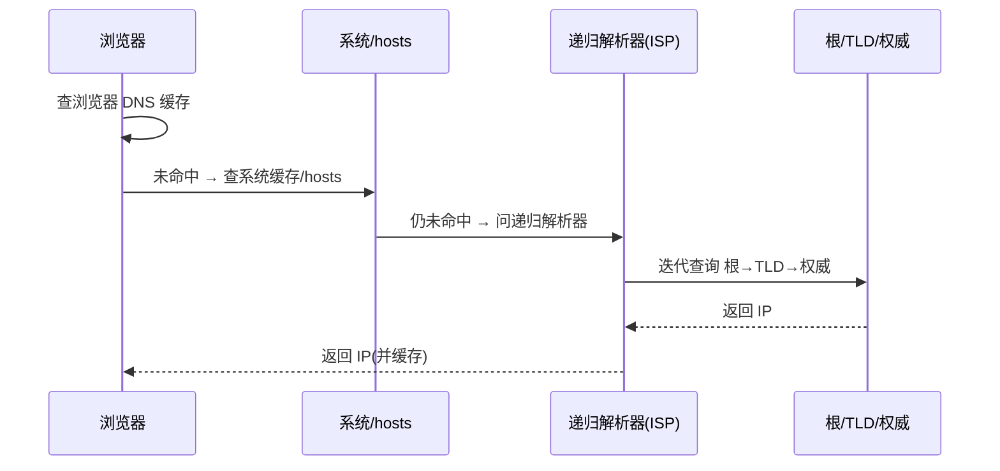

4. **建立连接**：拿到 IP 后进行 **TCP 三次握手**；HTTPS 再叠加 **TLS 握手**协商密钥（TLS 1.3 只需 1-RTT，会话复用可 0-RTT）。这部分协议细节见 `17-network-protocols` 工程。
5. **发请求 / 收响应**：发送 HTTP 请求，服务器返回响应。遇到 `3xx` 要跟随重定向；`200` 则根据 `Content-Type` 决定后续处理（HTML 走渲染、下载类走保存）。
6. **交给渲染流水线**：HTML 字节流开始被解析，进入下一节的流水线，直到首屏像素上屏；之后继续加载子资源、执行 JS、响应交互。

> 详见模块 [02-url-to-render](./02-url-to-render/)。观察工具：DevTools Network 面板的 Timing 分栏，能看到 DNS / Connecting / TLS / TTFB / Content Download 各段耗时。

---

## 三、渲染流水线：像素是怎么来的

拿到 HTML 后，Renderer 主线程把它变成屏幕上的像素，要走一条固定的**渲染流水线**：

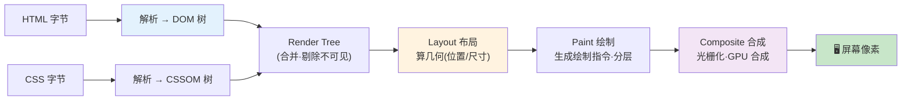

- **构建 DOM**：字节 → 字符 → token → node → **DOM 树**。HTML 解析是**流式**的，边下载边解析。浏览器还有**预加载扫描器（preload scanner）**，会提前扫描后续标签，抢跑下载 `img`/`script`/`link` 等资源。
- **构建 CSSOM**：CSS 被解析成 **CSSOM 树**。**CSS 会阻塞渲染**——没算完样式，浏览器不敢绘制（否则会闪现无样式内容 FOUC）。CSS 选择器**从右向左**匹配。
- **JavaScript 的阻塞**：默认的 `<script>` 会**阻塞 DOM 构建**（解析器遇到它就停下，下载并执行完再继续），而且 JS 可能读写样式，所以它还要**等 CSSOM 就绪**才能执行。

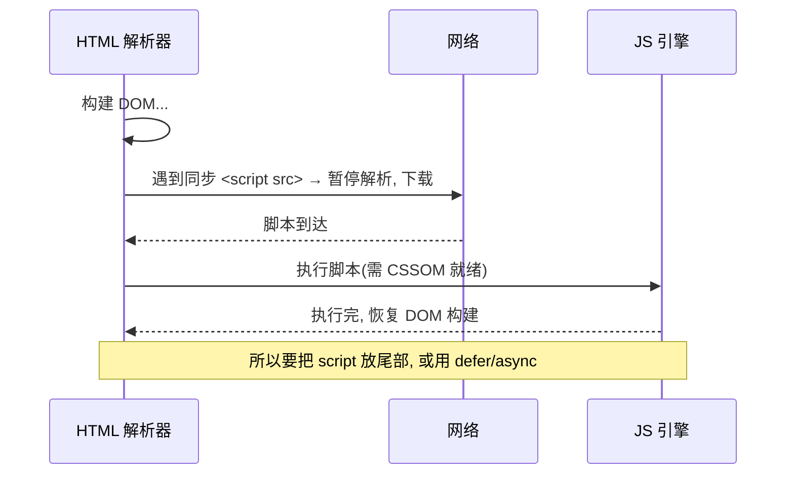

  - `defer`：下载不阻塞解析，**等 DOM 构建完、按顺序**执行（推荐）。
  - `async`：下载不阻塞解析，**下载完立即**执行（顺序不保证），适合独立第三方脚本。
- **Render Tree（渲染树）**：合并 DOM + CSSOM，**剔除不可见节点**（`display:none`、`<head>`），保留可见内容与伪元素。
- **Layout（布局 / 回流）**：为渲染树每个节点计算**精确几何**——在视口里的位置与尺寸（盒模型、相对单位换算）。
- **Paint（绘制）**：把布局结果转成**绘制指令**（先画哪个背景、再画哪个边框、文字……），并可能**分层（layer）**。
- **Composite（合成）**：把页面分成多个**图层**与**图块（tiles）**，交给**光栅线程**转成位图，再由**合成线程 + GPU** 拼合上屏。滚动、`transform`/`opacity` 动画可以只在合成阶段完成，**不劳烦主线程**。

**关键渲染路径（Critical Rendering Path）优化**的核心就是：减少阻塞渲染的关键资源、缩短这条流水线到首屏的长度——CSS 尽早、尽小；JS 用 `defer`/放尾部；避免超大 DOM。

> 详见模块 [03-rendering-pipeline](./03-rendering-pipeline/)。

---

## 四、渲染性能：回流、重绘与合成三档代价

首帧渲染走完整条流水线；此后每次改动，浏览器会**尽量只重跑必要的阶段**。这就形成了三档由贵到便宜的代价：

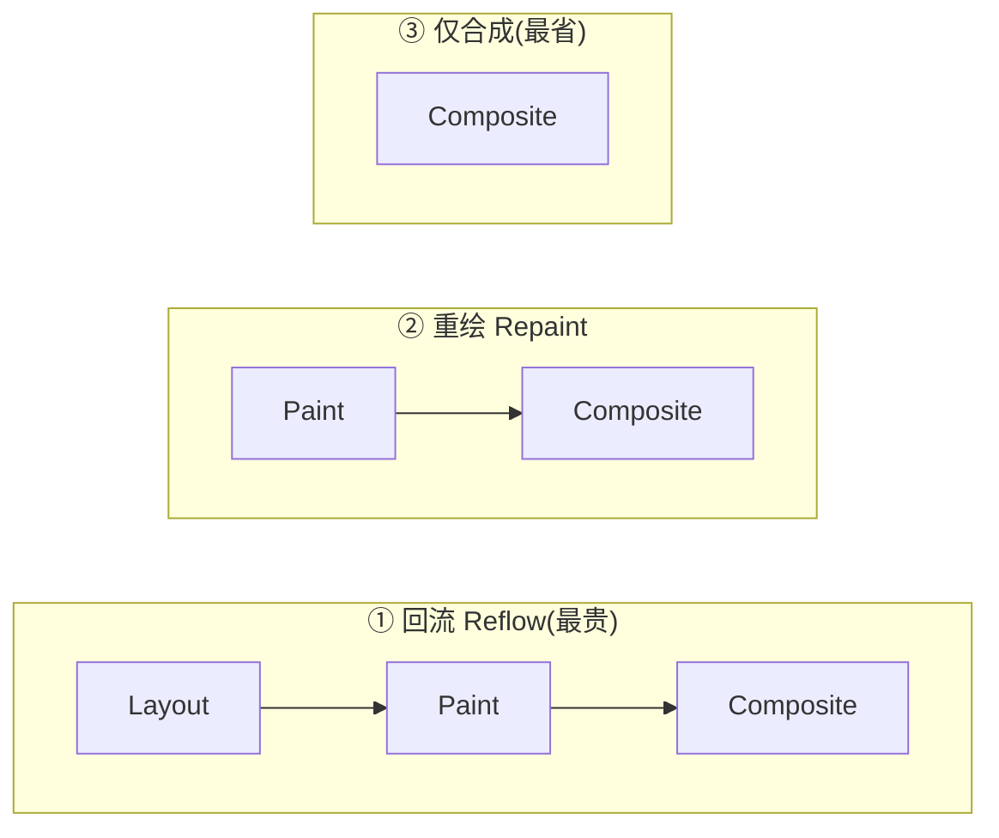

- **回流 Reflow（= Layout）**：改变**几何属性**（宽高、位置、增删节点、`display`）→ 重新布局，可能连锁影响整棵树，**最贵**。
- **重绘 Repaint（= Paint）**：只改**外观**（`color`、`background`、`visibility`）而几何不变 → 跳过布局，直接重画像素。
- **仅合成**：只改 `transform`/`opacity` → 连 Paint 都跳过，直接在**合成线程 / GPU** 处理，**最省、最顺**。

关系链：**回流 → 必然重绘 → 必然合成；重绘 → 必然合成；合成不回头。**

一个高频性能杀手是**强制同步布局 / 布局抖动（Layout Thrashing）**：浏览器本会**批量合并**多次样式修改、在帧末统一回流一次；但如果你**改样式后立刻读取布局属性**（`offsetTop`、`getBoundingClientRect()`……），浏览器为了给你准确值被迫**立即同步回流**。在循环里反复「写-读」就是灾难。口诀：**先批量读、再批量写（分离读写）**。

**合成层（Composite Layer）**：把频繁动的元素提升为**独立图层**（用 `will-change: transform` 或 `transform` 触发），它的动画就能只走合成、不触碰主线程。但图层不是免费的——每层都占显存，滥用会导致**层爆炸**，反而拖慢合成。

> 详见已完成模块 [04-reflow-repaint](./04-reflow-repaint/) 与 [05-composite-layers](./05-composite-layers/)。

---

## 五、事件循环：JS 何时执行

JS 是**单线程**的——同一时刻主线程只做一件事。那异步（定时器、网络、Promise）是怎么协调的？靠**事件循环（Event Loop）**。

核心数据结构：**调用栈 Call Stack**（当前正在执行的函数帧）、**堆 Heap**（对象内存）、**宏任务队列（task queue）**、**微任务队列（microtask queue）**。

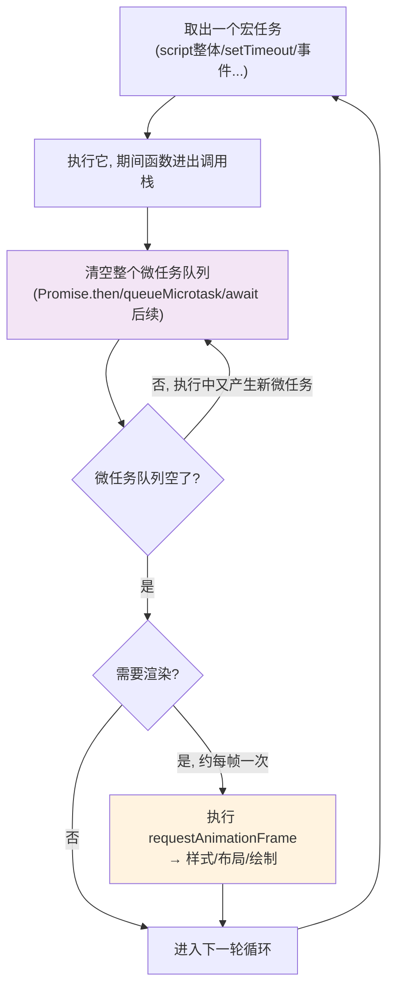

**一次 tick 的铁律**：

1. 取**一个**宏任务执行。
2. 执行完后，**清空整个微任务队列**——包括执行微任务过程中新产生的微任务（所以无限 `Promise` 递归会**饿死**渲染和其它宏任务）。
3. 需要时进行渲染：`requestAnimationFrame` 回调 → 样式 → 布局 → 绘制（约每帧一次，不是每个 tick 都渲染）。
4. 进入下一轮，再取下一个宏任务。

- **宏任务（macrotask）**：`<script>` 整体、`setTimeout`/`setInterval`、I/O、UI 事件、`MessageChannel`。
- **微任务（microtask）**：`Promise.then/catch/finally`、`queueMicrotask`、`MutationObserver`、`await` 之后的代码。

**记住关键差异：每执行完一个宏任务就清空所有微任务**——微任务的优先级高于「下一个宏任务」。

经典输出题：

```js
console.log('1 script start');
setTimeout(() => console.log('2 setTimeout'), 0);   // 宏任务
Promise.resolve()
  .then(() => console.log('3 promise1'))            // 微任务
  .then(() => console.log('4 promise2'));           // 微任务(链式)
console.log('5 script end');
// 输出: 1 → 5 → 3 → 4 → 2
// 同步先跑(1,5); script 宏任务结束后清空微任务(3,4); 最后才轮到 setTimeout 宏任务(2)
```

`async/await` 只是 Promise 的语法糖：`await x` 之后的代码等价于放进 `x.then(...)` 的微任务里。

> 详见模块 [06-event-loop-deep](./06-event-loop-deep/)（含可运行 demo 与多道经典题逐步分析）。Node 的事件循环有 6 个阶段 + `process.nextTick` 优先级更高，见 `10-nodejs`。

---

## 六、V8 引擎：JS 如何被编译执行

上一节讲「何时执行」，这一节讲「如何执行」。**V8** 是 Chrome / Node / Edge 用的 JS + WebAssembly 引擎（C++ 编写）。JS 是动态语言，V8 用**「解释器快速启动 + JIT 即时编译热点」**的分层策略兼顾启动速度与峰值性能：

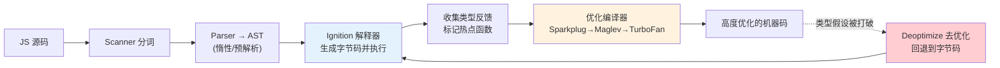

- **解析**：源码 → 分词 → **AST 抽象语法树**。V8 用**惰性/预解析（lazy parsing）** 跳过暂时用不到的函数体，加快启动。
- **Ignition 解释器**：把 AST 编译成紧凑的**字节码 bytecode** 并直接执行，同时**收集类型反馈**（这个变量一直是数字吗？这个对象结构稳定吗？）。
- **分层优化编译（tiered compilation）**：函数变「热」后，逐层交给更强的编译器——**Sparkplug**（快速基线编译器）→ **Maglev**（中层优化，较新）→ **TurboFan**（顶级优化），基于类型反馈生成**高度优化的机器码**。
- **去优化 Deoptimization**：优化建立在「类型假设」上。一旦假设被打破（本来一直是数字的变量突然变成字符串），V8 会**丢弃优化代码、回退到字节码**——性能骤降。

两个决定 JS 快慢的底层机制：

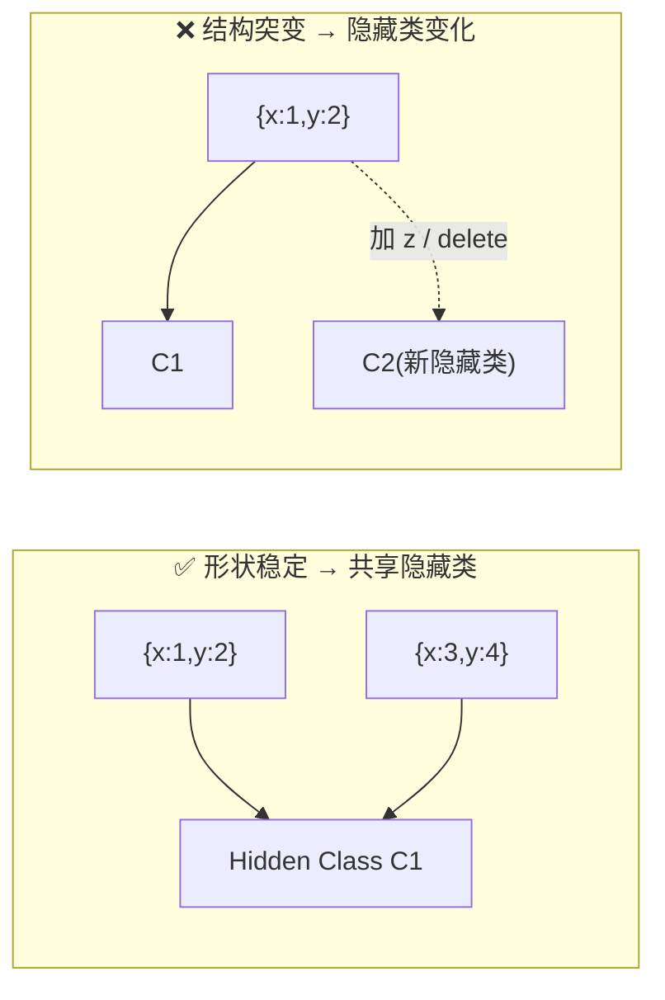

- **隐藏类（Hidden Class / Map / Shape）**：V8 给「结构相同」的对象分配同一个隐藏类，从而像静态语言一样用固定偏移量快速访问属性。**要点：以相同顺序初始化属性、别动态 `delete` 属性**，让对象「形状」稳定，才能共享隐藏类。
- **内联缓存（Inline Cache, IC）**：缓存属性访问的查找结果。如果某处访问的对象总是同一个隐藏类（**单态 monomorphic**），访问极快；如果混入多种形状会退化为**多态 polymorphic**、乃至**巨态 megamorphic**，缓存失效、变慢。

> 详见模块 [07-v8-engine](./07-v8-engine/)。观察工具：`node --print-bytecode`、`node --trace-opt --trace-deopt`、`d8`。

---

## 七、垃圾回收：内存如何自动释放

V8 帮你自动管理内存。它靠**可达性（reachability）** 判断「垃圾」：从一组 **GC Roots**（全局对象、当前调用栈、活动闭包）出发，凡是**引用链能到达**的对象都是「活的」，到达不了的就是垃圾，可回收。（这解决了引用计数法无法回收**循环引用**的缺陷。）

V8 采用**分代式回收（Generational GC）**——基于「大多数对象很快就死」的经验假设，把堆分成新生代和老生代，用不同算法：

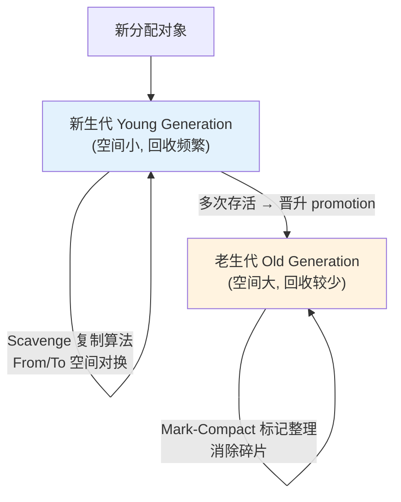

- **新生代**：用 **Scavenge（Cheney 复制算法）**，把 From 空间的存活对象复制到 To 空间再对换，回收快；多次存活的对象**晋升**到老生代。
- **老生代**：用**标记-清除（Mark-Sweep）** 找出并回收垃圾，再用**标记-整理（Mark-Compact）** 移动存活对象、消除内存碎片。

朴素 GC 会**「Stop-The-World」**（暂停 JS 造成卡顿）。V8 用一系列技术把停顿摊薄：**三色标记（tri-color marking）**、**增量标记（incremental marking）** 把标记切成小段穿插执行、**并发标记（concurrent marking）** 让辅助线程和 JS 并行标记、惰性清扫——配合**写屏障（write barrier）** 保证并发正确性。

**GC 帮不了内存泄漏**——只要对象仍可达，GC 就不会回收它。常见 JS 泄漏：

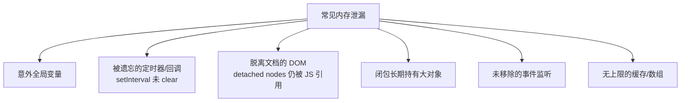

用 **WeakMap / WeakRef / FinalizationRegistry** 存「弱引用」，不会阻止 GC 回收目标对象，是缓存、DOM 关联数据的利器。排查用 DevTools **Memory 面板**：Heap snapshot 对比、Allocation instrumentation on timeline、Detached elements。

> 详见模块 [08-gc-memory](./08-gc-memory/)（含可复现泄漏的 demo）。

---

## 八、缓存与存储：数据放哪、加载多快

**缓存（cache）** 解决「加载多快」，**存储（storage）** 解决「数据放哪」——两者常被混淆，其实是两类问题。

### 8.1 多级缓存查找顺序

浏览器请求一个资源时，按层级从快到慢查找，命中即返回：

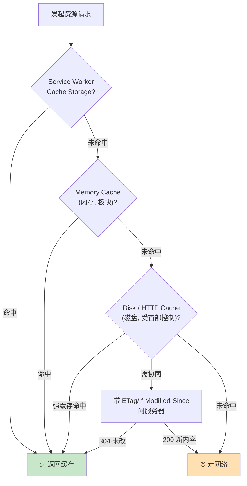

- **Service Worker / Cache Storage**：可编程拦截，能实现 Cache First / Network First / Stale-While-Revalidate 策略，是 PWA 离线的基础。
- **Memory Cache**：内存里，极快，随标签页生命周期，存放本次会话重复用到的资源。
- **Disk / HTTP Cache**：磁盘持久，跨会话，由 HTTP 首部（`Cache-Control`、`ETag`、`Last-Modified`）控制强缓存与协商缓存（首部细节见 `17-network-protocols/09-http-cache`）。
- **缓存分区（Cache Partitioning）**：现代浏览器按**顶级站点**隔离缓存，防止用共享缓存做跨站追踪。

另有 **bfcache（Back/Forward Cache，前进后退缓存）**：把整个页面快照（含 JS 堆、DOM）**冻结在内存**里，点后退时**秒开恢复**。注意别用 `unload` 事件、`Cache-Control: no-store` 等破坏 bfcache 资格。

### 8.2 客户端存储机制选型

```mermaid
flowchart TD
    Q1{"需要随请求<br/>自动发给服务器?"} -->|是| Cookie["🍪 Cookie<br/>4KB, 身份/会话, SameSite"]
    Q1 -->|否| Q2{"数据量大/结构化?"}
    Q2 -->|大量/结构化/离线| IDB["IndexedDB<br/>异步事务型 NoSQL"]
    Q2 -->|少量键值| Q3{"需要持久?"}
    Q3 -->|持久| LS["localStorage<br/>~5-10MB, 同步"]
    Q3 -->|随标签页会话| SS["sessionStorage"]
    Q2 -->|离线资源(Req/Res)| CS["Cache Storage"]
    style Cookie fill:#fff3e0
    style IDB fill:#e3f2fd
```

| 机制 | 容量 | 生命周期 | 同步/异步 | 随请求发送 | 典型场景 |
|---|---|---|---|---|---|
| Cookie | ~4KB | 可设过期 | 同步 | **是**（每次同源请求） | 会话/身份、CSRF 相关 |
| localStorage | ~5-10MB | 持久 | 同步（阻塞主线程） | 否 | 小量持久配置 |
| sessionStorage | ~5-10MB | 标签页会话 | 同步 | 否 | 临时会话数据 |
| IndexedDB | 大（按配额） | 持久 | **异步** | 否 | 大量结构化/离线数据 |
| Cache Storage | 大（按配额） | 持久 | 异步 | 否 | 离线资源（Req/Res 对） |

选型口诀：**要随请求带 → Cookie；小量持久配置 → localStorage；临时会话 → sessionStorage；大量结构化/离线 → IndexedDB；缓存资源 → Cache Storage。** 注意 `localStorage` 是**同步 API 会阻塞主线程**，别存大数据；任何客户端存储都别放敏感信息（可被 JS 读到，除非 `HttpOnly` Cookie）。

> 详见模块 [09-browser-cache-system](./09-browser-cache-system/) 与 [10-storage-mechanisms](./10-storage-mechanisms/)。

---

## 九、终章：把所有子系统串成一张图

把前八节的子系统拼起来，就是一次完整的「打开网页」在浏览器内部的全貌：

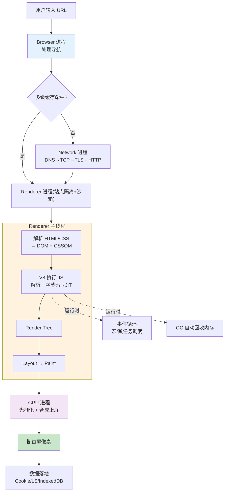

一句话总纲：**Browser 进程发起导航 → 命中缓存或走 Network 进程取到 HTML → 交给被沙箱隔离的 Renderer 进程；主线程解析出 DOM/CSSOM、V8 编译执行 JS、合成 Render Tree、布局绘制 → GPU 进程光栅合成上屏；整个运行期由事件循环调度宏/微任务、由 GC 自动回收内存；数据按需落地到 Cookie / localStorage / IndexedDB。**

---

## 十、常见误区速查

- **「浏览器是单进程的」**：现代浏览器是多进程 + 每进程多线程；一个页面的 JS 卡的是它所在 Renderer 的**主线程**，不影响别的进程。
- **「JS 慢是因为解释执行」**：V8 对热点函数做 JIT 编译成机器码；真正让 JS 变慢的往往是**去优化**（类型/对象形状不稳定）而非解释本身。
- **「`transform` 动画和 `left` 动画一样」**：`left` 触发回流（走完整流水线），`transform` 只走合成、能上 GPU，性能天差地别。
- **「微任务和宏任务谁先谁后看谁先写」**：不对——每个宏任务结束后会**清空所有微任务**，微任务整体优先于下一个宏任务。
- **「`setTimeout(fn, 0)` 会立刻执行」**：它只是「尽快作为**宏任务**排队」，要等当前同步代码 + 所有微任务跑完；且嵌套超过 5 层会被钳制到 4ms。
- **「GC 能防止内存泄漏」**：GC 只回收**不可达**对象；只要还有引用（遗忘的定时器、detached DOM、全局缓存），就永远不会被回收。
- **「缓存 = HTTP 缓存」**：HTTP/磁盘缓存只是多级缓存的一层，上面还有 Service Worker、Memory Cache，旁边还有 bfcache。
- **「localStorage 存啥都行」**：它是**同步**的会阻塞主线程、上限约 5-10MB、且**明文可被 JS 读取**，别存大数据和敏感信息。
- **「`will-change` 越多越流畅」**：每个合成层都吃显存，滥用导致**层爆炸**反而更卡，只给真正频繁动画的元素加。

---

## 🔗 权威资料

- Chrome 开发者文档 · Inside look at modern web browser（Part 1-4）：https://developer.chrome.com/blog/inside-browser-part1
- web.dev · Learn Performance / Rendering performance：https://web.dev/learn/performance
- web.dev · Critical Rendering Path：https://web.dev/articles/critical-rendering-path
- web.dev · Back/forward cache（bfcache）：https://web.dev/articles/bfcache
- MDN · The event loop：https://developer.mozilla.org/zh-CN/docs/Web/JavaScript/Event_loop
- MDN · Memory management：https://developer.mozilla.org/zh-CN/docs/Web/JavaScript/Memory_management
- MDN · Client-side storage：https://developer.mozilla.org/en-US/docs/Learn_web_development/Extensions/Client-side_APIs/Client-side_storage
- V8 官方博客（编译管线 / GC）：https://v8.dev/blog
