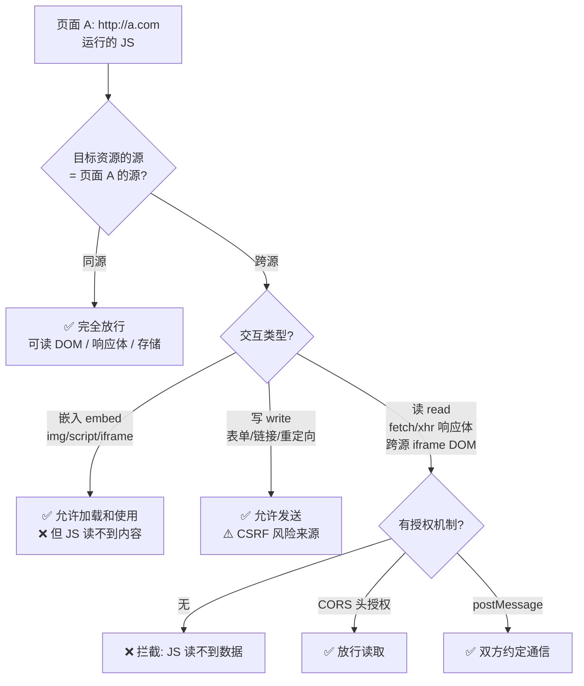
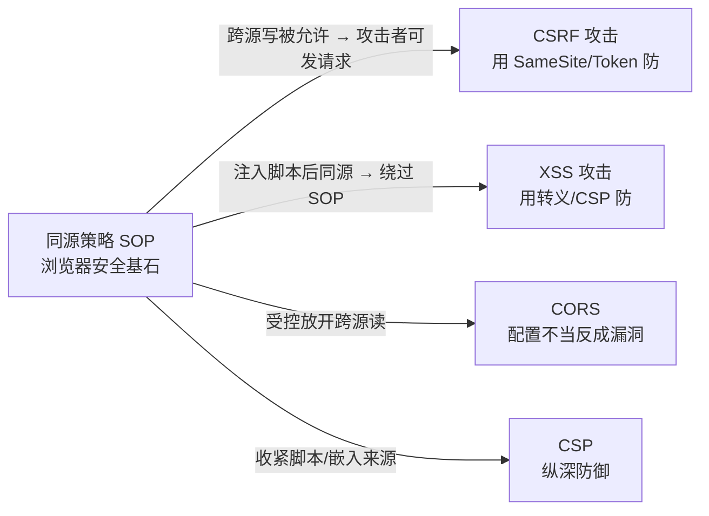

# 01 · 同源策略（Same-Origin Policy, SOP）

> 同源策略是浏览器最核心的安全基石：它规定「一个源（origin）的脚本默认不能读取另一个源的数据」。理解它，就理解了 XSS、CSRF、CORS、CSP 这一整套防御体系为什么存在。

## 📖 知识讲解

### 什么是「源（Origin）」

一个 URL 的**源**由三元组决定，三者必须**全部相同**才算同源：

```
协议(scheme)  +  主机(host)  +  端口(port)
```

以 `http://store.company.com/dir/page.html` 为基准：

| 对比 URL | 是否同源 | 原因 |
|----------|---------|------|
| `http://store.company.com/dir2/other.html` | ✅ 同源 | 只有路径不同（路径不参与判定） |
| `http://store.company.com/dir/inner/x.html` | ✅ 同源 | 路径不影响 |
| `https://store.company.com/page.html` | ❌ 跨源 | 协议不同（http vs https） |
| `http://store.company.com:81/dir/page.html` | ❌ 跨源 | 端口不同（默认 80 vs 81） |
| `http://news.company.com/dir/page.html` | ❌ 跨源 | 主机（子域名）不同 |

> ⚠️ 常见误区：`www.a.com` 和 `a.com` 是**跨源**（host 字符串不同）；`http` 默认端口 80、`https` 默认端口 443，写不写端口号只要实际端口一致就同源。

### 同源策略限制什么

SOP 把跨源交互分为三类，限制程度完全不同：

| 交互类型 | 是否允许 | 说明 |
|----------|---------|------|
| **跨源写（Write）** | ✅ 通常允许 | 链接跳转、重定向、表单提交都能发到别的源。**这正是 CSRF 的根源** |
| **跨源嵌入（Embed）** | ✅ 通常允许 | `<script>`、``、`<link>`、`<iframe>`、`<video>`、`@font-face` 都能加载别的源的资源 |
| **跨源读（Read）** | ❌ 默认禁止 | JS 不能读取跨源响应的内容、不能读跨源 iframe 的 DOM、不能读别的源的 Cookie/localStorage。**这是 SOP 保护的核心** |

一句话记忆：**能「用」别人的资源，但不能「读」别人的数据**。

- `` 能显示图片（嵌入），但 JS 读不到图片的像素字节（跨源读被 canvas「污染 tainted」机制拦住）。
- `<script src="https://cdn.com/lib.js">` 能执行脚本（嵌入），但拿不到脚本源码文本。
- `fetch('https://other.com/api')` 请求能发出去，但没有 CORS 头时，JS **读不到**返回体（响应到达浏览器但被拦在 JS 之外）。

### 为什么需要它

设想没有 SOP：你登录网银后打开一个恶意页面，恶意页面的 JS 就能直接 `fetch('https://bank.com/account')` 并**读到你的余额、转账记录**，因为浏览器会自动带上你的网银 Cookie。SOP 正是通过「禁止跨源读」把不同网站的数据隔离开，防止恶意站点窃取你在其他站点的敏感数据。

### SOP 的「放行」与「绕过」机制

SOP 不是铁板一块，存在若干**受控的**跨源通道：

- **CORS**：服务器用 `Access-Control-Allow-Origin` 等响应头**主动授权**特定源可以读响应（见 04 模块）。
- **postMessage**：不同源的窗口/iframe 之间用 `window.postMessage()` 安全通信（需校验 `event.origin`）。
- **JSONP**（历史遗留）：利用 `<script>` 可跨源嵌入的特性绕过读限制，已被 CORS 取代，有安全风险。
- **document.domain**：已废弃，设置后会把端口置为 null，破坏安全模型，不要再用。
- **CSP / CORP / COEP / COOP**：更细粒度的跨源资源隔离头。

### 存储的隔离

每个源拥有**独立**的存储空间，互不可读：

- `localStorage` / `sessionStorage`：严格按源隔离。
- `IndexedDB`：按源隔离。
- `Cookie`：规则特殊——按域名（可设父域）+ 路径隔离，不完全等同 origin，且受 SameSite、Public Suffix List 约束（这也是 Cookie 会引发 CSRF 的原因）。

## 🔄 流程图 / 原理图





## 💻 代码说明

本模块用 `index.html` 演示同源策略如何**拦截跨源 iframe 的 DOM 读取**。核心代码：

```js
// 尝试读取一个跨源 iframe 的 document —— 会被 SOP 抛出 SecurityError
try {
  const doc = crossOriginIframe.contentWindow.document; // 跨源读，禁止
  log('读取成功: ' + doc.title);
} catch (e) {
  // 浏览器抛出: "Blocked a frame with origin ... from accessing a cross-origin frame."
  log('❌ 被同源策略拦截: ' + e.message);
}
```

而对**同源** iframe，同样的代码可以正常读到 `document.title`。这直观展示了「同源可读、跨源不可读」的边界。demo 还演示了跨源合法通信应改用 `postMessage`。

## ▶️ 运行方式

免构建，直接用浏览器打开 `index.html` 即可（`file://` 下同源判定也生效）。打开浏览器控制台观察输出。

> 若想更真实地体验，可用两个不同端口起本地服务制造「跨源」：
> ```bash
> npx http-server . -p 8080   # 页面 A
> npx http-server . -p 8081   # 作为跨源 iframe 源
> ```

## ⚠️ 常见坑 / 最佳实践

- **子域名不同 = 跨源**：`app.a.com` 与 `api.a.com` 之间 fetch 需要配 CORS。
- **协议升级即跨源**：http → https 会导致同源判定失败，注意混合内容。
- SOP **只约束脚本读取**，不阻止请求发出——所以「跨源请求失败」时请求其实已经到了服务器，服务器已可能产生副作用（这正是 CSRF 能得逞的原因）。
- 不要用已废弃的 `document.domain` 放宽同源，改用 CORS + postMessage。
- SOP 一旦被 XSS 突破（脚本注入进目标页面，就获得了目标源的身份），所有基于 SOP 的隔离都失效——所以 XSS 是「万恶之源」。

## 🔗 官方文档

- MDN 同源策略：<https://developer.mozilla.org/zh-CN/docs/Web/Security/Same-origin_policy>
- MDN Origin 定义：<https://developer.mozilla.org/zh-CN/docs/Glossary/Origin>
- MDN postMessage：<https://developer.mozilla.org/zh-CN/docs/Web/API/Window/postMessage>
