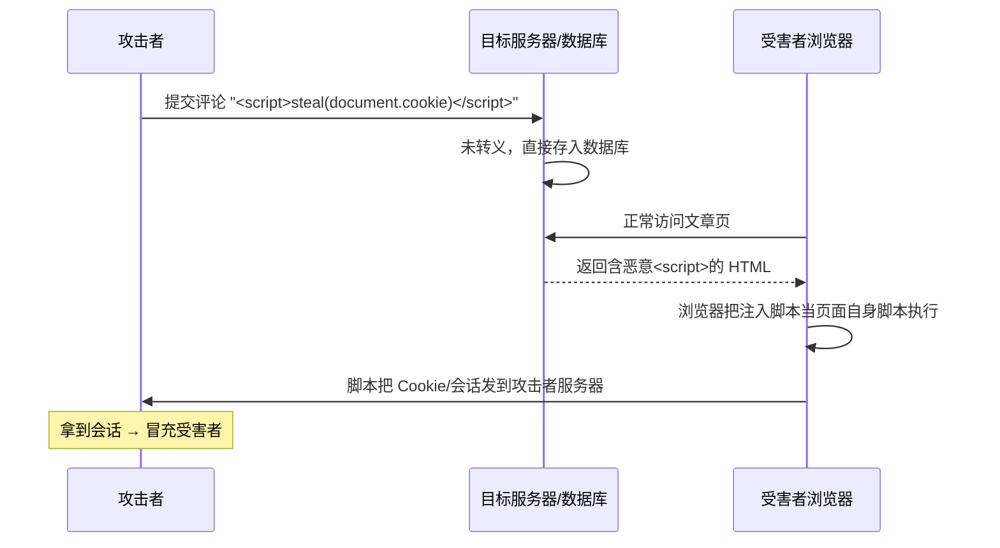
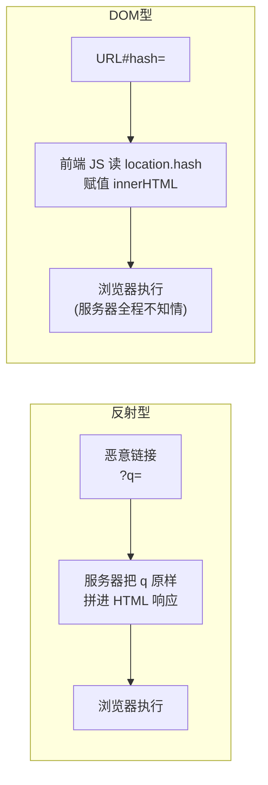

# 02 · 跨站脚本攻击（XSS, Cross-Site Scripting）

> XSS 是把攻击者控制的脚本注入到受害者浏览器中、以**受害者身份在目标站点的源里执行**的攻击。因为注入的脚本获得了目标源的身份，等于突破了同源策略——所以 XSS 被称为「Web 安全的万恶之源」。

## 📖 知识讲解

### XSS 的本质

Web 页面把**不可信的用户输入**当作 **HTML/JS 代码**输出，导致浏览器把数据「误当成程序」执行。只要攻击者的 `<script>` 在你的页面里跑起来，它就能：

- 窃取 Cookie / localStorage 中的会话令牌（`document.cookie`）
- 冒充你发请求（转账、发帖、改密码），且天然带上你的会话
- 篡改页面（钓鱼表单）、记录键盘、发起蠕虫式传播

### 三种类型

| 类型 | 恶意脚本存在哪 | 触发方式 | 影响范围 |
|------|--------------|---------|---------|
| **存储型 Stored** | 持久化到服务器（数据库、评论、留言、用户资料） | 任何人访问该内容页即中招 | 最严重，可影响所有访客，可蠕虫式扩散 |
| **反射型 Reflected** | 不落库，藏在 URL / 请求参数里，被服务器「反射」回响应 | 诱骗受害者点击构造好的恶意链接 | 单次、针对被诱导的用户 |
| **DOM 型 DOM-based** | 不经过服务器，纯前端 JS 用不可信数据写 DOM | 前端 `innerHTML`/`document.write`/`location` 等 sink 触发 | 服务器日志看不到，隐蔽性强 |

**存储型 vs 反射型的区别在「脚本存哪」**：存储型写进了服务器数据库，反射型只是把请求参数原样回显。
**DOM 型的区别在「不经过服务器」**：漏洞完全在客户端 JS 里，服务器响应本身是干净的。

### 危险的「源（source）」与「汇（sink）」

DOM 型 XSS 关注数据从**来源**流向**危险汇点**：

- 常见来源 source：`location.href` / `location.hash` / `location.search`、`document.referrer`、`window.name`、`postMessage` 数据。
- 常见危险汇 sink：`element.innerHTML` / `outerHTML`、`document.write()`、`eval()`、`setTimeout(字符串)`、`new Function()`、`element.setAttribute('href', ...)`（`javascript:` 协议）、`insertAdjacentHTML`。

### 防御体系（多层纵深）

1. **输出编码 / 转义（首要且最有效）**：把数据放进页面时，按**上下文**转义。
   - HTML 文本上下文：`& < > " '` → `&amp; &lt; &gt; &quot; &#x27;`
   - HTML 属性上下文：属性值加引号并转义。
   - JS 上下文、URL 上下文、CSS 上下文各有不同的转义规则，不能混用。
   - **优先用框架的自动转义**：React 的 `{}`、Vue 的 `{{ }}`、模板引擎默认转义，天然安全。危险的是 `dangerouslySetInnerHTML` / `v-html` / `innerHTML`。
2. **避免危险 sink**：能用 `textContent` 就绝不用 `innerHTML`；不用 `eval`/`document.write`。
3. **输入侧校验/净化**：需要富文本时，用成熟库（如 **DOMPurify**）做 HTML 净化白名单，不要自己写正则过滤（易被绕过）。
4. **CSP（内容安全策略）**：作为**纵深防御的最后一道**，即使有注入点，`script-src 'nonce-xxx'` 也能阻止未授权脚本执行（见 05 模块）。
5. **HttpOnly Cookie**：给会话 Cookie 加 `HttpOnly`，让 `document.cookie` 读不到它，降低 XSS 窃取会话的危害（但不能防 XSS 本身）。
6. **Trusted Types**：现代浏览器可用 `require-trusted-types-for 'script'` 从根上锁死危险 sink 赋值。

> ⚠️ 记住优先级：**转义 > 净化 > CSP**。CSP 是兜底，不是替代转义。

## 🔄 流程图 / 原理图

存储型 XSS 攻击流程：



反射型 vs DOM 型 数据流对比：



## 💻 代码说明

本模块提供两个 demo，**对照体验**同一功能的漏洞版与安全版：

- `vulnerable.html`：**漏洞版**。用 `innerHTML` 直接把 URL 参数 / 输入框内容写进页面，输入 `` 即弹窗，演示反射型与 DOM 型注入。
- `safe.html`：**安全版**。同样功能，改用 `textContent`（自动转义）和手写的 HTML 转义函数，注入无效，标签被当作纯文本显示。

漏洞版关键（**错误示范**）：
```js
// ❌ 危险：把用户输入当 HTML 解析，onerror 会执行
output.innerHTML = userInput;
```

安全版关键（**正确做法**）：
```js
// ✅ 安全：textContent 只写文本，标签被转义显示，脚本不执行
output.textContent = userInput;

// 若确实要输出 HTML 片段，先转义特殊字符
function escapeHtml(s) {
  return s.replace(/&/g, '&amp;').replace(/</g, '&lt;')
          .replace(/>/g, '&gt;').replace(/"/g, '&quot;')
          .replace(/'/g, '&#x27;');
}
```

## ▶️ 运行方式

免构建，直接浏览器打开：
- 先开 `vulnerable.html`，在输入框粘贴 `` 点击提交 → 弹窗（注入成功）。
- 再开 `safe.html`，同样输入 → 标签原样显示为文本，**不弹窗**（防御成功）。

也可测试 DOM 型：打开 `vulnerable.html#` 观察 hash 触发。

## ⚠️ 常见坑 / 最佳实践

- **别用黑名单正则过滤**「script」关键字，绕过方式无穷（大小写、编码、`<svg onload>`、`javascript:` 协议、事件属性…）。用白名单净化库 DOMPurify。
- **转义要分上下文**：HTML 里安全的转义，放进 `<script>` 或 `href` 里可能仍有 XSS。
- `React` 的 `dangerouslySetInnerHTML`、`Vue` 的 `v-html`、Angular 的 `bypassSecurityTrust*` 是主动关闭了框架保护，必须配合 DOMPurify。
- 富文本编辑器输出、Markdown 渲染、SVG 上传、`href`/`src` 用户可控 URL（`javascript:`）都是高发点。
- CSP 是兜底不是免死金牌，仍要做输出转义。
- 给会话 Cookie 加 `HttpOnly` + `Secure`，即便中招也降低会话被盗风险。

## 🔗 官方文档

- OWASP XSS：<https://owasp.org/www-community/attacks/xss/>
- OWASP XSS Prevention Cheat Sheet：<https://cheatsheetseries.owasp.org/cheatsheets/Cross_Site_Scripting_Prevention_Cheat_Sheet.html>
- OWASP DOM XSS Prevention：<https://cheatsheetseries.owasp.org/cheatsheets/DOM_based_XSS_Prevention_Cheat_Sheet.html>
- MDN CSP：<https://developer.mozilla.org/zh-CN/docs/Web/HTTP/CSP>
- DOMPurify：<https://github.com/cure53/DOMPurify>
