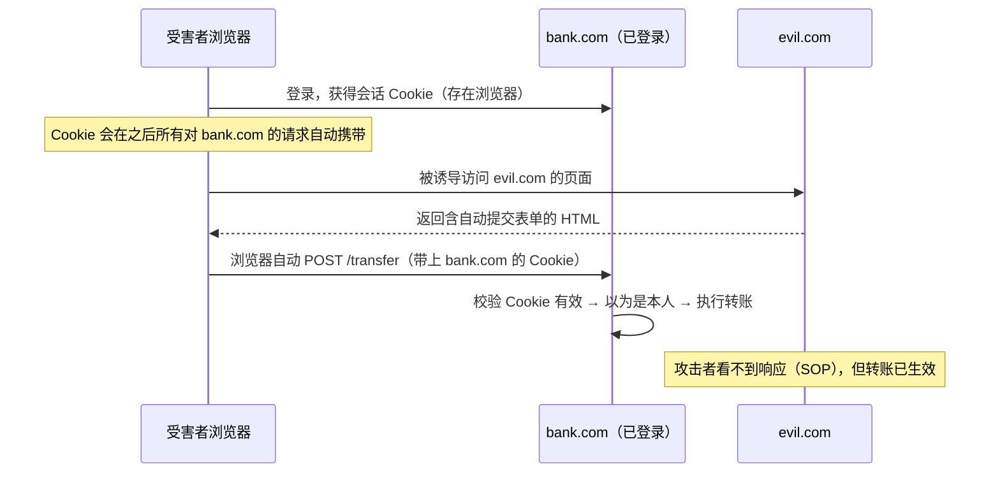
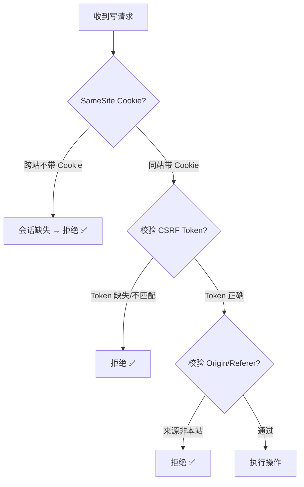

# 03 · 跨站请求伪造（CSRF, Cross-Site Request Forgery）

> CSRF 诱导已登录用户的浏览器，在用户不知情的情况下向目标站点发出「带着用户会话 Cookie」的请求，从而以用户身份执行操作（改邮箱、转账、改密码）。它利用的是同源策略「允许跨源写」+「Cookie 自动携带」这两个特性。

## 📖 知识讲解

### 攻击本质

浏览器有个「贴心」的行为：只要向某个域发请求，就**自动带上该域的 Cookie**，无论请求是从哪个页面发起的。攻击者利用这点：诱导你（已登录网银）访问恶意页，恶意页偷偷向网银发一个转账请求，浏览器自动带上你的网银会话 Cookie，服务器以为是你本人操作。

**关键**：攻击者**看不到**响应（同源策略挡住跨源读），但请求已经**发出并生效**——CSRF 攻击的是「写操作/副作用」，不是窃取数据。

### 成立的三个条件（PortSwigger）

1. **有价值的操作**：存在攻击者想代替用户执行的功能（改密码、转账、改邮箱）。
2. **仅靠 Cookie 鉴别会话**：应用仅依赖会话 Cookie 识别用户，没有额外校验。
3. **参数可预测**：请求参数攻击者能全部猜出/构造，没有不可预测的秘密值。

三者同时满足才可被 CSRF。防御的核心就是**打破第 2、3 条**。

### 常见攻击载体

```html
<!-- 自动提交的隐藏表单：受害者一打开页面就发出 POST -->
<form action="https://bank.com/transfer" method="POST" id="f">
  <input type="hidden" name="to" value="attacker">
  <input type="hidden" name="amount" value="10000">
</form>
<script>document.getElementById('f').submit();</script>

<!-- GET 型更简单：一张图片就能发请求 -->

```

### 防御手段

| 防御 | 原理 | 说明 |
|------|------|------|
| **CSRF Token（同步器令牌）** | 服务器给表单/页面下发一个**不可预测的秘密 token**，提交时校验；攻击者页面拿不到这个 token（跨源读不到），伪造请求缺 token 被拒 | 最可靠。打破「参数可预测」 |
| **SameSite Cookie** | 给会话 Cookie 加 `SameSite=Lax`（默认）或 `Strict`，浏览器在**跨站请求**时不携带该 Cookie | 打破「Cookie 自动携带」。现代浏览器默认 Lax |
| **双重提交 Cookie** | token 同时放 Cookie 和请求头/表单，服务器比对两者是否一致 | 无状态实现，适合前后端分离 |
| **自定义请求头（如 `X-Requested-With`）** | 跨站的简单表单无法自定义头，需要 CORS 预检；服务器要求带特定头 | 适合 AJAX/JSON API |
| **校验 Origin / Referer** | 服务器检查请求来源是否为本站 | 次要手段，Referer 可能缺失，不如 token 可靠 |
| **敏感操作二次确认** | 改密码要求输旧密码、转账要短信验证码 | 打破「参数可预测」 |

**SameSite 三个值**：
- `Strict`：完全不在任何跨站请求中带 Cookie（连从外站点链接跳转进来都不带，体验略差）。
- `Lax`（现代浏览器默认）：顶级导航的 GET（如点链接跳转）会带，但跨站 POST / iframe / img / fetch 不带——挡住绝大多数 CSRF。
- `None`：跨站也带，**必须同时加 `Secure`**（仅 HTTPS）。用于确实需要跨站的第三方 Cookie。

> ⚠️ SameSite=Lax 默认能防大部分 CSRF，但**不能完全替代 CSRF Token**：例如同站不同子域、GET 型副作用操作、或需要兼容老浏览器时。推荐 **Token + SameSite 双管齐下**。

### CSRF 与 XSS 的关系

- **XSS 能击穿一切 CSRF 防御**：注入的脚本运行在目标源里，能读到 CSRF Token，自然能构造合法请求。所以「先修 XSS」。
- CSRF 防的是「别的站点冒充你」，XSS 防的是「脚本注入你的站点」。

## 🔄 流程图 / 原理图





## 💻 代码说明

本模块用两个文件演示（**均仅供学习**）：

- `victim-app.html`：模拟一个「已登录的目标应用」，提供「修改邮箱」功能。切换开关演示**无防御**（任何请求都执行）与**有 CSRF Token 防御**（校验隐藏 token）两种情况。
- `attacker.html`：模拟攻击者页面，内含一个**自动提交的隐藏表单**，指向目标应用的修改邮箱接口。

关键防御代码（服务器侧伪码 + 前端）：
```js
// 服务器渲染表单时下发一次性 token，存入会话
const csrfToken = crypto.randomUUID();
session.csrfToken = csrfToken;   // 服务器记住
// 表单里放隐藏字段 <input type="hidden" name="_csrf" value={csrfToken}>

// 处理提交时校验：攻击者的跨站表单拿不到这个 token
if (req.body._csrf !== session.csrfToken) {
  return res.status(403).send('CSRF token 校验失败');
}
```

## ▶️ 运行方式

免构建，浏览器打开 `victim-app.html`（保持打开，模拟已登录状态），再打开 `attacker.html`，观察其自动提交如何影响目标应用；然后在目标应用里打开「CSRF Token 防御」开关，再次尝试，攻击被拦截。

> 说明：因是纯前端演示，用 `localStorage` 模拟服务器会话与数据。真实防御逻辑（token 校验）已在代码中体现。

## ⚠️ 常见坑 / 最佳实践

- **GET 不应有副作用**：把「转账/删除」做成 GET，一张 `` 就能触发 CSRF。写操作一律用 POST/PUT/DELETE。
- SameSite=Lax 是默认但**不是万能**，仍要配 Token（尤其 SPA、跨子域、老浏览器）。
- `SameSite=None` 必须配 `Secure`，否则浏览器丢弃该 Cookie。
- CSRF Token 要**每会话（或每请求）随机、不可预测、与会话绑定**，不能放在 URL 里（会泄露到 Referer/日志）。
- 纯 Token（放请求头）的 JSON API + CORS 严格配置，天然对简单表单 CSRF 有抵抗力，但仍建议显式防御。
- 先修 XSS：有 XSS 时任何 CSRF 防御都形同虚设。

## 🔗 官方文档

- PortSwigger CSRF：<https://portswigger.net/web-security/csrf>
- OWASP CSRF Prevention Cheat Sheet：<https://cheatsheetseries.owasp.org/cheatsheets/Cross-Site_Request_Forgery_Prevention_Cheat_Sheet.html>
- MDN SameSite cookies：<https://developer.mozilla.org/zh-CN/docs/Web/HTTP/Headers/Set-Cookie/SameSite>
