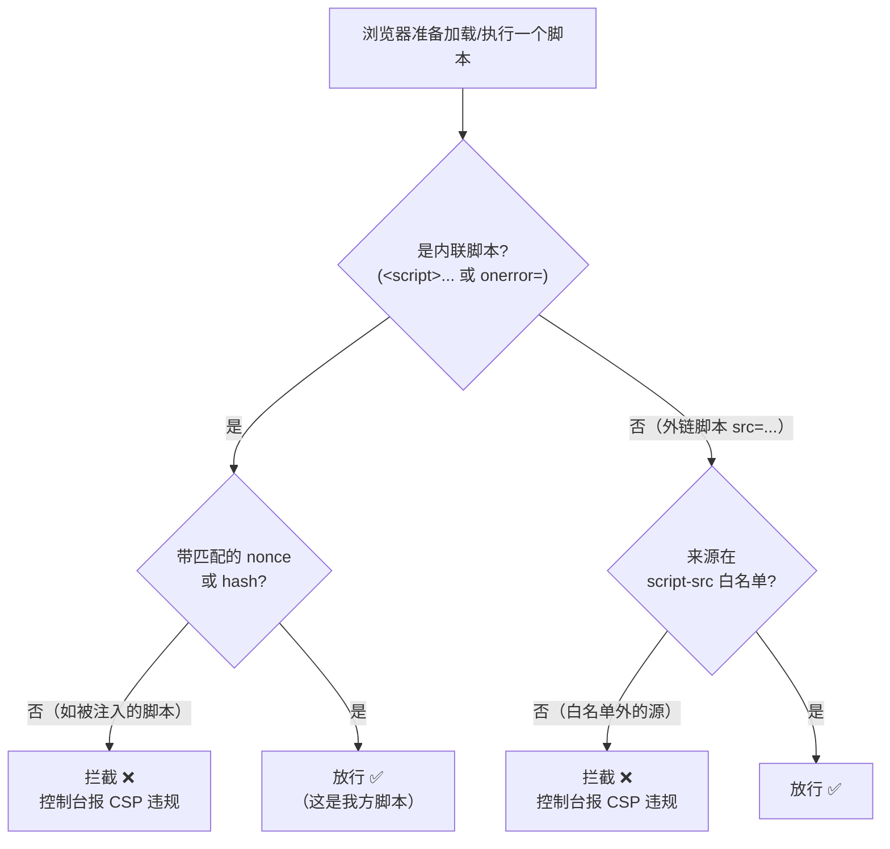
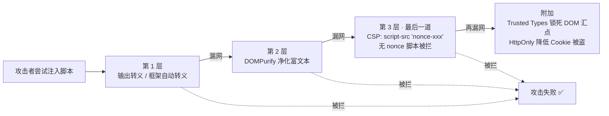

# 05 · 内容安全策略（CSP, Content Security Policy）

> CSP 是浏览器层面的一份「白名单声明」：由服务器通过 HTTP 响应头下发，告诉浏览器「这个页面只允许从哪些来源加载/执行脚本、样式、图片等资源」。它是 XSS **纵深防御的最后一道**——即使攻击者找到了注入点，未被授权的脚本也跑不起来。

## 📖 知识讲解

### CSP 是什么、解决什么问题

前面的 XSS 防御（输出转义、DOMPurify 净化）都是「不让攻击者的代码进来」。但没有任何过滤是 100% 的。CSP 换了个思路：**假设注入已经发生**，退一步守住「即便进来了也别让它执行」。

浏览器加载并执行每一个资源前，都会拿 CSP 里的规则比对：脚本来源在不在白名单？是内联脚本吗？有没有合法的 nonce/hash？不满足就**直接拦截**并在控制台报错。所以 CSP 是「兜底」而不是「替代」——转义仍要做，CSP 是最后一道保险。

> ⚠️ 优先级：**输出转义 > 净化（DOMPurify）> CSP**。CSP 不是免死金牌，是纵深防御的最后一层。

### 怎么下发 CSP

两种方式，**优先用响应头**：

```
# 方式一：HTTP 响应头（推荐，能力最全，可用 frame-ancestors、report-to 等）
Content-Security-Policy: default-src 'self'; script-src 'nonce-r4nd0m'; object-src 'none'

# 方式二：<meta> 标签（无法配置服务器时的退路）
<meta http-equiv="Content-Security-Policy" content="default-src 'self'; script-src 'nonce-r4nd0m'">
```

`<meta>` 方式受限：**不支持 `frame-ancestors`、`report-uri`/`report-to`、`sandbox`** 等指令（这些只能走响应头）。本模块的 demo 因为要「浏览器直接打开」，用的是 `<meta>` 方式。

### 核心指令（directives）

| 指令 | 管控对象 |
|------|---------|
| `default-src` | 兜底：其它 `*-src` 没显式声明时回退到它 |
| `script-src` | JS 脚本（含内联、外链、`eval`） |
| `style-src` | CSS 样式（含内联样式、外链样式表） |
| `img-src` | 图片来源 |
| `connect-src` | `fetch` / `XHR` / `WebSocket` / `EventSource` 能连的地址 |
| `frame-ancestors` | **谁能把本页嵌进 iframe**（防点击劫持，见 06 模块） |
| `base-uri` | 限制 `<base>` 标签能设置的地址（防篡改相对路径基准） |
| `object-src` | `<object>`/`<embed>`（老插件攻击面，通常设 `'none'`） |
| `form-action` | 表单能提交到的地址（防表单被劫持到外站） |

### 关键取值（source expressions）

| 取值 | 含义 |
|------|------|
| `'self'` | 只允许同源（同协议+域名+端口） |
| `'none'` | 什么都不允许（如 `object-src 'none'`） |
| `'unsafe-inline'` | 允许内联脚本/样式（`<script>...</script>`、`onclick=`、内联 `style`）——**危险** |
| `'unsafe-eval'` | 允许 `eval` / `new Function` / `setTimeout('字符串')`——**危险** |
| `'nonce-xxx'` | 只放行带匹配 `nonce="xxx"` 属性的内联脚本 |
| `'sha256-...'` | 只放行内容哈希匹配的内联脚本（无需改标签，适合静态内联） |
| `'strict-dynamic'` | 信任「已被 nonce/hash 放行的脚本」动态创建的子脚本，忽略白名单 |
| `https://cdn.example.com` | 允许来自该来源的资源 |

### nonce 与 hash：为什么优于「域名白名单」

传统写法是列一串允许的域名（`script-src 'self' https://cdn.jsdelivr.net ...`）。问题是：

- 白名单里的 CDN 上如果存在 **JSONP 端点**或可托管任意 JS 的路径，攻击者就能借道它绕过白名单（`<script src="https://白名单CDN/jsonp?callback=alert(1)">`）——**仅供学习**。
- 域名白名单不区分「这段脚本是我放的还是被注入的」，只要来源域对就放行。

**nonce（number used once）**：服务器每次响应生成一个**随机、不可预测**的值，放进 CSP 头，同时给页面里**自己写的**每个 `<script>` 加 `nonce="该值"`。浏览器只执行 nonce 匹配的内联脚本。攻击者注入的脚本**不知道这一次的随机 nonce**，于是被拦截。

**hash（`sha256-...`）**：把某段内联脚本的内容做 SHA 哈希写进 CSP，浏览器只执行哈希匹配的脚本。适合内容固定、不方便加 nonce 的静态内联片段。

nonce/hash 的核心优势：**从「信任来源域」升级为「信任具体这段代码」**，天然区分「我放的」与「被注入的」。

### `strict-dynamic`：让 nonce 传播

现代推荐的 CSP 写法：

```
Content-Security-Policy: script-src 'nonce-r4nd0m' 'strict-dynamic'; object-src 'none'; base-uri 'none'
```

`'strict-dynamic'` 表示：被 nonce/hash 放行的脚本，它**用 JS 动态创建（`document.createElement('script')`）的后代脚本自动被信任**，无需再逐个加 nonce；同时**忽略**域名白名单和 `'unsafe-inline'`。这样既支持现代打包器/加载器动态插脚本，又不必维护一长串易被绕过的 CDN 白名单。

### 为什么 `'unsafe-inline'` 危险、如何用 nonce 替代

`'unsafe-inline'` 等于对**所有**内联脚本开绿灯——而 XSS 注入进来的正是内联脚本（`<script>` 或 `onerror=`/`onclick=`）。加了它，CSP 对 XSS 基本失效（**仅供学习**：此时注入的 `` 会直接得逞）。

正确做法是**去掉 `'unsafe-inline'`，改用 nonce**：把页面里所有合法内联脚本挪成带 nonce 的 `<script nonce="...">`，把内联事件处理器（`onclick=`）改成 `addEventListener`。这样注入的无 nonce 内联脚本一律被拦。

### 上线策略：Report-Only + 上报

直接上强 CSP 可能误伤自家脚本导致白屏。稳妥的灰度姿势：

```
# 只报告不拦截：违规照常执行，但把违规信息上报，先观察一段时间收集误报
Content-Security-Policy-Report-Only: default-src 'self'; script-src 'nonce-xxx'; report-uri /csp-report
```

- `Content-Security-Policy-Report-Only`：**不拦截**，只把违规上报，用于上线前摸清有哪些资源会被拦、修好误报后再切正式头。
- `report-uri /path`（旧）与 `report-to <group>`（新，配合 `Report-To`/`Reporting-Endpoints` 头）：指定违规报告 POST 到哪里，便于线上持续监控被注入/被拦截的情况。

### `frame-ancestors`：防点击劫持

```
Content-Security-Policy: frame-ancestors 'none'          # 谁都不能把本页嵌进 iframe
Content-Security-Policy: frame-ancestors 'self'          # 只有同源页面能嵌
```

`frame-ancestors` 控制「**谁能把本页面放进 iframe**」，是防**点击劫持（Clickjacking）**的现代手段，取代老的 `X-Frame-Options` 头（点击劫持详见 06 模块）。注意它**只能通过响应头下发**，`<meta>` 无效。

### 与 Trusted Types 配合

CSP 管「脚本能不能执行」，Trusted Types 管「危险 DOM 汇点（`innerHTML` 等）能不能被赋不可信字符串」，二者从不同角度收敛 XSS：

```
Content-Security-Policy: require-trusted-types-for 'script'; trusted-types default dompurify
```

开启后，向 `innerHTML`/`document.write`/`eval` 等 sink 赋普通字符串会**直接抛错**，必须经过受信任的策略（如 DOMPurify 封装）转换。CSP 的 nonce 挡「脚本执行」，Trusted Types 挡「DOM 注入」，配合起来把 DOM XSS 从根上锁死。

## 🔄 流程图 / 原理图

浏览器加载脚本时如何按 CSP 逐条校验：



CSP 在 XSS 防御纵深里的位置（层层设防，CSP 是最后一道）：



## 💻 代码说明

本模块提供两个可直接用浏览器打开的 demo，**对照体验**有无 CSP 的差别：

- `vulnerable.html`：**无 CSP**。页面既有合法内联 `<script>`，又有一段模拟「被注入」的 ``。打开即弹窗——演示没有 CSP 时注入直接得逞（**仅供学习**）。
- `safe.html`：**有 CSP**。用 `<meta>` 下发 `default-src 'self'; script-src 'nonce-abc123'; object-src 'none'; base-uri 'none'`。合法脚本带 `nonce="abc123"` 能正常执行；被注入的内联脚本与 `onerror` 因**没有匹配 nonce**被 CSP 拦截，**不弹窗**，控制台可见 CSP 报错。

安全版的关键（**正确做法**）：

```html
<!-- CSP：只放行带 nonce="abc123" 的内联脚本；禁 object；锁死 base-uri -->
<meta http-equiv="Content-Security-Policy"
      content="default-src 'self'; script-src 'nonce-abc123'; object-src 'none'; base-uri 'none'">

<!-- ✅ 合法脚本：带匹配 nonce，放行 -->
<script nonce="abc123">console.log('我方脚本正常执行');</script>

<!-- ❌ 模拟被注入：无 nonce 的内联脚本 / onerror 都会被 CSP 拦截，不弹窗 -->
<script>alert('注入脚本')</script>

```

> 说明：真实项目里 nonce 应由服务器**每次响应随机生成**（如 `crypto.randomUUID()`），绝不能像 demo 这样写死成 `abc123`——写死的 nonce 等于公开，攻击者照抄就能绕过。demo 写死只为方便本地打开演示。

## ▶️ 运行方式

免构建，直接用浏览器打开：

- 打开 `vulnerable.html` → 立即弹窗 `XSS`（无 CSP，注入得逞）。
- 打开 `safe.html` → **不弹窗**；按 F12 打开控制台，能看到类似
  `Refused to execute inline script because it violates the following Content Security Policy directive...` 的 CSP 拦截报错。页面上带 nonce 的合法脚本仍正常运行（会在页面上打出一行「我方脚本已执行」）。

> 提示：CSP 的 `report-uri`/`report-to`、`frame-ancestors` 等只能通过 HTTP 响应头生效，`<meta>` 里写了也不起作用；要完整体验需用服务器下发响应头（可参考 04 模块的 Node 服务器加一行 `res.setHeader('Content-Security-Policy', ...)`）。

## ⚠️ 常见坑 / 最佳实践

- **别加 `'unsafe-inline'`**：它一开，CSP 对 XSS 基本失效（**仅供学习**：此时注入的内联脚本/`onerror` 直接执行）。用 nonce/hash 替代内联脚本，用 `addEventListener` 替代 `onclick=`。
- **nonce 必须每次请求随机、不可预测、不复用**；写死或可猜的 nonce 等于没有。
- **白名单要当心 JSONP / 开放 CDN**：白名单域上若有 JSONP 端点或可托管任意 JS 的路径，攻击者可借道绕过（**仅供学习**）。优先用 `'nonce' + 'strict-dynamic'`，少用长域名白名单。
- **一定锁 `base-uri`**：不设 `base-uri` 时，攻击者注入 `<base href="//evil.com">` 可改变相对脚本的加载基准，**间接偷走 nonce 场景下的脚本加载**（**仅供学习**）。推荐 `base-uri 'none'` 或 `'self'`。
- **`object-src 'none'`**：老的 `<object>/<embed>` 插件是历史攻击面，几乎都应禁掉。
- **上线先用 `Content-Security-Policy-Report-Only` + 上报**，收集误报、修好后再切正式头，避免误伤自家脚本白屏。
- **`frame-ancestors`、`report-uri`/`report-to`、`sandbox` 只能走响应头**，`<meta>` 无效。
- CSP 是**纵深防御的最后一道**，不能替代输出转义与输入净化；也别忘了配 `HttpOnly` Cookie、Trusted Types 一起用。

## 🔗 官方文档

- MDN CSP 总览：<https://developer.mozilla.org/zh-CN/docs/Web/HTTP/CSP>
- MDN `Content-Security-Policy` 响应头：<https://developer.mozilla.org/zh-CN/docs/Web/HTTP/Headers/Content-Security-Policy>
- OWASP CSP Cheat Sheet：<https://cheatsheetseries.owasp.org/cheatsheets/Content_Security_Policy_Cheat_Sheet.html>
- W3C CSP Level 3 规范：<https://www.w3.org/TR/CSP3/>
- Google web.dev CSP 指南：<https://web.dev/articles/strict-csp>
