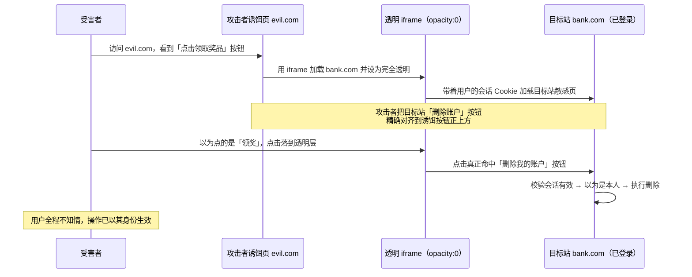
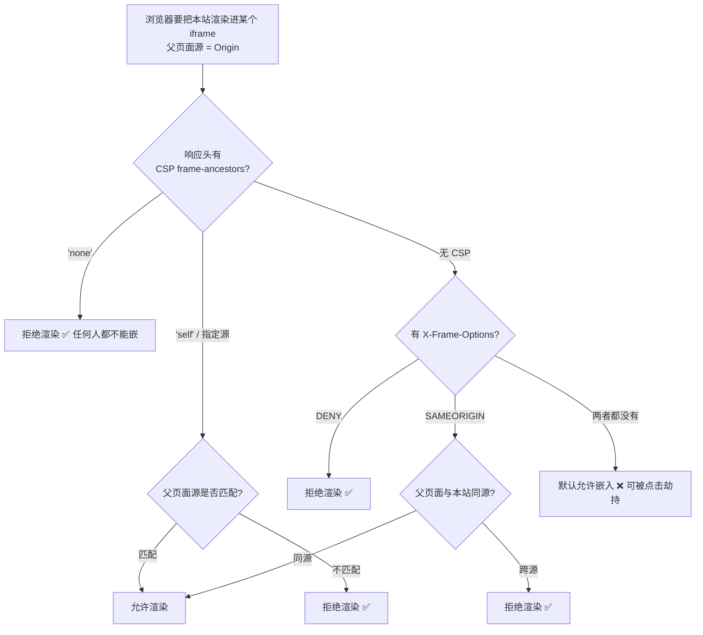

# 06 · 点击劫持（Clickjacking / UI Redressing）

> 点击劫持是把目标站点用一个**透明 iframe** 盖在攻击者的诱饵页之上，用户以为自己点的是诱饵页上「看似无害」的按钮（如「点击领取奖品」），实际点到的是下层目标站的**敏感操作按钮**（转账、授权、删除账户），操作以受害者已登录的身份被真实执行。它劫持的不是数据，而是用户的「点击」。

## 📖 知识讲解

### 攻击本质

点击劫持又叫 **UI Redressing（界面伪装）**。攻击链条是：

1. 攻击者做一个诱饵页（evil.com），页面上放诱人的按钮/内容（「点击领奖」「看视频」）。
2. 用 `<iframe>` 把**目标站**（受害者已登录的 bank.com / 社交站）加载进来，通过 CSS 把这个 iframe 设为**完全透明**（`opacity: 0`）并用 `z-index` 叠在诱饵内容**上层**。
3. 精确调整位置，让目标站里的**敏感按钮**正好落在诱饵按钮的点击区域上。
4. 用户看到的是诱饵按钮，鼠标点下去时，点击事件穿过肉眼看不见的透明 iframe，**真正命中的是目标站的敏感按钮**。
5. 因为目标站是在用户自己的浏览器里、带着用户的会话 Cookie 加载的，所以这一次点击等于用户**亲手**在目标站上完成了敏感操作。

**关键点**：攻击者不需要窃取密码，也不需要绕过登录——他借用的是「用户本人已登录 + 用户真实的一次点击」。

### 为什么攻击能成立

根本原因是：**目标站允许自己被任意第三方页面用 iframe 嵌入**。浏览器默认允许跨源 iframe 嵌入（同源策略挡的是「跨源读 iframe 内容」，但**不挡「把跨源页面显示出来」**）。只要目标站没有声明「禁止被嵌入」，攻击者就能把它盖进自己的页面。防御的核心就是：**目标站主动声明「不许别人 iframe 我」**。

### 常见变体

| 变体 | 手法 |
|------|------|
| **Likejacking** | 透明 iframe 盖住社交平台的「赞 / 关注 / 分享」按钮，诱导用户在不知情下点赞、涨粉、传播 |
| **Cursorjacking** | 用 CSS 隐藏真实光标、画一个假光标，制造「视觉上点 A，实际点 B」的位置错位 |
| **拖放劫持（Drag-and-Drop）** | 诱导用户把页面上的东西「拖」到透明 iframe 里，借拖放把敏感数据/内容投递到目标控件 |
| **Filejacking / 键盘劫持** | 结合透明覆盖，诱导用户完成文件选择或表单输入等操作 |

### 防御手段（服务端响应头为主，前端 JS 兜底）

| 防御 | 原理 | 定位 |
|------|------|------|
| **`X-Frame-Options: DENY` / `SAMEORIGIN`** | 老牌响应头。`DENY`=任何页面都不许 iframe 我；`SAMEORIGIN`=只有同源页面能 iframe 我 | 历史方案，兼容老浏览器，但不支持「允许多个指定源」 |
| **`Content-Security-Policy: frame-ancestors`** | 现代首选。`frame-ancestors 'none'`=谁都不许嵌；`'self'`=只许同源；可列多个源 `'self' https://ok.com` | **现代标准**，比 XFO 更灵活，优先用它 |
| **前端 frame-busting JS** | 页面自检 `if (self !== top)`，发现自己被套在别人的框架里就跳出/清空页面 | **仅兜底**，可被 iframe `sandbox` 属性禁用脚本而绕过，不能作为唯一防线 |
| **`SameSite` Cookie** | 会话 Cookie 设 `SameSite=Lax/Strict`，跨站 iframe 里的请求不带会话，敏感操作因缺会话失败 | 附带缓解，不是专门防点击劫持，但能削弱其效果 |

> ⚠️ 优先级：**`CSP frame-ancestors`（现代首选） ≈ `X-Frame-Options`（兼容兜底） > frame-busting JS（可绕过，仅最后兜底）**。两者都是**服务端响应头**，是真正可靠的防线；JS 兜底只在无法设置响应头时（如纯静态 `file://` 演示）临时替代。

#### `X-Frame-Options` 与 `frame-ancestors` 的关系

- 两者作用重叠，`frame-ancestors` 是 XFO 的现代替代者，表达力更强（能精确列多个允许源）。
- 当浏览器同时支持 CSP 时，**`frame-ancestors` 优先于 `X-Frame-Options`**。
- 最佳实践：两个都发（`frame-ancestors` 面向现代浏览器，`X-Frame-Options` 兜底老浏览器）。

## 🔄 流程图 / 原理图

点击劫持攻击流程（透明 iframe 覆盖 + 点击穿透）：



服务端收到「被嵌入」请求时如何决定允许/拒绝渲染：



## 💻 代码说明

本模块提供三个文件，**对照体验**攻击与防御（攻击 demo **仅供学习**）：

- `victim.html`：模拟**无防护的目标站**。有一个显眼的「⚠️ 删除我的账户」按钮，点击后弹窗并把页面文字改成「账户已删除」，代表一次敏感操作被执行。
- `attacker.html`：**攻击者诱饵页（仅供学习）**。用一个 iframe 加载 `victim.html`，为教学把透明度设成 `opacity: 0.3`（让学习者**能看到**上下层的覆盖关系），并注释说明**真实攻击会设 `opacity: 0` 完全透明**。诱饵按钮「点击领取奖品」被精确定位在 victim 删除按钮的正上方，演示「看着点领奖、实际点到删除」的点击穿透错觉。
- `victim-protected.html`：**加了 frame-busting JS 兜底的防护版**。检测到自己被套进别的框架时清空页面并跳出，注释强调**真实防御应以 `X-Frame-Options` / `CSP frame-ancestors` 响应头为主**（纯 `file://` 打开无法设响应头，故这里用 JS 演示兜底思路）。

诱饵页覆盖的关键（**攻击示范，仅供学习**）：
```html
<!-- 真实攻击这里是 opacity:0（完全透明），教学演示用 0.3 让你看到覆盖关系 -->
<iframe src="victim.html" style="opacity: 0.3; position: absolute; z-index: 2;"></iframe>
<!-- 诱饵按钮在下层，透明 iframe 在上层，点击被 iframe 拦截 -->
<button class="lure">🎁 点击领取奖品</button>
```

防护版的兜底关键（**正确思路是响应头，JS 仅兜底**）：
```js
// ✅ frame-busting：发现自己不是顶层窗口（被嵌套）就自救
if (self !== top) {
  document.body.innerHTML = '⛔ 检测到本页被嵌套，已阻止点击劫持';
  top.location = self.location;   // 试图跳出框架
}
// ⚠️ 该 JS 可被 <iframe sandbox> 禁脚本而绕过，真实防御必须靠：
//    响应头 X-Frame-Options: DENY 或 CSP frame-ancestors 'none'
```

## ▶️ 运行方式

免构建，直接用浏览器打开：

1. 打开 `attacker.html`：你会看到诱饵按钮「点击领取奖品」，以及半透明叠在上面的目标站（教学用 `opacity:0.3`）。**尝试点击「领奖」按钮**——实际点到的是下层目标站的「删除我的账户」，页面显示「账户已删除」，即攻击成功。真实攻击中 iframe 完全透明，用户根本看不到目标站。
2. 打开 `victim.html`：单独访问目标站，直接点删除按钮体验正常功能。
3. 把 `attacker.html` 里的 `iframe src` 改成 `victim-protected.html` 再打开：防护版检测到被嵌套，清空内容并跳出，攻击被拦截。

> 说明：因是纯前端 `file://` 演示，无法设置真实响应头，故防护版用 frame-busting JS 演示「拒绝被嵌」的效果。生产环境请以 `X-Frame-Options` / `CSP frame-ancestors` 响应头为准。

## ⚠️ 常见坑 / 最佳实践

- **别只靠 frame-busting JS**：它能被 `<iframe sandbox="allow-forms">`（不含 `allow-scripts`）禁用脚本而失效，只能当兜底。可靠防线是**响应头**。
- **首选 `CSP frame-ancestors`**，同时保留 `X-Frame-Options` 兜底老浏览器；两者只能通过**响应头**下发，`<meta>` 标签设置 `X-Frame-Options` **无效**。
- `X-Frame-Options` **不支持列多个允许源**（`ALLOW-FROM` 已废弃且兼容差），需要「允许多个指定源嵌入」时必须用 `frame-ancestors`。
- 全站默认加 `frame-ancestors 'none'` 或 `'self'`，只对确实需要被嵌的页面单独放行，遵循最小授权。
- 敏感操作（转账/删除/授权）除了防嵌入，**再加二次确认**（输密码、验证码、确认弹窗），即使被劫持一次点击也不足以完成。
- 给会话 Cookie 加 `SameSite=Lax/Strict`，让跨站 iframe 里的请求不自动带会话，进一步削弱点击劫持。
- 记住点击劫持劫持的是「点击/操作」，不是「读数据」，所以 CORS、CSP 的 `script-src` 都防不住它，必须专门用 `frame-ancestors` / `X-Frame-Options`。

## 🔗 官方文档

- OWASP Clickjacking：<https://owasp.org/www-community/attacks/Clickjacking>
- OWASP Clickjacking Defense Cheat Sheet：<https://cheatsheetseries.owasp.org/cheatsheets/Clickjacking_Defense_Cheat_Sheet.html>
- MDN X-Frame-Options：<https://developer.mozilla.org/zh-CN/docs/Web/HTTP/Headers/X-Frame-Options>
- MDN CSP frame-ancestors：<https://developer.mozilla.org/zh-CN/docs/Web/HTTP/Headers/Content-Security-Policy/frame-ancestors>
