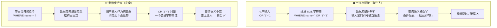
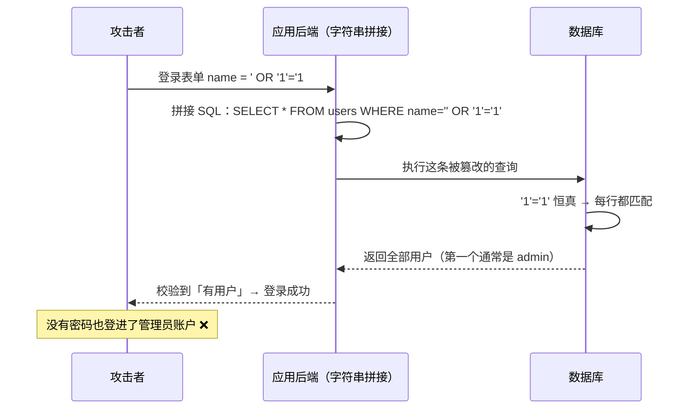

# 07 · 注入攻击（Injection：SQL 注入 / 命令注入 / NoSQL 注入）

> 注入攻击的本质是把**不可信的用户输入**拼进了某个「解释器」的指令里（SQL 语句、Shell 命令、LDAP/OS 命令、NoSQL 查询），导致本该当「数据」的输入被解释器**当成「代码」执行**，从而篡改指令语义。它和 XSS 是同一种思想（数据被当代码执行），只是解释器不同——XSS 的解释器是浏览器，SQL 注入的解释器是数据库。注入常年高居 OWASP Top 10（2021 年为 **A03:2021 – Injection**）。

## 📖 知识讲解

### 注入的本质：数据与指令混在一起

程序把「指令模板」和「用户数据」用**字符串拼接**的方式凑成一条完整指令交给解释器。解释器看到的是一整条字符串，它**分不清哪部分是程序员写的指令、哪部分是用户填的数据**——只要用户在数据里塞进解释器的**语法元字符**（引号、分号、注释符、逻辑运算符），就能「越狱」，改变整条指令的含义。

> 一句话：**凡是「拼字符串 + 交给解释器执行」，就有注入风险**。防御的核心是让解释器**始终知道**「哪部分是代码、哪部分是数据」——这就是参数化查询要做的事。

### 经典 SQL 注入（仅供学习）

假设登录查询是**字符串拼接**出来的：

```sql
SELECT * FROM users WHERE name = '$input'
```

- 输入 `zhangsan` → `... WHERE name = 'zhangsan'`，正常。
- 输入 `' OR '1'='1` → 拼成 `... WHERE name = '' OR '1'='1'`。因为 `'1'='1'` **恒为真**，WHERE 条件对**每一行**都成立，查询返回**所有用户**，攻击者无需密码即可**绕过登录**（通常匹配到第一个用户，往往是管理员）。
- 输入 `admin'--` → 拼成 `... WHERE name = 'admin'--'`，`--` 是 SQL 注释符，把后面（比如密码校验条件）**全部注释掉**，直接以 admin 登录。
- 输入 `'; DROP TABLE users;--` → 若支持多语句，可能**删表**（脱库/破坏）。

### 危害

- **绕过登录 / 越权**：`' OR '1'='1` 恒真、`--` 注释掉密码校验。
- **脱库（数据泄露）**：用 `UNION SELECT` 把其它表（密码、身份证、银行卡）拼进结果读出来。
- **提权 / 破坏**：删表、改数据；配合数据库存储过程甚至可执行系统命令。
- **盲注**：即使页面不回显数据，也能靠「真/假」响应或时间延迟逐位猜出数据。

### 不止 SQL：其它注入同源同理

| 类型 | 危险写法（拼接） | 后果 |
|------|-----------------|------|
| **命令注入 OS Command** | `exec("ping " + userInput)`，输入 `google.com; rm -rf /` | 分号后的命令被 Shell 执行 |
| **NoSQL 注入** | MongoDB `db.users.find({name: req.body.name})`，传入 `{"$ne": null}` | 操作符注入，`$ne:null` 匹配所有用户，绕过登录 |
| **LDAP / XPath / 模板注入** | 把输入拼进 LDAP 过滤器 / XPath / 模板字符串 | 越权查询、SSTI 远程执行 |

### 防御手段（首选参数化，彻底分离数据与指令）

| 防御 | 原理 | 定位 |
|------|------|------|
| **① 参数化查询 / 预编译语句（Prepared Statement）** | 先把**带占位符的指令**（`... WHERE name = ?`）发给数据库编译定型，再单独把用户输入作为**纯数据**绑定进去。此后输入里的引号、分号都只是普通字符，**永远无法改变查询结构** | **首要、最有效**，从根上消除注入 |
| **② ORM / 查询构造器** | Sequelize、Prisma、MyBatis、Hibernate 等底层用参数化，正确使用即安全 | 首选，但小心它们提供的「拼原生 SQL」口子 |
| **③ 最小权限数据库账号** | 应用连库账号只给必需权限（如只读、限定表），即使被注入也限制破坏面 | 纵深防御 |
| **④ 输入校验（白名单）** | 对能枚举的输入（如排序字段、类型）用白名单校验；数字就强制转数字 | 辅助，尤其用于无法参数化的部分（如表名/列名/`ORDER BY`） |
| **⑤ 转义（辅助，不作首选）** | 对特殊字符转义 | **辅助手段**，易漏易错，不能替代参数化 |
| **⑥ WAF / 数据库防火墙** | 拦截常见注入特征 | 兜底，可被绕过，不能当唯一防线 |

**命令注入专项**：**不要拼接 Shell 字符串**、**不要用 `shell: true`**；用**参数数组**形式调用（如 Node 的 `execFile('ping', ['-c', '1', host])`、Python 的 `subprocess.run([...], shell=False)`），让参数作为独立参数传给程序，而不是交给 Shell 解析。

> ⚠️ 记住优先级：**参数化查询 / ORM（首选） > 最小权限 + 白名单校验（纵深） > 转义 / WAF（辅助兜底）**。转义能绕过、WAF 能绕过，**参数化从原理上让注入不可能**。

### 参数化为什么有效

拼接是「先拼成一整条字符串，再整体解析」——数据里的语法字符会参与解析。参数化是「**先把指令结构解析定型，再塞数据**」——数据到达时结构已固定，输入无论写什么都只是某个占位符的值，不再被当语法解析。这就是「数据与指令彻底分离」。

## 🔄 流程图 / 原理图

字符串拼接（有注入） vs 参数化查询（安全）对比：



SQL 注入登录绕过时序：



## 💻 代码说明

本模块用一个纯 Node 内置模块脚本 `injection-demo.js` 演示（**无需安装任何依赖**，攻击部分**仅供学习**）：

- 用一个**内存用户数组**模拟数据库（避免真连数据库的复杂度）。
- **漏洞版 `loginVulnerable(name)`**：用**字符串拼接**构造出一条 SQL 字符串并打印出来，配一个极简 SQL 条件解释器，真实地演示输入 `' OR '1'='1` 时最终 SQL 变成**恒真**、登录被绕过（返回了本不该匹配的用户）。
- **安全版 `loginSafe(name)`**：用**参数化思路**——把用户输入当作**纯数据**，用 `===` 精确比较数组元素（等价于「把输入绑定到占位符」，永不参与「语法解析」）。同样的恶意输入下，绕过**失效**。

漏洞版关键（**错误示范，仅供学习**）：
```js
// ❌ 字符串拼接：用户输入直接进了 SQL 语法
const sql = `SELECT * FROM users WHERE name = '${name}'`;
// name = "' OR '1'='1" 时 → WHERE name = '' OR '1'='1'（恒真，绕过）
```

安全版关键（**正确做法**）：
```js
// ✅ 参数化思路：输入只当「数据」，用精确相等比较，永不解析成语法
const user = users.find(u => u.name === name);   // name 再怎么写也只是个字符串值
```

## ▶️ 运行方式

纯 Node 内置模块，**无需 `npm install`**：

```bash
node injection-demo.js
```

脚本会依次打印：正常登录、恶意输入 `' OR '1'='1` 在**漏洞版**下如何绕过（并打印被篡改的 SQL），以及同样输入在**安全版**下如何被挡住，形成对照。

## ⚠️ 常见坑 / 最佳实践

- **首选参数化 / 预编译语句**，几乎所有语言的数据库驱动都支持（`?` 或 `:name` 占位符）。这是根治手段，不是可选项。
- **别用「转义 / 过滤关键字」当主防御**：黑名单（过滤 `OR`、`--`、`union`）能被大小写、内联注释 `/**/`、编码等花式绕过。
- **表名、列名、`ORDER BY` 字段无法用占位符参数化**——这些只能用**白名单**映射（把用户输入映射到固定的合法标识符集合），绝不能直接拼。
- **ORM 也可能注入**：用它提供的「原生 SQL / `whereRaw` / 字符串拼接」口子时同样要参数化。
- **命令注入**：用参数数组（`execFile` / `subprocess.run([...], shell=False)`），**永不 `shell: true` + 拼接**。
- **NoSQL 注入**：对请求体做类型校验，别把用户可控对象直接塞进查询条件（防 `$ne` / `$gt` 等操作符注入），字符串就强制当字符串。
- **最小权限**：应用连库账号别用 root/dba，按需授权，限制被注入后的破坏面。
- 报错信息别把原始 SQL / 数据库结构返回给前端，避免帮攻击者「盲注」。
- 与 XSS 对照记忆：**都是「数据被当代码执行」**，防线也同构——**从源头分离数据与指令 / 数据与代码**。

## 🔗 官方文档

- OWASP Injection Flaws：<https://owasp.org/www-community/Injection_Flaws>
- OWASP SQL Injection Prevention Cheat Sheet：<https://cheatsheetseries.owasp.org/cheatsheets/SQL_Injection_Prevention_Cheat_Sheet.html>
- OWASP Top 10 · A03:2021 Injection：<https://owasp.org/Top10/A03_2021-Injection/>
- OWASP SQL Injection 攻击说明：<https://owasp.org/www-community/attacks/SQL_Injection>
- MDN · Node 子进程安全（避免命令注入）：<https://developer.mozilla.org/en-US/docs/Web/Security>
