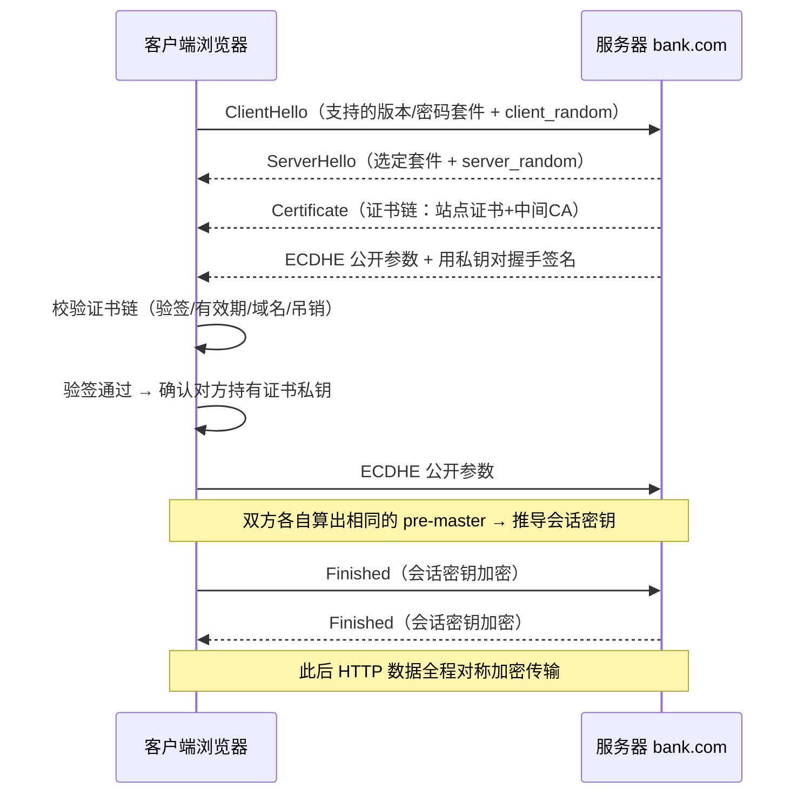
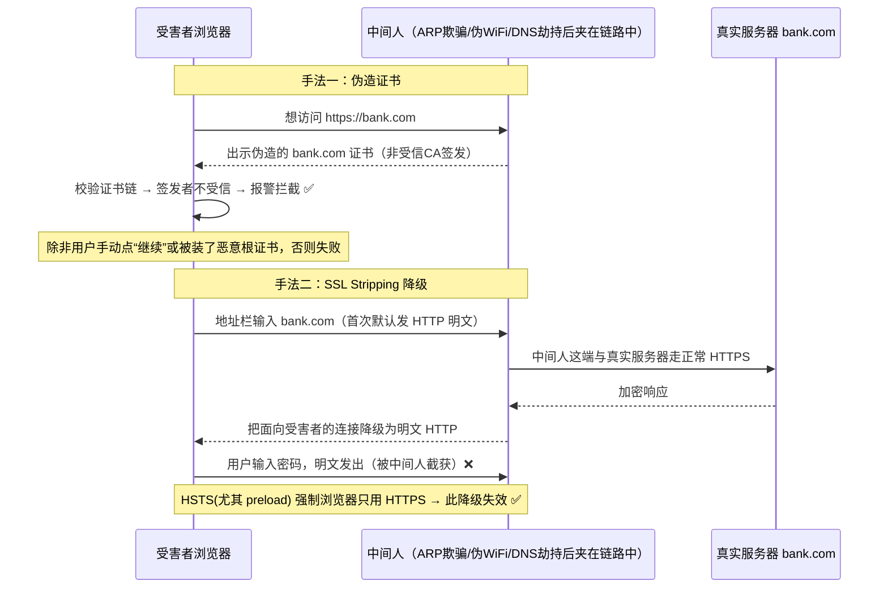
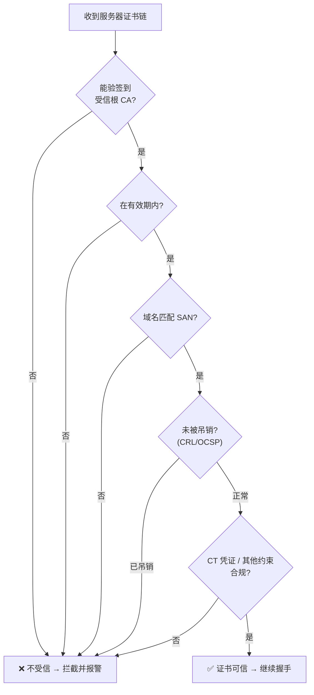

# 08 · HTTPS 与中间人攻击（HTTPS & MITM, Man-in-the-Middle）

> 明文 HTTP 在网络链路上是「裸奔」的——任何路径上的节点都能窃听、篡改、劫持。HTTPS 用 TLS 给通信加上**加密 + 完整性 + 身份认证**三重保险，从根上瓦解中间人（MITM）攻击。理解 TLS 握手与证书信任链，才能看懂 MITM 是怎么发生、又怎么被防住的。

## 📖 知识讲解

### 一、明文 HTTP 的风险：链路上人人可见

HTTP 报文是明文的，从你的浏览器到目标服务器要经过一长串节点：家里的路由器、运营商网关、骨干路由、CDN……**任何一个节点都能看到并改动报文**。三类典型危害：

- **窃听（Sniffing）**：抓包即得，Cookie、会话令牌、账号密码、浏览内容全部暴露。同一个 WiFi 下用 Wireshark 就能看别人的 HTTP。
- **篡改（Tampering）**：改请求或响应内容。经典案例是**运营商/公共 WiFi 给 HTTP 页面注入广告**、插弹窗、塞统计脚本——因为它就在链路上，改一改 HTML 即可。
- **劫持（Hijacking）**：直接把响应换成钓鱼页，或把下载的安装包替换成木马。

一句话：**HTTP 没有任何保护，链路上的中间人天然拥有「上帝视角 + 改写权」**。这正是 MITM 的土壤。

### 二、TLS/SSL 解决了什么：三件事

TLS（Transport Layer Security，其前身叫 SSL，现在口头仍混用「SSL」）在 TCP 之上、HTTP 之下加了一层，同时提供三个保证：

| 保证 | 解决的问题 | 靠什么实现 |
|------|-----------|-----------|
| **加密（Confidentiality）** | 防窃听：链路上看到的是密文 | 握手协商出的**对称会话密钥**加密应用数据 |
| **完整性（Integrity）** | 防篡改：改一个字节就能被发现 | 消息认证码 MAC / AEAD（如 AES-GCM） |
| **身份认证（Authentication）** | 防冒充：确认对面真是「银行」而不是中间人 | **服务器证书 + CA 信任链** |

三者缺一不可。只有加密没有身份认证，中间人可以自己跟你加密（你根本不知道在跟谁加密）；这就是为什么**证书校验是 HTTPS 安全的命门**。

### 三、TLS 握手流程（以 TLS 1.2 ECDHE 为例）

握手的目标：在不安全的信道上，安全地协商出一把**只有双方知道的对称会话密钥**，并**验证服务器身份**。

1. **ClientHello**：客户端发出支持的 TLS 版本、密码套件列表（cipher suites）、一个随机数 `client_random`。
2. **ServerHello**：服务器选定版本与密码套件，回一个随机数 `server_random`。
3. **Certificate**：服务器下发**证书链**（站点证书 + 中间 CA 证书），证书里含服务器公钥。
4. **密钥交换（ECDHE）**：双方用椭圆曲线 Diffie-Hellman 各自生成临时密钥对，交换公开参数，各自算出同一个**预主密钥（pre-master secret）**。服务器还会用证书私钥对握手参数**签名**，证明「我持有该证书对应的私钥」。
5. **生成会话密钥**：双方用 `client_random + server_random + pre-master secret` 通过 KDF 推导出对称**会话密钥**。
6. **Finished**：双方发一条用会话密钥加密的校验消息，确认握手未被篡改。此后应用数据（HTTP）全部用会话密钥对称加密传输。

几个关键概念：

- **为什么用非对称 + 对称混合**：非对称（RSA/ECDHE）慢，只用来安全地协商密钥与验证身份；真正传数据用快的对称加密。
- **前向保密（Forward Secrecy / PFS）**：用 **ECDHE**（临时密钥，每次握手不同）而非老式 RSA 密钥交换。好处是——即使日后服务器私钥泄露，攻击者**也无法解密历史抓包**，因为会话密钥用的临时参数早已丢弃。现代配置必须启用 ECDHE。
- **TLS 1.3 的简化（1-RTT）**：TLS 1.3 砍掉了不安全的老套件，强制前向保密，把握手压缩到 **1 个往返（1-RTT）**——客户端在 ClientHello 里就带上密钥交换参数，服务器一回就能开始加密。还支持 **0-RTT** 会话恢复（有重放风险，需谨慎）。相比 1.2 更快更安全。

### 四、证书与 CA 信任链

服务器公钥凭什么可信？靠**证书**：由受信任的 **CA（Certificate Authority，证书颁发机构）**用其私钥对「域名 + 服务器公钥 + 有效期」签名背书。

信任是**链式**的：

```
根 CA（Root CA，自签名，预置在操作系统/浏览器信任库）
   └── 中间 CA（Intermediate CA，被根 CA 签名）
          └── 站点证书（example.com，被中间 CA 签名）
```

浏览器**从站点证书往上逐级验签**，一直验到本机信任库里预置的根 CA，链条完整且都验签通过才算可信。浏览器校验一张证书要看：

1. **签名有效**：用上一级证书的公钥验证本级证书的签名，逐级到受信根。
2. **在有效期内**：`notBefore ~ notAfter`，过期直接报错。
3. **域名匹配**：访问的域名要出现在证书的 **SAN（Subject Alternative Name）**里（CN 已废弃）。`bank.com` 的证书不能用在 `evil.com` 上。
4. **未被吊销**：通过 **CRL（吊销列表）**或 **OCSP（在线证书状态协议，及 OCSP Stapling）**检查证书是否已被 CA 提前作废。
5. **用途/约束**：基本约束（是否 CA）、密钥用途等扩展字段合规。

任何一步失败，浏览器就弹「您的连接不是私密连接」并拦截。**这道校验就是挡住 MITM 的墙**。

### 五、MITM 攻击方式（⚠️ 仅供学习，理解原理以做防御）

中间人要成功，得先「挤」到链路中间，再想办法绕过 TLS 的身份认证：

**第一步 · 抢占链路位置**（把流量引到自己这）：
- **ARP 欺骗**：在局域网内伪造 ARP 应答，让受害者把「网关」的 MAC 认成攻击者的机器，流量都经过攻击者。
- **伪造 WiFi 热点（Evil Twin）**：架一个同名免费 WiFi，受害者连上后所有流量过攻击者。
- **DNS 劫持/污染**：篡改 DNS 应答，把 `bank.com` 解析到攻击者 IP。

**第二步 · 绕过 TLS 身份认证**：
- **伪造证书**：攻击者给 `bank.com` 签一张自己的证书。但它的签发者不是受信 CA，浏览器**验签失败会报警**——除非攻击者能让受害者**手动信任**其根证书（企业设备被装了根证书、诱导用户点「继续访问」）。这也是为什么**绝不能随意点过证书警告、绝不能乱装根证书**。
- **SSL Stripping（降级攻击）**：更阴险——攻击者不碰 TLS，而是**阻止你用上 HTTPS**。当你在地址栏输入 `bank.com`（默认先发 HTTP）或点了一个 `http://` 链接时，攻击者与真实服务器之间走 HTTPS，却把面向**你**的连接降级成明文 HTTP，你和银行之间的「加密」被悄悄剥掉了，你看到的是能正常显示的页面（可能没有小锁标），密码却是明文发出。**HSTS 就是专门打这个的**。

### 六、防御体系

1. **全站 HTTPS**：所有页面、所有接口、所有静态资源一律 HTTPS，不留任何 HTTP 入口。
2. **HSTS（HTTP Strict Transport Security）**：服务器返回响应头
   `Strict-Transport-Security: max-age=63072000; includeSubDomains; preload`
   浏览器收到后，在 `max-age` 期限内**强制对该域只用 HTTPS**，用户即便输 `http://` 或点 http 链接，浏览器也在本地直接改成 https 再发出——**SSL Stripping 无从下手**。
   - `includeSubDomains`：覆盖所有子域。
   - `preload`：把域名提交到浏览器内置的 **HSTS Preload 列表**，这样**第一次访问**（还没收到过 HSTS 头）就强制 HTTPS，堵住「首次访问被降级」的窗口。
3. **证书透明度（CT, Certificate Transparency）**：所有 CA 签发的证书都要记入公开、可审计的 CT 日志。域名所有者能监控是否有人给自己域名偷签了证书，误签/恶意签发无所遁形。现代浏览器要求证书带 CT 凭证（SCT）。
4. **证书校验绝不可关闭**：客户端（浏览器、App、爬虫、后端调用）**永远不要**为了「图方便」关闭证书校验（如 `curl -k`、`rejectUnauthorized:false`、`verify=False`）——这等于自废武功，MITM 直接生效。
5. **升级不安全请求 `upgrade-insecure-requests`**：页面加 CSP 指令
   `Content-Security-Policy: upgrade-insecure-requests`
   浏览器会把页面里写成 `http://` 的子资源自动升级为 `https://` 再请求，帮助从历史遗留的混合内容平滑迁移。
6. **避免混合内容（Mixed Content）**：HTTPS 页面里引用了 `http://` 的脚本/样式/图片就是混合内容。**混合脚本（active mixed content）会被浏览器直接拦截**（因为可被 MITM 改写，危害等同 XSS），图片等被动内容也会警告。务必让所有子资源都走 HTTPS。
7. **HPKP 已废弃**：曾经有 HTTP Public Key Pinning（把证书公钥「钉」在浏览器里）试图防伪造证书，但极易「自锁」（配错就把自己站点锁死），且被滥用作勒索，**已被浏览器废弃**。现代改用 **CT + CAA 记录 + 短有效期证书** 来管控误签，不要再用 HPKP。

## 🔄 流程图 / 原理图

正常 TLS 握手（TLS 1.2，ECDHE 前向保密）：



中间人攻击（⚠️ 仅供学习）：攻击者夹在中间，两种典型手法：



浏览器证书校验决策：



## 💻 代码说明

本模块偏原理，以文档 + 图为主，demo 为辅——用现成命令行工具「亲眼看」真实网站的证书链与安全头，无需写服务器。见 `inspect-cert.sh`（含中文注释）。核心两条命令：

```bash
# ① 用 openssl 查看证书链（签发者、有效期、SAN、密码套件、TLS 版本）
openssl s_client -connect example.com:443 -servername example.com -showcerts </dev/null

# ② 用 curl 只看响应头，重点确认 HSTS 是否开启
curl -sI https://example.com | grep -i strict-transport-security
```

- `openssl s_client` 会打印握手全过程：`Certificate chain`（证书链层级）、`Server certificate`、`issuer`（签发的 CA）、`Verify return code`（`0 (ok)` 表示校验通过）、协商出的 `Protocol`（如 TLSv1.3）与 `Cipher`（如 `TLS_AES_256_GCM_SHA384`）。
- `curl -sI` 拿响应头，看到 `Strict-Transport-Security: max-age=...; includeSubDomains; preload` 就说明该站启用了 HSTS，能抵御 SSL Stripping 降级。

## ▶️ 运行方式

无需构建，任意装了 `openssl` 与 `curl` 的终端即可（macOS/Linux 自带）：

```bash
# 直接跑脚本（默认检测 example.com，也可传域名）
sh inspect-cert.sh                 # 检测 example.com
sh inspect-cert.sh www.baidu.com   # 检测指定站点

# 或手动逐条体验：
# 看证书链与校验结果（关注 Verify return code、issuer、Protocol、Cipher）
openssl s_client -connect www.baidu.com:443 -servername www.baidu.com </dev/null 2>/dev/null | openssl x509 -noout -issuer -subject -dates -ext subjectAltName

# 看有没有 HSTS 头（有则能防降级）
curl -sI https://www.baidu.com | grep -i strict-transport-security
```

对照体验：找一个只有 HTTP 的站点会发现浏览器地址栏标「不安全」；找一个大站会看到完整证书链 + `Verify return code: 0 (ok)` + HSTS 头。

## ⚠️ 常见坑 / 最佳实践

- **绝不关闭证书校验**：`curl -k`、Node 的 `rejectUnauthorized:false`、Python 的 `verify=False`、`NODE_TLS_REJECT_UNAUTHORIZED=0` 都是把 HTTPS 的身份认证扔掉，MITM 立刻可用。开发自签名证书应把 CA 加入信任库，而不是关校验。
- **别乱点证书警告、别乱装根证书**：浏览器的证书报警几乎都意味着链路有问题；随手装「加速/抓包/翻墙」软件的根证书，等于给它开了合法 MITM 的后门。
- **HSTS 首访窗口**：不加 `preload` 时，用户**第一次**访问仍可能被降级（还没收到过 HSTS 头）；要彻底堵住就提交 preload 列表。但 `preload` 是**强承诺**（含 `includeSubDomains`），一旦提交想撤销很慢，上线前确认所有子域都已 HTTPS。
- **混合内容**：HTTPS 页面里残留 `http://` 的脚本会被拦截、图片会警告并把地址栏小锁去掉。迁移期用 `upgrade-insecure-requests` 兜底，但根本还是把资源都换成 https。
- **HPKP 别再用**：已废弃、易自锁。证书管控改用 CT 监控 + CAA 记录（限定哪些 CA 能给你域名签证书）+ 短有效期证书。
- **前向保密要开**：优先 TLS 1.3 / ECDHE 套件，禁用老旧的 RSA 密钥交换、SSLv3、TLS 1.0/1.1，避免私钥泄露导致历史流量被解密。
- **OCSP/CRL 软失败**：吊销检查在现实中常「软失败」（查不到就放行），别把它当唯一防线；短有效期证书 + CT 更实在。

## 🔗 官方文档

- MDN HTTPS：<https://developer.mozilla.org/zh-CN/docs/Glossary/HTTPS>
- MDN Strict-Transport-Security（HSTS）：<https://developer.mozilla.org/zh-CN/docs/Web/HTTP/Headers/Strict-Transport-Security>
- MDN 混合内容 Mixed content：<https://developer.mozilla.org/zh-CN/docs/Web/Security/Mixed_content>
- MDN 证书透明度 CT：<https://developer.mozilla.org/zh-CN/docs/Web/Security/Certificate_Transparency>
- OWASP Transport Layer Security Cheat Sheet：<https://cheatsheetseries.owasp.org/cheatsheets/Transport_Layer_Security_Cheat_Sheet.html>
- RFC 8446（TLS 1.3）：<https://datatracker.ietf.org/doc/html/rfc8446>
- Cloudflare Learning · TLS 握手：<https://www.cloudflare.com/zh-cn/learning/ssl/what-happens-in-a-tls-handshake/>
