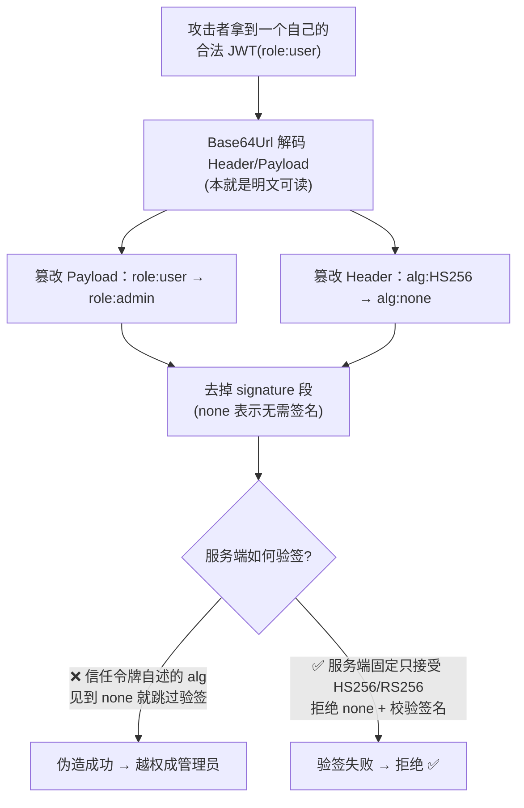
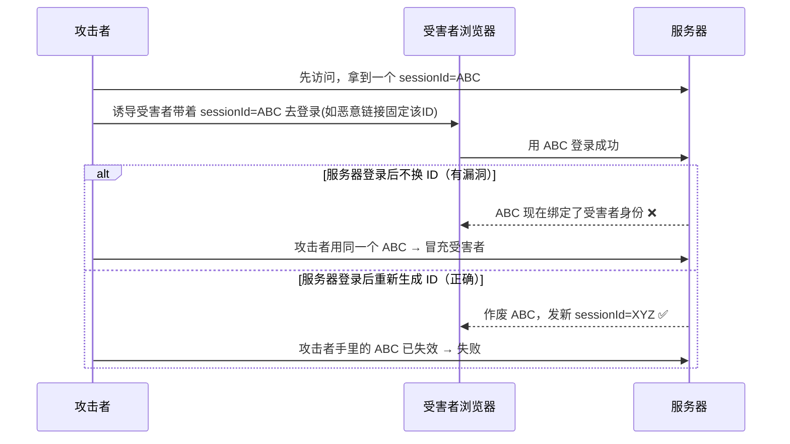

# 09 · 认证与会话安全（Authentication & Session Security）

> 「你是谁」和「你能干什么」是两回事。认证（Authentication）负责证明身份，会话（Session）负责在登录后持续记住你。这层一旦做错——弱密码存储、令牌被偷、会话能被固定/伪造——攻击者就能直接以你的身份为所欲为。对应 **OWASP Top 10 · A07 身份识别与认证失败**。

## 📖 知识讲解

### 一、认证 vs 授权：别搞混

| | 认证 Authentication（AuthN） | 授权 Authorization（AuthZ） |
|---|------|------|
| 回答的问题 | **你是谁？**（验证身份） | **你能做什么？**（验证权限） |
| 手段 | 密码、验证码、MFA、生物特征 | 角色/权限（RBAC）、资源归属校验 |
| 时机 | 登录时 | 每次访问受保护资源时 |
| 出错后果 | 冒充他人登录 | 越权访问（水平/垂直越权） |

**先认证、后授权**。本模块聚焦认证与登录后的会话，越权属授权范畴。

### 二、会话管理两大流派

登录成功后，服务器要有办法在后续请求里认出「还是刚才那个人」。两条技术路线：

#### 流派 A：服务端 Session + Cookie（有状态）

- 服务器在内存/Redis/数据库里存一份 session 数据，生成一个随机的 **Session ID**，通过 `Set-Cookie` 发给浏览器。
- 之后每次请求浏览器自动带上这个 Cookie，服务器凭 Session ID 查出会话。
- **优点**：服务端可随时**主动作废**会话（登出、封号即时生效）；Cookie 里只有一个不透明 ID，不含敏感信息。
- **缺点**：服务器要存会话，横向扩展需共享存储（Redis）；跨域/多端（App）用 Cookie 不便。

#### 流派 B：无状态 Token / JWT（无状态）

- 登录后服务器签发一个自包含的 **Token（常用 JWT）**，把用户信息 + 签名打包给客户端保存；服务器**不存**会话。
- 之后请求把 Token 放在 `Authorization: Bearer <token>` 头里带上，服务器只**验签**就知道是谁，无需查库。
- **优点**：无状态、易水平扩展、天然适合前后端分离 / 多端 / 微服务。
- **缺点**：**签发后难以主动撤销**（服务器没存，令牌在有效期内一直有效）→ 需靠短时效 + 刷新令牌 + 黑名单弥补；令牌体积比 Session ID 大；一旦被偷，在过期前都能用。

> 选型：单体 Web 应用、需要即时登出/封禁 → Session 更省心；前后端分离、多端、微服务 → JWT 更顺手。两者可混用（如 JWT 短时效 + 服务端刷新令牌撤销）。

### 三、Cookie 安全属性（会话安全的地基）

无论存 Session ID 还是 Token（若放 Cookie），这些属性都要拉满：

| 属性 | 作用 | 说明 |
|------|------|------|
| **HttpOnly** | 禁止 JS 通过 `document.cookie` 读取 | **防 XSS 偷会话**：即便页面被 XSS，脚本也拿不到会话 Cookie |
| **Secure** | 仅在 HTTPS 连接下发送 | 防止 Cookie 在明文 HTTP 里被窃听（配合 08 模块 HTTPS） |
| **SameSite** | 跨站请求是否携带 | `Lax`(默认)/`Strict` **防 CSRF**；`None` 必须配 `Secure`（见 03 模块） |
| **Domain / Path** | 限定 Cookie 作用的域与路径 | 收窄作用域，最小权限；别把 Cookie 放到过宽的父域 |
| **`__Host-` 前缀** | 强约束的命名前缀 | 名字以 `__Host-` 开头的 Cookie，浏览器强制要求带 `Secure`、`Path=/`、**不带 Domain**（锁定到确切主机），最能抗子域/降级注入 |

一条安全的会话 Cookie 典型形态：
```
Set-Cookie: __Host-sid=<随机ID>; HttpOnly; Secure; SameSite=Lax; Path=/
```

### 四、JWT 结构与常见坑

JWT 由三段用 `.` 连接、各自 **Base64Url** 编码：`header.payload.signature`

```
eyJhbGciOiJIUzI1NiJ9 . eyJzdWIiOiIxMjMiLCJyb2xlIjoidXNlciJ9 . 5dF...签名
   Header(算法/类型)        Payload(声明: sub/exp/role...)        Signature(签名)
```

- **Header**：`{"alg":"HS256","typ":"JWT"}`——签名算法。
- **Payload**：声明（claims），如 `sub`(用户)、`exp`(过期时间)、`iat`、自定义字段。
- **Signature**：对 `header.payload` 用密钥签名。**HS256** 用对称密钥（HMAC，签验同一把密钥）；**RS256** 用非对称（私钥签、公钥验，适合多方验证）。

⚠️ **Base64Url 不是加密**：Header/Payload 任何人都能解码看到明文！签名只保证「没被改」，不保证「看不见」。

常见坑（⚠️ 涉攻击处仅供学习）：

1. **别在 Payload 放敏感明文**：密码、身份证、密钥等绝不能进 payload（人人可解）。
2. **`alg:none` 伪造攻击**：JWT 规范里有个 `"alg":"none"`（无签名）。**如果服务端实现会「信任令牌头里声明的算法」**，攻击者就把 header 改成 `{"alg":"none"}`、去掉签名、随意篡改 payload（如把 `role:user` 改成 `role:admin`），服务端若不校验就被伪造身份。**防御：服务端固定只接受预期算法，拒绝 `none`。**
3. **RS256/HS256 混淆攻击**：服务端若用「公钥」但没锁死算法，攻击者把 RS256 换成 HS256、拿公开的公钥当 HMAC 密钥来签，可能骗过验签。**防御：显式指定并校验算法，不让令牌自述算法决定验签方式。**
4. **无法主动撤销**：JWT 一旦签发，过期前一直有效。**用短时效 access token（如 15 分钟）+ 刷新令牌（refresh token，长时效、可在服务端撤销/轮换）**，登出/封号时废掉刷新令牌 + 维护短黑名单。
5. **存哪里？localStorage vs HttpOnly Cookie 的权衡**：
   - 放 **localStorage**：JS 能读 → **XSS 一旦得手就能直接偷走令牌**，风险高；但不受 CSRF 影响（不自动发送）。
   - 放 **HttpOnly Cookie**：JS 读不到（防 XSS 窃取），但会**自动随请求发送 → 需防 CSRF**（配 SameSite + CSRF Token）。
   - 权衡结论：**多数场景优先 HttpOnly + Secure + SameSite 的 Cookie**，把 XSS 偷令牌这条最危险的路堵死，再用 SameSite/Token 处理 CSRF。绝不要图方便裸放 localStorage。

### 五、密码存储：绝不明文，绝不 MD5

- **绝不明文存**：一旦库被拖，所有账号立即沦陷。
- **绝不用 MD5/SHA-1 直接哈希**：它们是**快速**哈希，攻击者每秒能算数十亿次，配合**彩虹表**（预计算的哈希-明文对照表）秒破常见密码。
- **正确做法：加盐（salt）的慢哈希**——用 **bcrypt / scrypt / argon2**（Argon2 是当前 OWASP 首选）：
  - **加盐**：每个用户一个随机盐，一起参与哈希。这样**相同密码的两个人哈希也不同**，彩虹表失效，也无法「一破全破」。
  - **慢（计算成本高）**：故意设计得慢/耗内存（工作因子可调），让暴力枚举与撞库代价爆炸式增长。
  - 防的是：**彩虹表**、**撞库/暴力破解**、以及库泄露后的**离线爆破**。

### 六、防御体系（认证加固）

- **登录限流防爆破**：对同一账号/IP 的失败登录做速率限制、递增延迟、验证码、临时锁定，挡住暴力枚举密码。
- **防撞库（Credential Stuffing）**：用户在别处泄露的「账号+密码」被拿来批量试你的站。对策：MFA、异常登录检测、限流、比对已泄露密码库拒绝弱/已泄露口令。
- **MFA 多因素认证**：密码（知道的）+ 手机验证码/TOTP/硬件密钥（拥有的）+ 生物特征（本身的）。多一层，密码泄露也难直接登入。
- **账户枚举防护**：登录/找回密码/注册的报错与响应时间要**统一**（一律「用户名或密码错误」），别让攻击者通过「该用户不存在 vs 密码错误」的差异**探测哪些账号存在**。
- **安全的会话失效 / 登出**：登出要在**服务端**真正销毁会话（Session 删掉 / 刷新令牌作废），不能只删前端 Cookie；设置合理的空闲超时与绝对超时。
- **防会话固定（Session Fixation）**：攻击者先拿到一个 Session ID 诱导受害者用它登录，登录后该 ID 就绑定了受害者身份，攻击者用同一个 ID 即可冒充。**防御：登录成功后立刻重新生成 Session ID（regenerate/rotate），作废登录前的旧 ID。**
- **OAuth2 / OIDC 简述**：
  - **OAuth 2.0** 是**授权**框架——「让第三方应用在你授权范围内访问你的资源」（如用「微信授权登录」让某 App 拿到你的部分信息），产出 access token。
  - **OIDC（OpenID Connect）** 在 OAuth2 之上加了**认证**层，标准化了「用户是谁」，产出 **id_token**（一个 JWT）。「用 Google/微信 登录」这类**第三方登录**多基于 OIDC。好处是自己不用存密码，把认证托管给可信身份提供方。

## 🔄 流程图 / 原理图

Session（有状态）vs JWT（无状态）登录后鉴权对比：

```mermaid
sequenceDiagram
  participant B as 浏览器
  participant S as 服务器
  participant DB as 会话存储(Redis/DB)

  Note over B,DB: 流派 A · 服务端 Session + Cookie（有状态）
  B->>S: 登录(账号/密码)
  S->>DB: 校验通过 → 创建会话，存 sessionId→用户
  S-->>B: Set-Cookie: __Host-sid=xxx; HttpOnly; Secure; SameSite=Lax
  B->>S: 后续请求自动带 Cookie(sid)
  S->>DB: 用 sid 查会话 → 认出用户（可随时删=即时登出）

  Note over B,S: 流派 B · 无状态 JWT（服务器不存会话）
  B->>S: 登录(账号/密码)
  S->>S: 校验通过 → 签发 JWT(签名), 不存服务端
  S-->>B: 返回 access token(短时效) + refresh token
  B->>S: 后续请求带 Authorization: Bearer <JWT>
  S->>S: 仅验签+查 exp → 认出用户（无需查库，但难主动撤销）
```

攻击流程（⚠️ 仅供学习）：JWT `alg:none` 伪造管理员身份：



会话固定攻击（⚠️ 仅供学习）：



## 💻 代码说明

本模块提供 `password-hashing-demo.js`，用 Node **纯内置 `crypto`** 演示密码的安全存储与校验，**无需任何依赖**：

- 用 `crypto.randomBytes` 生成**随机盐**，`crypto.scryptSync` 做**加盐慢哈希**，存储格式为 `salt:hash`。
- 演示**同一个密码两次注册得到完全不同的哈希**（因为盐不同）→ 彩虹表 / 「一破全破」失效。
- 校验时用 `crypto.timingSafeEqual` 做**定时安全比较**，避免通过响应时间差异侧信道猜测哈希。
- 演示正确密码校验通过、错误密码校验失败。
- 注释说明为什么**不能用明文 / MD5**（涉攻击面处标注「仅供学习」）。

关键片段：
```js
// ✅ 加盐 + 慢哈希（scrypt）：每人不同盐 → 相同密码哈希也不同
const salt = crypto.randomBytes(16).toString('hex');
const hash = crypto.scryptSync(password, salt, 64).toString('hex');
const stored = `${salt}:${hash}`;   // 存这个，绝不存明文

// ✅ 校验用定时安全比较，防时序侧信道
crypto.timingSafeEqual(Buffer.from(hashA), Buffer.from(hashB));
```

## ▶️ 运行方式

Node 内置模块，**无需 `npm install`**：

```bash
node password-hashing-demo.js
```

你会看到：同一密码两次得到不同的 `salt:hash`；正确密码验证 ✅ 通过；错误密码 ❌ 失败；以及为何 MD5/明文不可取的说明。

## ⚠️ 常见坑 / 最佳实践

- **密码**：只存加盐慢哈希（Argon2/bcrypt/scrypt），永不明文、永不 MD5/SHA1 裸哈希；工作因子随硬件升级调高。
- **JWT**：服务端**固定并校验算法**，拒绝 `alg:none`、防 RS256/HS256 混淆；payload 不放敏感明文；access token 短时效 + refresh token 可撤销轮换。
- **令牌存放**：优先 `HttpOnly + Secure + SameSite` Cookie，别裸放 localStorage（XSS 直接偷）；用 Cookie 就要配 CSRF 防御。
- **Cookie 属性拉满**：`HttpOnly; Secure; SameSite=Lax; Path=/`，敏感会话用 `__Host-` 前缀。
- **会话固定**：登录成功后**必须重新生成 Session ID**；登出要在服务端真正销毁会话。
- **登录接口**：限流 + 锁定 + 验证码防爆破/撞库；报错统一防账户枚举；上线 MFA。
- **先修 XSS**：有 XSS，HttpOnly 之外的令牌都可能被偷，任何会话防御都打折——纵深防御要一起做（见 02 XSS、03 CSRF、08 HTTPS 模块）。

## 🔗 官方文档

- OWASP Authentication Cheat Sheet：<https://cheatsheetseries.owasp.org/cheatsheets/Authentication_Cheat_Sheet.html>
- OWASP Session Management Cheat Sheet：<https://cheatsheetseries.owasp.org/cheatsheets/Session_Management_Cheat_Sheet.html>
- OWASP Password Storage Cheat Sheet：<https://cheatsheetseries.owasp.org/cheatsheets/Password_Storage_Cheat_Sheet.html>
- OWASP Top 10 · A07 身份识别与认证失败：<https://owasp.org/Top10/A07_2021-Identification_and_Authentication_Failures/>
- MDN Set-Cookie：<https://developer.mozilla.org/zh-CN/docs/Web/HTTP/Headers/Set-Cookie>
- JWT 结构与调试（jwt.io）：<https://jwt.io/>
