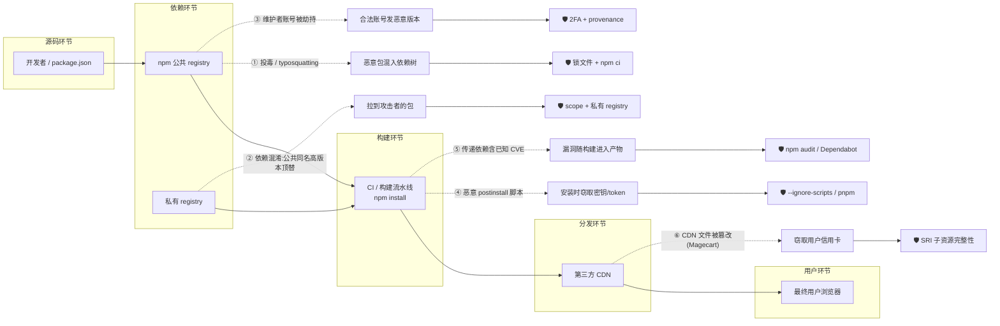
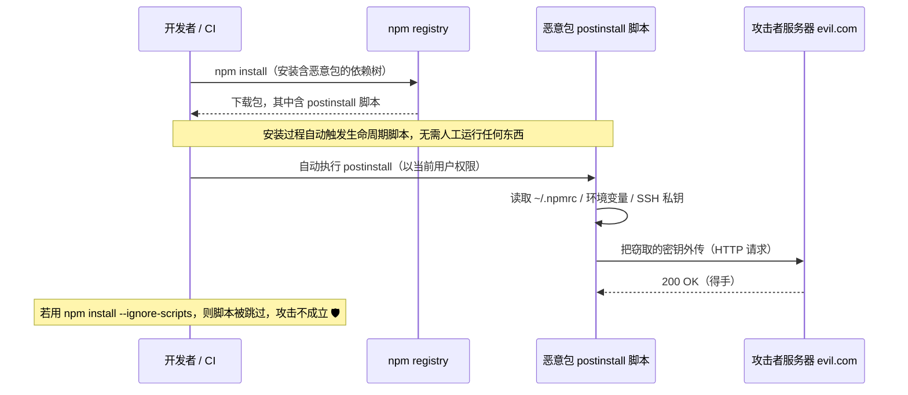

# 10 · 前端依赖与供应链安全（Dependency & Supply Chain Security）

> 现代前端项目里 90% 以上的代码不是你写的，而是来自 npm 依赖（还有一大堆你从没直接安装过的「传递依赖」）。你的代码再安全，只要某个依赖包被投毒、被抢注、被劫持，恶意代码就会随 `npm install` 一起进入你的机器、CI、以及最终用户的浏览器。供应链安全关注的就是「你信任的这条链条」上每一环的风险与防御。

## 📖 知识讲解

### 为什么供应链是最大的信任边界

安装一个看起来只有几行的包，`node_modules` 里可能装进几百个包。这些包又依赖别的包（**传递依赖 / transitive dependency**），形成一棵庞大的依赖树。你**显式**信任的是 `package.json` 里那几十个直接依赖，但你**实际**信任的是整棵树里成百上千个包、以及它们背后成百上千个你素不相识的维护者。任何一个环节被攻破，坏代码就顺着这条链条流进来——这就是「软件供应链攻击」。

它对应 **OWASP Top 10 2021** 的两条：
- **A06 Vulnerable and Outdated Components（易受攻击和过时的组件）**：用了带已知漏洞（CVE）或年久失修的依赖。
- **A08 Software and Data Integrity Failures（软件和数据完整性失败）**：对代码/依赖/更新来源的完整性不做校验，导致被人塞进恶意内容（投毒、CI 被篡改、CDN 被替换）。

### 攻击面逐个拆解（攻击手法均「仅供学习」，用于理解防御）

#### ① 恶意包 / 投毒（Typosquatting 抢注 + 已知历史事件）

**原理**：npm 是开放注册的，任何人都能发包。攻击者利用两点：
- **Typosquatting（错字抢注）**：注册一个和热门包极其相似的名字，赌你手滑打错。经典例子：`crossenv`（真包是 `cross-env`）、`cross-env.js`、`event-stream` 生态里的仿冒、`lodahs`（真包 `lodash`）。你少打一个字符 `-`，装进来的就是攻击者的包。
- **直接投毒已有热门包**：攻击者拿到某个真实热门包的发布权后，在新版本里塞恶意代码。真实历史事件（都发生过、可查证）：
  - **`event-stream`（2018）**：攻击者接手维护权后，通过依赖 `flatmap-stream` 注入代码，专门窃取比特币钱包（Copay）。
  - **`ua-parser-js`（2021）**：维护者 npm 账号被劫持，发布的版本会下载挖矿程序和窃密木马。
  - **`node-ipc`（2022）**：维护者本人在包里加入「抗议性」恶意逻辑（俗称 protestware），按 IP 判断地区后删除文件系统内容。

**要点**：投毒往往发生在**某个补丁版本**里。如果你的版本范围写成 `^1.2.0`，一次 `npm install` 就可能悄悄升到被投毒的 `1.2.3`。

#### ② 依赖混淆（Dependency Confusion）

**原理**：很多公司用**私有包**（比如公司内部的 `@mycorp/utils`，只在私有 registry 里）。如果构建工具同时会去**公共 npm** 查同名包，而攻击者在公共 npm 上抢注了一个**同名、但版本号更高**的包（比如 `99.9.9`），包管理器出于「装最新版」的默认策略，会从公共仓库把攻击者的高版本包拉下来，顶替掉你的私有包。

**仅供学习**：2021 年安全研究员 Alex Birsan 用这一手法，成功让代码在 Apple、微软、特斯拉等几十家大公司的内网执行，拿到了几十万美元漏洞赏金。防御核心：给私有包统一加 **scope**（`@mycorp/`）并绑定私有 registry、锁定来源。

#### ③ 账号劫持 / 维护者被钓鱼

**原理**：包本身没问题，但**维护者的 npm 账号**被攻破（密码泄露、被钓鱼、无 2FA），攻击者用合法账号发一个恶意版本。上面的 `ua-parser-js` 就是典型。防御：维护者开 **2FA**、发布走 **npm provenance**（可溯源），使用者锁版本 + 校验。

#### ④ 恶意生命周期脚本（postinstall / preinstall）

**原理**：npm 包可以在 `package.json` 的 `scripts` 里声明 `preinstall`、`install`、`postinstall` 等**生命周期脚本**。当你 `npm install` 这个包时，这些脚本会**自动在你的机器上以你的权限执行任意代码**——你根本没运行任何东西，只是「装」了一下。攻击者借此在安装瞬间窃取 `~/.npmrc`（里面有 npm token）、环境变量（CI 里常有云密钥）、SSH 私钥并外传。这是投毒包最常用的落地方式（见下方时序图和 `malicious-package-example/`）。

**防御**：`npm install --ignore-scripts` 跳过所有生命周期脚本；或改用 **pnpm**（默认不执行依赖的构建脚本，需在 `pnpm.onlyBuiltDependencies` 里显式放行）；审查新依赖的 `scripts` 字段。

#### ⑤ 传递依赖里的已知漏洞（CVE）

**原理**：你直接依赖的包没问题，但它依赖的某个深层包有已公开的漏洞（CVE），比如原型链污染、ReDoS、命令注入。你可能压根不知道这个包的存在，却把漏洞带进了产品。对应 OWASP **A06**。防御：`npm audit` / Snyk / GitHub Dependabot / OSV 数据库定期扫描，及时升级。

#### ⑥ 前端第三方 `<script>` / CDN 被篡改（Magecart）

**原理**：网页直接从第三方 CDN 引入 `<script src="https://cdn.thirdparty.com/lib.js">`。如果这个 CDN 或第三方账号被攻破，攻击者改掉那个 JS 文件，就能在**所有引用它的网站**上运行恶意脚本。**Magecart** 系列攻击正是如此：篡改电商页面里的第三方脚本，实时窃取用户在结账页输入的**信用卡号**（British Airways、Ticketmaster 都中过招）。对应 OWASP **A08**。

**防御**：**子资源完整性（SRI, Subresource Integrity）**——给 `<script>`/`<link>` 加上文件内容的哈希，浏览器下载后校验哈希，一旦文件被改哈希对不上就**拒绝执行**：

```html
<script src="https://cdn.example.com/lib@1.0.0.js"
        integrity="sha384-oqVuAfXRKap7fdgcCY5uykM6+R9GqQ8K/uxy9rx7HNQlGYl1kPzQho1wx4JwY8wC"
        crossorigin="anonymous"></script>
```

### 防御手段总览

| 防御 | 针对的攻击 | 原理 |
|------|-----------|------|
| **锁文件 `package-lock.json` / `yarn.lock` + `npm ci`** | 投毒补丁版本、不可复现构建 | 锁文件把每个包精确钉到某个版本 + 完整性哈希（`integrity`）；`npm ci` 严格按锁文件安装，版本被偷偷改动会报错 |
| **`npm audit` / Snyk / Dependabot / OSV** | ⑤ 已知 CVE | 拿依赖树比对漏洞数据库，报告并建议升级；Dependabot 自动提 PR |
| **最小化依赖 + 审计新增依赖** | ①③④ | 依赖越少信任面越小；引入前看下载量、维护活跃度、`scripts` 字段、有无可疑网络行为 |
| **`--ignore-scripts` / 用 pnpm** | ④ 恶意生命周期脚本 | 安装时不执行 pre/post install 脚本，堵住「装即中招」 |
| **SRI 子资源完整性** | ⑥ CDN 被篡改 | 浏览器按哈希校验第三方文件，被改则拒绝执行 |
| **私有 registry + scope** | ② 依赖混淆 | 私有包统一 `@scope/`，配置只从私有源解析该 scope，公共同名高版本包顶替不了 |
| **npm provenance + 2FA** | ③ 账号劫持 | provenance 让包能溯源到具体的 CI 构建与源码提交；2FA 防账号被盗 |
| **SBOM + SLSA** | 全局治理 | SBOM（软件物料清单）列清用了哪些组件；SLSA 是一套供应链完整性等级框架，规范「从源码到产物」每步可验证 |
| **定期更新** | ⑤ | 及时打补丁，别让依赖年久失修 |

## 🔄 流程图 / 原理图

### 图 1：供应链攻击面全景（源码 → 依赖 → 构建 → CDN → 用户）



### 图 2：恶意 `postinstall` 脚本在安装时窃密（仅供学习）



## 💻 代码说明

本模块偏文档，配两个**可落地但无害**的演示（均**仅供学习**，不会真正下载依赖、也不做任何危险操作）：

### `malicious-package-example/package.json`

模拟一个「被投毒的包」长什么样：它的 `scripts.postinstall` 会在被安装时自动执行。为了安全，脚本里**只做无害的 `echo` 输出**，并用注释标明真实攻击会在这里做什么（窃取 `~/.npmrc`、环境变量、SSH 密钥并外传）。关键片段：

```json
"scripts": {
  "postinstall": "node -e \"console.log('[恶意包示范] 仅供学习：真实攻击此处会读取 ~/.npmrc、环境变量、SSH 私钥并 POST 到攻击者服务器')\""
}
```

只要有人 `npm install` 这个包，这行 `postinstall` 就会自动运行——这正是攻击者要的「安装即执行」。用 `npm install --ignore-scripts` 安装则不会触发。

### `safe-install.sh`

一份「安全安装 / 审计流程」的命令清单（带中文注释，**仅示范不实际执行下载**）：用 `npm ci` 按锁文件精确安装、用 `npm audit` 扫描 CVE、用 `--ignore-scripts` 阻断生命周期脚本、用 `npm config set ignore-scripts true` 全局默认关闭脚本等。

## ▶️ 运行方式

本模块以阅读文档 + 看图理解为主。演示文件的「查看方式」（**不要真的联网安装依赖**）：

```bash
# 1) 查看被投毒包的样子（重点看 scripts.postinstall 字段）
cat malicious-package-example/package.json

# 2) 阅读安全安装 / 审计流程脚本（每行都有中文注释）
cat safe-install.sh

# 3)（可选，纯本地、无害）体验 postinstall「安装即执行」：
#    在 malicious-package-example/ 目录下执行 npm install，
#    会看到那行 echo 被自动打印出来（说明脚本确实自动运行了）。
#    再用 --ignore-scripts 对比：这次不会打印，说明脚本被成功拦截。
cd malicious-package-example
npm install                 # 会打印那行「仅供学习」的提示 → 脚本自动执行了
npm install --ignore-scripts   # 不打印 → 生命周期脚本被跳过 🛡
```

> 说明：该示范包**没有任何真实依赖**，`npm install` 不会联网下载东西，只会触发本地那行无害 `echo`，用来直观体会「生命周期脚本会自动执行」这一点。

## ⚠️ 常见坑 / 最佳实践

- **一定提交锁文件**：`package-lock.json` / `pnpm-lock.yaml` / `yarn.lock` 必须进版本库，且 CI 用 `npm ci`（而非 `npm install`），保证每次装的都是被审计过的确切版本 + 完整性哈希。
- **`^` / `~` 范围是双刃剑**：方便打补丁，但也意味着一次安装可能悄悄升到被投毒的新补丁版本；靠锁文件把实际版本钉死。
- **默认警惕生命周期脚本**：不信任的依赖用 `--ignore-scripts`，或迁移到 pnpm（默认不跑依赖构建脚本）；引入新依赖前先看它的 `scripts` 字段。
- **私有包全部加 scope 并锁定 registry**，防依赖混淆；别让构建工具「公共源兜底」去解析私有包名。
- **CDN 引入必加 SRI + `crossorigin`**：只要引第三方 `<script>`/`<link>`，就带 `integrity` 哈希；能自托管关键脚本更好。
- **`npm audit` 不是万能**：它只覆盖「已公开」的漏洞，对 0day 投毒无能为力，别把「audit 通过」当作绝对安全；结合最小化依赖 + 人工审查。
- **别忽视 `npm audit` 的噪音**：大量告警在 devDependencies 或不可达路径上，要分清「真能被利用」和「理论存在」，用 `npm audit --omit=dev` 等聚焦生产依赖。
- **维护者视角**：开 2FA、发布启用 provenance，别把 npm token 明文写进 CI 日志或提交进仓库。
- **建立 SBOM**：为产物生成软件物料清单（如 CycloneDX），出漏洞时能快速定位「我到底用没用这个包」。

## 🔗 官方文档

- OWASP Top 10 A06 易受攻击和过时的组件：<https://owasp.org/Top10/A06_2021-Vulnerable_and_Outdated_Components/>
- OWASP Top 10 A08 软件和数据完整性失败：<https://owasp.org/Top10/A08_2021-Software_and_Data_Integrity_Failures/>
- npm audit 文档：<https://docs.npmjs.com/cli/commands/npm-audit>
- MDN 子资源完整性 SRI：<https://developer.mozilla.org/zh-CN/docs/Web/Security/Subresource_Integrity>
- SLSA 供应链完整性框架：<https://slsa.dev/>
- GitHub Dependabot 文档：<https://docs.github.com/zh/code-security/dependabot>
- OWASP Dependency-Check：<https://owasp.org/www-project-dependency-check/>
- npm provenance（可溯源发布）：<https://docs.npmjs.com/generating-provenance-statements>
