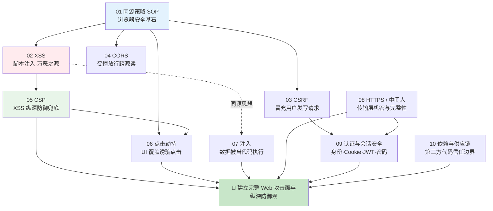
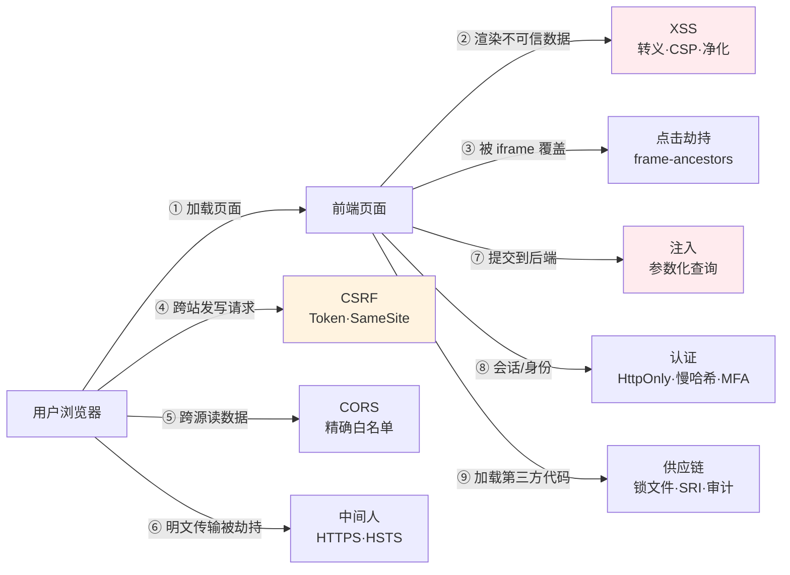

# 19 · Web 安全（Web Security）

> 从**同源策略**这块浏览器安全基石出发，把 XSS、CSRF、CORS、CSP、点击劫持、注入、HTTPS/中间人、认证会话、依赖供应链这一整套**攻击面与防御体系**讲透。本工程属于**「原理」类**：以**深度文档 + 大量 Mermaid 攻击/防御流程图**为主、可复现小 demo 为辅，配套一篇《[原理详解.md](./原理详解.md)》把「同源策略如何串起整套防御」讲成一条完整主线。全部对照 **OWASP** 与 **MDN Web Security** 权威文档整理。
>
> ⚠️ **本工程所有攻击 demo 均标注「仅供学习」，仅用于在本地理解漏洞原理、验证防御效果，严禁用于未授权的真实系统。**

---

## 📚 模块索引

| 模块 | 知识点 | 核心内容 | 类型 |
| --- | --- | --- | --- |
| [01-same-origin-policy](./01-same-origin-policy/) | 同源策略 📊 | Origin 三元组、读/写/嵌入三类限制、放行机制 | 文档 + html demo |
| [02-xss](./02-xss/) | 跨站脚本 📊 | 存储/反射/DOM 型、source→sink、转义/净化/CSP | 文档 + 漏洞/安全对照 demo |
| [03-csrf](./03-csrf/) | 跨站请求伪造 📊 | Cookie 自动携带、Token、SameSite | 文档 + 受害/攻击 demo |
| [04-cors-security](./04-cors-security/) | CORS 配置安全 📊 | 预检、反射 Origin/null 误区、精确白名单 | 文档 + node demo |
| [05-csp](./05-csp/) | 内容安全策略 📊 | script-src、nonce/hash、纵深防御最后一道 | 文档 + 漏洞/安全对照 demo |
| [06-clickjacking](./06-clickjacking/) | 点击劫持 📊 | 透明 iframe 覆盖、X-Frame-Options、frame-ancestors | 文档 + 攻击/防护 demo |
| [07-injection](./07-injection/) | 注入攻击 📊 | SQL/命令/NoSQL 注入、参数化查询 | 文档 + node demo |
| [08-https-mitm](./08-https-mitm/) | HTTPS 与中间人 📊 | TLS 握手、证书链、SSL Stripping、HSTS | 纯文档 + 抓包脚本 |
| [09-auth-security](./09-auth-security/) | 认证与会话安全 📊 | Session vs JWT、Cookie 属性、密码慢哈希 | 文档 + node demo |
| [10-dependency-supply-chain](./10-dependency-supply-chain/) | 依赖与供应链 📊 | 投毒/依赖混淆/postinstall、锁文件、SRI、审计 | 文档 + 示例包 demo |

📊 = 含重点攻击/防御流程图。**建议先通读 [原理详解.md](./原理详解.md) 建立以同源策略为核心的全局体系，再逐模块深入。**

---

## 🗺️ 学习路线

**三阶段建议：**

1. **地基与浏览器同源模型**（01→02→03→04→05）：先吃透**同源策略**——它规定「一个源的脚本默认不能读另一个源的数据」。XSS（注入脚本获得目标源身份而击穿 SOP）、CSRF（利用 SOP「允许跨源写 + Cookie 自动携带」）、CORS（受控放开跨源读）、CSP（收紧脚本来源做纵深防御）全都围绕它展开。这是前端最该吃透的一条主线。
2. **界面与解释器攻击面**（06→07）：点击劫持攻击的是「用户的眼睛与点击」，注入攻击的是「后端解释器」，二者与 XSS 共享「数据被当作代码/操作执行」的同一思想。
3. **传输、身份与供应链**（08→09→10）：HTTPS 保证传输不被窃听篡改，认证与会话安全守住「你是谁」，依赖供应链安全守住「你运行的代码可不可信」——从一次请求的链路补齐纵深防御的最后几环。

---

## 🔗 一次攻击/防御都发生在哪一层？

---

## ▶️ 运行说明

本工程**以阅读文档 + 看攻击/防御流程图为主**，配少量可在本地复现的小 demo：

| 模块 | 依赖 | 运行 |
| --- | --- | --- |
| 01 同源策略 | 无 | 浏览器打开 `index.html`，看控制台 |
| 02 XSS | 无 | 对照打开 `vulnerable.html` / `safe.html` |
| 03 CSRF | 无 | 打开 `victim-app.html` + `attacker.html` |
| 04 CORS | 无（Node 内置） | `node server-demo.js` 后用 curl 对照响应头 |
| 05 CSP | 无 | 对照打开 `vulnerable.html` / `safe.html`，看控制台 CSP 报错 |
| 06 点击劫持 | 无 | 打开 `attacker.html` 观察覆盖，`victim-protected.html` 看防护 |
| 07 注入 | 无（Node 内置） | `node injection-demo.js` 看注入前后 SQL 对照 |
| 08 HTTPS/MITM | 无（系统 openssl/curl） | `sh inspect-cert.sh` 查看证书链与 HSTS 头 |
| 09 认证 | 无（Node 内置） | `node password-hashing-demo.js` 看加盐慢哈希 |
| 10 供应链 | 无（不下载依赖） | 阅读 `malicious-package-example/` 与 `safe-install.sh` |

- 环境：Node.js LTS 18/20/22+，任意现代浏览器。用 Chrome DevTools 的 **Console / Network / Application** 面板观察 CSP 报错、CORS 头、Cookie 属性最直观。
- 所有 demo **不需要 `npm install`**，纯 Node 内置模块或浏览器直接打开。

---

## 📖 配套原理长文

👉 **[原理详解.md](./原理详解.md)** —— 本工程核心交付物，以**同源策略**为轴心，把 XSS / CSRF / CORS / CSP 的防御体系与整个 Web 攻击面全景串成一条完整主线，配 15+ 张 Mermaid 攻击/防御图、相邻方案对比与常见误区速查。

---

> 📌 所有内容对照 [OWASP](https://owasp.org/)（[Top 10](https://owasp.org/www-project-top-ten/)、[Cheat Sheet Series](https://cheatsheetseries.owasp.org/)）、[MDN Web Security](https://developer.mozilla.org/zh-CN/docs/Web/Security)、[PortSwigger Web Security Academy](https://portswigger.net/web-security) 等权威资料整理，各模块 README 末尾附具体链接。采用 2026 年近版本知识。
