# Web 安全 · 原理详解

> 本文是 `19-web-security` 工程的核心交付物。目标不是罗列"有哪些攻击"，而是把 Web 前端安全**串成一条主线**：一切都围绕浏览器的**同源策略（Same-Origin Policy, SOP）**展开——XSS 是「击穿 SOP」、CSRF 是「利用 SOP 的写放行」、CORS 是「受控地放开 SOP 的读限制」、CSP 是「在 SOP 之上再收紧脚本来源」。理解了同源策略这块地基，整套防御体系就有了统一的解释框架。全文对照 **OWASP** 与 **MDN Web Security**，配 16 张 Mermaid 图，采用 2026 年近版本知识。
>
> ⚠️ 文中所有攻击代码与手法**仅供学习**，用于在受控环境理解漏洞与验证防御，严禁用于未授权系统。

---

## 目录

1. [安全模型的原点：同源策略](#一安全模型的原点同源策略)
2. [SOP 到底限制了什么：读 / 写 / 嵌入三分法](#二sop-到底限制了什么读--写--嵌入三分法)
3. [XSS：把 SOP 从内部击穿](#三xss把-sop-从内部击穿)
4. [CSRF：利用 SOP「允许跨源写」的副作用](#四csrf利用-sop允许跨源写的副作用)
5. [CORS：受控地放开「跨源读」](#五cors受控地放开跨源读)
6. [CSP：在 SOP 之上再筑一道墙](#六csp在-sop-之上再筑一道墙)
7. [四者的关系：一张图看懂防御体系](#七四者的关系一张图看懂防御体系)
8. [攻击面全景：从界面到传输到供应链](#八攻击面全景从界面到传输到供应链)
9. [纵深防御：一次请求的完整防护清单](#九纵深防御一次请求的完整防护清单)
10. [常见误区速查](#十常见误区速查)
11. [官方文档](#十一官方文档)

---

## 一、安全模型的原点：同源策略

浏览器要同时打开你的**网银**、**邮箱**和一个**随手点开的陌生网站**，它们的代码都跑在同一个进程宇宙里。如果没有隔离，陌生网站的 JS 就能随手 `fetch('https://bank.com/account')`——而且浏览器会**自动带上你的网银 Cookie**——直接读走你的余额。**同源策略就是浏览器用来隔离不同网站数据的那道墙**，它是整个 Web 安全模型的原点。

一个 URL 的**源（Origin）**由三元组决定，三者必须**全部相同**才算同源：

```
协议(scheme)  +  主机(host)  +  端口(port)
```

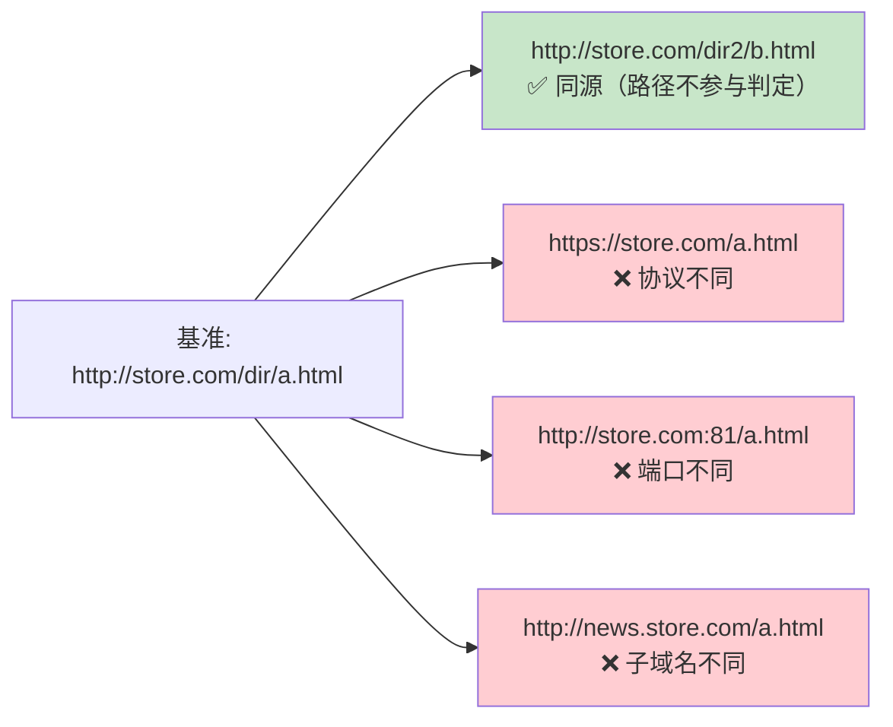

> 关键直觉：**`www.a.com` 与 `a.com` 跨源；`app.a.com` 与 `api.a.com` 跨源；`http` 与 `https` 跨源**。SOP 判的是「源」这个字符串三元组，不是「同一家公司」。

---

## 二、SOP 到底限制了什么：读 / 写 / 嵌入三分法

初学者常以为 SOP 是「跨源什么都不许」，其实它把跨源交互分成**三类**，限制程度完全不同——**理解这个三分法，就理解了后面每一种攻击为什么可能**：

| 交互类型 | 是否允许 | 谁利用了它 |
| --- | --- | --- |
| **跨源写 Write**（表单提交、链接跳转、重定向） | ✅ 通常允许 | **CSRF** 的根源 |
| **跨源嵌入 Embed**（`<script>` `` `<iframe>` `<link>`） | ✅ 通常允许 | **点击劫持**（iframe 嵌入）、**XSS**（能加载外部脚本） |
| **跨源读 Read**（读 `fetch` 响应体、读跨源 iframe 的 DOM、读别的源的存储） | ❌ 默认禁止 | **CORS** 受控放开它；**XSS** 从内部绕过它 |

一句话记忆：**能「用」别人的资源，但不能「读」别人的数据**。

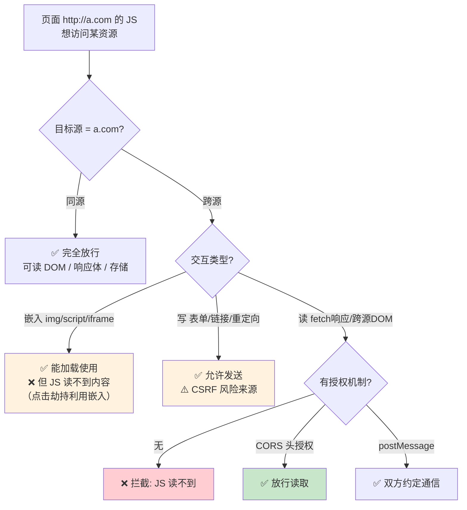

一个精妙的细节：`` 能**显示**图片（嵌入放行），但 JS **读不到**图片像素（跨源读被 canvas「污染 tainted」机制拦住）；`<script src="cdn/lib.js">` 能**执行**脚本，但拿不到源码文本；`fetch('other.com/api')` 请求能**发出去**（甚至带 Cookie），但没有 CORS 头时 JS **读不到**返回体。**「请求能发出」这一点，正是 CSRF 能得逞的关键**——攻击者不需要读响应，他要的只是让写请求生效。

---

## 三、XSS：把 SOP 从内部击穿

SOP 隔离的是「不同源之间」。但如果攻击者能让自己的脚本**跑在你的源里面**呢？那这段脚本就**天生拥有你这个源的全部身份**——SOP 对它完全不设防。这就是 **XSS（跨站脚本）** 被称为「Web 安全万恶之源」的原因：**它不是绕过 SOP，而是取得了目标源的合法身份，从内部让 SOP 形同虚设**。

### 3.1 本质：数据被当成代码

XSS 的根因只有一句话：**页面把不可信的用户输入，当作 HTML/JS 代码输出，浏览器把「数据」误当成「程序」执行**。这与第七节的「注入」是同一种思想，只是解释器从数据库换成了浏览器。

三种类型的区别只在「脚本存哪、经不经过服务器」：

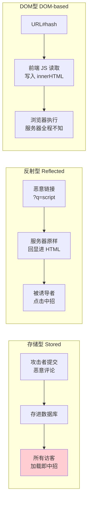

### 3.2 击穿之后能干什么

一旦脚本在你的源里跑起来，它 = 你：

- 读会话令牌：`document.cookie`（除非 Cookie 设了 `HttpOnly`）、`localStorage`；
- 以你的身份发任何请求，**天然带上你的会话**，还能读到 CSRF Token——所以 **XSS 能击穿一切 CSRF 防御**；
- 篡改页面做钓鱼、记录键盘、蠕虫式传播。

### 3.3 防御：分上下文转义 > 净化 > CSP 兜底

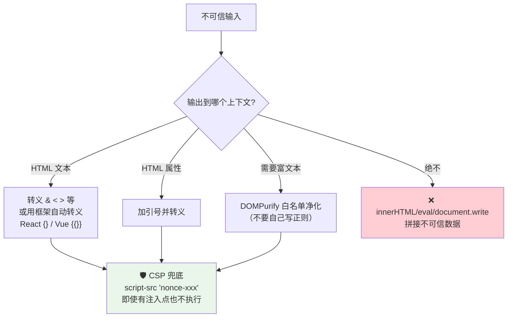

优先级要牢记：**输出转义是首要且最有效的**（框架的自动转义天然安全，危险的是 `dangerouslySetInnerHTML`/`v-html`/`innerHTML`）；富文本用 **DOMPurify** 净化；**CSP 是纵深防御的最后一道兜底，不是转义的替代品**。再配 `HttpOnly` Cookie 降低中招后的会话失窃危害。详见 [02-xss](./02-xss/) 与 [05-csp](./05-csp/)。

---

## 四、CSRF：利用 SOP「允许跨源写」的副作用

回到第二节的三分法：SOP **允许跨源写**，且浏览器**对某域的请求会自动携带该域 Cookie**。**CSRF（跨站请求伪造）** 把这两点组合起来：诱导已登录网银的你打开恶意页，恶意页偷偷向网银发一个转账写请求，浏览器自动带上你的会话 Cookie，服务器以为是你本人。

**关键**：攻击者**看不到响应**（跨源读被 SOP 挡住），但他不需要看——**CSRF 攻击的是「写操作/副作用」，不是窃取数据**。这正是它与 CORS 漏洞的分水岭。

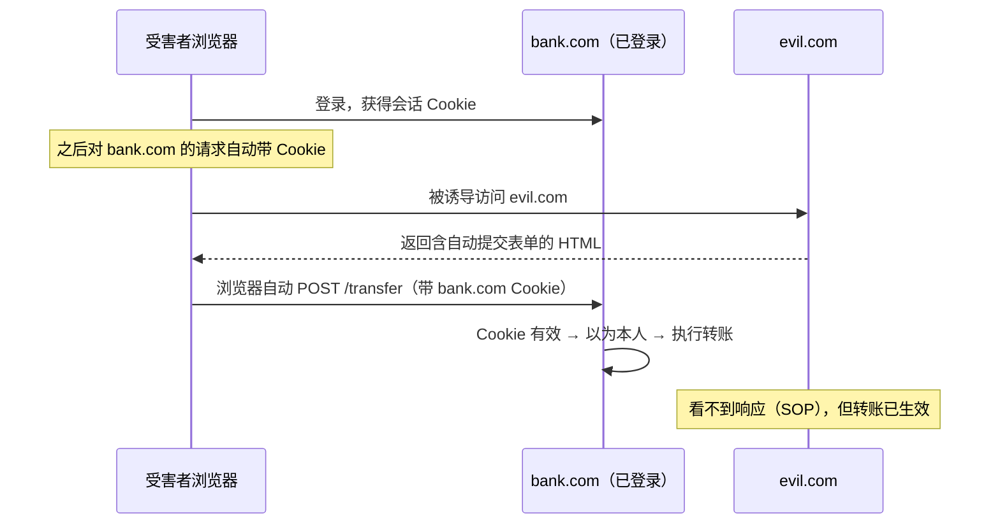

### 防御：打破「Cookie 自动携带」与「参数可预测」

CSRF 成立需要三条件：有价值的操作、仅靠 Cookie 鉴别、参数可预测。防御就是打破后两条：

- **SameSite Cookie**（打破 Cookie 自动携带）：`Lax`（现代浏览器默认）在跨站 POST/iframe/img/fetch 时不带 Cookie，挡住绝大多数 CSRF；`Strict` 更严；`None` 必须配 `Secure`。
- **CSRF Token / 同步器令牌**（打破参数可预测）：服务器下发不可预测的秘密 token，攻击者跨源**读不到**，伪造请求缺 token 被拒。最可靠。
- 双重提交 Cookie（无状态 SPA 适用）、校验 Origin/Referer（次要）、敏感操作二次确认。

> 推荐 **Token + SameSite 双管齐下**：SameSite 挡大部分，Token 补上同站子域、GET 副作用、老浏览器等缺口。且 GET 绝不做副作用操作（否则一张 `` 就能触发）。详见 [03-csrf](./03-csrf/)。

---

## 五、CORS：受控地放开「跨源读」

前后端分离后，`app.com` 的前端要读 `api.com` 的数据——这是**合法的跨源读**，但被 SOP 默认禁止。**CORS（跨源资源共享）** 就是 SOP 的「受控放行阀门」：由**服务器**用响应头声明「我允许某某源读我的响应」，浏览器只是执行者。

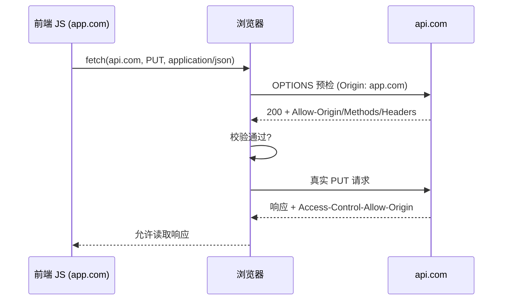

**两个致命误区（仅供学习）**：

1. **反射 Origin + 允许凭证**——服务器把请求 Origin 原样回显到 `Access-Control-Allow-Origin`，又设 `Access-Control-Allow-Credentials: true`。等于对**任意源**都授权带 Cookie 读响应，攻击者页面 `fetch(victim, {credentials:'include'})` 就能读走受害者私密数据。
2. **允许 `null` 源**——`<iframe sandbox>` 会发送 `Origin: null`，攻击者轻松命中白名单。

正确做法：需要凭证时用**精确白名单**（`Set` 逐个相等比较，绝不反射、绝不 `*`、绝不 `null`、绝不后缀匹配），动态回显 Origin 必加 `Vary: Origin`。

> 两个必须记住的边界：**CORS 不是鉴权**（它只决定浏览器让不让 JS 读，服务端仍需权限校验）；**CORS 不防 CSRF**（CSRF 攻击写、不读响应，配再严的 CORS 也拦不住）。详见 [04-cors-security](./04-cors-security/)。

---

## 六、CSP：在 SOP 之上再筑一道墙

SOP + 转义已能防大部分 XSS，但**总有转义遗漏的注入点**。**CSP（内容安全策略）** 是纵深防御的最后一道：即便攻击者成功注入了 `<script>`，CSP 也能让它**无法执行**。它通过 `Content-Security-Policy` 响应头（或 `<meta>`）声明「哪些来源的脚本/样式/资源可以加载执行」。

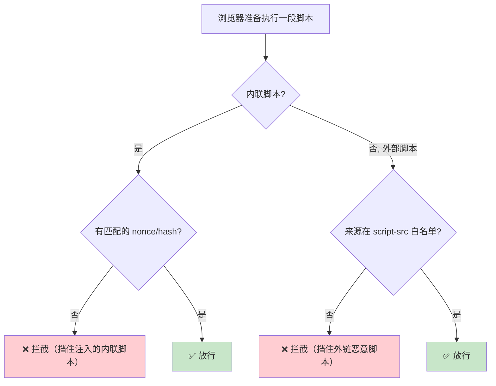

核心机制：用 **`script-src 'nonce-随机值'`** 给每次响应的合法脚本盖一个一次性随机戳，注入的脚本没有这个 nonce 就被拦——这比维护域名白名单更安全（白名单常被开放 CDN、JSONP 端点绕过）。配合 `base-uri 'none'`（防 nonce 被偷）、`object-src 'none'`、`strict-dynamic`。上线用 `Content-Security-Policy-Report-Only` + `report-to` 先观察再强制。

> CSP 的 **`frame-ancestors`** 指令还负责防**点击劫持**（第八节），是 `X-Frame-Options` 的现代替代。记住：**CSP 是兜底不是免死金牌，仍要做输出转义**。详见 [05-csp](./05-csp/)。

---

## 七、四者的关系：一张图看懂防御体系

现在把主线收拢——**同源策略是根，四种机制都是它的分支**：

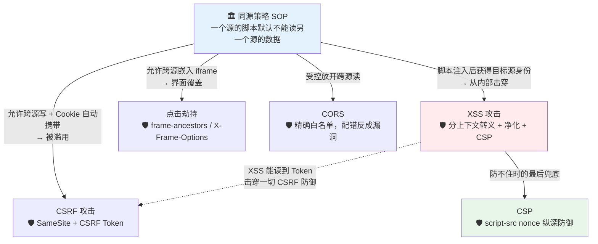

一句话总结每条边：
- **CSRF** 利用 SOP 的「写放行 + Cookie 自动带」→ 用 SameSite/Token 打破。
- **XSS** 取得目标源身份、从内部击穿 SOP → 用转义/CSP 防（也因此 **XSS 能击穿 CSRF 防御，要先修 XSS**）。
- **点击劫持** 利用 SOP 的「iframe 嵌入放行」→ 用 frame-ancestors 拒绝被嵌。
- **CORS** 是 SOP 主动开的读放行口 → 配错（反射 Origin/null）反而把数据送人。
- **CSP** 站在 SOP 之上再收紧脚本来源，是 XSS 防不住时的最后一道墙。

---

## 八、攻击面全景：从界面到传输到供应链

同源模型覆盖了「浏览器内的数据隔离」，但一次完整的 Web 交互还要经过**用户的眼睛、后端解释器、网络传输、身份系统、第三方代码**——每一环都有独立攻击面：

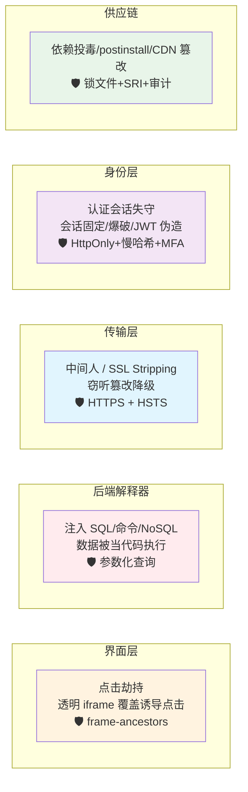

- **点击劫持**（[06](./06-clickjacking/)）：把目标站用**完全透明的 iframe** 盖在诱饵页下，诱导用户点「领奖品」实则点到目标站的「删除账户」。防御是让目标站**拒绝被嵌**：`CSP: frame-ancestors 'none'` / `X-Frame-Options: DENY`。
- **注入**（[07](./07-injection/)）：与 XSS 同源思想，`SELECT * FROM users WHERE name='$input'` 拼进 `' OR '1'='1` 就恒真绕过登录。防御首选**参数化查询/预编译**，把数据与指令彻底分离，再配最小权限账号。
- **HTTPS 与中间人**（[08](./08-https-mitm/)）：明文 HTTP 可被窃听/篡改/插广告；TLS 用加密+完整性+证书身份认证解决；**SSL Stripping** 把 https 降级成 http，用 **HSTS** 防降级。
- **认证与会话安全**（[09](./09-auth-security/)）：Cookie 的 `HttpOnly`/`Secure`/`SameSite` 三属性、JWT 的 `alg:none` 坑、密码必须用 **bcrypt/scrypt/argon2 加盐慢哈希**、登录后重置 session id 防会话固定、限流防爆破、MFA。
- **依赖与供应链**（[10](./10-dependency-supply-chain/)）：前端 90%+ 代码来自 npm，攻击面包括 typosquatting 投毒、依赖混淆、恶意 `postinstall` 脚本、CDN 被篡改（Magecart）。防御是锁文件 + `npm ci`、`npm audit`、`--ignore-scripts`、CDN 用 **SRI** 完整性校验。

一个 postinstall 供应链攻击的典型流程（仅供学习）：

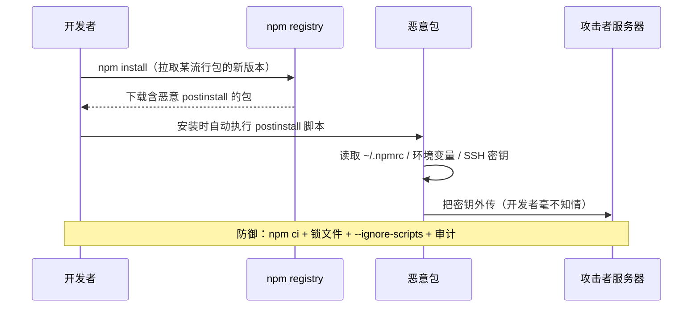

---

## 九、纵深防御：一次请求的完整防护清单

没有任何单点防御是万能的。安全靠**多层叠加**，任一层失守还有下一层。以一次「已登录用户在你的站点提交表单」为例，把全书的防御串成一张清单：

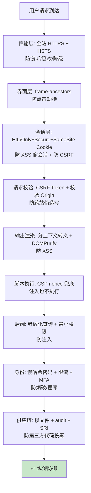

**优先级心法**：① 先修 **XSS**（它能击穿其余一切）；② 传输用 **HTTPS**（其余防御的前提）；③ 写操作上 **CSRF 防御 + SameSite**；④ 后端 **参数化查询**；⑤ 会话与密码按 OWASP 规范；⑥ CSP、SRI 做兜底与供应链加固。

---

## 十、常见误区速查

| 误区 | 纠正 |
| --- | --- |
| SOP 阻止跨源请求发出 | ❌ SOP 只挡「读响应」，请求照发、副作用照生效——这是 CSRF 根源 |
| `www.a.com` 和 `a.com` 同源 | ❌ host 字符串不同即跨源 |
| 配好 CORS 就能防 CSRF | ❌ CORS 管「读」，CSRF 攻击「写」，两回事 |
| CORS 就是鉴权 | ❌ CORS 只决定浏览器让不让 JS 读，服务端仍需权限校验 |
| `Access-Control-Allow-Origin: *` + `Credentials: true` | ❌ 规范禁止；反射 Origin + 凭证是重大漏洞 |
| 有 CSP 就不用转义了 | ❌ CSP 是兜底，转义是首要；`'unsafe-inline'` 会让 CSP 失效 |
| 用黑名单正则过滤 `script` 防 XSS | ❌ 绕过无穷，用白名单净化库 DOMPurify |
| SameSite=Lax 已默认，CSRF 不用管了 | ❌ 仍需 Token（同站子域、GET 副作用、老浏览器有缺口） |
| 密码用 MD5/SHA256 存储 | ❌ 要用 bcrypt/scrypt/argon2 加盐**慢**哈希 |
| JWT 放 localStorage 方便 | ❌ 易被 XSS 偷；敏感场景放 HttpOnly Cookie |
| 把转账做成 GET | ❌ 一张 `` 就能 CSRF；写操作用 POST/PUT/DELETE |
| CDN 引第三方 `<script>` 不用管 | ❌ CDN 被篡改即中招，用 SRI `integrity` 校验 |
| 前端做了校验就安全 | ❌ 前端校验只为体验，安全校验必须在服务端 |

---

## 十一、官方文档

- OWASP 首页与 Top 10：<https://owasp.org/www-project-top-ten/>
- OWASP Cheat Sheet Series（各主题防御速查）：<https://cheatsheetseries.owasp.org/>
- MDN Web Security：<https://developer.mozilla.org/zh-CN/docs/Web/Security>
- MDN 同源策略：<https://developer.mozilla.org/zh-CN/docs/Web/Security/Same-origin_policy>
- MDN CORS：<https://developer.mozilla.org/zh-CN/docs/Web/HTTP/CORS>
- MDN CSP：<https://developer.mozilla.org/zh-CN/docs/Web/HTTP/CSP>
- PortSwigger Web Security Academy：<https://portswigger.net/web-security>
- OWASP XSS / CSRF / SQL Injection / Clickjacking / Auth / Transport / Password Storage Cheat Sheets（各模块 README 末尾附具体链接）

> 各专题的深入内容、可复现 demo 与专属官方链接见对应模块 `NN-xxx/README.md`。本文与各模块相互印证：先读本文建立以同源策略为核心的全局体系，再逐模块深入细节。
