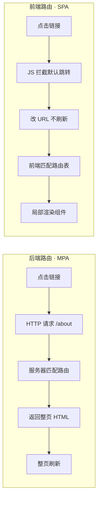

# 01 · SPA 为何需要前端路由（Why SPA Routing）

> 传统多页应用（MPA）每次切页都向服务器请求新 HTML 并整页刷新；单页应用（SPA）只加载一个 HTML，页面切换靠 JS 在前端完成。要在「不刷新」的前提下让 URL 与页面保持同步，就必须有**前端路由**。

## 📖 知识讲解

### 什么是路由（Routing）

「路由」的本质是一张**映射表**：`URL ↔ 要展示的内容`。谁来维护这张表、谁来根据 URL 找内容，就决定了是「后端路由」还是「前端路由」。

### 后端路由（MPA / 传统模式）

浏览器地址栏输入 `/about` → 发一个 HTTP 请求给服务器 → 服务器路由（Express/Spring/Nginx）匹配 `/about` → 返回一整张 `about.html` → 浏览器**整页刷新**渲染。

- 优点：首屏快、SEO 友好（每个 URL 都有完整 HTML）。
- 缺点：每次切页都白屏刷新、重复下载公共资源（导航栏/CSS/JS）、体验割裂。

### 前端路由（SPA 模式）

首次访问只下载 **一个 `index.html` + 一个大 JS 包**。之后点击链接：

1. JS **拦截**默认跳转（不让浏览器发请求）。
2. 用 `History API` / `hash` **修改 URL** 但**不触发刷新**。
3. 监听 URL 变化，**在前端匹配路由表**，把对应组件渲染到「路由出口」。

于是 URL 变了、页面内容变了，但浏览器**没有整页刷新**，公共资源不重新加载 —— 这就是 SPA 流畅体验的来源，也是前端路由存在的根本原因。

### 前端路由要解决的三个核心问题

| 问题 | 手段 |
| --- | --- |
| 改 URL 但**不刷新页面** | `location.hash` 或 `history.pushState` |
| **感知** URL 变化 | `hashchange` 事件 / `popstate` 事件 |
| 拦截 `<a>` 默认跳转 | `e.preventDefault()` + 编程式改 URL |

后续模块（02 hash / 03 history）就是把这三点用原生 API 手写实现。

## 🔄 流程图 / 原理图



## 💻 代码说明

`index.html` 用同一个页面直观对比两种模式：

- 「后端路由」按钮：真实 `<a href>`，点击后整页跳转（会看到浏览器刷新 / 页面闪烁）。
- 「前端路由」按钮：JS 拦截跳转、只更新 `#view` 区域，地址栏 hash 变化但页面不刷新。页面顶部有一个**随机色块**，前端路由切换时色块**不变**（证明没刷新），后端路由跳转时色块**会变**（证明刷新了）。

```js
// 前端路由：拦截 + 局部渲染，页面不刷新
link.addEventListener('click', (e) => {
  e.preventDefault();            // 关键：阻止浏览器默认整页跳转
  location.hash = link.dataset.to;  // 只改 hash，不发请求
});
window.addEventListener('hashchange', render); // 感知变化后局部渲染
```

## ▶️ 运行方式

免构建，直接用浏览器打开 `index.html` 即可。观察：

- 点「前端路由」几个链接 —— 顶部色块不变、地址栏 `#/xxx` 在变、内容在变。
- 点「后端路由（模拟）」—— 页面重新加载、色块随之变化。

## ⚠️ 常见坑 / 最佳实践

- 前端路由的第一步永远是 `e.preventDefault()`，忘了就会被浏览器抢先发请求、导致刷新。
- SPA 首屏是「一个空壳 + 大 JS」，首屏白屏时间长、SEO 差 —— 这正是后面 `08-ssr-routing` 要用 SSR 解决的问题。
- 「前端路由」不等于「没有后端路由」：SPA 部署时后端仍需把所有路径回退到 `index.html`（见 `04-hash-vs-history`）。

## 🔗 官方文档

- MDN 单页应用（SPA）：https://developer.mozilla.org/zh-CN/docs/Glossary/SPA
- MDN History API：https://developer.mozilla.org/zh-CN/docs/Web/API/History_API
- Vue Router 介绍：https://router.vuejs.org/zh/introduction.html
