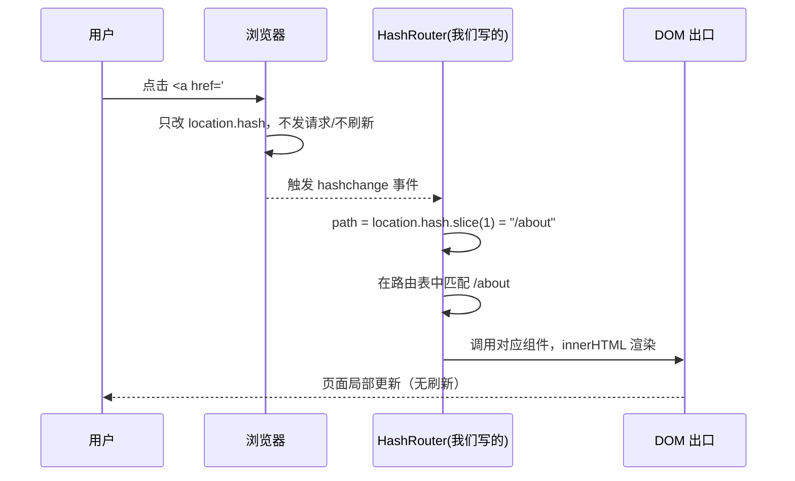

# 02 · Hash 路由原理 + 手写实现（Hash Router）

> Hash 路由利用 URL 中 `#` 后面的部分（`location.hash`）：改变 hash **不会**让浏览器向服务器发请求、不会刷新页面，且会触发 `hashchange` 事件。监听它就能实现「改 URL 不刷新地渲染」。

## 📖 知识讲解

### 为什么 hash 天生适合做路由

URL 里 `#` 后面的 `fragment`（片段标识符）**从不发送给服务器**（它原本是页面内锚点定位用的）。因此：

- 改 `location.hash`（如 `location.hash = '/about'`）→ URL 变成 `xxx#/about`，浏览器**不刷新、不发请求**。
- hash 变化时，浏览器触发 **`window.onhashchange`** 事件，我们在回调里读新 hash、匹配路由、渲染即可。
- 直接输入 `xxx#/about` 或刷新，服务器只看到 `xxx`（`#` 后被截断），永远返回同一个 `index.html` —— 所以 **hash 路由不需要任何服务器配置**，这是它相对 history 模式最大的优势。

### 核心 API（对照 MDN）

| API | 作用 |
| --- | --- |
| `location.hash` | 读/写 `#` 后的字符串（含 `#`）。写入即改 URL 不刷新 |
| `window.addEventListener('hashchange', fn)` | hash 变化时触发（前进/后退/手改地址栏/赋值 hash 都会触发） |
| `window.location.hash = '/x'` | 会新增一条历史记录，可用浏览器「后退」回退 |

> hash 变化**总会**触发 `hashchange`（无论是代码赋值还是用户操作），这点比 history 模式简单 —— history 的 `pushState` 不会触发 `popstate`（见 03）。

### 手写 mini hash-router 的三步

1. **注册路由表**：`{ '/home': render函数, '/about': render函数 }`。
2. **监听 `hashchange` 和首次 `load`**：拿到 `location.hash.slice(1)` 作为当前 path。
3. **匹配并渲染**：找到对应回调，输出到路由出口 DOM；找不到就渲染 404。

## 🔄 流程图 / 原理图



## 💻 代码说明

`index.html` 里手写了一个 ~40 行的 `HashRouter` 类，无任何依赖：

```js
class HashRouter {
  constructor(outlet) {
    this.routes = {};                       // 路由表：path -> handler
    this.outlet = outlet;                   // 路由出口 DOM
    // 两个入口都要监听：hash 变化 + 首次加载（进来时 hash 可能已存在）
    window.addEventListener('hashchange', () => this.resolve());
    window.addEventListener('load', () => this.resolve());
  }
  on(path, handler) { this.routes[path] = handler; return this; } // 链式注册
  resolve() {
    const path = location.hash.slice(1) || '/';   // "#/about" -> "/about"
    const handler = this.routes[path] || this.routes['*']; // '*' 作 404 兜底
    this.outlet.innerHTML = handler ? handler() : '404';
  }
  push(path) { location.hash = path; }     // 编程式导航：赋值 hash 即可
}
```

关键点：

- `location.hash.slice(1)` 去掉开头的 `#`，得到 `/about` 这样的干净 path。
- 注册 `'*'` 作为**通配兜底**实现 404。
- `push()` 只需给 `location.hash` 赋值，浏览器会自动触发 `hashchange` → `resolve()`，无需手动调用渲染。
- 声明式导航直接用 `<a href="#/about">` 即可，浏览器原生支持，连 `preventDefault` 都不用（因为改的就是 hash，本就不刷新）。

## ▶️ 运行方式

**免构建**，直接用浏览器打开 `index.html`（`file://` 协议也完全正常，这是 hash 路由的优势）。

- 点导航链接：地址栏 `#/xxx` 变化、内容切换、页面不刷新。
- 点「编程式导航」按钮：演示 `router.push()`。
- 按浏览器「后退/前进」：hash 路由天然支持历史记录。

## ⚠️ 常见坑 / 最佳实践

- URL 里带 `#` 不美观，且 `#` 后内容对 **SEO 不友好**（爬虫早期不索引 fragment）。
- hash 被页面内**锚点定位**占用：若页面同时想用 `#section` 锚点，会与路由冲突，需约定前缀（如 `#/route`）。
- 服务器端拿不到 hash（`req.url` 里没有 `#` 后内容），所以**无法在服务端根据路由做 SSR** —— 需要 SSR 时用 history 模式。
- 好处也很实在：**零服务器配置**，刷新任意子路由都不会 404，非常适合静态托管、后台管理系统、内嵌页面。

## 🔗 官方文档

- MDN `location.hash`：https://developer.mozilla.org/zh-CN/docs/Web/API/Location/hash
- MDN `hashchange` 事件：https://developer.mozilla.org/zh-CN/docs/Web/API/Window/hashchange_event
- Vue Router `createWebHashHistory`：https://router.vuejs.org/zh/api/#createwebhashhistory
